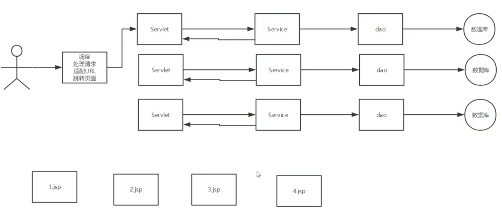
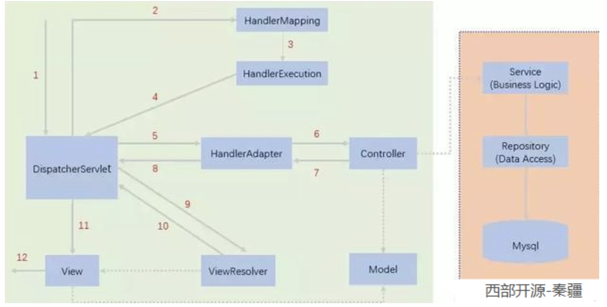

# 10. SpringMVC
**重点：SpringMVC的执行流程**
## 10.1. 回顾
### 10.1.1. 回顾MVC
模型（dao，service）-视图（jsp）-控制器（servlet）

是一种软件设计规范，让业务逻辑、数据和显示分离的方法来组织代码

主要作用：降低了视图与业务逻辑间的双向耦合

控制器：
- 取得表单数据
- 调用业务逻辑
- 转向指定的页面

模型：
- 业务逻辑
- 保存数据的状态

视图：
- 显示页面
### 10.1.2. 回顾servlet
步骤：
1. 新建maven导入依赖
2. 建立module
3. 在模块的pom.xml中导入jsp和servlet依赖
4. 编写servlet类(继承HttpServlet)
5. 在WEB-INF目录下建jsp(WEB-INF下对客户端是不可见的)
6. 在web.xml中注册servlet
## 10.2. 什么是springmvc
Spring MVC是Spring Framework的一部分，是基于Java实现MVC的轻量级Web框架

特点：
- 轻量级，容易学
- 高效，基于请求响应的mvc框架
- 与spring兼容性好，无缝结合
  - 可以将springmvc所有要用到的bean注册到spring中
- 约定优于配置
- 功能强大：restful、数据验证、格式化、本地化、主题等
- 简单灵活


之前每一个servlet都要去xml中注册，现在只需要注册一个调度就行了。

Spring的web框架围绕DispatcherServlet设计。 DispatcherServlet的作用是将请求分发到不同的处理器

### 10.2.1. HelloSpringMVC


[简要分析执行流程:]
**发起请求**
1. DispatcherServlet表示前置控制器，是整个SpringMVC的控制中心。用户发出请求，DispatcherServlet接收请求并拦截请求。
    - 我们假设请求的url为 : http://localhost:8080/SpringMVC/hello
    - 如上url拆分成三部分：
    - http://localhost:8080服务器域名
    - SpringMVC部署在服务器上的web站点
    - hello表示控制器
    - 通过分析，如上url表示为：请求位于服务器localhost:8080上的SpringMVC站点的hello控制器。

**接下来适配这个请求要干嘛**

2. HandlerMapping为处理器映射。DispatcherServlet调用HandlerMapping,HandlerMapping根据请求url查找Handler。
   ```xml
    <bean class="org.springframework.web.servlet.handler.BeanNameUrlHandlerMapping"/>
    <bean class="org.springframework.web.servlet.mvc.SimpleControllerHandlerAdapter"/>
   ```
3. HandlerExecution表示具体的Handler,其主要作用是根据url查找控制器，如上url被查找控制器为：hello。
    - 在spring中定义了处理器与url的映射
    ```xml
     <!--Handler-->
     <bean id="/hello" class="com.wyj.controller.HelloController"/>
    ```
4. HandlerExecution将解析后的信息传递给DispatcherServlet,如解析控制器映射等。

**已经拿到了请求对应的处理器，接下来去完成视图要做的事情**

5. HandlerAdapter表示处理器适配器，其按照特定的规则去执行Handler。
   - 去找Controller实现类方法
6. Handler让具体的Controller执行。
   - 【需要程序员编写的代码】Controller去调用业务层
7. Controller将具体的执行信息返回给HandlerAdapter,如ModelAndView。
   - 在Controller中封装对象以及要跳转的视图，返回一个ModelAndView，给前端的数据以及指定是哪一个前端
8. HandlerAdapter将视图逻辑名或模型传递给DispatcherServlet。

**完成了视图要做的事情，DispatcherServlet拿到了ModelAndView，接下来进行视图解析**

9.  DispatcherServlet调用视图解析器(ViewResolver)来解析HandlerAdapter传递的逻辑视图名。
    - 在spring中定义，ModelAndView全部都会经过他
    - 获取ModelAndView中的数据
    - 解析ModelAndView中的视图名字
    - 拼接视图名字，找到对应的视图
    - 将数据渲染到这个视图上
    ```xml
    <!--视图解析器:DispatcherServlet给他的ModelAndView-->
    <bean class="org.springframework.web.servlet.view.InternalResourceViewResolver" id="InternalResourceViewResolver">
        <!--前缀-->
        <property name="prefix" value="/WEB-INF/jsp/"/>
        <!--后缀-->
        <property name="suffix" value=".jsp"/>
    </bean>
    ```
10. 视图解析器将解析的逻辑视图名传给DispatcherServlet。
11. DispatcherServlet根据视图解析器解析的视图结果，调用具体的视图。
12. 最终视图呈现给用户。

以上部分我们都不需要做，我们需要做的部分
1. controller层调用业务层
2. 设置视图的名字

[代码]
```xml
<!-- web.xml -->
<?xml version="1.0" encoding="UTF-8"?>
<web-app xmlns="http://xmlns.jcp.org/xml/ns/javaee"
         xmlns:xsi="http://www.w3.org/2001/XMLSchema-instance"
         xsi:schemaLocation="http://xmlns.jcp.org/xml/ns/javaee http://xmlns.jcp.org/xml/ns/javaee/web-app_4_0.xsd"
         version="4.0">

    <!--配置dispatcherServlet：这个是springmvc的核心：请求分发器，前端控制器-->
    <servlet>
        <servlet-name>springmvc</servlet-name>
        <servlet-class>org.springframework.web.servlet.DispatcherServlet</servlet-class>

        <!--dispatcherServlet要绑定spring的配置文件-->
        <init-param>
            <param-name>contextConfigLocation</param-name>
            <param-value>classpath:springmvc-servlet.xml</param-value>
        </init-param>
        <!--启动级别-->
        <load-on-startup>1</load-on-startup>
    </servlet>

    <!--注册请求
    springmvc中/和/*的区别
    /: 只匹配所有请求，不会去匹配jsp页面，一般都用/
    /*: 匹配所有的请求，包括jsp-->
    <servlet-mapping>
        <servlet-name>springmvc</servlet-name>
        <url-pattern>/</url-pattern>
    </servlet-mapping>
</web-app>
```
```xml
<!-- springmvc-servlet.xml -->
<?xml version="1.0" encoding="UTF-8"?>
<beans xmlns="http://www.springframework.org/schema/beans"
       xmlns:xsi="http://www.w3.org/2001/XMLSchema-instance"
       xsi:schemaLocation="http://www.springframework.org/schema/beans
       http://www.springframework.org/schema/beans/spring-beans.xsd">

    <!--下面三个是springmvc的核心三要素-->
    <!-- 下面两个在真实开发中不会用到，这里讲原理所以写出来 -->
    <!--处理器映射器-->
    <bean class="org.springframework.web.servlet.handler.BeanNameUrlHandlerMapping"/>
    <!--处理器适配器-->
    <bean class="org.springframework.web.servlet.mvc.SimpleControllerHandlerAdapter"/>
    <!--视图解析器 这个类是可以变得-->
    <bean class="org.springframework.web.servlet.view.InternalResourceViewResolver" id="internalResourceViewResolver">
        <!--前缀-->
        <property name="prefix" value="/WEB-INF/jsp/"/>
        <!--后缀-->
        <property name="suffix" value=".jsp"/>
    </bean>

    <!--BeanNameUrlHandlerMapping：bean-->
    <bean id="/hello" class="com.wyj.controller.HelloController"/>
</beans>
```
```java
// HelloController.java
package com.wyj.controller;

import org.springframework.web.servlet.ModelAndView;
import org.springframework.web.servlet.mvc.Controller;

import javax.servlet.http.HttpServletRequest;
import javax.servlet.http.HttpServletResponse;

class HelloController implements Controller {
    public ModelAndView handleRequest(HttpServletRequest httpServletRequest, HttpServletResponse httpServletResponse) throws Exception {
        ModelAndView mv = new ModelAndView();

        // 业务代码
        String res="HelloSpringMVC";
        mv.addObject("msg", res);

        // 视图跳转
        mv.setViewName("test");

        return mv;
    }
}
```
```jsp
<!-- WEB-INF/jsp/test.jsp -->
<%--
  Created by IntelliJ IDEA.
  User: striverwang
  Date: 2020/3/17
  Time: 18:51
  To change this template use File | Settings | File Templates.
--%>
<%@ page contentType="text/html;charset=UTF-8" language="java" %>
<html>
<head>
    <title>Title</title>
</head>
<body>

${msg}
</body>
</html>
```

这样子每写一个类还是要去bean中注册一次。通过注解版实现才是springMVC的精髓
## 10.3. 注释版
1. 新建一个web项目
2. 导入相关jar包
3. 编写web.xml , 注册DispatcherServlet
4. 编写springmvc配置文件
5. 接下来就是去创建对应的控制类 , controller
6. 最后完善前端视图和controller之间的对应
7. 测试运行调试.

```xml
<!-- web.xml -->
<?xml version="1.0" encoding="UTF-8"?>
<web-app xmlns="http://xmlns.jcp.org/xml/ns/javaee"
         xmlns:xsi="http://www.w3.org/2001/XMLSchema-instance"
         xsi:schemaLocation="http://xmlns.jcp.org/xml/ns/javaee http://xmlns.jcp.org/xml/ns/javaee/web-app_4_0.xsd"
         version="4.0">
    <servlet>
        <servlet-name>SpringMVC</servlet-name>
        <servlet-class>org.springframework.web.servlet.DispatcherServlet</servlet-class>
        <init-param>
            <param-name>contextConfigLocation</param-name>
            <param-value>classpath:springmvc-servlet.xml</param-value>
        </init-param>
        <load-on-startup>1</load-on-startup>
    </servlet>
    <servlet-mapping>
        <servlet-name>SpringMVC</servlet-name>
        <url-pattern>/</url-pattern>
    </servlet-mapping>
</web-app>
```
```xml
<!-- springmvc-servlet.xml -->
<?xml version="1.0" encoding="UTF-8"?>
<beans xmlns="http://www.springframework.org/schema/beans"
       xmlns:xsi="http://www.w3.org/2001/XMLSchema-instance"
       xmlns:context="http://www.springframework.org/schema/context"
       xmlns:mvc="http://www.springframework.org/schema/mvc"
       xsi:schemaLocation="http://www.springframework.org/schema/beans
       http://www.springframework.org/schema/beans/spring-beans.xsd http://www.springframework.org/schema/context https://www.springframework.org/schema/context/spring-context.xsd http://www.springframework.org/schema/mvc https://www.springframework.org/schema/mvc/spring-mvc.xsd">

    <!-- 自动扫描包，让指定包下的注解生效,由IOC容器统一管理 -->
    <context:component-scan base-package="com.wyj.controller"/>
    <!-- 让Spring MVC不处理静态资源 .css .js .html .mp3 .mp4-->
    <mvc:default-servlet-handler/>
    <!--
    支持mvc注解驱动
        在spring中一般采用@RequestMapping注解来完成映射关系
        要想使@RequestMapping注解生效
        必须向上下文中注册DefaultAnnotationHandlerMapping
        和一个AnnotationMethodHandlerAdapter实例
        这两个实例分别在类级别和方法级别处理。
        而annotation-driven配置帮助我们自动完成上述两个实例的注入。
     -->
    <mvc:annotation-driven/>

    <!-- 视图解析器 -->
    <bean class="org.springframework.web.servlet.view.InternalResourceViewResolver"
          id="internalResourceViewResolver">
        <!-- 前缀 -->
        <property name="prefix" value="/WEB-INF/jsp/" />
        <!-- 后缀 -->
        <property name="suffix" value=".jsp" />
    </bean>
</beans>
```
```java
// com.wyj.controller.HelloController.java
package com.wyj.controller;

import org.springframework.stereotype.Controller;
import org.springframework.ui.Model;
import org.springframework.web.bind.annotation.RequestMapping;

@Controller // 在spring中配置了扫描注解，自动注册bean，不需要在去spring中注册
@RequestMapping("hello")
public class HelloController {
    @RequestMapping("/h1") // 表示真实访问地址localhost:8080/hello/h1
    public String hello(Model model){
        // 封装数据
        model.addAttribute("msg", "Hello, SpringMVCAnnotation");
        return "hello"; // 会被视图解析器处理 返回值是视图的名称.
    }
}
```
```jsp
<!-- hello.jsp -->
<%--
  Created by IntelliJ IDEA.
  User: striverwang
  Date: 2020/3/17
  Time: 19:44
  To change this template use File | Settings | File Templates.
--%>
<%@ page contentType="text/html;charset=UTF-8" language="java" %>
<html>
<head>
    <title>Title</title>
</head>
<body>
${msg}
</body>
</html>
```

使用springMVC必须配置的三大件：

**处理器映射器、处理器适配器、视图解析器**

通常，我们只需要手动配置视图解析器，而处理器映射器和处理器适配器只需要开启注解驱动即可，而省去了大段的xml配置
## 10.4. Controller总结
控制器负责解析用户的请求并将其转换为一个模型返回给视图解析器
- 实现Controller接口
  - 缺点：一个控制器只能写一个方法
- 使用注解
  - @Component 组件
  - @Service service
  - @Controller controller
  - @Repository dao

[对比-Controller接口]xml只写了有区别的地方
```java
package com.wyj.controller;


import org.springframework.web.servlet.ModelAndView;
import org.springframework.web.servlet.mvc.Controller;

public class ControllerTest1 implements Controller {

    public ModelAndView handleRequest(javax.servlet.http.HttpServletRequest httpServletRequest, javax.servlet.http.HttpServletResponse httpServletResponse) throws Exception {
        ModelAndView mv = new ModelAndView();

        mv.addObject("msg", "ControllerTest01");
        mv.setViewName("test");

        return mv;
    }
}
```
```xml
<bean id="/hello" class="com.wyj.controller.ControllerTest1"/>
```

[对比-注释]xml只写了有区别的地方
```java
package com.wyj.controller;
import org.springframework.stereotype.Controller;
import org.springframework.ui.Model;
import org.springframework.web.bind.annotation.RequestMapping;

@Controller
public class ControllerTest2{

    @RequestMapping("/t2")
    public String test2(Model model){
        model.addAttribute("msg", "ControllerTest2");
        return "test";
    }
}
```
```xml
<context:component-scan base-package="com.wyj.controller"/>
<mvc:default-servlet-handler/>
<mvc:annotation-driven/>
```
## 10.5. RestFul风格
原来：localhost:8080/method?add=1

RestFul风格：localhost:8080/method/add/1/

只是一种风格，可以让软件更简洁、更有层次，更易于实现缓存机制等

通过不同的请求方式来实现不同的效果，请求网址可能一样

好处：
- 安全 变量名不会暴露
- 简单 清楚
- 简洁高效

```java
package com.wyj.controller;

import org.springframework.stereotype.Controller;
import org.springframework.ui.Model;
import org.springframework.web.bind.annotation.*;

@Controller
public class RestFulController {
//     http://localhost:8080/add?a=1&b=2
//    @RequestMapping("/add")
//    public String test1(int a, int b, Model model) {
//        int res = a + b;
//        model.addAttribute("msg", res);
//        return "test";
//    }

//    在Spring MVC中可以使用 @PathVariable 注解，让方法参数的值对应绑定到一个URI模板变量上。
//    http://localhost:8080/add/1/2
//    @RequestMapping(value="/add/{a}/{b}", method = RequestMethod.GET) // 表示只能接受GET请求 约束请求类型
    @GetMapping("/add/{a}/{b}")
    public String test1(@PathVariable int a,@PathVariable int b, Model model) {
        int res = a + b;
        model.addAttribute("msg", "Get方法" + res);
        return "test";
    }
//    http://localhost:8080/add/1/2
//    地址栏一样 但是请求的方法不同
    @PostMapping("/add/{a}/{b}")
    public String test2(@PathVariable int a,@PathVariable int b, Model model) {
        int res = a + b;
        model.addAttribute("msg", "Post方法" + res);
        return "test";
    }
}
```
## 10.6. 结果跳转方式
```java
// 
@Controller
public class ResultSpringMVC {
    @RequestMapping("/rsm/t1")
    public String test1(){
        //转发
        return "test";
    }

    @RequestMapping("/rsm/t2")
    public String test2(){
        //转发二
        return "forward:/WEB-INF/jsp/test.jsp";
    }

    @RequestMapping("/rsm/t3")
    public String test3(){
        //重定向
        return "redirect:/index.jsp";
    }
}
```

[注意！]：
**WEB-INF下面的内容都是只能由服务器级别才能访问，客户端并不能访问。什么是客户端级别?什么是服务器级别呢?**

**转发就是服务器级别，浏览器的地址不会变，因为，客户端发送一个请求，服务器受理之后，发现要请求内容还要再去别的请求，那么转发就是服务器自己去处理完成。不麻烦客户端(浏览器)了，所以客户端上面的地址栏不会改变。**

**重定向：就是客户端级别的。服务器收到请求后，发现还要去请求别的内容，但是服务器自己不想处理，那么就告诉客户端，你自己去处理吧，那么客户端就去请求那个别的内容了。所以客户端（浏览器）地址栏就会改变了。**

## 10.7. 数据处理
1. 提交的域名和方法的参数名一致
```java
@Controller
@RequestMapping("/user")
public class UserController {
    @RequestMapping("/t1")
    // localhost:8080/user/t1?name=xxxx
    public String test1(String name, Model model){
        // 1.接收前端参数
        System.out.println(name);
        // 2.将返回的结果传递给前端
        model.addAttribute("msg", name);
        return "test";
    }
}
```
2. 提交的域名和方法的参数名不一样
```java
@Controller
@RequestMapping("/user")
public class UserController {
    @RequestMapping("/t1")
    // localhost:8080/user/t1?name=xxxx
    public String test1(@RequestParam("name") String userName, Model model){
        // 1.接收前端参数
        System.out.println(userName);
        // 2.将返回的结果传递给前端
        model.addAttribute("msg", userName);
        return "test";
    }
}
```
建议只要是前端传过来的参数，都是用@RequestParam注解，不管是否名字一样。
3. 前端接收的是一个对象
```java
// 前端接收的是一个对象：id age name
/*
* 1. 接收前端用户传递的参数，判断参数的名字，假设名字直接在发放上可以直接使用
* 2. 假设传递的是一个对象User，匹配User对象中的字段名，加入字段名一直则成功运行，否则失败
* */
@RequestMapping("/t2")
// localhost:8080/user/t2?name=xxxx&id=1&age=18
public String test2(User user, Model model){
    model.addAttribute("msg", user.toString());
    return "test";
}
```

- Model 只有寥寥几个方法只适合用于储存数据，简化了新手对于Model对象的操作和理解；
- ModelMap 继承了 LinkedMap ，除了实现了自身的一些方法，同样的继承 LinkedMap 的方法和特性；
- ModelAndView 可以在储存数据的同时，可以进行设置返回的逻辑视图，进行控制展示层的跳转。

## 10.8. 乱码问题
在web.xml中配置如下
```xml
<!--springmvc提供的乱码过滤器-->
<filter>
    <filter-name>encoding</filter-name>
    <filter-class>org.springframework.web.filter.CharacterEncodingFilter</filter-class>
    <init-param>
        <param-name>encoding</param-name>
        <param-value>utf-8</param-value>
    </init-param>
</filter>
<filter-mapping>
    <filter-name>encoding</filter-name>
    <url-pattern>/*</url-pattern>
</filter-mapping>
```

有时对get失效，可以配置tomcat的xml
```xml
<Connector URIEncoding="utf-8" port="8080" protocol="HTTP/1.1"
           connectionTimeout="20000"
           redirectPort="8443" />
```

## 10.9. JSON
前后端分离：
- 后端部署后端，提供接口：
- json前后端数据交换格式
- 前端独立部署：负责渲染后端的数据

### 10.9.1. jackson
去maven中导入依赖

```java
@Controller
public class UserController {
    @RequestMapping("/j1")
    @ResponseBody // 只要加了这个注解就不会走视图解析器，会直接返回一个字符串
    public String json1() throws JsonProcessingException {
        //jackson ObjectMapper
        ObjectMapper mapper = new ObjectMapper();

        // 创建一个对象
        User user = new User("wyj",3,"男");

        String str = mapper.writeValueAsString(user);
        return str;
    }
}
```
处理乱码问题
```xml
<!--json的乱码处理办法-->
<mvc:annotation-driven>
    <mvc:message-converters register-defaults="true">
        <bean class="org.springframework.http.converter.StringHttpMessageConverter">
            <constructor-arg value="UTF-8"/>
        </bean>
        <bean class="org.springframework.http.converter.json.MappingJackson2HttpMessageConverter">
            <property name="objectMapper">
                <bean class="org.springframework.http.converter.json.Jackson2ObjectMapperFactoryBean">
                    <property name="failOnEmptyBeans" value="false"/>
                </bean>
            </property>
        </bean>
    </mvc:message-converters>
</mvc:annotation-driven>
```
### 10.9.2. 封装工具类
```java
package com.kuang.utils;

import com.fasterxml.jackson.core.JsonProcessingException;
import com.fasterxml.jackson.databind.ObjectMapper;
import com.fasterxml.jackson.databind.SerializationFeature;

import java.text.SimpleDateFormat;

public class JsonUtils {
    
    public static String getJson(Object object) {
        return getJson(object,"yyyy-MM-dd HH:mm:ss");
    }

    public static String getJson(Object object,String dateFormat) {
        ObjectMapper mapper = new ObjectMapper();
        //不使用时间戳的方式
        mapper.configure(SerializationFeature.WRITE_DATES_AS_TIMESTAMPS, false);
        //自定义日期格式对象
        SimpleDateFormat sdf = new SimpleDateFormat(dateFormat);
        //指定日期格式
        mapper.setDateFormat(sdf);
        try {
            return mapper.writeValueAsString(object);
        } catch (JsonProcessingException e) {
            e.printStackTrace();
        }
        return null;
    }
}
```
使用：
```java
@RequestMapping("/json5")
public String json5() throws JsonProcessingException {
    Date date = new Date();
    String json = JsonUtils.getJson(date);
    return json;
}
```
### 10.9.3. fastjson
maven导入包
```xml
<!-- https://mvnrepository.com/artifact/com.alibaba/fastjson -->
<dependency>
    <groupId>com.alibaba</groupId>
    <artifactId>fastjson</artifactId>
    <version>1.2.66</version>
</dependency>
```
fastjson 三个主要的类：
- 【JSONObject 代表 json 对象 】
  - JSONObject实现了Map接口, 猜想 JSONObject底层操作是由Map实现的。
  - JSONObject对应json对象，通过各种形式的get()方法可以获取json对象中的数据，也可利用诸如size()，isEmpty()等方法获取"键：值"对的个数和判断是否为空。其本质是通过实现Map接口并调用接口中的方法完成的
- 【JSONArray 代表 json 对象数组】
  - 内部是有List接口中的方法来完成操作的。
- 【JSON 代表 JSONObject和JSONArray的转化】
  - JSON类源码分析与使用
  - 仔细观察这些方法，主要是实现json对象，json对象数组，javabean对象，json字符串之间的相互转化。

```java
package com.kuang.controller;

import com.alibaba.fastjson.JSON;
import com.alibaba.fastjson.JSONObject;
import com.kuang.pojo.User;

import java.util.ArrayList;
import java.util.List;

public class FastJsonDemo {
    public static void main(String[] args) {
        //创建一个对象
        User user1 = new User("秦疆1号", 3, "男");
        User user2 = new User("秦疆2号", 3, "男");
        User user3 = new User("秦疆3号", 3, "男");
        User user4 = new User("秦疆4号", 3, "男");
        List<User> list = new ArrayList<User>();
        list.add(user1);
        list.add(user2);
        list.add(user3);
        list.add(user4);

        System.out.println("*******Java对象 转 JSON字符串*******");
        String str1 = JSON.toJSONString(list);
        System.out.println("JSON.toJSONString(list)==>"+str1);
        String str2 = JSON.toJSONString(user1);
        System.out.println("JSON.toJSONString(user1)==>"+str2);

        System.out.println("\n****** JSON字符串 转 Java对象*******");
        User jp_user1=JSON.parseObject(str2,User.class);
        System.out.println("JSON.parseObject(str2,User.class)==>"+jp_user1);

        System.out.println("\n****** Java对象 转 JSON对象 ******");
        JSONObject jsonObject1 = (JSONObject) JSON.toJSON(user2);
        System.out.println("(JSONObject) JSON.toJSON(user2)==>"+jsonObject1.getString("name"));

        System.out.println("\n****** JSON对象 转 Java对象 ******");
        User to_java_user = JSON.toJavaObject(jsonObject1, User.class);
        System.out.println("JSON.toJavaObject(jsonObject1, User.class)==>"+to_java_user);
    }
}
```
## 10.10. 整合SSM
- 需要熟练掌握MySQL，spring，javaweb及mybatis知识，简单的前端知识
### 10.10.1. 准备工作
#### 10.10.1.1. 数据库
```sql
create database ssmbuild;

use ssmbuild;

drop table if exists books;

create table books(
	bookId int(10) not null auto_increment comment '书id',
	bookName varchar(100) not null comment '书名',
	bookCounts int(10) not null comment '数量',
	detail varchar(200) not null comment '描述',
	key bookId (bookID)
)engine=INNODB DEFAULT charset=utf8;

insert into books(bookId,bookName,bookCounts,detail) VALUES
(1,'java',1,'从入门到放弃'),
(2,'Mysql',10,'从删库到跑路'),
(3,'Linux',5,'从进门到进牢')
```
#### 10.10.1.2. maven依赖

写完依赖要到projuect structure中的artifacts中创建lib文件，并且导入所有的包。否则报错：一个或多个筛选器启动失败。完整的详细信息将在相应的容器日志文件中找到

```xml
<?xml version="1.0" encoding="UTF-8"?>
<project xmlns="http://maven.apache.org/POM/4.0.0"
         xmlns:xsi="http://www.w3.org/2001/XMLSchema-instance"
         xsi:schemaLocation="http://maven.apache.org/POM/4.0.0 http://maven.apache.org/xsd/maven-4.0.0.xsd">
    <modelVersion>4.0.0</modelVersion>

    <groupId>com.wyj</groupId>
    <artifactId>ssmbuild</artifactId>
    <version>1.0-SNAPSHOT</version>

    <!--依赖：junit。数据库驱动，连接池，servlet，jsp，mybatis，mybatis-spring，spring-->
    <dependencies>
        <!--junit-->
        <dependency>
            <groupId>junit</groupId>
            <artifactId>junit</artifactId>
            <version>4.12</version>
        </dependency>
        <!--数据库驱动-->
        <dependency>
            <groupId>mysql</groupId>
            <artifactId>mysql-connector-java</artifactId>
            <version>8.0.18</version>
        </dependency>
        <!--连接池：c3p0-->
        <dependency>
            <groupId>com.mchange</groupId>
            <artifactId>c3p0</artifactId>
            <version>0.9.5.5</version>
        </dependency>
        <!--servlet-->
        <dependency>
            <groupId>javax.servlet</groupId>
            <artifactId>servlet-api</artifactId>
            <version>2.5</version>
        </dependency>
        <!--jsp-->
        <dependency>
            <groupId>javax.servlet.jsp</groupId>
            <artifactId>jsp-api</artifactId>
            <version>2.2</version>
        </dependency>
        <dependency>
            <groupId>javax.servlet</groupId>
            <artifactId>jstl</artifactId>
            <version>1.2</version>
        </dependency>
        <!--mybatis-->
        <dependency>
            <groupId>org.mybatis</groupId>
            <artifactId>mybatis</artifactId>
            <version>3.5.4</version>
        </dependency>
        <!--用于整合mybatis和spring-->
        <dependency>
            <groupId>org.mybatis</groupId>
            <artifactId>mybatis-spring</artifactId>
            <version>2.0.4</version>
        </dependency>

        <!--spring-->
        <dependency>
            <groupId>org.springframework</groupId>
            <artifactId>spring-webmvc</artifactId>
            <version>5.2.4.RELEASE</version>
        </dependency>
        <!--spring操作数据库-->
        <dependency>
            <groupId>org.springframework</groupId>
            <artifactId>spring-jdbc</artifactId>
            <version>5.2.4.RELEASE</version>
        </dependency>

        <!--mybatis的lombok插件-->
        <dependency>
            <groupId>org.projectlombok</groupId>
            <artifactId>lombok</artifactId>
            <version>1.18.10</version>
        </dependency>
    </dependencies>

    <!--静态资源导出问题-->
    <build>
        <resources>
            <resource>
                <directory>src/main/resources</directory>
                <includes>
                    <include>**/*.properties</include>
                    <include>**/*.xml</include>
                </includes>
                <filtering>true</filtering>
            </resource>
            <resource>
                <directory>src/main/java</directory>
                <includes>
                    <include>**/*.properties</include>
                    <include>**/*.xml</include>
                </includes>
                <filtering>true</filtering>
            </resource>
        </resources>
    </build>
</project>
```
#### 10.10.1.3. 创建spring和mybatis的配置
```xml
<!-- mybatis-config.xml -->
<?xml version="1.0" encoding="UTF-8" ?>
<!DOCTYPE configuration
        PUBLIC "-//mybatis.org//DTD Config 3.0//EN"
        "http://mybatis.org/dtd/mybatis-3-config.dtd">
<configuration>
<!--配置数据源，交给spring去做-->
    
    <typeAliases>
        <package name="com.wyj.pojo"/>
    </typeAliases>
</configuration>
```
```xml
<!-- applicationContext.xml -->
<?xml version="1.0" encoding="UTF-8"?>
<beans xmlns="http://www.springframework.org/schema/beans"
       xmlns:xsi="http://www.w3.org/2001/XMLSchema-instance"
       xsi:schemaLocation="http://www.springframework.org/schema/beans
        http://www.springframework.org/schema/beans/spring-beans.xsd">

</beans>
```
#### 10.10.1.4. 数据库配置
```
# database.properties
driver=com.mysql.cj.jdbc.Driver
# mysql8.0+ 需要设置时区&serverTimezone=Asia/Shanghai 否则会报错
url=jdbc:mysql://localhost:3306/mybatis?useSSL=true&useUnicode=true&characterEncoding=UTF-8&serverTimezone=Asia/Shanghai&autoReconnect=true
username=root
password=12345678
```

#### 10.10.1.5. 创建包
- com.wyj.controller
- com.wyj.pojo
- com.wyj.dao
- com.wyj.service
### 10.10.2. 开始mybatis编写
#### 10.10.2.1. 建立实体类
```java
package com.wyj.pojo;

import lombok.AllArgsConstructor;
import lombok.Data;
import lombok.NoArgsConstructor;

@Data
@AllArgsConstructor
@NoArgsConstructor
public class Books {
    private int bookId;
    private String bookName;
    private int bookCounts;
    private String detail;
}
```
#### 10.10.2.2. 建立接口
```java
package com.wyj.dao;

import com.wyj.pojo.Books;
import org.apache.ibatis.annotations.Param;

import java.util.List;

public interface BookMapper {
    // 增加一本书
    int addBook(Books books);
    // 删除一本书
    int deleteBookById(@Param("bookId") int id);
    // 更新一本书
    int updateBook(Books books);
    // 查询一本书
    Books queryBookById(@Param("bookId")int id);
    // 查询全部的书
    List<Books> queryAllBook();
}
```
#### 10.10.2.3. 建立mapper实现
```xml
<?xml version="1.0" encoding="UTF-8" ?>
<!DOCTYPE mapper
        PUBLIC "-//mybatis.org//DTD Config 3.0//EN"
        "http://mybatis.org/dtd/mybatis-3-mapper.dtd">
<mapper namespace="com.wyj.dao.BookMapper">
    <insert id="addBook" parameterType="Books">
        insert into ssmbuild.books (bookName, bookCounts, detail)
        values (#{bookName},#{bookCounts},#{detail});
    </insert>

    <delete id="deleteBookById" parameterType="int">
        delete from ssmbuild.books where bookId=#{bookId}
    </delete>

    <update id="updateBook" parameterType="Books">
        update ssmbuild.books
        set bookName=#{bookName}, bookCounts=#{bookCounts}, detail=#{detail}
        where bookId=#{bookId};
    </update>

    <select id="queryBookById" parameterType="int" resultType="Books">
        select * from ssmbuild.books where bookId=#{bookId}
    </select>
    
    <select id="queryAllBook" resultType="Books">
        select * from ssmbuild.books
    </select>
</mapper>
```
#### 10.10.2.4. 更新mybatis的配置，注册mapper
```xml
<?xml version="1.0" encoding="UTF-8" ?>
<!DOCTYPE configuration
        PUBLIC "-//mybatis.org//DTD Config 3.0//EN"
        "http://mybatis.org/dtd/mybatis-3-config.dtd">
<configuration>
    <!--配置数据源，交给spring去做-->
    <settings>
        <setting name="logImpl" value="STDOUT_LOGGING"/>
    </settings>
    <typeAliases>
        <package name="com.wyj.pojo"/>
    </typeAliases>

    <mappers>
        <!--这里接口名和mapper.xml名字一样 用class
        不一样用resource-->
        <mapper class="com.wyj.dao.BookMapper"/>
    </mappers>

</configuration>
```
#### 10.10.2.5. 业务层接口
```java
package com.wyj.service;

import com.wyj.pojo.Books;
import java.util.List;

public interface BookService {
    // 增加一本书
    int addBook(Books books);
    // 删除一本书
    int deleteBookById(int id);
    // 更新一本书
    int updateBook(Books books);
    // 查询一本书
    Books queryBookById(int id);
    // 查询全部的书
    List<Books> queryAllBook();
}
```
#### 10.10.2.6. 业务层接口实现类
```java
package com.wyj.service;

import com.wyj.dao.BookMapper;
import com.wyj.pojo.Books;

import java.util.List;

public class BookServiceImpl implements BookService {
//    service调用dao层， 组合dao层
    private BookMapper bookMapper;

    public void setBookMapper(BookMapper bookMapper) {
        this.bookMapper = bookMapper;
    }

    public int addBook(Books books) {
        return bookMapper.addBook(books);
    }

    public int deleteBookById(int id) {
        return bookMapper.deleteBookById(id);
    }

    public int updateBook(Books books) {
        return bookMapper.updateBook(books);
    }

    public Books queryBookById(int id) {
        return bookMapper.queryBookById(id);
    }

    public List<Books> queryAllBook() {
        return bookMapper.queryAllBook();
    }
}
```
### 10.10.3. spring层
#### 10.10.3.1. spring整合dao层
```xml
<!-- spring-dao.xml -->
<?xml version="1.0" encoding="UTF-8"?>
<beans xmlns="http://www.springframework.org/schema/beans"
       xmlns:xsi="http://www.w3.org/2001/XMLSchema-instance"
       xmlns:context="http://www.springframework.org/schema/context"
       xsi:schemaLocation="http://www.springframework.org/schema/beans
        http://www.springframework.org/schema/beans/spring-beans.xsd http://www.springframework.org/schema/context https://www.springframework.org/schema/context/spring-context.xsd">

    <!--关联数据库配置文件-->
    <context:property-placeholder location="classpath:database.properties"/>

    <!--连接池
    dbcp: 半自动化操作， 不能自动连接
    c3p0: 自动化操作，自动化加载配置文件，并且可以自动设置到对象中
    -->
    <bean id="dataSource" class="com.mchange.v2.c3p0.ComboPooledDataSource">
        <property name="driverClass" value="${driver}"/>
        <property name="jdbcUrl" value="${url}"/>
        <property name="password" value="${password}"/>
        <property name="user" value="${username}"/>

        <!-- c3p0连接池的私有属性 -->
        <property name="maxPoolSize" value="30"/>
        <property name="minPoolSize" value="10"/>
        <!-- 关闭连接后不自动commit -->
        <property name="autoCommitOnClose" value="false"/>
        <!-- 获取连接超时时间 -->
        <property name="checkoutTimeout" value="10000"/>
        <!-- 当获取连接失败重试次数 -->
        <property name="acquireRetryAttempts" value="2"/>
    </bean>

    <!--sqlsessionfactory-->
    <bean id="sqlSessionFactory" class="org.mybatis.spring.SqlSessionFactoryBean">
        <property name="dataSource" ref="dataSource"/>
        <!--绑定mybatis配置文件，整合mybatis和spring-->
        <property name="configLocation" value="classpath:mybatis-config.xml"/>
    </bean>
    <!--配置dao接口扫描包，动态的实现了dao接口可以注入到spring容器中。原理是反射-->
    <!--这里本来是sqlSessionTemplate的注入-->
    <bean class="org.mybatis.spring.mapper.MapperScannerConfigurer">
        <!--注入sqlsessionfactory-->
        <property name="sqlSessionFactoryBeanName" value="sqlSessionFactory"/>
        <!--扫描的dao包-->
        <property name="basePackage" value="com.wyj.dao"/>
    </bean>

</beans>
```
#### 10.10.3.2. spring整合service层
```xml
<!-- spring-service.xml -->
<?xml version="1.0" encoding="UTF-8"?>
<beans xmlns="http://www.springframework.org/schema/beans"
       xmlns:xsi="http://www.w3.org/2001/XMLSchema-instance"
       xmlns:context="http://www.springframework.org/schema/context"
       xsi:schemaLocation="http://www.springframework.org/schema/beans
        http://www.springframework.org/schema/beans/spring-beans.xsd http://www.springframework.org/schema/context https://www.springframework.org/schema/context/spring-context.xsd">

    <!--扫描service下的包-->
    <!--service下的包如果有注解就会自动扫描过来-->
    <context:component-scan base-package="com.wyj.service"/>

    <!--将我们的所有业务类注入到spring，可以通过配置或者注解实现
    可以使用@Service和@Autowired配合使用来代替这里的配置-->
    <bean id="BookServiceImpl" class="com.wyj.service.BookServiceImpl">
        <property name="bookMapper" ref="bookMapper"/>
    </bean>

    <!--声明式事务-->
    <!--用时实现mybatis的事务管理-->
    <bean id="transactionManager" class="org.springframework.jdbc.datasource.DataSourceTransactionManager">
        <!--注入数据源-->
        <property name="dataSource" ref="dataSource"/>
    </bean>

    <!--aop事务支持
    上面的声明式事务已经支持了aop，但是没有说明横切到哪里-->
  <!--结合AOP实现事务的织入-->
    <!--配置事务通知-->
    <tx:advice id="txAdvice" transaction-manager="transactionManager">
        <!--给哪些方法配置事务-->
        <!--配置事务的传播特性 默认是REQUIRED-->
        <tx:attributes>
            <tx:method name="*" propagation="REQUIRED"/>
        </tx:attributes>
    </tx:advice>

    <!--配置事务切入-->
    <aop:config>
        <aop:pointcut id="txPointCut" expression="execution(* com.wyj.dao.*.*(..))"/>
        <aop:advisor advice-ref="txAdvice" pointcut-ref="txPointCut"/>
    </aop:config>
</beans>
```
### 10.10.4. springmvc层
增加web框架
```xml
<!--web.xml-->
<?xml version="1.0" encoding="UTF-8"?>
<web-app xmlns="http://xmlns.jcp.org/xml/ns/javaee"
         xmlns:xsi="http://www.w3.org/2001/XMLSchema-instance"
         xsi:schemaLocation="http://xmlns.jcp.org/xml/ns/javaee http://xmlns.jcp.org/xml/ns/javaee/web-app_4_0.xsd"
         version="4.0">
    <!--dispatcherservlet
    核心分发器-->
    <servlet>
        <servlet-name>springmvc</servlet-name>
        <servlet-class>org.springframework.web.servlet.DispatcherServlet</servlet-class>
        <init-param>
            <param-name>contextConfigLocation</param-name>
            <!-- 导入的是整合配置的文件 -->
            <param-value>classpath:applicationContext.xml</param-value>
        </init-param>
        <load-on-startup>1</load-on-startup>
    </servlet>
    <servlet-mapping>
        <servlet-name>springmvc</servlet-name>
        <url-pattern>/</url-pattern>
    </servlet-mapping>
    <!--乱码过滤-->
    <filter>
        <filter-name>encodingFilter</filter-name>
        <filter-class>org.springframework.web.filter.CharacterEncodingFilter</filter-class>
        <init-param>
            <param-name>encoding</param-name>
            <param-value>utf-8</param-value>
        </init-param>
    </filter>
    <filter-mapping>
        <filter-name>encodingFilter</filter-name>
        <url-pattern>/*</url-pattern>
    </filter-mapping>
    <!--默认session过期时间
    15分钟-->
    <session-config>
        <session-timeout>15</session-timeout>
    </session-config>
</web-app>
```
```xml
<!-- spring-mvc.xml -->
<?xml version="1.0" encoding="UTF-8"?>
<beans xmlns="http://www.springframework.org/schema/beans"
       xmlns:xsi="http://www.w3.org/2001/XMLSchema-instance" xmlns:mvc="http://www.springframework.org/schema/mvc"
       xmlns:context="http://www.springframework.org/schema/context"
       xsi:schemaLocation="http://www.springframework.org/schema/beans
        http://www.springframework.org/schema/beans/spring-beans.xsd http://www.springframework.org/schema/mvc http://www.springframework.org/schema/mvc/spring-mvc.xsd
http://www.springframework.org/schema/context http://www.springframework.org/schema/context/spring-context.xsd">

    <!--注解驱动-->
    <mvc:annotation-driven/>
    <!--静态资源过滤-->
    <mvc:default-servlet-handler/>
    <!--扫码包-->
    <context:component-scan base-package="com.wyj.controller"/>
    <!--视图解析器-->
    <bean class="org.springframework.web.servlet.view.InternalResourceViewResolver">
        <property name="prefix" value="/WEB-INF/jsp/"/>
        <property name="suffix" value=".jsp"/>
    </bean>
</beans>
```
```xml
<!-- applicationContext.xml -->
<?xml version="1.0" encoding="UTF-8"?>
<beans xmlns="http://www.springframework.org/schema/beans"
       xmlns:xsi="http://www.w3.org/2001/XMLSchema-instance"
       xsi:schemaLocation="http://www.springframework.org/schema/beans
        http://www.springframework.org/schema/beans/spring-beans.xsd">

    <import resource="spring-mvc.xml"/>
    <import resource="spring-dao.xml"/>
    <import resource="spring-service.xml"/>
</beans>
```
#### 10.10.4.1. 配置tomcat

创建lib文件，增加依赖

### 10.10.5. Controller层
#### 10.10.5.1. 首页
```html
<!-- index.jsp -->
<%--
  Created by IntelliJ IDEA.
  User: striverwang
  Date: 2020/3/19
  Time: 11:45
  To change this template use File | Settings | File Templates.
--%>
<%@ page contentType="text/html;charset=UTF-8" language="java" %>
<html>
  <head>
    <title>首页</title>
    <style>
      a{
        text-decoration: none;
        color: black;
        font-size: 18px;
      }
      h3{
        width:180px;
        height:38px;
        margin: 100px auto;
        text-align: center;
        line-height: 38px;
        background: deepskyblue;
        border-radius: 5px;
      }
    </style>
  </head>
  <body>
  <h3>
    <a href="${pageContext.request.contextPath}/book/allBook">进入书籍页面</a>
  </h3>
  </body>
</html>
```
#### 10.10.5.2. 查询所有书籍-controller
```java
// BookController.java
package com.wyj.controller;

import com.wyj.pojo.Books;
import com.wyj.service.BookService;
import org.springframework.beans.factory.annotation.Autowired;
import org.springframework.beans.factory.annotation.Qualifier;
import org.springframework.stereotype.Controller;
import org.springframework.ui.Model;
import org.springframework.web.bind.annotation.RequestMapping;

import java.util.List;

@Controller
@RequestMapping("/book")
public class BookController {
    //controller层调用service层
    @Autowired
    @Qualifier("BookServiceImpl") // 自动装配时，指定
    private BookService bookService;

    // 查询全部的书籍，并且返回到一个书籍展示的页面
    @RequestMapping("/allBook")
    public String list(Model model){
        List<Books> booksList = bookService.queryAllBook();
        model.addAttribute("list", booksList);
        return "allBook";
    }
}
```
#### 10.10.5.3. 查询所有书籍-jsp
```html
<!-- allBooks.jsp -->
<%@ taglib prefix="c" uri="http://java.sun.com/jsp/jstl/core" %>
<%--
  Created by IntelliJ IDEA.
  User: striverwang
  Date: 2020/3/19
  Time: 13:48
  To change this template use File | Settings | File Templates.
--%>
<%@ page contentType="text/html;charset=UTF-8" language="java" %>
<html>
<head>
    <title>书籍展示页面</title>
    <%--bootstrap 美化界面--%>
    <link href="https://cdn.staticfile.org/twitter-bootstrap/3.3.7/css/bootstrap.min.css" rel="stylesheet">

</head>
<body>
<div class="container">
    <div class="row clearfix">
        <div class="col-md-12 column">
            <div class="page-header">
                <h1>
                    <small>书籍列表 -- 显示所有书籍</small>
                </h1>
            </div>
        </div>
    </div>

    <div class="row clearfix">
        <div class="col-md-12 column">
            <table class="table table-hover table-striped">
                <thead>
                    <tr>
                        <th>书籍编号</th>
                        <th>书籍名称</th>
                        <th>书籍数量</th>
                        <th>书籍详情</th>
                    </tr>
                </thead>
                <%--书籍从数据库中查询出来，从list遍历出来--%>
                <tbody>
                    <c:forEach var="book" items="${list}">
                        <tr>
                            <td>${book.bookId}</td>
                            <td>${book.bookName}</td>
                            <td>${book.bookCounts}</td>
                            <td>${book.detail}</td>
                        </tr>
                    </c:forEach>
                </tbody>
            </table>
        </div>
    </div>
</div>
</body>
</html>
```
#### 10.10.5.4. 新增书籍请求-controller
```java
// BookController.java 更新
// 跳转到新增书籍页面
@RequestMapping("/toAddBook")
public String toAddPage(){
    return "addBook";
}
```
#### 10.10.5.5. 新增书籍请求-jsp
新建一个/WEB-INF/jsp/addBook.jsp

```html
<!-- allBook.jsp更新 -->
<div class="row">
    <div class="col-md-4 column">
        <a href="${pageContext.request.contextPath}/book/toAddBook">新增书籍</a>
    </div>
</div>
```
```html
<!-- addBook.jsp -->
<%--
  Created by IntelliJ IDEA.
  User: striverwang
  Date: 2020/3/19
  Time: 14:15
  To change this template use File | Settings | File Templates.
--%>
<%@ page contentType="text/html;charset=UTF-8" language="java" %>
<html>
<head>
    <title>新增书籍页面</title>
    <link href="https://cdn.staticfile.org/twitter-bootstrap/3.3.7/css/bootstrap.min.css" rel="stylesheet">
</head>
<body>
<div class="container">
    <div class="row clearfix">
        <div class="col-md-12 column">
            <div class="page-header">
                <h1>
                    <small>增加书籍</small>
                </h1>
            </div>
        </div>
    </div>

    <form action="/book/addBook" method="post">
        <div class="form-group">
            <label for="bkname">书籍名称：</label>
            <%--name属性必须与实体类中的变量名一致--%>
            <input type="text" class="form-control" name="bookName" id="bkname" required>
        </div>
        <div class="form-group">
            <label for="bkcount">书籍数量：</label>
            <input type="text" class="form-control" name="bookCounts" id="bkcount" required>
        </div>
        <div class="form-group">
            <label for="bkdetail">书籍详情：</label>
            <input type="text" class="form-control" name="detail" id="bkdetail" required>
        </div>
        <div class="form-group">
            <input type="submit" class="form-control" value="添加">
        </div>
    </form>
</div>
</body>
</html>
```
#### 10.10.5.6. 新增书籍事件-controller
```java
// BookController.java更新
// 添加书籍的请求
@RequestMapping("/addBook")
public String addBook(Books books){
    System.out.println("addbook");
    bookService.addBook(books);
    return "redirect:/book/allBook";
}
```
#### 10.10.5.7. 新增书籍事件-jsp
```html
<!-- addBook.jsp更新 -->
<form action="/book/addBook" method="post">
    <div class="form-group">
        <label for="bkname">书籍名称：</label>
        <%--name属性必须与实体类中的变量名一致--%>
        <input type="text" class="form-control" name="bookName" id="bkname" required>
    </div>
    <div class="form-group">
        <label for="bkcount">书籍数量：</label>
        <input type="text" class="form-control" name="bookCounts" id="bkcount" required>
    </div>
    <div class="form-group">
        <label for="bkdetail">书籍详情：</label>
        <input type="text" class="form-control" name="detail" id="bkdetail" required>
    </div>
    <div class="form-group">
        <input type="submit" class="form-control" value="添加">
    </div>
</form>
```
#### 10.10.5.8. 修改书籍请求-jsp
```html
<!-- allBook.jsp修改 -->
<div class="row clearfix">
    <div class="col-md-12 column">
        <table class="table table-hover table-striped">
            <thead>
                <tr>
                    <th>书籍编号</th>
                    <th>书籍名称</th>
                    <th>书籍数量</th>
                    <th>书籍详情</th>
                    <th>操作</th>
                </tr>
            </thead>
            <%--书籍从数据库中查询出来，从list遍历出来--%>
            <tbody>
                <c:forEach var="book" items="${list}">
                    <tr>
                        <td>${book.bookId}</td>
                        <td>${book.bookName}</td>
                        <td>${book.bookCounts}</td>
                        <td>${book.detail}</td>
                        <td>
                            <a href="/book/toUpdateBook?id=${book.bookId}">修改</a>
                            &nbsp; | &nbsp;
                            <a href="#">删除</a>
                        </td>
                    </tr>
                </c:forEach>
            </tbody>
        </table>
    </div>
</div>
```
#### 10.10.5.9. 修改书籍请求-controller
```java
// 跳转到修改书籍页面
@RequestMapping("/toUpdateBook")
public String toUpdatePage(int id, Model model){
    Books book = bookService.queryBookById(id);
    model.addAttribute("books", book);
    return "updateBook";
}
```
#### 10.10.5.10. 修改书籍事件-jsp
```html
<!-- updateBook.jsp -->
<%--
  Created by IntelliJ IDEA.
  User: striverwang
  Date: 2020/3/19
  Time: 15:00
  To change this template use File | Settings | File Templates.
--%>
<%@ page contentType="text/html;charset=UTF-8" language="java" %>
<html>
<head>
    <title>修改书籍页面</title>
    <link href="https://cdn.staticfile.org/twitter-bootstrap/3.3.7/css/bootstrap.min.css" rel="stylesheet">
</head>
<body>
<div class="container">
    <div class="row clearfix">
        <div class="col-md-12 column">
            <div class="page-header">
                <h1>
                    <small>修改书籍</small>
                </h1>
            </div>
        </div>
    </div>

    <form action="/book/updateBook" method="post">
        <%--前端传递隐藏域--%>
        <input type="hidden" name="bookId" value="${books.bookId}">
        <div class="form-group">
            <label for="bkname">书籍名称：</label>
            <%--name属性必须与实体类中的变量名一致--%>
            <input type="text" class="form-control" name="bookName" id="bkname" value="${books.bookName}" required>
        </div>
        <div class="form-group">
            <label for="bkcount">书籍数量：</label>
            <input type="text" class="form-control" name="bookCounts" id="bkcount" value="${books.bookCounts}" required>
        </div>
        <div class="form-group">
            <label for="bkdetail">书籍详情：</label>
            <input type="text" class="form-control" name="detail" id="bkdetail" value="${books.detail}" required>
        </div>
        <div class="form-group">
            <input type="submit" class="form-control" value="修改">
        </div>
    </form>
</div>
</body>
</html>
```
#### 10.10.5.11. 修改书籍事件-controller
```java
// BookController.java 更新
// 修改书籍的请求
@RequestMapping("/updateBook")
public String updateBook(Books books){
    bookService.updateBook(books);
    return "redirect:/book/allBook";
}
```
#### 10.10.5.12. 增删改需要设置事务
设置横切

添加maven依赖
```xml
<dependency>
    <groupId>org.aspectj</groupId>
    <artifactId>aspectjweaver</artifactId>
    <version>1.9.5</version>
</dependency>
```
```xml
<!-- spring-service.xml更新 -->
<!--aop事务支持
上面的声明式事务已经支持了aop，但是没有说明横切到哪里-->
<!--结合AOP实现事务的织入-->
<!--配置事务通知-->
<tx:advice id="txAdvice" transaction-manager="transactionManager">
    <!--给哪些方法配置事务-->
    <!--配置事务的传播特性 默认是REQUIRED-->
    <tx:attributes>
        <tx:method name="*" propagation="REQUIRED"/>
    </tx:attributes>
</tx:advice>

<!--配置事务切入-->
<aop:config>
    <aop:pointcut id="txPointCut" expression="execution(* com.wyj.dao.*.*(..))"/>
    <aop:advisor advice-ref="txAdvice" pointcut-ref="txPointCut"/>
</aop:config>
```
#### 10.10.5.13. 删除书籍请求-jsp
```html
<!-- allBook.jsp更新 -->
<!-- 这里使用RestFul格式 -->
<a href="/book/deleteBook/${book.bookId}">删除</a>
```
#### 10.10.5.14. 删除书籍事件-controller
```java
// BookController.java更新
// 使用RestFul风格
// 删除书籍事件
@RequestMapping("/deleteBook/{bookId}")
public String deleteBook(@PathVariable("bookId") int id){
    bookService.deleteBookById(id);
    return"redirect:/book/allBook";
}
```
### 10.10.6. 新增功能
#### 10.10.6.1. 查询书籍请求-jsp
```html
<!-- allBook.jsp -->
<%--查询书籍--%>
<div class="col-md-8 column">
    <form class="form-inline" action="queryBook" method="post" style="float: right">
        <span style="color: red; font-weight: bold">${error}</span>
        <input type="text" class="form-control" name="queryBookName" placeholder="请输入需要查询的名称">
        <input type="submit" value="查询" class="btn btn-primary">
    </form>
</div>
```
#### 10.10.6.2. dao层增加
```java
Books queryBookByname(@Param("bookName") String bookName);
```
```xml
<select id="queryBookByname" resultType="Books">
    select * from ssmbuild.books where bookName=#{bookName}
</select>
```
#### 10.10.6.3. service层增加
```java
Books queryBookByname(String bookName);
```
```java
public Books queryBookByname(String bookName) {
    return bookMapper.queryBookByname(bookName);
}
```
#### 10.10.6.4. controller增加
```java
// 查询事件
@RequestMapping("queryBook")
public String queryBook(String queryBookName, Model model){
    System.out.println(queryBookName);
    List<Books> booksList= new ArrayList<Books>();
    if(queryBookName.equals("")) {
        booksList = bookService.queryAllBook();
    } else{
        Books books = bookService.queryBookByname(queryBookName);
        booksList.add(books);
        if(books==null){
            booksList = bookService.queryAllBook();
            model.addAttribute("error", "未查到");
        }
    }
    model.addAttribute("list", booksList);
    return "/allBook";
}
```
## 10.11. ajax
异步JavaScript和xml。

在不需要刷新网页的情况下，能更新部分网页的技术

`@RestController`自动添加@Controller和@ResponseBody注释之外没有其他新魔法。通过使用@RestController批注对控制器类进行注释，您不再需要将@ResponseBody添加到所有请求映射方法中。@ResponseBody注释默认处于活动状态。

### 10.11.1. 伪ajax
```html
<!DOCTYPE html>
<html lang="en">
<head>
    <meta charset="UTF-8">
    <title>iframe测试体验页面无刷新</title>
    <script>
        function go(){
            var url = document.getElementById("url").value;
            document.getElementById("iframe1").src=url;
        }
    </script>
</head>
<body>
<div>
    <p>请输入地址：</p>
    <input type="text" id="url">
    <input type="button" value="提交" onclick="go()">
</div>
<div>
    <iframe id="iframe1" style="width: 100%;height: 500px"></iframe>
 </div>
</body>
</html>
```
### 10.11.2. 真ajax
不用原生的ajax写，比较麻烦，使用jQuery写，它是JavaScript的一个库

需要下载jQuery.js，导入静态资源，在applicationContext.xml中配置静态过滤
`<mvc:default-servlet-handler />`

```html
<%--
  Created by IntelliJ IDEA.
  User: striverwang
  Date: 2020/3/22
  Time: 10:48
  To change this template use File | Settings | File Templates.
--%>
<%@ page contentType="text/html;charset=UTF-8" language="java" %>
<html>
  <head>
    <title>$Title$</title>
    <script src="${pageContext.request.contextPath}/statics/js/jquery-3.4.1.js"></script>
    <script>
      /*jQuery. 等于 $.*/
      function a() {
        $.post({
          url:"${pageContext.request.contextPath}/a1",
          data:{"name":$("#username").val()},/*这里的name与java中的方法参数名一样，这里是前端给后端数据*/
          success:function(data){/*这里是后端返回给前端的数据 */
            alert(data);
          }
        })
      }
    </script>
  </head>
  <body>
  <%--失去焦点的时候发起一个请求（鞋带信息）到后台--%>
  用户名：<input type="text" id="username" onblur="a()">

  </body>
</html>
```

> jQuery.ajax(...)</br>
>        部分参数：</br>
>              url*：请求地址</br>
>             type*：请求方式，GET、POST（1.9.0之后用method）</br>
>          headers：请求头</br>
>             data*：要发送的数据</br>
>      contentType：即将发送信息至服务器的内容编码类型(默认: "application/x-www-form-urlencoded; charset=UTF-8")</br>
>            async：是否异步</br>
>          timeout：设置请求超时时间（毫秒）</br>
>       beforeSend：发送请求前执行的函数(全局)</br>
>         complete：完成之后执行的回调函数(全局)</br>
>          success*：成功之后执行的回调函数(全局)</br>
>            error*：失败之后执行的回调函数(全局)</br>
>          accepts：通过请求头发送给服务器，告诉服务器当前客户端课接受的数据类型</br>
>         dataType：将服务器端返回的数据转换成指定类型</br>
>            "xml": 将服务器端返回的内容转换成xml格式</br>
>           "text": 将服务器端返回的内容转换成普通文本格式</br>
>           "html": 将服务器端返回的内容转换成普通文本格式，在插入DOM中时，如果包含JavaScript标签，则会尝试去执行。</br>
>         "script": 尝试将返回值当作JavaScript去执行，然后再将服务器端返回的内容转换成普通文本格式</br>
>           "json": 将服务器端返回的内容转换成相应的JavaScript对象</br>
>          "jsonp": JSONP 格式使用 JSONP 形式调用函数时，如 "myurl?callback=?" jQuery 将自动替换 ? 为正确的函数名，以执行回调函数</br>

### 10.11.3. 举例
```html
<%--
  Created by IntelliJ IDEA.
  User: striverwang
  Date: 2020/3/22
  Time: 12:04
  To change this template use File | Settings | File Templates.
--%>
<%@ page contentType="text/html;charset=UTF-8" language="java" %>
<html>
<head>
    <title>Title</title>
    <script src="${pageContext.request.contextPath}/statics/js/jquery-3.4.1.js"></script>
    <script>
        $(function () {
            // 根据id寻找对应的html内容
            $("#btn").click(function () {
                /*简写方式，参数data可以不要*/
                $.post("${pageContext.request.contextPath}/a2", function (data) {
                    var html = "<>";
                    for (let i = 0; i < data.length; i++) {
                        html += "<tr>" +
                            "<td>" + data[i].name + "</td>"+
                            "<td>" + data[i].age + "</td>"+
                            "<td>" + data[i].sex + "</td>"+
                            "</tr>";
                    }
                    $("#content").html(html);
                })
            })
        })

    </script>
</head>
<body>

<input type="button" value="加载数据" id="btn">

<table>
    <tr>
        <td>姓名</td>
        <td>年龄</td>
        <td>性别</td>
    </tr>
    <tbody id="content">
    <%--后台数据，这里通过JavaScript来填充内容--%>

    </tbody>
</table>

</body>
</html>
```

## 10.12. 拦截器
类似于servlet的过滤器，是AOP思想的具体应用。拦截器是springmvc框架自己的，只有使用了springmvc框架的工程才能使用

只会拦截访问的控制器方法，如果访问的是jsp/html/css/image/js是不会进行拦截的

只要实现HandlerInterceptor接口就是拦截器

### 10.12.1. 拦截器和过滤器
interceptor

过滤器(filter)与拦截器(intercepter)相同点:
1. 都可以拦截请求,过滤请求
2. 都是应用了过滤器(责任链)设计模式

2.区别:

1. filter是范围比较大,配置web.xml中
2. intercepter范围比较小,配置在springmvc中
3. 在进入springmvc处理之前,要先处理web.xml的

### 10.12.2. 举例
实现未登录无法进入首页
```java
package com.wyj.controller;

import org.springframework.stereotype.Controller;
import org.springframework.web.bind.annotation.RequestMapping;

import javax.servlet.http.HttpSession;

@Controller
@RequestMapping("/user")
public class LoginController {

    @RequestMapping("/login")
    public String login(String username, String pwd, HttpSession session){
        // 把用户的信息存在session中
        session.setAttribute("userLoginInfo", username);
        return "main";
    }

    @RequestMapping("/main")
    public String main(){
        return "main";
    }

    @RequestMapping("/goLogin")
    public String goLogin(){
        return "login";
    }
}
```
```xml
<!-- applicationContext.xml -->
<!--拦截器配置-->
<mvc:interceptors>
    <mvc:interceptor>
        <!--包括这个请求下面的所有请求-->
        <mvc:mapping path="/user/**"/>
        <!--登录的controller放行-->
        <mvc:exclude-mapping path="/user/login"/>
        <bean class="com.wyj.config.LoginInterceptor"/>
    </mvc:interceptor>
</mvc:interceptors>
```
```java
// LoginInterceptor.xml
package com.wyj.config;

import org.springframework.web.servlet.HandlerInterceptor;

import javax.servlet.http.HttpServletRequest;
import javax.servlet.http.HttpServletResponse;
import javax.servlet.http.HttpSession;

public class LoginInterceptor implements HandlerInterceptor {
    public boolean preHandle(HttpServletRequest request, HttpServletResponse response, Object handler) throws Exception {
        HttpSession session = request.getSession();
        // 放行
        // 如果URI中包含Login，则表示要去登录，也放行
        if(request.getRequestURI().contains("Login")){
            return true;
        }
        // 如果已经有session了 也放行
        if(session.getAttribute("userLoginInfo")!=null){
            return true;
        }
        // 什么情况下没有登录
        // 未登录则转发到登录页面
        request.getRequestDispatcher("/WEB-INF/jsp/login.jsp").forward(request, response);
        return false;
    }
}
```
## 10.13. 下载与上传
文件上传是项目开发中最常见的功能之一 ,springMVC 可以很好的支持文件上传，但是SpringMVC上下文中默认没有装配MultipartResolver，因此默认情况下其不能处理文件上传工作。如果想使用Spring的文件上传功能，则需要在上下文中配置MultipartResolver。

前端表单要求：为了能上传文件，必须将表单的method设置为POST，并将enctype设置为multipart/form-data。只有在这样的情况下，浏览器才会把用户选择的文件以二进制数据发送给服务器；

对表单中的 enctype 属性做个详细的说明：
- application/x-www=form-urlencoded：默认方式，只处理表单域中的 value 属性值，采用这种编码方式的表单会将表单域中的值处理成 URL 编码方式。
- multipart/form-data：这种编码方式会以二进制流的方式来处理表单数据，这种编码方式会把文件域指定文件的内容也封装到请求参数中，不会对字符编码。
- text/plain：除了把空格转换为 "+" 号外，其他字符都不做编码处理，这种方式适用直接通过表单发送邮件。

### 10.13.1. 文件上传
先导包
```xml
<!--文件上传-->
<dependency>
    <groupId>commons-fileupload</groupId>
    <artifactId>commons-fileupload</artifactId>
    <version>1.3.3</version>
</dependency>
<!--servlet-api导入高版本的-->
<dependency>
    <groupId>javax.servlet</groupId>
    <artifactId>javax.servlet-api</artifactId>
    <version>4.0.1</version>
</dependency>
```

前端
```html
<form action="/upload" enctype="multipart/form-data" method="post">
  <input type="file" name="file"/>
  <input type="submit" value="upload">
</form>
```

Spring MVC为文件上传提供了直接的支持，这种支持是用即插即用的MultipartResolver实现的。

配置bean
```xml
<!-- applicationContext.xml -->
<!--文件上传配置-->
<bean id="multipartResolver"  class="org.springframework.web.multipart.commons.CommonsMultipartResolver">
    <!-- 请求的编码格式，必须和jSP的pageEncoding属性一致，以便正确读取表单的内容，默认为ISO-8859-1 -->
    <property name="defaultEncoding" value="utf-8"/>
    <!-- 上传文件大小上限，单位为字节（10485760=10M） -->
    <property name="maxUploadSize" value="10485760"/>
    <property name="maxInMemorySize" value="40960"/>
</bean>
```
