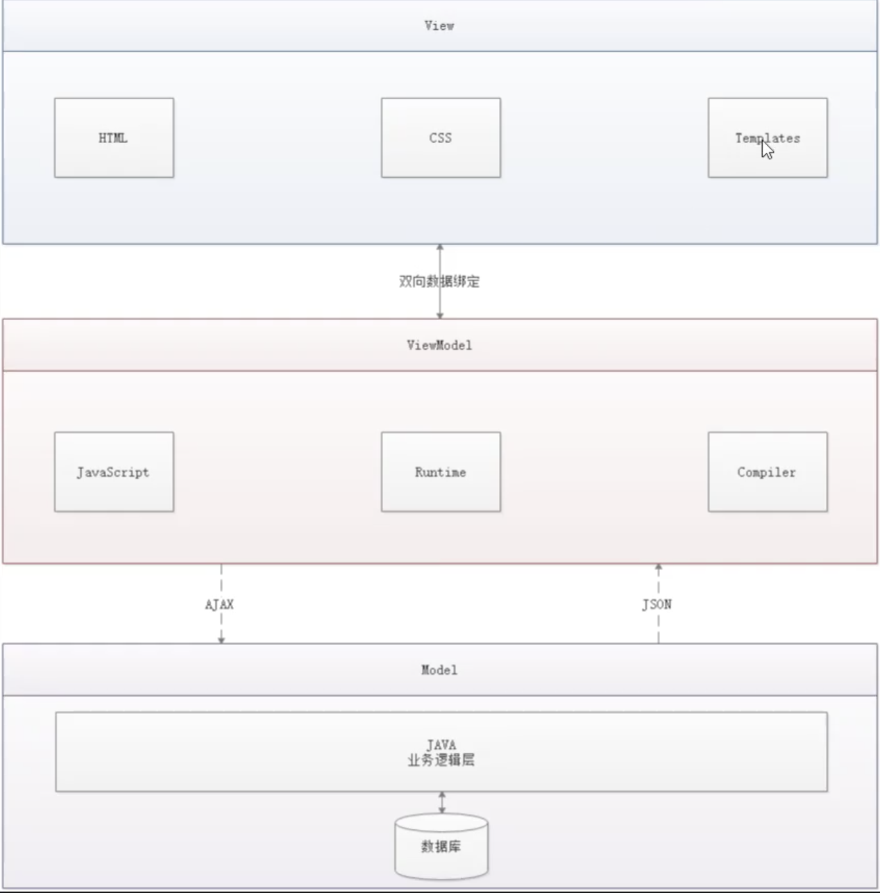
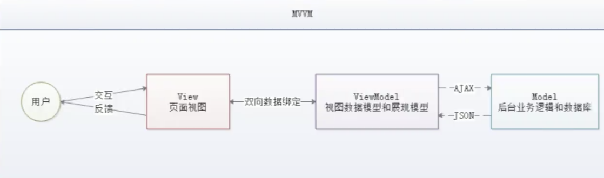
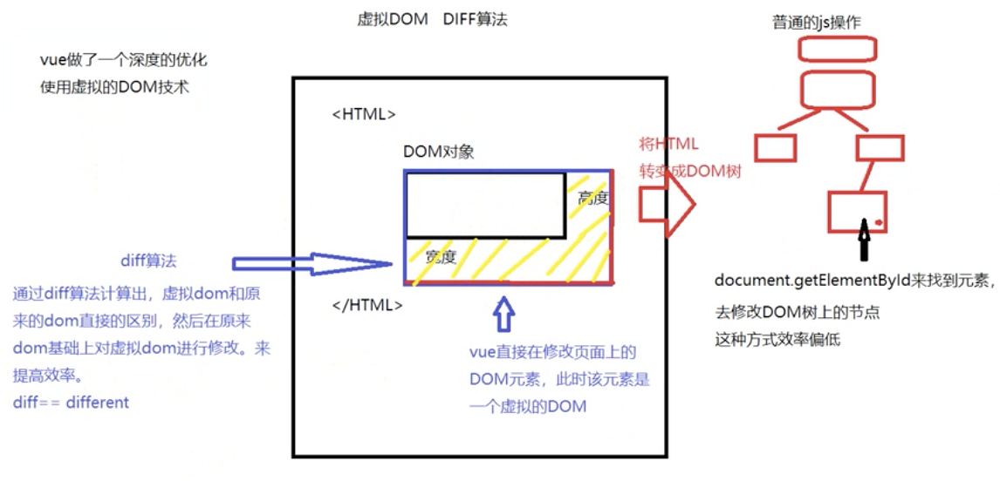
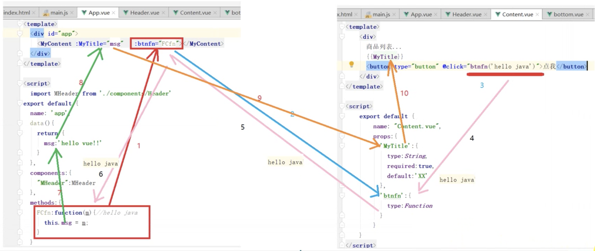
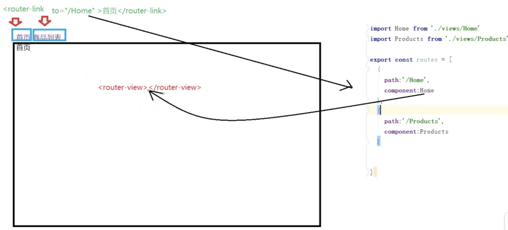

# 14. VUE
渐进式的js框架，只注重视图层

自底向上逐层运用，只关注视图层（HTML+CSS+JS）：给用户看，刷新后台给的数据

SoC 关注点分离原则

集成了MVVM+虚拟DOM

MVVM 异步通信为主：model view viewModel

npm：类似于maven，项目综合管理工具

[vue-element-admin](https://panjiachen.github.io/vue-element-admin-site/zh/guide/)

## 14.1. MVVM
Vue是MVVM中viewmodel的实现者。VUE的核心是DOM的监听和数据的绑定




viewModel层监听Model，Model中的数据变了马上让View层的数据也变。

viewModel是连接视图和数据的中间件

在MVVM框架中，数据和视图不能直接通信，要通过viewmodel。实现了双向数据绑定
- viewmodel能够观察到数据的变化通知视图更新，
- 能监听到视图的变化，通知数据发生改变

- 低耦合
- 可复用
- 独立开发
- 可测试
### 14.1.1. 使用vue实现MVVM
`<script src="https://cdn.jsdelivr.net/npm/vue/dist/vue.js"></script>`
```html
<!DOCTYPE html>
<html lang="en">
<head>
    <meta charset="UTF-8">
    <title>Title</title>
</head>
<body>

<div id="app">
    <span>
    <!-- 这里通过插值表达式来获得值 -->
        {{title}}
    </span>
    <!--这里input框内的数据改变 span中的也会改变-->
    <!--模型的改变会影响视图 中间就是VM在起作用-->
    <input type="text" v-model="title">
</div>

<script src="https://cdn.jsdelivr.net/npm/vue/dist/vue.js"></script>
<script>
    new Vue({
        el:'#app',
        data:{
            title:"hello vue"
        }
    })
</script>
</body>
</html>
```
## 14.2. 快速入门
### 14.2.1. 在网页中使用vue
1. html中`<div id="app"></div>`
2. js中`new Vue({el:'#app'})` 可以帮他想成json格式，里面存放了键值对，在js中键可以没有引号，多个键之间使用逗号分隔

原来我们的数据从域对象来，是后端提供的，意味着前后端在一起开发。

现在前后端分离，数据是通过发送ajax请求来获得的，请求后端接口，后端接口提供数据。

在html中被vue绑定的元素中，通过插值表达式来获取vue对象中的数据
### 14.2.2. vue对象里有什么
- el 该vue对象绑定在哪个div上
- data 提供数据，存放键值对
- methods 定义方法
    ```
        methods:{
            sayHi: function(){
                alert("hello");
            }
        }
    ```
- template
- render
- computed
- watch
### 14.2.3. 插值表达式
#### 14.2.3.1. 数组
`{{[0,1,2,3,4][1]}}`

#### 14.2.3.2. 对象
`{{ {name:'xiaoming',age:18}.name }}`

#### 14.2.3.3. 调用方法
`{{ sayHi() }}`

### 14.2.4. vue中的关键字
这些关键字都是作为html页面的标签中的属性
#### 14.2.4.1. v-model 双向绑定
将标签的value值与vue实例中的data属性进行绑定
```html
<div id="app">
    <p>
        <!--双向绑定-->
        请输入你的专业:<input type="text" v-model="major">
    </p>
    ======================<hr/>
    我是一位{{major}}的程序员
</div>

<script>
    new Vue({
        el:'#app',
        data:{
            major:"java"
        }
    })
</script>
```
#### 14.2.4.2. v-on 事件绑定
通过配合具体的事件名绑定vue中的函数
```html
<div id="app">
    <p>
        <!--双向绑定-->
        <!-- 可以简写成@input -->
        请输入你的专业:<input type="text" v-on:input="valueOfTag()">
    </p>
    ======================<hr/>
    我是一位{{major}}的程序员
</div>

<script>
    new Vue({
        el:'#app',
        data:{
            major:"java"
        },
        methods:{
            changeMajor: function(){
                console.log("changeTitle");
            }
            
            // 获取当前事件标签的属性 event是内置的参数对象
            // 这里的功能的实现与v-bind一样
            valueOfTag: function(event){
                this.major = event.target.value;
            }
        }
    })
</script>
```
#### 14.2.4.3. v-bind 属性绑定
```html
<div id="app">
    <!--插值表达式不能写在html的标签中，不能当做属性-->
    <!--要更改属性的话 需要用v-bind  可以简写成:href="link"-->
    <a v-bind:href="link">百度</a>
</div>

<script>
    new Vue({
        el:'#app',
        data:{
            link:"http://www.baidu.com"
        }
    })
</script>
```
#### 14.2.4.4. v-once
此元素只出现一次，数据内容的修改不影响此元素
```html
<div id="app">
    <!-- 这里下面即使双向绑定了，数值也不会更改 -->
    <p v-once>
        {{link}}
    </p>
    <input type="text" v-model="link">
</div>

<script>
    new Vue({
        el:'#app',
        data:{
            link:"http://baidu.com"
        }
    })
</script>
```
#### 14.2.4.5. v-html
将数据变成html语句
```html
<div id="app">
    <span v-html="mylink"></span>
</div>

<script>
    new Vue({
        el:'#app',
        data:{
            mylink:'<a href="www.baidu.com">链接</a>'
        }
    })
</script>
```
#### 14.2.4.6. v-text
将数据变成文本

### 14.2.5. 事件
#### 14.2.5.1. 事件的参数传递
- 设参 
- 传参
- 接参
#### 14.2.5.2. 事件修饰符
目的：让方法只有纯粹的数据逻辑，而不是去处理DOM事件细节
```html
<!-- 传播：div1中包含div2，两个都有click实践，如果在div2中click了，div1也会被出发 -->
<!-- 阻止单击事件继续传播 -->
<a v-on:click.stop="doThis"></a>

<!-- 提交事件不再重载页面 -->
<form v-on:submit.prevent="onSubmit"></form>

<!-- 修饰符可以串联 -->
<a v-on:click.stop.prevent="doThat"></a>

<!-- 只有修饰符 -->
<form v-on:submit.prevent></form>

<!-- 添加事件监听器时使用事件捕获模式 -->
<!-- 即内部元素触发的事件先在此处理，然后才交由内部元素进行处理 -->
<div v-on:click.capture="doThis">...</div>

<!-- 只当在 event.target 是当前元素自身时触发处理函数 -->
<!-- 即事件不是从内部元素触发的 -->
<div v-on:click.self="doThat">...</div>
```
#### 14.2.5.3. 按键修饰符
只有按下enter才会调用函数
```html
<input v-on:keyup.enter="submit">
```
### 14.2.6. vue改变内容
#### 14.2.6.1. 通过插值表达式的方法
#### 14.2.6.2. 计算属性：computed
他是一个属性，有着计算的能力。把不需要经常计算的东西放进computed，类似于缓存。他是一个属性而不是一个方法，用的时候不要加括号
```html
<div id="app">
    {{getCurrentTime()}}
    {{getCurrentTime1}}
</div>

<script>
    var v1 = new Vue({
        el:'#app',
        methods: {
            getCurrentTime:function(){
                return new Date();
            }
        },
        computed:{
            getCurrentTime1:function(){
                return new Date();
            }
        }
    })
</script>
```
### 14.2.7. 获取监控属性 watch
可以接收两个内部参数，第一个是变化后的值，第二个是变化前的值
```html
<div id="app">
    {{title}}
    <input type="text" v-model="title">
</div>

<script>
    var v1 = new Vue({
        el:'#app',
        data:{
            title: 'hello vue'
        },
        watch: {
            /*对title的改变进行监控，一旦改变就调用function*/
            title: function(newValue, oldValue){
                console.log(newValue + oldValue);
            }
        }
    })
</script>
```
### 14.2.8. Vue改变样式
#### 14.2.8.1. 绑定class属性
通过给html元素的class属性绑定vue中的属性值，得到样式的动态绑定
```html
<style>
    .mydiv{
        width: 400px;
        height: 220px;
        background-color: gray;

    }
    .red{
        background-color: red;
    }
</style>
<div id="app">
    <!-- 如果这里temp是true 则变为<div class="red"> 正好对应上面已经准备好的red class的样式 -->
    <div class="mydiv" v-bind:class="{red:temp}"></div>
    <div class="mydiv"></div>
    <div class="mydiv"></div>
    <button type="button" @click="temp=!temp">点我</button>
</div>
<script>
    new Vue({
        el: '#app',
        data:{
            temp: false
        }
    })
</script>
```
#### 14.2.8.2. 加入computed
通过computed返回对象，对象里放着键值对
```html
<div id="app">
    <div class="mydiv" :class="myClassStyle"></div>
    <div class="mydiv"></div>
    <button type="button" @click="temp=!temp">点我</button>
</div>
<script>
    new Vue({
        el: '#app',
        data:{
            temp: false
        },
        computed:{
            myClassStyle: function(){
                return {
                    yellow: this.temp
                }
            }
        }
    })
</script>
```
#### 14.2.8.3. v-model双重绑定
搞一个标签中用v-model绑定color`<input type="text" v-model="color">`

然后在div标签中的class 绑定到color上`<div :class="color">`

在vue的data中声明一个color

注意这里color定义的值其实是对应一个class，需要在css中定义这个类的样式才行


#### 14.2.8.4. 多个样式的操作
使用数组`<div :class="[mycolor, mywidth]">`

#### 14.2.8.5. 通过style设置
```html
<div id="app">
<!-- 这里本来是background-color但是在json中要改成驼峰 -->
    <div class="mydiv" :style="{backgroundColor:bc}"></div>
</div>
<script>
    new Vue({
        el: '#app',
        data:{
            bc: 'blue'
        },
    })
</script>
```
### 14.2.9. Vue核心：虚拟DOM和diff算法
普通的js操作：将html转换成DOM树。 开销比较大需要去找dom树上的节点并改变它，然后再对应网页上的改变。

vue的做法：直接去页面上改，这时的DOM叫虚拟DOM。通过diff算法，计算出虚拟DOM和原来DOM的区别，在原来的DOM上对虚拟DOM进行修改，提高效率



### 14.2.10. vue中的语句
1. 分支语句
- v-if
- v-else-if
- v-else

```html
<body>
    <div id="app">
        <h1 v-if="type==='A'">A</h1>
        <h1 v-else-if="type==='B'">B</h1>
        <h1 v-else>C</h1>
    </div>

    <script>
        var vm = new Vue({
            el:"#app",
            data:{
                type: 'A'
            }
        });
    </script>

</body>
```

2. v-show
用法上和v-if相同。布尔变量是true时显示，false不显示，改变的是元素的样式，不显示display是non，而v-if是让元素消失，然后添加元素。v-show的效率更高

3. 循环
```html
<body>
    <div id="app">
    <!-- key定义索引 -->
        <li v-for="(item, index) in items" :key="index">
            {{item.message}} -- {{index}}
        </li>
    </div>

    <script>
        var vm = new Vue({
            el:"#app",
            data:{
                items:[
                    {message: 'java'},
                    {message: 'python'}
                ]
            }
        });
    </script>

</body>
```

遍历对象
```html
<body>
    <div id="app">
    <!-- 顺序：值-键-索引 -->
        <li v-for="(v,k,i) in stu">
            {{k}} -- {{v}} --- {{i}}
        </li>
    </div>

    <script>
        var vm = new Vue({
            el:"#app",
            data:{
                stu:{
                    name:"xiaoming",
                    age:18
                }
            }
        });
    </script>

</body>
```
### 14.2.11. Vue实例
一个实例可以改变另一个实例中的内容，通过实例命名来改变

也可以调用另一个属性的方法
#### 14.2.11.1. 操作另一个对象的实例属性
带$开头的都叫实例属性，不直接通过对象.的方式调用的属性，这些通过.来获取的属性来自data或computed的属性。比如`\$el`,`\$data`

#### 14.2.11.2. ref的用法：相当于是id
因为id相同的话不会报错，但是会产生问题
```html
<div id="app1">
    <button type="button" ref="mybtn1" @click="showVueObj()">点我</button>
    <button type="button" ref="mybtn2" @click="showVueObj()">点我</button>
</div>
<script>
    var v1 = new Vue({
        el: '#app1',
        data:{
            title: "vuetitle"
        },
        methods:{
            showVueObj:function () {
                this.$refs.mybtn1.innerHTML="hello"
            }
        }

    });
</script>
```
#### 14.2.11.3. 动态绑定vue实例到页面
```html
<div id="app">

</div>
<script>
    new Vue({
        el: '#app',
        template:"<h1>hello</h1>"
    });
</script>
```
#### 14.2.11.4. mount的使用
将template中的内容展现到网页上，需要用el先绑定了。或者通过动态绑定
```html
<div id="app">

</div>
<script>
    var v1 = new Vue({
        template:"<h1>hello</h1>"
    });
    //动态绑定
    v1.$mount("#app");
</script>
```
### 14.2.12. Vue的组件
Vue的特点：组件化，可以被反复使用

有两种注册的方式，全局注册和本地注册
#### 14.2.12.1. component 全局注册
用component全局注册
```html
Vue.component("组件名",{vue对象})
```

在被vue绑定的html元素中才能使用组件

除了没有el，其他与vue对象一样
```html
<div id="app">
    <model1></model1>
</div>
<script>
    Vue.component("model1",{
        template:"<h1>{{title}}</h1>",
        // 注意 这里不能原来的data:了，要用这种格式
        data(){
            return {
                title:"hello vue"
            }
        }
    });

    var v1 = new Vue({
        el:'#app'
    });

</script>
```
#### 14.2.12.2. 本地注册
```html
<div id="app">
    <model1></model1>
</div>
<script>
    var model1 = {
        template:"<h1>{{title}}</h1>",
        data(){
            return {
                title:"hello vue"
            }
        }
    };

    var v1 = new Vue({
        el:'#app',
        components:{
            "model1":model1
        }
    });
</script>
```

#### 14.2.12.3. 作为组件的vue对象
- 特点1
    - vue.component中的data属性和之前的vue实例属性的写法有区别。
- 特点2
    - template写法：template中要写的html元素必须只能有一个根元素
    - `<h1>hello</h1><p>hello</p>`这个写法是错误的
    - 应该这么写`<div><h1>hello</h1><p>hello</p></div>`

### 14.2.13. vue的生命周期


```html
new Vue({
        el:'#app',
        beforeCreate(){
            console.log("beforeCreate")
        },
        created(){
            console.log("created")
        },
        beforeMount(){
            console.log("beforeMount")
        },
        mounted(){
            console.log("mounted")
        },
        beforeUpdate(){
            console.log("beforeUpdate")
        },
        updated(){
            console.log("updated")
        },
        beforeDestroy(){
            console.log("beforeDestroy")
        },
        destroyed(){
            console.log("destroyed")
        }

    });
```
### 14.2.14. slot
可以实现内容的动态拔插

```html
<body>
    <div id="app">
        <todolist>
            <!--这里的slot指 这个标签占用了哪一个插槽 在todolist标签中有两个插槽-->
            <!--冒号是v-bind的缩写-->
            <todo-title slot="todo-title" :title="title"></todo-title>
            <todo-items slot="todo-items" v-for="item in todoItems" :item="item"></todo-items>
        </todolist>
    </div>

    <script type="text/javascript">
        /*slot 定义插槽*/
        Vue.component("todolist",{
            template: '<div>' +
                '<slot name="todo-title">' +
                '</slot>' +
                '<ur>' +
                    '<slot name="todo-items"></slot>' +
                '</ur>' +
                '</div>'
        });
        Vue.component("todo-title",{
            props:['title'],
            template: '<div>{{title}}</div>'
        });
        Vue.component("todo-items",{
            props:['item'],
            template: '<li>{{item}}</li>'
        });

        var vm = new Vue({
            el:"#app",
            data:{
                title:'todolist',
                todoItems:['java','python']
            }
        });
    </script>

</body>
```

### 14.2.15. 自定义事件
```html
<body>
    <div id="app">
        <todolist>
            <!--这里的slot指 这个标签占用了哪一个插槽 在todolist标签中有两个插槽-->
            <!--冒号是v-bind的缩写-->
            <!--v-on来绑定时间，把这个组件中的remove方法绑定到vm中的removeItems方法-->
            <!--index可以直接用 不需要绑定-->
            <todo-title slot="todo-title" :title="title"></todo-title>
            <todo-items slot="todo-items" v-for="(item,index) in todoItems" :item="item"
            v-on:remove="removeItems(index)"></todo-items>
        </todolist>
    </div>

    <script type="text/javascript">
        /*slot 定义插槽*/
        Vue.component("todolist",{
            template: '<div>' +
                '<slot name="todo-title">' +
                '</slot>' +
                '<ur>' +
                    '<slot name="todo-items"></slot>' +
                '</ur>' +
                '</div>'
        });
        Vue.component("todo-title",{
            props:['title'],
            template: '<div>{{title}}</div>'
        });
        Vue.component("todo-items",{
            props:['item'],
            /*这里@click 是v-click的缩写*/
            /*还能绑定当前组件的方法*/
            template: '<li>{{item}} <button @click="removeClick">删除</button></li>',
            methods:{
                removeClick: function(){
                    /*自定义事件调用 调用v-on绑定的remove事件，而这个remove事件已经与removeItems(index)绑定，并且每个li中的remove实践的
                    * index都已经不一样了，所以这里直接调用remove事件就行，连index参数都不需要*/
                    this.$emit('remove');
                }
            }
        });

        var vm = new Vue({
            el:"#app",
            data:{
                title:'todolist',
                todoItems:['java','python']
            },
            methods:{
                removeItems: function(index){
                    alert("删除了"+this.todoItems[index]);
                    this.todoItems.splice(index, 1); //一次删除一个元素 从第index开始删除n个
                }
            }
        });
    </script>

</body>
```
## 14.3. vue-cli 脚手架工具
后端通过maven来创建项目的目的：1.通过maven快速管理依赖。2.来确定项目的结构。

前端可以通过vue-cli解决这俩问题

### 14.3.1. 安装nodejs
nodejs可以让前端运行在nodejs提供的服务器上的工具。

`npm install cnpm -g` 安装淘宝镜像 加速

安装vue-cil `cnpm install vue-cli -g`

### 14.3.2. 使用vue-cli
下载骨架搭建项目`vue init webpack-simple vue-cli-demo`

使用webpack-simple骨架初始化，项目名叫vue-cli-demo

`npm install` 下载依赖

使用开发模式运行项目`npm run dev`

### 14.3.3. 结构
- index.html 首页 实际内容被打包进了/dist/build.js
- main.js 整个vue项目的入口js
- App.vue 以.vue为扩展名的内容实际上就是一个vue对象。这种文件也成为vue组件

### 14.3.4. .vue文件的组成
- template 代表html
- script 代表js
- style 代表css

```html
<template>
  <div id="app">

  </div>
</template>

<script>
<!--  暴露一个vue对象 -->
export default {
  name: 'app',
  data () {
    return {

    }
  }
}
</script>

<style lang="scss">

</style>
```

### 14.3.5. 在App.vue中使用另一个vue组件
#### 14.3.5.1. 全局注册
1. 编写组件 .vue
2. 去main.js中导入，并且注册
3. 加入到App.vue中 把组件当标签使用
```js
import Vue from 'vue'
import App from './App.vue'
import Header from './components/Header'
import Content from './components/Content'
import Botton from './components/Botton'

// 全局注册了三个组件，可以把组件拿来当标签使用
Vue.component('Header', Header);
Vue.component('Content', Content);
Vue.component('Botton', Botton);


new Vue({
  el: '#app',
  render: h => h(App)
})
```
```html
<template>
  <div id="app">
    <Header></Header>
    <Content></Content>
    <Botton></Botton>
  </div>
</template>

<script>
// 暴露一个vue对象
export default {
  name: 'app',
  data () {
    return {

    }
  }
}
</script>

<style lang="scss">

</style>
```
#### 14.3.5.2. 本地注册
全部写在App.vue中
```html
<template>
  <div id="app">
    <Header></Header>
    <Content></Content>
    <Botton></Botton>
  </div>
</template>

<script>
  import Header from './components/Header'
  import Content from './components/Content'
  import Botton from './components/Botton'
// 暴露一个vue对象
export default {
  name: 'app',
  data () {
    return {

    }
  },
  components:{
    'Header':Header,
    'Content':Content,
    'Botton':Botton
  }
}
</script>

<style lang="scss">

</style>
```
### 14.3.6. 各组件之间的参数传递
#### 14.3.6.1. 父传子
1. 父Vue中定义数据，在标签中通过绑定属性的方式传递
    `<Content :MyTitle="msg"></Content>`
2. 子组件用props接收
    ```html
    <template>
    <div>
    商品列表
    {{MyTitle}}
    </div>
    </template>

    <script>
        export default {
            name: "Content",
        props:['MyTitle']
        }
    </script>

    <style scoped>

    </style>
    ```

props的写法有两种：
1. props[参数列表]
2. props可以存放一个对象，对象内放类型，是否必须，默认值
```html
props:{
        MyTitle:{
        type:String,
        required: true,
        default:'XX'
        },
      btnfn: {
        type: Function
      }
    }
```
props也可以接收函数，这个函数在父组件中定义

#### 14.3.6.2. 子传父

在父中定义函数，传给子，子调用函数在函数中的变量可以由子组件传递给父组件。

#### 14.3.6.3. 以事件发射的方式，实现子传父
子组件使用方法`this.$emit("键","值");`
```html
methods: {
    doClick: function () {
    this.$emit('newName', 'hello js');
    }
}
```

父组件在标签中接收 `@键="赋值对象=$event"`
```html
<Content :MyTitle="msg" @newName="msg=$event"></Content>
```

### 14.3.7. Vue中发送ajax请求
#### 14.3.7.1. axios
由于vue是一个视图层框架，严格遵守Soc，所以vue并不包含ajax的通信功能。
##### 14.3.7.1.1. 安装
**在项目中**安装

`cnpm install --save axios vue-axios`

##### 14.3.7.1.2. main.js中引入
```js
import axios from 'axios'
import VueAxios from 'vue-axios'

Vue.use(VueAxios, axios);
```

##### 14.3.7.1.3. 发送ajax请求
后端代码
```java
@RequestMapping("regist")
@ResponseBody
public String regist(String mail, String password){
    System.out.println(mail);
    System.out.println(password);
    return "regist success!";
}
```
```html
<!-- App.vue -->
<template>
  <div id="app">
    <div style="width:50%" class="container">
      <div>
        <h3>Regist</h3>
        <h5>Email</h5>
        <input type="text" class="form-control" v-model.trim="mail"/><br/> {{mail}}
        <h5>Password</h5>
        <input type="password" class="form-control" v-model.lazy="password"/><br/> {{password}}
        <h5>Gender</h5>
        <input type="radio" name="gender" v-model="gender" value="female"/>男
        <input type="radio" name="gender" v-model="gender" value="male"/>女<br/>
        <h5>Hobby</h5>
        <input type="checkbox" name="hobby" v-model="hobby" value="music">音乐
        <input type="checkbox" name="hobby" v-model="hobby" value="movie">电影
        <input type="checkbox" name="hobby" v-model="hobby" value="sport">运动 {{hobby}}<br/>
        <button type="button" class="btn btn-success" @click="registfn">注册</button>
      </div>
    </div>
  </div>
</template>

<script>
  export default {
    name: 'app',
    data(){
      return {
        mail: '',
        password: '',
        gender: '',
        hobby: ''
      }
    },
    methods:{
      registfn:function () {
        this.axios({
          method:"get",
          url:"http://localhost:8090/regist?mail"+this.mail+"&password="+this.passive,
        }).then(function(response){
          console.log(response.data)
        });
        }
      },
      // 可以这样用 从数据库拿来数据 显示
    created(){
      this.axios({
        method:"get",
        url:"http://localhost:8090/regist?mail"+this.mail+"&password="+this.passive,
      }).then(function(response){
        this.$data = response.data;
      });
    }
  }
</script>

<style lang="scss">

</style>
```

并开启tomcat服务器，设置端口8090 避免与vue撞上。

##### 14.3.7.1.4. 跨域问题
vue在8080 tomcat在8090

此时会出现**跨域问题**。解决方案在spring-mvc.xml中加上以下
```xml
<mvc:cors>
<mvc:mapping path="/**"
allowed-origins="*"
allowed-methods="POST, GET, OPTIONS, DELETE, PUT,PATCH"
allowed-headers="Content-Type, Access-Control-Allow-Headers, Authorization, X-Requested-
With"
allow-credentials="true" />
</mvc:cors>
```

跨域是指浏览器不能执行其他网站的脚本。它是由浏览器的同源策略造成的，是浏览器JavaScript施加的安全限制

域名，协议，端口均相同的叫同源

[解决方案]
1. CORS 在spring-mvc.xml中加
2. 使用JSONP解决跨域问题
3. 使用Nginx反向代理

### 14.3.8. 路由（组件之间的跳转）
能够帮助一个vue组件中实现其他组件的相互切换。

可以通过路由模块，将制定的组件显示在路由视图中。

在项目中安装路由模块`cnpm install vue-router -s`

#### 14.3.8.1. 创建静态路由表
在src下创建router.js
```js
// router.js
import Home from './views/Home'
import Products from './views/Products'

export const routes=[
  {
    path:"/Home",
    component: Home
  },
  {
    path:"/Products",
    component: Products
  }
];
```
#### 14.3.8.2. 使用路由并绑定路由表
```js
// main.js
import Vue from 'vue'
import App from './App.vue'
import VueRouter from 'vue-router' // 1 引入路由模块
import {routes} from './router' // 2 引入静态路由表

Vue.use(VueRouter); //3 使用路由模块

// 4 创建VueRouter实例
const router = new VueRouter({
  routes: routes
});

new Vue({
  el: '#app',
  router, // 5 把router放入到vue实例中
  render: h => h(App)
});
```
```html
<!-- App.vue -->
<template>
  <div id="app">
    <router-view></router-view>
  </div>
</template>

<script>
export default {
  name: 'app',

}
</script>

<style>
</style>
```

此时地址栏输入`http://localhost:8080/#/Home` 和`http://localhost:8080/#/Products` 就会响应了。**但是页面还是那个页面，并没有刷新，只是内容变了。**

#### 14.3.8.3. 创建路由连接和路由视图
`<router-view>`是专门用来显示组件的视图


```html
<!-- App.vue -->
<template>
  <div id="app">
    <div>
      <span>
        <router-link to="/Home">首页</router-link>
      </span>
      <span>
        <router-link to="/Products">商品列表</router-link>
      </span>
    </div>
    <router-view></router-view>
  </div>
</template>

<script>
export default {
  name: 'app',

}
</script>

<style>
</style>
```

#### 14.3.8.4. 路由参数传递
##### 14.3.8.4.1. 方法一
【设参】先在route.js中修改
```js
{
    path:"/Products/:id",
    component: Products
}
```

【传参】在router-link元素中to属性后面加上id
```html
<li role="presentation"><router-link to="/Products/1">手机</router-link></li>
```

【接参】通过目标vue中的this.$route.params.id接收
```html
<template>
    <div>
      商品列表
      {{id}}
    </div>
</template>

<script>
    export default {
        name: "Products",
      data(){
          return{
            id: this.$route.params.id
          }
      },
      // 可以这样等网页加载完后获取到id号，那么就可以这样从数据库获得指定商品，进行网页渲染
      created(){
          console.log(this.id)
      }
    }
</script>

<style scoped>
</style>
```
##### 14.3.8.4.2. 方法二
在html中使用

`<router-link :to="{neme:"Products", params:{id:1}}">`
这里的name要和路由配置时的name属性匹配。另外这里是`:to`，是为了将这当做属性使用

在js中使用时

`this.$router.push({name:"Products", params:{id:1}})`

**[注意！]**

这样使用的话route.js中的path后面可以不加`/:id`，也可以加，加了之后路径会显示`http://localhost:8080/#/ProductInfo/1001` 不加则不会显示，但是参数传递也会成功

#### 14.3.8.5. 路由间跳转的方式
##### 14.3.8.5.1. html中的router-link连接进行跳转
##### 14.3.8.5.2. 通过js实现路由的跳转
```js
methods:{
    btnfn:function () {
    this.$router.push("/Products/1")
    }
}
```
### 14.3.9. 资源打包
```html

```
此时的图片已经被打包到/dist/目录下，能正常显示

但是如果这样，就无法正常显示
```html


data(){
    return{
        img:"../img/1.png"
    }
}
```
这里的img在data中定义。因为这样不会被打包到/dist下

[解决方案]
1. 这是需要通过`npm run build`构造生成环境。所有的都会被打包到/dist/build.js中
2. 或者直接在开发环境下，手动把静态资源放到/dist/中，并把路径改成dist路径下的资源

**开发一个vue项目的步骤**：
1. 用vue-cli获取骨架
2. 安装依赖
3. 使用`npm run dev`进入开发者模式。看到的内容都是有vue-cli打包并发布到nodejs上的。开发完是需要手动部署的。
4. 使用`npm run build`构建资源。会产生一个dist文件夹。里面包含静态资源

## 14.4. 使用webpack
是非常主流的vue骨架`vue init webpack 项目名`

### 14.4.1. 安装依赖
`vue-router` `element-ui` `sass-loader` `node-sass`
```
cnpm install vue-router --save-dev
cnpm i element-ui -S
cnpm install sass-loader node-sass --save-dev
cnpm install --save axios vue-axios

cnpm install
```

### 14.4.2. 路由的变化
webpack骨架用路由的方法稍有变化，创建/router/index.js文件夹
```js
import Vue from 'vue'
import Router from 'vue-router'
import Login from '../views/Login'

Vue.use(Router);

export default new Router({
  routes:[
    {
      path: '/Login',
      name: "Login",
      component: Login
    }
  ]
})
```
```js
// main.js
import Vue from 'vue'
import App from './App'
import router from './router'
import VueRoute from 'vue-router'

Vue.use(VueRoute);
Vue.config.productionTip = false;

/* eslint-disable no-new */
new Vue({
  el: '#app',
  router,
  components: { App },
  template: '<App/>',
});
```

在App.vue中使用`<router-view>`

### 14.4.3. 使用elementUI
在main.js中加入
```js
import ElementUI from 'element-ui';
import 'element-ui/lib/theme-chalk/index.css';
Vue.use(ElementUI);
```

Vue实例中增加一句`render: h => h(App)`

### 14.4.4. 首页编写
Form 组件提供了表单验证的功能，只需要通过 rules 属性传入约定的验证规则，并将 Form-Item 的 prop 属性设置为需校验的字段名即可。

#### 14.4.4.1. 后端
```java
@ResponseBody
@RequestMapping(value="login", method=RequestMethod.Post)
public String login(String name, String password){
    if("xiaoming".equals(name)&&"123".equals(password)){
        return "success";
    }else{
        return "error";
    }
}
```
别忘了加上mvc:cors
```xml
<mvc:cors>
<mvc:mapping path="/**"
allowed-origins="*"
allowed-methods="POST, GET, OPTIONS, DELETE, PUT,PATCH"
allowed-headers="Content-Type, Access-Control-Allow-Headers, Authorization, X-Requested-With"
allow-credentials="true" />
</mvc:cors>
```
#### 14.4.4.2. 前端
```html
<!-- Login.vue -->
<template>
  <div class="login-box">
    <!--定义验证功能rules 在data中返回rule-->
    <el-form ref="form" :model="form" :rules="rules" label-width="80px">
      <h3 class="login-title">欢迎登陆</h3>
      <el-form-item label="用户名" prop="name">
        <el-input type="text" v-model="form.name" placeholder="请输入用户名"></el-input>
      </el-form-item>
      <el-form-item label="密码" prop="password">
        <el-input type="password" v-model="form.password" placeholder="请输入密码"></el-input>
      </el-form-item>

      <el-form-item>
        <!--点击登录时也要检验表单，所以把form的ref传进去 要联合prop属性一起用-->
        <el-button type="primary" @click="onSubmit('form')">登录</el-button>
      </el-form-item>
    </el-form>
  </div>
</template>

<script>
  export default {
    name: "Login",
    data() {
      return {
        form: {
          name: '',
          password: ''
        },
        rules: {
          name: [
            /*trigger表示触发条件，一旦失去焦点就触发*/
            {required: true, message: '请输入用户名', trigger: 'blur'},
            {min: 5, max: 12, message: '长度在 5 到 12 个字符', trigger: 'blur'}
          ],
          password: [
            {required: true, message: '请输入密码', trigger: 'blur'}
          ]
        }
      }
    },
    methods: {
      onSubmit(formName) {
        this.$refs[formName].validate((valid) => {
          /*注意 后面的this会改变，所以需要提前绑定this*/
          var vm = this;
          if (valid) {
            /*这里post请求需要添加一个模块，否则数据会传输失败，需要qs的内置库*/
            this.axios({
              method: 'get',
              url: 'http://localhost:8090/login?name='+vm.form.name+'&password='+vm.form.password,
              // data: {
              //   name: vm.form.name,
              //   password: vm.form.password
              // }
            }).then(function (resp) {
              if (resp.data === 'success') {
                //  登录成功 跳转到主页
                vm.$router.push("/Home");
              } else {
                vm.$message.error('用户名或密码错误');
                return false;
              }
            })
          } else {
            this.$message.error('用户名或密码错误');
            return false;
          }
        });
      }
    }
  }
</script>

<style scoped>
  .login-box {
    width: 500px;
    height: 300px;
    border: 1px solid #DCDFE6;
    border-radius: 20px;
    box-shadow: 0px 0px 20px #DCDFE6;
    margin: 150px auto;
    padding: 20px 50px 20px 30px;
  }

  .login-title {
    text-align: center;
    margin-bottom: 40px;
  }
</style>
```
#### 14.4.4.3. post请求需要内置库qs
```js
import Qs from 'qs'
// 在axios中在data前对data进行转换
transformRequest:[function(data){
    return Qs.stringify(data)
}]
```

### 14.4.5. 假数据Mock
常用的工具 easyMock

进入easyMock在线创建接口，通过created()和axios访问接口获取数据
```html
<template>
  <div>
    <el-container style="height: 500px; border: 1px solid #eee">
      <el-aside width="200px" style="background-color: rgb(238, 241, 246)">
        <el-menu :default-openeds="['1']">
          <el-submenu index="1">
            <template slot="title"><i class="el-icon-message"></i>商品管理</template>
            <el-menu-item-group>
              <el-menu-item index="1-1">商品列表</el-menu-item>
              <el-menu-item index="1-2">商品信息</el-menu-item>
            </el-menu-item-group>
          </el-submenu>
        </el-menu>
      </el-aside>


      <el-container>
        <el-header style="text-align: right; font-size: 12px">
          <el-dropdown>
            <i class="el-icon-setting" style="margin-right: 15px"></i>
            <el-dropdown-menu slot="dropdown">
              <el-dropdown-item>查看</el-dropdown-item>
              <el-dropdown-item>新增</el-dropdown-item>
              <el-dropdown-item>删除</el-dropdown-item>
            </el-dropdown-menu>
          </el-dropdown>
          <span>王小虎</span>
        </el-header>

        <el-main>
          <el-table :data="users">
            <el-table-column prop="uid" label="用户ID" width="140">
            </el-table-column>
            <el-table-column prop="uname" label="姓名" width="120">
            </el-table-column>
            <el-table-column prop="age" label="年龄">
            </el-table-column>
          </el-table>
        </el-main>
      </el-container>
    </el-container>
  </div>
</template>

<script>
  export default {
    name: "Home",
    data() {
      return {
        users: []
      }
    },
    created() {
      //因为axios内部的this是当前axios对象，而不是当前vue对象。
      var vm = this;
      this.axios({
        method: 'get',
        url:'https://www.easy-mock.com/mock/5e80acf5d625bd5d7455b0a0/vuedemo/users',
      }).then(function (resp) {
        vm.users = resp.data.users;
      })
    }
  }
</script>

<style scoped>
  .el-header {
    background-color: #B3C0D1;
    color: #333;
    line-height: 60px;
  }

  .el-aside {
    color: #333;
  }
</style>
```
### 14.4.6. 配置嵌套路由(子路由)
虽然显示了好几个页面，其实都是在app.vue中的路由。那么这些页面的路由就叫子路由。

路由显示的组件内部，又嵌套着路由。

在/router/index.js中更改
```js
export default new Router({
  routes:[
    {
      path: '/Login',
      name: "Login",
      component: Login
    },
    {
      path: '/Home',
      name: "Home",
      component: Home,
      children:[
        {
          path: '/ProductInfo',
          name: "ProductInfo",
          component: ProductInfo
        },
        {
          path: '/PeoductList',
          name: "PeoductList",
          component: PeoductList
        }
      ]
    }
  ]
})
```

这新加的两个vue应该出现在Home.vue中的router-view中，把原来的table组件放到这两个新的vue中。

```html
<!-- Home.vue更改 -->
 <el-main>
    <router-view></router-view>
<!--          <el-table :data="users">-->
<!--            <el-table-column prop="uid" label="用户ID" width="140">-->
<!--            </el-table-column>-->
<!--            <el-table-column prop="uname" label="姓名" width="120">-->
<!--            </el-table-column>-->
<!--            <el-table-column prop="age" label="年龄">-->
<!--            </el-table-column>-->
<!--          </el-table>-->
</el-main>
```

对应的标签点击跳转的地方也要添加router-link
```html
<el-menu-item-group>
    <el-menu-item index="1-1"><router-link to="/ProductList">商品列表</router-link></el-menu-item>
    <el-menu-item index="1-2"><router-link to="/ProductInfo">商品信息</router-link></el-menu-item>
</el-menu-item-group>
```
### 14.4.7. 组件重定向
点击退出，跳转到登录页面
```html
<!-- Home.vue -->
<el-dropdown-item><router-link to="/Logout">退出</router-link></el-dropdown-item>
```
```js
// index.js
{
    // 意思是logout链接将跳转到login页面
    path: '/Logout',
    redirect: '/Login'
}
```

### 14.4.8. 路由的钩子函数
`beforeRouteEnter()`和`afterRouteLeave`

## 14.5. vue element admin
是一个后台前端解决方案。 
[vue-element-admin](https://panjiachen.github.io/vue-element-admin-site/zh/guide/essentials/router-and-nav.html#配置项)
### 14.5.1. 安装
```
# 克隆项目
git clone https://github.com/PanJiaChen/vue-element-admin.git

# 进入项目目录
cd vue-element-admin

# 安装依赖
npm install

# 建议不要用 cnpm 安装 会有各种诡异的bug 可以通过如下操作解决 npm 下载速度慢的问题
npm install --registry=https://registry.npm.taobao.org

# 本地开发 启动项目
npm run dev
```

基础模板
`git clone https://github.com/PanJiaChen/vue-admin-template.git`

@ 被解释称`src` 在vue.config.js文件中可以看到

### 14.5.2. 路由和侧边栏
整个项目的侧边栏是通过路由表动态生成的，可以调整路由表中的内容来改变侧边栏的内容
1. 改变侧边栏的标题
2. 改变侧边栏的内容

### 14.5.3. 分页Pagination
通过elementUI的内置组件实现。

五个部分：
1. 记录的总条数
2. 每页记录几条
3. 总页数
4. 当前是第几页
5. 当前页的所有记录

使用Pagination标签，通过父传子，props的方法传递数据即可

真分页：后端分页给数据。适合大数据量的
假分页：已经获得了所有数据，前端来进行分页。所有数据已经缓存在浏览器了。

**Pagination实现的是真分页，前端把当前页和每页显示几条传给后端，后端实现真分页回传给前端。**

```js
<pagination
:total="total"
:page.sync="listQuery.page"
:limit.sync="listQuery.limit"
@pagination="getList" />
```

#### 14.5.3.1. 后端：使用Mybatis的PageHelper插件
```xml
<dependency>
    <groupId>com.github.pagehelper</groupId>
    <artifactId>pagehelper</artifactId>
    <version>5.1.10</version>
</dependency>
```

在mybatis.xml中配置拦截器插件

通过pagehelper获取PageInfo对象，该对象中封装了五个部分。

通过`PageHelper.startPage(pageNum,pageSize);`设置当前是第几页，当前页面内显示多少条数据
```java
PageHelper.startPage(pageNum,pageSize);
List<Product> list = productService.getList();
PageInfo<Product> pageInfo = new PageInfo<Product>(list);
return pageInfo;
```

#### 14.5.3.2. 前端
在vue中加入
```html
<template>
  <pagination
    :total="total"
    :page.sync="listQuery.page"
    :limit.sync="listQuery.limit"
    @pagination="getList" />
</template>

<script>
import Pagination from '@/components/Pagination'

export default {
  components: { Pagination },
  data() {
    return {
      total: 0, // 记录条数
      listQuery: {
        page: 1, // 当前页数
        limit: 20 // 每页显示的数量
      },
      list: null
    }
  },
  methods: {
    getList() { // 当前页的所有记录
      // 获取数据
      var vm = this;
      this.axios({
          method:"get",
          url:"....", //带上listQuery.page和listQuery.limit
      }).then(function(resp){
          vm.total = resp.data.total;
          vm.list = resp.data.list; //当前页数据
      })
    }
  }
}
</script>
```

在js中
`import Pagination from '@/components/Pagination`

到admin中把这个组件复制过来

把Pagination需要的/utils/scroll-to.js也拷贝进来

`components:{Pageination}` 声明组件

在data中定义listQuery对象，里面设置page, limit数值


## 14.6. Vuex
vuejs应用程序的状态管理模式

`npm install vuex --save`

新建`store`下面放`index`

起到session的功能
- 现在vuex里存入user对象
- 然后到home.vue中取出

