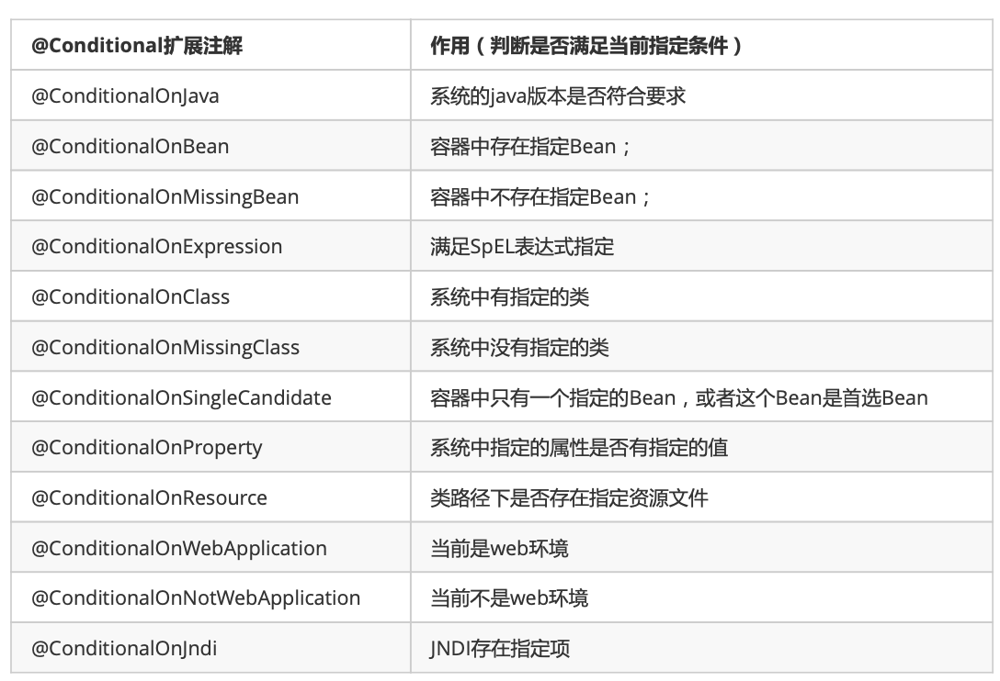
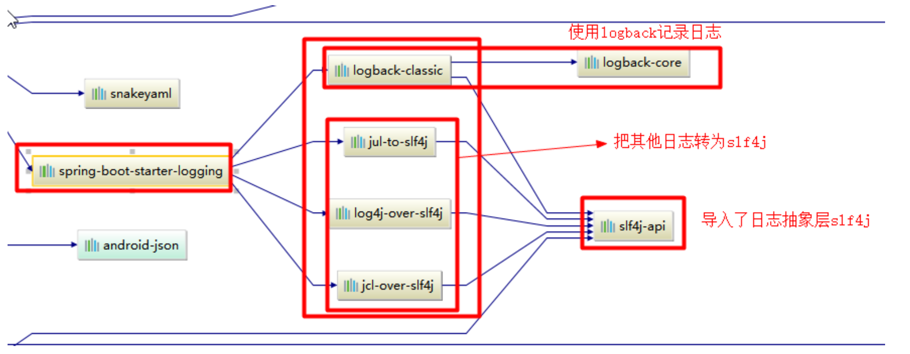
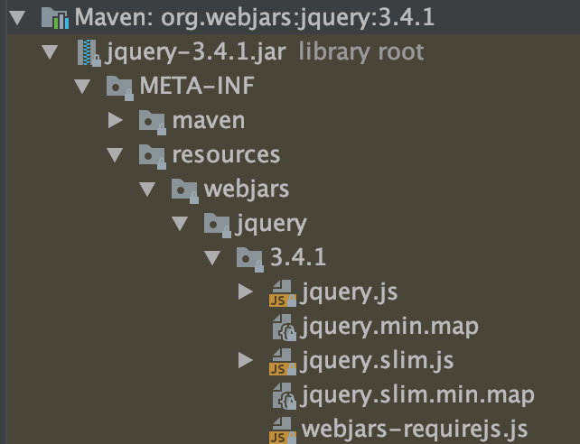
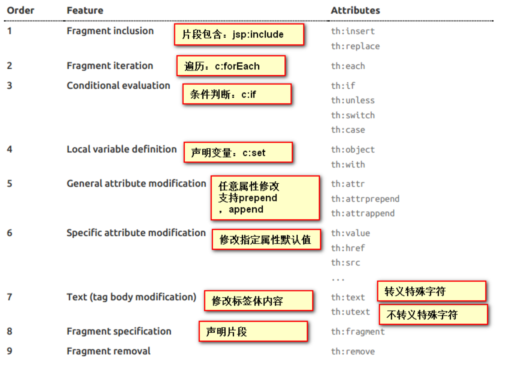
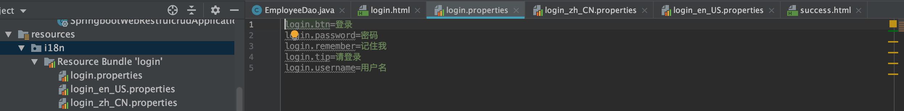

# 15. Spring Boot
## 15.1. SpringBoot入门
### 15.1.1. 简介
简化spring应用开发，约定大于配置。整个Spring技术栈的一个大整合。

- 快速建立spring项目
- 使用嵌入式servlet容器，应用无需打包成war包
- 自动依赖于版本控制
- 大量的自动配置，简化开发，也可修改默认值
- 无需配置xml，无代码生成，开箱即可
- 准生产环境的运行时应用监控
- 与云计算的天然继承

要学好springboot需要充分了解spring框架。
#### 15.1.1.1. 微服务简介
是个架构风格，一个应用应该是一组小型服务；可以通过http的方式进行沟通；

每一个功能元素最终都是一个可独立替换和独立升级的软件单元。

微服务单元之间通过轻量级的http相互通信
#### 15.1.1.2. 环境搭建
- jdk 1.8
- maven
- idea
- springboot

### 15.1.2. HelloWord
浏览器发送hello请求，服务器接收请求并处理，响应helloword字符串

通过spring initialize创建.

HelloworldApplication是程序的主入口不能删除也不能更改

1. 创建maven项目
2. 导入springboot依赖
3. 编写主程序 @SpringBootApplication 标注是一个SpringBoot应用
4. 编写相关的业务逻辑
5. 运行main方法
6. 部署工作：导入Maven插件，将应用打包成一个可运行的jar包。运行生命周期中的package即可。直接通过`java -jar 包地址`即可
    ```xml
    <build>
        <plugins>
            <plugin>
                <groupId>org.springframework.boot</groupId>
                <artifactId>spring-boot-maven-plugin</artifactId>
            </plugin>
        </plugins>
    </build>
    ```
### 15.1.3. **原理
#### 15.1.3.1. POM文件
1. 父项目
`spring-boot-starter-parent`。这个的父项目`spring-boot-dependencies`。这个父项目真正管理SpringBoot中的所有依赖版本

以后导入依赖默认是不需要写版本的。（没有再dependencies的需要些）

2. 导入的依赖
`spring-boot-starter-web`。

spring-boot-starter：SpringBoot的场景启动器；帮我们导入了web模块正常运行所依赖的组件；

SpringBoot将所有的功能场景抽取出来，做成一个个的启动器，只需要在项目里面引入这些启动器，相关场景的依赖都会导入进来。

#### 15.1.3.2. 主程序
@SpringBootApplication 标注是一个SpringBoot应用，是SpringBoot的主配置类，运行这个类的main方法来启动应用。

他是一连串的组合注解
```java
@Target({ElementType.TYPE})
@Retention(RetentionPolicy.RUNTIME)
@Documented
@Inherited
@SpringBootConfiguration
@EnableAutoConfiguration
@ComponentScan(
    excludeFilters = {@Filter(
    type = FilterType.CUSTOM,
    classes = {TypeExcludeFilter.class}
), @Filter(
    type = FilterType.CUSTOM,
    classes = {AutoConfigurationExcludeFilter.class}
)}
)
```
- @SpringBootConfiguration
  - SpringBoot的配置类。包含了 @Configuration spring的注解。而上面那个是SpringBoot的注解
  - 配置类 == 配置文件
- EnableAutoConfiguration
  - 开启自动配置功能。
  - 以前我们需要配置的，现在SpringBoot都帮我们自动配置了。
  - 包含了@AutoConfigurationPackage
    - 将主配置类（@SpringBootApplication标注的类）所在包下所有的组件都扫描到spring容器中。
    - 包含了@Import({Registrar.class}) spring的底层注解@import，给容器中导入一个组件
      - 选择导入哪些组件的选择器
      - 将所有需要导入的组件以全类名的组件以全类名的方式返回；这些组件就会被添加到容器中
      - 会给容器中导入非常多的自动配置类，就是给容器中这个场景需要的所有组件，并配置好这些组件
      - `SpringFactoriesLoader.loadFactoryNames(EnableAutoConfiguration.class,classLoader);` 从`META-INFO/spring.factories`获取EnableAutoConfiguration指定的值。

**Spring Boot在启动的时候从类路径下的META-INF/spring.factories中获取EnableAutoConfiguration指定的值，将这些值作为自动配置类导入到容器中，自动配置类就生效，帮我们进行自动配置工作**

J2EE的整体整合解决方案和自动配置都在org.springframework.boot:spring-boot-autoconfigure包下
    
## 15.2. SpringBoot配置
### 15.2.1. 配置文件
SpringBoot使用一个全局的配置文件
- application.properties
- application.yml

配置文件的作用：修改SpringBoot自动配置的默认值
#### 15.2.1.1. yaml
标记语言：
- 以前的配置文件都是使用.xml
- yaml是以数据为中心，比json、xml等更适合做配置文件

```yml
# application.yml
server:
  port:8081
```
```xml
<!-- application.xml -->
<server>
    <port>8081</port>
</server>
```

##### 15.2.1.1.1. yaml的语法
1. 基本语法
`k: v` : 表示一对键值对（冒号后的空格必须有）；

以空格的缩进来控制层级关系；只要是左对齐的一列数据都是统一层级的

大小写敏感

2. 值的写法
- 字面量：普通的值（数字，字符串，布尔）
  - `k: v`
  - 字符串不需要单引号和双引号
  - 双引号内不转意 `\n`会变成换行
  - 单引号 不转意
- 对象、Map（属性和值）（键值对）
  - `k: v`
  ```yml
    friend:
        lastName: zhangsan
        age: 20
    
    friend:{lastName: zhangsan, age: 20}
  ```
- 数组（List、Set）
  ```yml
    pets:
     - cat
     - dog
     - pig

    pets: [cat, dog, pig]
  ```
#### 15.2.1.2. 获取配置文件值注入
##### 15.2.1.2.1. 从yml中获得
配置文件
```yml
person:
  lastName: zhangsan
  age: 18
  boss: false
  birth: 2017/12/12
  maps: {k1: v1, k2: v2}
  lists:
    - lisi
    - zhouliu
  dog:
    name: 小狗
    age: 2
```
javaBean
```java
package com.example.demo.bean;

import org.springframework.boot.context.properties.ConfigurationProperties;
import org.springframework.stereotype.Component;

import java.util.Date;
import java.util.List;
import java.util.Map;

//将配置文件中的每一个属性映射到这个组件中
// @ConfigurationProperties告诉SpringBoot将本类中所有属性和配置文件中相关的配置进行绑定
// prefix = "person" 配置文件中哪一个属性进行一一映射
// 只有这个组件是容器中的组件，才能使用容器提供的功能 @Component
/*
需要导入这个
<dependency>
            <groupId>org.springframework.boot</groupId>
            <artifactId>spring-boot-configuration-processor</artifactId>
            <optional>true</optional>
        </dependency>
 */
@Component
@ConfigurationProperties(prefix = "person")
public class Person {
    private String lastName;
    private Integer age;
    private Boolean boss;
    private Date birth;

    private Map<String, Object> maps;
    private List<Object> lists;
    private Dog dog;

    @Override
    public String toString() {
        return "Person{" +
                "laseName='" + lastName + '\'' +
                ", age=" + age +
                ", boss=" + boss +
                ", birth=" + birth +
                ", maps=" + maps +
                ", lists=" + lists +
                ", dog=" + dog +
                '}';
    }

    public String getLaseName() {
        return lastName;
    }

    public void setLaseName(String laseName) {
        this.lastName = laseName;
    }

    public Integer getAge() {
        return age;
    }

    public void setAge(Integer age) {
        this.age = age;
    }

    public Boolean getBoss() {
        return boss;
    }

    public void setBoss(Boolean boss) {
        this.boss = boss;
    }

    public Date getBirth() {
        return birth;
    }

    public void setBirth(Date birth) {
        this.birth = birth;
    }

    public Map<String, Object> getMaps() {
        return maps;
    }

    public void setMaps(Map<String, Object> maps) {
        this.maps = maps;
    }

    public List<Object> getLists() {
        return lists;
    }

    public void setLists(List<Object> lists) {
        this.lists = lists;
    }

    public Dog getDog() {
        return dog;
    }

    public void setDog(Dog dog) {
        this.dog = dog;
    }
}
```
可以导入配置文件处理器以后编写配置就有提示了。
```xml
<dependency>
    <groupId>org.springframework.boot</groupId>
    <artifactId>spring-boot-configuration-processor</artifactId>
    <optional>true</optional>
</dependency>
```
##### 15.2.1.2.2. 从properties中获得
```xml
# 避免乱码 需要去设置正file encodings把transparent native-to-ascii勾上
person.lase-name=张三
person.age=20
person.birth=2017/12/12
person.boss=false
person.maps.k1=v1
person.maps.k2=v2
person.lists=a,b,c
person.dog.name=dog
person.dog.age=2
```
#### 15.2.1.3. ConfigurationProperties和Value的区别
```java
public class Person {
    @Value("${person.lastName}")
    private String lastName;
    @Value("#{11*2}")
    private Integer age;
```

区别
- 功能： 前者批量配置 后者一个一个指定
- 松散绑定： 前者支持大写用`-`或者`_`来代替 而后者不行
- SpEL： 前者不支持 后者支持
- JSR303数据校验： 前者支持  后者不支持
- 复杂类型封装（map set等）： 前者支持 后者不支持

什么是数据校验`@Validated`
```java
@Component
@ConfigurationProperties(prefix = "person")
@Validated
public class Person {
    @Email
    private String lastName;
```
这样表示这个lastName必须是email格式的
#### 15.2.1.4. @PropertySource&@ImportResource
**@PropertySource**加载指定的配置文件。@ConfigurationProperties是默认从全局配置文件中获取值。一些与SpringBoot无关的配置不要放在全局配置文件中，放在其他的配置文件中。

这里比如把person的数值定义放到person.properties中，那么用`@PropertySource(value = {"classpath:person.properties"})`即可，这大括号内可以填多个。

**@ImportResource**导入spring的配置文件，让配置文件的内容生效。SpringBoot中没有spring的配置文件，我们自己编写的配置文件也不能自动识别。想让spring配置文件生效，需要使用这个注解，标注在配置类上
```xml
<bean id="helloService" class="com.example.demo.service.HelloService"></bean>
```
```java
@SpringBootApplication
@ImportResource(locations = {"classpath:beans.xml"})
public class DemoApplication {

    public static void main(String[] args) {
        SpringApplication.run(DemoApplication.class, args);
    }

}
```
```java
@Autowired
ApplicationContext ioc;

@Test
public void testHelloService(){
    System.out.println(ioc.containsBean("helloService"));
}
```
但是这不是SpringBoot推荐的方式。SpringBoot推荐使用全注解的方式：
1. 配置类 相当于spring的配置文件
    ```java
    package com.example.demo.config;

    import com.example.demo.service.HelloService;
    import org.springframework.context.annotation.Bean;
    import org.springframework.context.annotation.Configuration;

    // 指明当前类是一个配置类，替代之前的spring配置文件
    // 在配置文件中用<bean></bean>添加标签，在类中用@Bean
    @Configuration
    public class MyAppConfig {
        // 将方法的返回值添加到容器中，容器中这个组件默认的id就是方法名
        @Bean
        public HelloService helloService(){
            System.out.println("配置类@Bean给容器中添加组建了");
            return new HelloService();
        }
    }

    ```

#### 15.2.1.5. 配置文件的占位符
- 随机数
  - `${random.value}` `${random.uuid}`
- 使用已经定义过的 `${}`

#### 15.2.1.6. profile
1. 多profile文件
我们在主配置文件时，文件名可以是`application-{profile}.properties`，这里`{profile}`用任意字符代替。就可以动态切换。

在主文件中`spring.profile.active=dev`就能激活使用`application-dev.properties`的配置

2. yml支持多文档块
用`---`来定义多个文档块
```yml
server:
  port:8080
#   设置激活dev模式
spring:
  profiles:
    active: dev
---

spring:
  profiles: dev
server:
  port: 8081
---
server:
  port: 8082
spring:
  profiles: prod
```

3. 命令行模式激活
`--spring.profiles.active=dev`
4. 虚拟机参数
`-Dspring.profile.active=dev`

`server.context.path=` 项目的url
### 15.2.2. 加载顺序
#### 15.2.2.1. 配置文件加载位置
- file:./config/
- file:./
- classpath:/config/
- classpath:/

**优先级从高到低**高优先级覆盖低优先级

可以通过`spring.config.location`来改变默认配置文件的位置。项目打包好后，使用命令行参数的形式指定配置文件的新位置。会和默认文件一起启动

#### 15.2.2.2. 外部配置的加载顺序
这里只写核心的，一共其实有17个

1. 命令行参数

**有profile>无profile 外部>内部**
2. jar包外部的application-{profile}.properties或application.yml(带spring.profile)配置文件
3. jar包内部的application-{profile}.properties或application.yml(带spring.profile)配置文件
4. jar包外部的application.properties或application.yml(不带spring.profile)配置文件
5. jar包内部的application.properties或application.yml(不带spring.profile)配置文件

还是高优先级覆盖低优先级
### 15.2.3. 配置原理
#### 15.2.3.1. **自动配置原理(注意这里讲的是SpringBoot1.5的版本，2中有所不同后序自学) 尚硅谷P19
[配置文件能配置的属性参照](https://docs.spring.io/spring-boot/docs/2.2.6.RELEASE/reference/html/appendix-application-properties.html#common-application-properties)

1. springboot启动的时候加载主配置类，开启了自动配置功能`@EnableAutoConfiguration`
2. `@EnableAutoConfiguration`作用：
   1. 利用`AutoConfigurationImportSelector`给容器导入一些组件。这个类中有一个`selectImports`方法。返回一个字符串列表
   ```java
    public List<String> getConfigurations() {
        return this.configurations;
    }
    // 扫描所有jar包类路径下 META-INF/spring.factories
    List<String> configurations = SpringFactoriesLoader.loadFactoryNames(this.getSpringFactoriesLoaderFactoryClass(), this.getBeanClassLoader());
   ```
    把扫描到的这些文件的内容包装秤properties对象

    从properties中获取到EnableAutoConfiguration.class的值，把他添加到容器中
**将类路径下 META-INF/spring.factories里面配置的所有EnableAutoConfiguration加入到容器中**，用他们做自动配置

3. 每一个自动配置类进行自动配置功能
4. 以HttpEncodingAutoConfiguration为例解释自动配置原理
    ```java
    @Configuration( // 表示这是一个配置类，以前编写的配置文件一样，也可以给容器中添加组件
        proxyBeanMethods = false
    )
    @EnableConfigurationProperties({HttpProperties.class})// 启用指定类的ConfigurationProperties功能；将配置文件中对应的值和HttpProperties帮顶起来
    @ConditionalOnWebApplication( // spring底层有conditional注解，根据不同的条件，如果满足指定的条件，整个配置类里面的配置就会生效。这里判断当前配置类是否是web应用
        type = Type.SERVLET
    )
    @ConditionalOnClass({CharacterEncodingFilter.class}) // 判断当前项目有没有这个类； 这个类是springmvc中乱码解决的过滤器
    @ConditionalOnProperty( // 判断配置文件中是否存在某个配置，如果不存在也是城里的
        prefix = "spring.http.encoding",
        value = {"enabled"},
        matchIfMissing = true
    )
    public class HttpEncodingAutoConfiguration {
        // 已经和SpringBoot的配置文件映射了，他是获取配置文件中的spring.http
        private final Encoding properties;

        // 通过只有一个参数的有参构造器，参数的值就会从容器中拿
        public HttpEncodingAutoConfiguration(HttpProperties properties) {
        this.properties = properties.getEncoding();
        }

        @Bean // 给容器中添加一个组件，这个组件的某些值需要从properties中获取
        @ConditionalOnMissingBean
        public CharacterEncodingFilter characterEncodingFilter() {
    ```
    根据当前不同的条件判断，决定这个配置类是否生效。一旦这个配置类生效，这个配置类就会给容器中添加各种组件；这些组件的属性从对应的propertiess类中获取，每一个属性又是和配置文件绑定的
5. 所有在配置文件中能配置的属性都是在xxxProperties类中封装着；配置文件能配置什么就可以参照某一个功能对应的这个属性类
    ```java
    @ConfigurationProperties( // 从配置文件中获取指定的值和bean的属性进行绑定
        prefix = "spring.http"
    )
    public class HttpProperties {
    ```

精髓：
- springboot启动会加载大量的自动配置类
- 我们看我们需要的功能有没有springboot默认写好的自动配置类
- 我们再来看这个自动配置类中到底配置了哪些组件（只要有我们要用的组件，我们就不需要再来配置了）
- 给容器中自动配置类添加组件的时候，会从properties中获取某些属性，我们就可以在配置文件中指定这些属性的值

xxxAutoConfiguration: 自动配置类；

xxxProperties: 封装配置文件中相关属性
#### 15.2.3.2. @Conditional&自动配置报告
1. @Conditional派生注解
   作用：必须是@Conditional指定的条件城里，才给容器中添加组件，配置里面的所有内容才生效
   
   **自动配置类在一定条件下才生效**

我们怎么知道哪些自动配置类生效了？

可以在配置文件中写`debug=true`，开启springboot debug模式。可以从控制台内看到哪些类自动配置了

## 15.3. SpringBoot与日志
### 15.3.1. 日志框架
日志抽象层
- JCL SLF4j jboss-logging
- 选择SLF4j

日志实现
- Log4j JUL Log4j2 Logback
- 选择Logback

springboot底层是spring框架，spring默认是用JCL，但是springboot默认使用SLF4j和Logback

#### 15.3.1.1. 使用SLF4j
1. 在系统中使用SLF4j
开发的时候，日志记录方法的调用，不应该直接调用日志的实现类，而是调用日志抽象层里面的方法。

导入slf4j的jar和logback的实现jar
```java
import org.slf4j.Logger;
import org.slf4j.LoggerFactory;

public class HelloWorld {
  public static void main(String[] args) {
    Logger logger = LoggerFactory.getLogger(HelloWorld.class);
    logger.info("Hello World");
  }
}
```


每一个日志的实现框架都有自己的配置文件，使用slf4j以后，配置文件还是用日志实现本身的配置文件

#### 15.3.1.2. 遗留问题
系统内部不同框架使用了不同的日志实现框架。需要统一日志记录

解决方法：先排除系统中的其他日志框架，然后用中间包来替换原有的日志框架，最后导入slf4j的实现


#### 15.3.1.3. springboot中的日志关系

底层依赖关系

总结：
- 底层也是使用slf4j+logback的方式进行日志记录
- 通过替换jar包解决了遗留问题
- 替换包内部其实都是slf4j
- 如果要引入其他框架，一定要把这个框架的默认日志移除掉，用替换包代替

### 15.3.2. 日志配置
```java
@Test
void contextLoads() {
    // 记录器
    Logger logger = LoggerFactory.getLogger(getClass());
    // 日志的级别
    // 由低到高的顺序如下
    // 可以调整输出的日志级别：日志只会打印高于这个级别的日志
    logger.trace("这是trace日志");
    logger.debug("这是debug日志");
    // springboot默认使用info级别 可以在配置文件调整
    logger.info("这是info日志");
    logger.warn("这是warn日志");
    logger.error("这是error日志");
}
```
可以在配置文件中调整级别
```properties
logging.level.com.example.demo=trace
# file和path只能写一个
# 生成日志的路径
logging.file=springboot.log
# 在当前磁盘的根路径下创建spring文件夹和里面的log文件夹，使用spring.log作为默认文件
logging.path=/spring/log
# 控制台输出日志的格式
logging.pattern.console=
# 指定文件中日志生成的格式
logging.pattern.file=
```
#### 15.3.2.1. 指定日志文件和日志profile功能
如果是使用logback，在resources下放一个logback.xml，在里面配置

- logback.xml直接被日志框架识别。
- logback-spring.xml 日志框架就不直接加载，由springboot加载，可以指定某段配置只在某个环境下生效
  ```xml
    <springProfilename="staging">
    <!‐‐ configuration to be enabled when the "staging" profile is active ‐‐> 可以指定某段配置只在某个环境下生效
    </springProfile>
  ```
#### 15.3.2.2. 切换日志框架
以log4j为例
1. 先把依赖中的logback排除掉
2. 把log4j-over-slf4j依赖排除
3. 导入中间的适配层
   ```xml
   <dependency>
    <groupId>org.slf4j</group>
    <artifactId>slf4j-log4j12</artifactId>
   </dependency>
   ```
## 15.4. SpringBoot与Web开发
1. 创建springboot应用，选中需要的模块
2. springboot已经默认将这些场景配置好了，只需要在配置文件中指定少量配置就可以允许起来
3. 自己编写代码

需要清楚**自动配置原理**，这个场景springboot帮我们配置了什么？能不能修改？能修改哪些？能不能扩展？
### 15.4.1. springboot对静态资源的映射规则
1. 所有/webjars/**，都去classpath:/META-INF/resources/wenjars/找资源
   webjars：以jar包的方式引入静态资源，将依赖通过maven的形式导入
   https://www.webjars.org

   
    可以通过localhost:8080/webjars/jquery/3.4.1/jquery.js来访问到

2. /** 当前项目的任何资源，如果没有人处理，就会去如下几个文件夹内寻找
   - classpath:/META-INF/resources/
   - classpath:/resources/ 也就是/src/main/resources/resources
   - classpath:/static/
   - classpath:/public/
   - / 当前项目根路径

3. 配置欢迎页映射；静态资源文件夹下的所有index.html页面，被/**映射，规则同2

4. 配置图标:所有的**/favicon.ico都是在静态资源文件下找，同2

可通过`spring.resources.static-locations`来配置
### 15.4.2. Thymeleaf
springboot以jar包的方式，而且tomcat也是嵌入式的，所以不支持jsp的开发。springboot中推荐使用thymeleaf。

语法更简单，功能更强大。

#### 15.4.2.1. 引入thymeleaf
```xml
<!--导入thymeleaf-->
<dependency>
    <groupId>org.springframework.boot</groupId>
    <artifactId>spring-boot-starter-thymeleaf</artifactId>
</dependency>
```
#### 15.4.2.2. 使用
去spring-boot-autoconfigure下找到thymeleaf中的autoconfigure。使用规则都放在ThymeleafProperties类中

```java
@ConfigurationProperties(
    prefix = "spring.thymeleaf"
)
public class ThymeleafProperties {
private static final Charset DEFAULT_ENCODING;
public static final String DEFAULT_PREFIX = "classpath:/templates/";
public static final String DEFAULT_SUFFIX = ".html";
private boolean checkTemplate = true;
private boolean checkTemplateLocation = true;
private String prefix = "classpath:/templates/";
private String suffix = ".html";
private String mode = "HTML";
```
只要把html页面放在classpath:/templates/路径下就可以了

#### 15.4.2.3. 语法
要使用现在html中导入名称空间
`<html xmlns:th="http://www.thymeleaf.org">`

```html
<!--将div里面的文本内容设置为-->
<div th:text="${hello}"></div>
```

语法规则
1. th:text 改变当前元素里面的文本内容
   - th: 任意html属性 可以替换原生属性


2. 表达式
```
Simple expressions:
    VariableExpressions: ${...}  #获取变量值
        1. 获取对象的属性、调用方法
        2. 使用内置的基本对象：
            #ctx : the context object.
            #vars: the context variables.
            #locale : the context locale.
            #request : (only in Web Contexts) the HttpServletRequest object. #response : (only in Web Contexts) the HttpServletResponse object. #session : (only in Web Contexts) the HttpSession object. #servletContext : (only in Web Contexts) the ServletContext object.
        3. 内置的工具对象
            #execInfo : information about the template being processed.
            #messages : methods for obtaining externalized messages inside variables expressions, in the same way as they would be obtained using #{...} syntax.
            Established locale country: <span th:text="${#locale.country}">US</span>.
            #uris : methods for escaping parts of URLs/URIs
            #conversions : methods for executing the configured conversion service (if any).
            #dates : methods for java.util.Date objects: formatting, component extraction, etc.
            #calendars : analogous to #dates , but for java.util.Calendar objects.
            #numbers : methods for formatting numeric objects.
            #strings : methods for String objects: contains, startsWith, prepending/appending, etc.
            #objects : methods for objects in general.
            #bools : methods for boolean evaluation.
            #arrays : methods for arrays.
            #lists : methods for lists.
            #sets : methods for sets.
            #maps : methods for maps.
            #aggregates : methods for creating aggregates on arrays or collections.
            #ids : methods for dealing with id attributes that might be repeated (for example, as a result of an iteration).


    SelectionVariableExpressions: *{...}  
        变量选择表达式；与${}功能一样。
        补充使用：配合th:object使用，可以直接获取其内部内容
        <div th:object="${session.user}">
        <p>Name: <span th:text="*{firstName}">Sebastian</span>.</p> 
        <p>Surname: <span th:text="*{lastName}">Pepper</span>.</p> 
        <p>Nationality: <span th:text="*{nationality}">Saturn</span>.</p>
        </div>

    MessageExpressions: #{...} 获取国际化内容

    LinkURLExpressions: @{...} 定义url链接
        <!-- Will produce 'http://localhost:8080/gtvg/order/details?orderId=3' (plus rewriting) -->
        <a href="details.html" th:href="@{http://localhost:8080/gtvg/order/details(orderId=${o.id})}">view</a>
        <!-- Will produce '/gtvg/order/details?orderId=3' (plus rewriting) -->
        <a href="details.html" th:href="@{/order/details(orderId=${o.id})}">view</a>
        <!-- Will produce '/gtvg/order/3/details' (plus rewriting) -->
        <a href="details.html" th:href="@{/order/{orderId}/details(orderId=${o.id})}">view</a>

    Fragment Expressions: ~{...} 片段引用表达式

Literals
Text literals: 'one text' , 'Another one!' ,... 
Number literals: 0 , 34 , 3.0 , 12.3 ,... 
Boolean literals: true , false
Nullliteral: null
Literal tokens: one , sometext , main ,... 

Text operations:
Stringconcatenation: +
Literal substitutions: |The name is ${name}|

Arithmetic operations: 
Binaryoperators: +, -, *, /, %
Minussign(unaryoperator): - 

Boolean operations:
Binary operators: and , or
Boolean negation (unary operator): ! , not

Comparisons and equality:
Comparators: >, <, >=, <= (gt, lt, ge, le)
Equality operators: == , != ( eq , ne ) 

Conditional operators:
If-then: (if) ? (then)
If-then-else: (if) ? (then) : (else) 
Default: (value) ?: (defaultvalue)

Special tokens:
No-Operation: _
```

```html
<!DOCTYPE html>
<html lang="en" xmlns:th="http://www.thymeleaf.org">
<head>
    <meta charset="UTF-8">
    <title>Title</title>
</head>
<body>
<h1>success</h1>
<!--将div里面的文本内容设置为-->
<div th:text="${hello}"></div>
<div th:utext="${hello}"></div>
<!--三个h4标签-->
<h4 th:each="user:${users}" th:text="${user}"></h4>
<!--一个h4标签-->
<hr/>
<!-- [[]]是text [()]是utext -->
<h4>
    <span th:each="user:${users}">[[${user}]]</span>
</h4>
</body>
</html>
```
#### 15.4.2.4. springmvc自动配置原理
springboot对springmvc的默认配置：
- 自动配置了viewresolver(视图解析器：根据方法的返回值得到视图对象，视图对象决定如何渲染)
  - ContentNegotiatingViewResolver组合所有的视图解析器
  - 如何定制：我们可以自己给容器中添加一个视图解析器，这会被自动的组合进去
- 静态资源文件夹路径
- 静态首页访问
- 静态图标
- 自动注册了Converter、GenericConverter、Formatter的bean
  - 转换器：类型转换使用Converter
  - Formatter格式化器：按一定的格式进行转化。2018-12-12===Date
  - 需要在配置中配置日期格式才会注册dateFormatter
  - 可以自己添加格式化器和转换器。直接放在容器中即可
- 消息转换器，用来转换HTTP请求和响应
  - 从容器中确定数值
  - 可以自己添加，注册在容器中
- MessageCodeResolver 定义错误代码生成规则
- ConfigurableWebBindingInitializer 初始化web数据绑定器
  - 将请求数据绑定到javabean中

**扩展配置springmvc**
编写一个配置类（@Configuration），实现WebMvcConfigurer；不能标注@EnableWebMvc

```java
package com.wyj.config;

import org.springframework.context.annotation.Configuration;
import org.springframework.web.servlet.config.annotation.ViewControllerRegistry;
import org.springframework.web.servlet.config.annotation.WebMvcConfigurer;

@Configuration
public class MyMvcConfig implements WebMvcConfigurer {
    /*浏览器发送home请求，也来到success页面。这个部分原来在spring-mvc.xml中是实现*/
    @Override
    public void addViewControllers(ViewControllerRegistry registry) {
        registry.addViewController("/home").setViewName("success");
    }
}
```

原理
1. WebMvcAutoConfiguration是SpringMVC的自动配置类
2. 在做其他自动配置时会导入@@Import({WebMvcAutoConfiguration.EnableWebMvcConfiguration.class})。他继承了DelegatingWebMvcConfiguration。这个父类中有以下代码
   ```java
    @Autowired(
        required = false
    )
    public void setConfigurers(List<WebMvcConfigurer> configurers) {
        if (!CollectionUtils.isEmpty(configurers)) {
            this.configurers.addWebMvcConfigurers(configurers);
        }

    }
   ```
    从容器中获取所有的WebMvcConfigurer。将所有的webmvc相关的配置都来调用一遍。
3. 容器中所有的webmvc都会一起起作用。我们自己的配置类也会被调用

如果要全面接管springmvc，不需要自动配置的话，标注@EnableWebMvc，所有的都自己配置

因为@EnableWebMvc会导入一个WebMvcConfigurationSupport组件，而WebMvcAutoConfiguration类运行的条件是没有WebMvcConfigurationSupport组件。所以会直接失效，不再进行自动配置

WebMvcConfigurationSupport是springmvc最进本的功能

#### 15.4.2.5. 如何修改springboot的默认配置
模式
- springboot在自动配置很多组件时，大部分是先看用户有没有在容器中自己配置(@Bean @Component)如果有就用用户自己配置的，如果没有，才自动配置；如果有些组件可以有多个(viewresolver)将用户配置的和自己默认的组合起来
- 在springboot中会有很多的xxxConfigure帮我们进行扩展配置

### 15.4.3. RestfulCRUD 开发实战
1. 默认访问首页
```java
@Configuration
public class MyMvcConfig implements WebMvcConfigurer {
    @Bean
    public WebMvcConfigurer webMvcConfigurer(){
        WebMvcConfigurer webMvcConfigurer = new WebMvcConfigurer(){
            @Override
            public void addViewControllers(ViewControllerRegistry registry) {
                registry.addViewController("/").setViewName("login");
                registry.addViewController("/index.html").setViewName("login");
            }
        };
        return webMvcConfigurer;
    }
}
```
2. 将html模板中bootstrap的引用通过webjars，如果是本地的也用thymeleaf的语法写
```html
<link th:href="@{/webjars/bootstrap/4.4.1-1/css/bootstrap.css}" rel="stylesheet">

```
这样写如果哪天项目的名字改了，这个路径也会自动变化

3. 国际化
   1. 编写国际化配置文件，抽取国际化页面需要显示的国际化消息
    
    第一个是默认值，第二个为英文，第三个为中文
   2. MessageSource已经自动配置好了 我们需要指定配置路径`spring.messages.basename=i18n.login`
    ```java
    public class MessageSourceAutoConfiguration {
    private static final Resource[] NO_RESOURCES = new Resource[0];

    public MessageSourceAutoConfiguration() {
    }

    @Bean
    @ConfigurationProperties(
        prefix = "spring.messages"
    )
    public MessageSourceProperties messageSourceProperties() {
        return new MessageSourceProperties();
    }

    @Bean
    public MessageSource messageSource(MessageSourceProperties properties) {
    ResourceBundleMessageSource messageSource = new ResourceBundleMessageSource();
    if (StringUtils.hasText(properties.getBasename())) {
        messageSource.setBasenames(StringUtils.commaDelimitedListToStringArray(StringUtils.trimAllWhitespace(properties.getBasename())));
    }

     protected static class ResourceBundleCondition extends SpringBootCondition {
        private static ConcurrentReferenceHashMap<String, ConditionOutcome> cache = new ConcurrentReferenceHashMap();

        protected ResourceBundleCondition() {
        }

        public ConditionOutcome getMatchOutcome(ConditionContext context, AnnotatedTypeMetadata metadata) {
            String basename = context.getEnvironment().getProperty("spring.messages.basename", "messages"); // 需要指定路径
    ```
   3. 去页面获取国际化值`<label class="sr-only" th:text="#{login.username}"></label>`。这样就可以根据浏览器的区域信息自动变化了，springboot有默认的localesolver，根据请求头信息获取locale
   4. 实现点击中文、英文也能切换功能。
      1. 自己编写一个LocaleResolver，思路是在链接中带上locale的信息`<a class="btn btn-sm" th:href="@{/index.html(l='zh_CN')}">中文</a>`
       ```java
       package com.wyj.component;

       import org.springframework.util.StringUtils;
       import org.springframework.web.servlet.LocaleResolver;

       import javax.servlet.http.HttpServletRequest;
       import javax.servlet.http.HttpServletResponse;
       import java.util.Locale;

       /*
       * 通过连接来区别区域信息
       * 仅仅写了这个，还没有注册是没有用的，去config中注册他
       * */
       public class MyLocaleResolver implements LocaleResolver {
           @Override
           public Locale resolveLocale(HttpServletRequest httpServletRequest) {
               String l = httpServletRequest.getParameter("l");
               Locale locale = Locale.getDefault();
               if(!StringUtils.isEmpty(l)){
                   String[] s = l.split("_");
                   locale = new Locale(s[0], s[1]);
               }
               return locale;
           }

           @Override
           public void setLocale(HttpServletRequest httpServletRequest, HttpServletResponse httpServletResponse, Locale locale) {

           }
       }
       ```
       ```java
       // MyMvcConfig.java
       @Bean
       public LocaleResolver localeResolver(){
           return new MyLocaleResolver();
       }
       ```
 4. 编写登录功能
      ```java
       package com.wyj.controller;

       import org.springframework.stereotype.Controller;
       import org.springframework.util.StringUtils;
       import org.springframework.web.bind.annotation.PostMapping;
       import org.springframework.web.bind.annotation.RequestParam;

       import java.util.Map;

       @Controller
       public class LoginController {
           @PostMapping(value = "/user/login")
           public String login(@RequestParam("username") String username,
                               @RequestParam("password") String password,
                               Map<String, Object> map){
               if(!StringUtils.isEmpty(username)&&"123456".equals(password)){
                   /*防止表单重复提交 可以重定向到主页。而这里的main.html添加了视图映射，是通往dashboard的*/
                   return "redirect:/main.html";
               }else{
                   map.put("msg", "用户名密码错误");
                   return "login";
               }

           }
       }

       // config添加试图映射
       registry.addViewController("/main.html").setViewName("dashboard");
      ```

    1. 拦截器登录检查
       ```java
       package com.wyj.component;
       import org.springframework.web.servlet.HandlerInterceptor;
       import org.springframework.web.servlet.ModelAndView;
       import javax.servlet.http.HttpServletRequest;
       import javax.servlet.http.HttpServletResponse;
       /*
       * 登录检查
       * */
       public class LoginHandlerInterceptor implements HandlerInterceptor {
           @Override
           public boolean preHandle(HttpServletRequest request, HttpServletResponse response, Object handler) throws Exception {
               Object loginUser = request.getSession().getAttribute("loginUser");
               if(loginUser==null){
                   // 未登录，返回登录页面
                   // 转发到登录页
                   request.setAttribute("msg", "没有权限请先登录");
                   request.getRequestDispatcher("/index.html").forward(request, response);
                   return false;
               }else{
                   // 已登录，放行请求
                   return true;
               }

           }
       }
       ```
       ```java
       // MyMvcConfig.java
       // 注册拦截器
        @Override
        public void addInterceptors(InterceptorRegistry registry) {
            /*拦截人任意请求，排除登录页面的请求和登录请求*/
            /*静态资源也要放进去*/
            registry.addInterceptor(new LoginHandlerInterceptor()).addPathPatterns("/**").excludePathPatterns("/asserts/css/**", "/webjars/**","/index.html", "/user/login", "/");
        }
       ```
5. CRUD-员工列表

   1. 需要满足Restful风格

   | 操作 | 普通CRUD(URI操作) | RestfulCRUD |
   | --- | ---------------- | ----------- |
   | 查询 | getEmp | emp---GET |
   | 添加 | addEmp | emp---POST |
   | 修改 | updateEmp?id=xxx?xxx=xx | emp---PUT |
   | 删除 | deleteEmp?id=xx | emp---DELETE |

    2. 实验的请求架构

   | 操作 | 请求URI | 请求方式 |
   | ---- | ---- | ---- |
   | 查询所有员工 | emps | GET |
   | 查询某个员工 | emp/{id} | GET |
   | 来到添加页面 | emp | GET |
   | 添加员工 | emp | POST |
   | 来到修改页面(查询某个员工回显) | emp/{id} | GET |
   | 修改员工 | emp | PUT |
   | 删除员工 | emp/{id} | DELETE |

    3. 员工列表
    thymeleaf公共页面的抽取，员工list.html页面与dashboard页面边框与上部一致。
    ```html
    1. 抽取公共片段 th:fragment
    2. 引入公共片段 区别：在div中插入；代替div；将标签内部的东西包含在div内
       1. th:insert=“~{模板名::选择器或片段名}” 注意选择器是#id
       2. th:replace
       3. th:include
       4. 用三个的时候 可以不加~{}
    ```
    ```html
    <tbody>
        <tr th:each="emp : ${emps}">
            <td th:text="${emp.id}"></td>
            <td th:text="${emp.lastName}"></td>
            <td th:text="${emp.email}"></td>
            <td th:text="${emp.gender}"></td>
            <td th:text="${emp.department}"></td>
            <td th:text="${emp.birth}"></td>
        </tr>
    </tbody>
    ```
    4. 引入片段的时候传入参数，以达到点击员工列表时，这几个字会高亮的效果
    ```html
    <!-- 通过在引入片段时设置参数 -->
    <div th:replace="~{commons/bar::#sidebar(activeUri='main.html')}"></div>

    <!-- 然后在被复用的片段内进行判断该参数 -->
    <a class="nav-link active" th:href="@{/main.html}" th:class="${activeUri=='main.html'?'nav-link active':'nav-link'}">
    ```
    5. 添加

    添加页面的跳转
    ```html
    <h2><a class="btn btn-sm btn-success" href="/emp" th:href="@{/emp}">添加</a></h2>
    ```
    ```java
    /*来到员工添加页面*/
    @GetMapping("/emp")
    public String toAddPage(Model model){
        /*查出所有的部门*/
        Collection<Department> departments = departmentDao.getDepartments();
        model.addAttribute("depts", departments);
        return "emp/add";
    }
    ```
   
    最容易出现400错误，员工数据出问题，其中生日格式可能会有斜杠分割（默认）或者横杠分割。可以在配置文件中配置`spring.mvc.date-format=yyyy-MM-dd`。配置了之后默认的就不起作用了

    6. 修改

    与添加放在同一个页面，修改时会回传emp信息，而添加是没有。因此可以写判断`<input name="lastName" type="text" class="form-control" placeholder="zhangsan" th:value="${emp!=null}?${emp.lastName}">`

    创建put请求的方法，另外还需要在配置文件中加一个`spring.mvc.hiddenmethod.filter.enabled=true`
    ```html
    <form th:action="@{/emp}" method="post">
    <!--发送put请求修改员工数据-->
    <!--
    1、SpringMVC中配置HiddenHttpMethodFilter;（SpringBoot自动配置好的）
    2、页面创建一个post表单
    3、创建一个input项，name="_method";值就是我们指定的请求方式
    -->
    <input type="hidden" name="_method" value="put" th:if="${emp!=null}"/>
    ```

    7. 删除
    DELETE请求。
    ```html
    <form th:action="@{/emp/}+${emp.id}" method="post">
        <input type="hidden" name="_method" value="delete">
        <button class="btn btn-sm btn-danger" type="submit">删除</button>
    </form>
    ```
    但是这样做每一行都有一个form表单，太累赘。可以将form表单取出来，通过点击删除响应js，用js提交form表单的形式。
    ```html
    <button th:attr="del_uri=@{/emp/}+${emp.id}" class="btn btn-sm btn-danger deleteBtn">删除</button>
     <form id="deleteEmpForm"  method="post">
        <input type="hidden" name="_method" value="delete"/>
    </form>
    ```
    ```js
    $(".deleteBtn").click(function(){
        //删除当前员工的
        $("#deleteEmpForm").attr("action",$(this).attr("del_uri")).submit();
        return false;
    });
    ```

6. 错误处理机制
    1. 是浏览器访问时，会返回一直404的错误网页
    2. 当时其他客户端，比如用postman，会返回一个json数据
   其中的原理与ErrorMvcAutoConfiguration有关，他给容器添加了一下组件：
        1. DefaultErrorAttributes 帮我们共享页面信息
        2. BasicErrorController 默认处理/error请求
            ```java
            @Controller
            @RequestMapping({"${server.error.path:${error.path:/error}}"})
            public class BasicErrorController extends AbstractErrorController {

            @RequestMapping( // 产生html类型的数据
               produces = {"text/html"}
           )
           public ModelAndView errorHtml(HttpServletRequest request, HttpServletResponse response) {
           
           @RequestMapping // 产生json数据
           public ResponseEntity<Map<String, Object>> error(HttpServletRequest request) {
           ```
        3. ErrorPageCustomizer 系统出现错误以后，来到error请求进行处理
        4. DefaultErrorViewResolver

     步骤：

     一旦出现4xx或5xx之类的错误。DefaultErrorViewResolver就会生效；就会来到/error请求。就会被BasicErrorController来处理
     
         1. 响应网页：去哪个页面是由DefaultErrorViewResolver决定。默认是error/xxx这个页面
         2. 如何定制错误响应：
            1. 错误页面：
               1. 有模板引擎的情况下；error/状态码；将错误页面命名为状态码.html，放在模板引擎文件夹下的error文件夹下。可以用4xx.html，所有以4开头的都到这个页面。
               2. 能获取的信息，这些都可以直接在html中通过[[$]]直接获取
                  1. timestamp:时间戳
                  2. status 状态码
                  3. error 错误提示
                  4. exception 异常对象
                  5. message 异常消息
                  6. errors JSR303数据校验的信息
               3. 没有模板引擎的时候，会去静态资源文件下找，但是获取信息的方法会失效
               4. 如果都没有，回到springboot默认的页面
            2. 错误json：

```java
package com.wyj.exception;

public class UserNotExistException extends RuntimeException {
    public UserNotExistException() {
        super("用户不存在");
    }
}
```
```java
public String hello(@RequestParam("user") String user){
    if(user.equals("aaa")){
        throw new UserNotExistException();
    }
    return "hello";
}
```
```java
// @ControllerAdvice.java
// 这个ControllerAdvice用来标注全局异常处理
@ControllerAdvice
public class MyExceptionHandler {

    @ResponseBody
    @ExceptionHandler(UserNotExistException.class)
    public Map<String, Object> handlerException(Exception e){
        Map<String, Object> map = new HashMap<>();
        map.put("code", "user.notexist");
        map.put("message", e.getMessage());
        return map;
    }
}
// 上面这个缺点 没有自适应，浏览器和客户端都会返回json
// 下面这个就可以自适应，网页和json都能返回但是不能将定制的数据携带出去给json显示
@ControllerAdvice
public class MyExceptionHandler {

    @ExceptionHandler(UserNotExistException.class)
    public String handlerException(Exception e, HttpServletRequest request){
        Map<String, Object> map = new HashMap<>();
        /*一定要自己传入错误代码，否则跳转网页之后的状态码是200，这样就不会进入自己定制的错误页面了*/
        request.setAttribute("javax.servlet.error.status_code", 404);
        map.put("code", "user.notexist");
        map.put("message", e.getMessage());
        return "forward:/error";
    }
}
// 为了将我们定制的数据携带出去
// 1.完全来编写一个ErrorController的实现类【或者是AbstractErrorController的子类】放在容器中
// 2.页面上的数据或者json数据都是通过errorAttributes.getErrorAttributes得到的

// 第一步在MyExceptionHandler中把存着错误信息的map放入request中
// 然后创建MyErrorAttribute.java
// 给容器中加入自己定义的ErrorAttribute属性
@Component
public class MyErrorAttributes extends DefaultErrorAttributes {
    @Override
    public Map<String, Object> getErrorAttributes(WebRequest webRequest, boolean includeStackTrace) {
        Map<String, Object> map = super.getErrorAttributes(webRequest, includeStackTrace);
        /*这里0表示从request域中获取，1表示从session中获取。这里从request中获取。在MyExceptionHandler中我们已经把错误信息map放入request中*/
        /*这就是异常处理器携带的数据*/
        Map<String, Object> ext = (Map<String, Object>) webRequest.getAttribute("ext", 0);
        map.put("ext", ext);
        // 这里返回的map就是网页和json都能获取的数据
        return map;
    }
}
```

7. 配置嵌入式servlet容器
  
   springboot默认使用tomcat作为嵌入式的servlet容器。

   问题：
   1. 如何定制和修改servlet容器的相关配置
      1. 修改和server有关的配置（ServerProperties类）
        ```
        server.xxx=
        server.tomcat.xxx=
        ```
      2. 编写一个WebServerFactoryCustomizer:嵌入式的servlet容器的定制器；来修改servlet容器配置
        ```java
        @Bean
        public WebServerFactoryCustomizer webServerFactoryCustomizer() {
            return new WebServerFactoryCustomizer<ConfigurableServletWebServerFactory>() {
                @Override
                public void customize(ConfigurableServletWebServerFactory factory) {
                    factory.setPort(8090);
                }
            };
        }
        ```
   2. 注册Servlet（ServletRegistrationBean）、Filter（FilterRegistrationBean）、Listener（ServletListennerRegistrationBean）
   
    由于springboot默认是jar包，没有web.xml文件，注册三大组件用一下方式：
    ```java
    public class MyServlet extends HttpServlet {
    @Override
    protected void doGet(HttpServletRequest req, HttpServletResponse resp) throws ServletException, IOException {
        super.doPost(req, resp);
    }

    @Override
    protected void doPost(HttpServletRequest req, HttpServletResponse resp) throws ServletException, IOException {
        resp.getWriter().write("hello my servlet");
    }
    }

    /*注册三大组件*/
    @Bean
    public ServletRegistrationBean myServlet(){
        ServletRegistrationBean servletRegistrationBean = new ServletRegistrationBean(new MyServlet(), "/myServlet");
        return servletRegistrationBean;
    }
    @Bean
    public FilterRegistrationBean myFilter(){
        FilterRegistrationBean registrationBean = new FilterRegistrationBean();
        registrationBean.setFilter(new MyFilter());
        registrationBean.setUrlPatterns(Arrays.asList("/hello","/myServlet"));
        return registrationBean;
    }

    @Bean
    public ServletListenerRegistrationBean myListener(){
        ServletListenerRegistrationBean<MyListener> registrationBean = new ServletListenerRegistrationBean<>(new MyListener());
        return registrationBean;
    }
    ```
   3. springboot能不能支持其他的servlet容器
## 15.5. SpringBoot与Docker
### 15.5.1. 简介
docker是一个开源的应用容器引擎。

将应用通过docker打包，然后再其他的服务器上使用镜像产生容器。容器的启动很快。
### 15.5.2. 核心概念
- docker主机：安装了docker的机器
- docker客户端：链接docker主机进行操作
- docker仓库：用来保存各种打包好的软件镜像
- docker镜像：软件打包好的镜像，放在docker仓库中
- docker容器：镜像启动后的实例称为一个容器；容器是独立运行的一个或一组应用

使用docker的步骤：
1. 安装docker
2. 去docker仓库找到软件对应的镜像
3. 使用docker运行镜像，这个镜像会生成一个docker容器
4. 对容器的启动停止就是对软件的启动停止

### 15.5.3. 使用
- docker search xxx 去仓库搜索相关镜像
- docker pull xxx：tags 下载镜像
- docker images 查看本地镜像
- docker rmi 镜像id   删除镜像

#### 15.5.3.1. 容器操作
软件镜像---运行镜像--产生一个容器（正在运行的软件）

- docker run --name 自己定义的容器名字 -d 镜像名。 根据镜像启动容器 -d表示后台运行
- docker ps 查看哪些容器在运行
- docker stop 容器id。 停止容器
- docker start 容器id。 启动容器
- docker rm 容器id。 删除容器
- docker run --name mytomcat -d -p 8888:8080 tomcat。启动做了端口映射的tomcat，可以通过8888的主机端口映射到容器内部的8080端口
- service firewalld stop 关闭防火墙

## 15.6. SpringBoot与数据访问
### 15.6.1. 使用JDBC
导入JDBC starter和mysql connector。

在配置文件中配置
```yml
spring:
  datasource:
    username: root
    password: 12345678
    url: jdbc:mysql://localhost:3306/jdbc?useSSL=true&useUnicode=true&characterEncoding=UTF-8&serverTimezone=Asia/Shanghai&autoReconnect=true
    driver-class-name: com.mysql.cj.jdbc.Driver
```
效果：默认数据源使用class com.zaxxer.hikari.HikariDataSource
```java
@RestController
public class JDBCController {
    @Autowired
    JdbcTemplate jdbcTemplate;

    // 查询数据库的所有信息
    @GetMapping("/userlist")
    public List<Map<String, Object>> userList(){
        String sql = "select * from mybatis.user";
        List<Map<String, Object>> maps = jdbcTemplate.queryForList(sql);
        return maps;
    }

    // 结合了两种动态sql的方法
    @GetMapping("/addUser/{id}")
    public String addUser(@PathVariable("id") int id){
        String sql = "insert into mybatis.user(id,name,pwd) values ("+id+",'?','?')";
        Object[] objects = new Obejct[2];
        objects[0] = "小名";
        objects[1] = "123456";
        jdbcTemplate.update(sql, objects);
        return "update-ok";
    }
}
```
### 15.6.2. 整合Druid数据源
先在依赖中导入。

在配置文件中使用`type: com.alibaba.druid.pool.DruidDataSource`

```java
public class DruidConfig {

    // 让配置文件里前缀是spring.datasource的部分绑定到druid来。
    @Bean
    @ConfigurationProperties(prefix = "spring.datasource")
    public DataSource druidDataSource(){
        return new DruidDataSource();
    }

    // 后台监控
    @Bean
    public ServletRegistrationBean a(){
        ServletRegistrationBean<StatViewServlet> statViewServletServletRegistrationBean = new ServletRegistrationBean<>(new StatViewServlet(), "/druid/*");

        // 后台需要有人登陆，账号密码配置
        HashMap<String, String> initParameters = new HashMap<>();;
        // 增加配置，名字都是固定的
        initParameters.put("loginUsername", "admin");
        initParameters.put("loginPassword", "123456");
        // 允许谁可以访问
        initParameters.put("allow", "");
        statViewServletServletRegistrationBean.setInitParameters(initParameters);// 初始化参数
        return statViewServletServletRegistrationBean;
    }
}
```
### 15.6.3. 整合mybatis
导入依赖 mybatis-springboot-starts

```yml
# applicationContext.yml
spring:
  datasource:
    username: root
    password: 12345678
    url: jdbc:mysql://localhost:3306/jdbc?useSSL=true&useUnicode=true&characterEncoding=UTF-8&serverTimezone=Asia/Shanghai&autoReconnect=true
    driver-class-name: com.mysql.cj.jdbc.Driver
```

在Mapper类上面标注`@Mapper`和`@Repository`

xml文件放在resources/mybatis/mapper/Mapper.xml。在xml中实现增删改查

在配置文件中配置，整合mybatis
```properties
mybatis.type-aliases-package=com.wyj.pojo
mybatis.mapper-locations=classpath:mybatis/mapper/*.xml
```

就可以在resources/mybatis/mapper/Mapper.xml中增删改查了

### 15.6.4. 整合JPA
ORM(Object Relational Mapping)

1. 编写实体类，配置好映射关系
```java
//使用JPA注解配置映射关系
@Entity //告诉JPA这是一个实体类（和数据表映射的类）
@Table(name = "tbl_user") //@Table来指定和哪个数据表对应;如果省略默认表名就是user；
public class User {

    @Id //这是一个主键
    @GeneratedValue(strategy = GenerationType.IDENTITY)//自增主键
    private Integer id;

    @Column(name = "last_name",length = 50) //这是和数据表对应的一个列
    private String lastName;
    @Column //省略默认列名就是属性名
    private String email;
```

2. 编写一个DAO，来操作这是实体类对象的数据表（Respository）
```java
//继承JpaRepository来完成对数据库的操作， 要操作的实体类，和主键对应的类型
public interface UserRepository extends JpaRepository<User,Integer> {
}
```

3. 基本的配置
```yml
spring:
  jpa:
    hibernate:
#     更新或者创建数据表结构
      ddl-auto: update
#    控制台显示SQL
    show-sql: true
```

4. 写请求controller
```java
@RestController
public class UserController {

    @Autowired
    UserRepository userRepository;

    @GetMapping("/user/{id}")
    public User getUser(@PathVariable("id") Integer id){
        User user = userRepository.findOne(id);
        return user;
    }

    @GetMapping("/user")
    public User insertUser(User user){
        User save = userRepository.save(user);
        return save;
    }

}
```