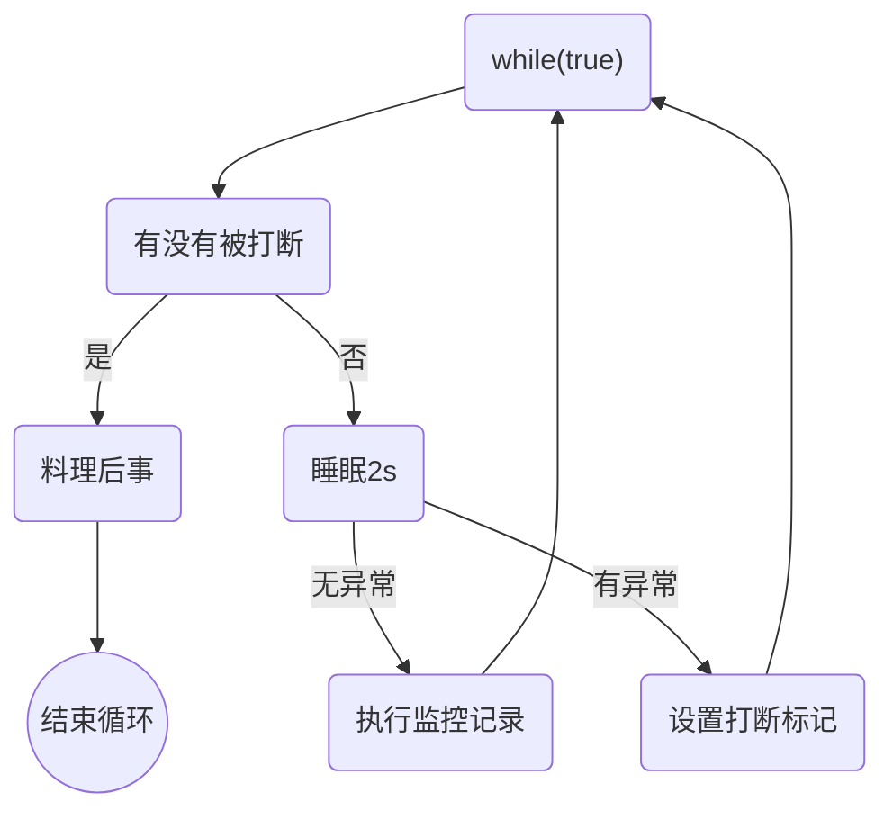

# 并发

## 进程与线程

### 进程与线程

#### 进程

- 当一个程序被运行，这时就开启来一个进程
- 可以看做是程序的一个实例

#### 线程

- 一个进程之内可以分成多个线程。
- 一个线程就是一个指令流，将指令流中的一条条指令以一定的顺序交给CPU
- java中，线程作为最小调度单位，进程是资源分配的最小单位


单核CPU下，多线程不能提高运行效率。但是可以在不同任务之间切换，防止一个线程一直占用着CPU

多CPU可以并行跑代码

#### 二者对比

- 进程拥有共享的资源
- 进程通信复杂，线程通信简单
- 线程更轻量，上下文切换成本低

### 并发与并行

#### 并发


cpu轮流调度给不同的线程使用。这个做法叫做并发concurrent。

#### 并行


多个核同时运行不同线程叫做并行。

大部分情况是并发与并行都有，因为核的个数会小于线程数。

### 同步与异步

从方法调用的角度来讲，如果：

- 需要等待结果返回，才能继续运行就是同步
- 不需要等待结果返回，就能继续运行就是异步

## java线程

### 创建和运行线程

#### 方法一：使用Thread

```java
Thread t = new Thread(){
	public void run(){
		//要执行的任务
	}
}
// 启动线程
t.setName("thread1");
t.start();
```

#### 方法二：使用Runnable配合Thread

```java
Runnable runnable = new Runnable(){
  public void run(){
    //要执行的任务
  }
};
// 创建线程对象
Thread t = new Thread(runnable);
t.start();
```

使用匿名内部类

```java
Runnable runnable = () -> {
    //要执行的任务
  };
// 创建线程对象
Thread t = new Thread(runnable);
t.start();
```

更简洁的写法

```java
Runnable runnable = () -> {
    //要执行的任务
  };
// 创建线程对象
Thread t = new Thread(() -> {
    //要执行的任务
  });
t.start();
```

#### Thread与Runnable的关系

Thread的源码：


当用第二种Runnable方法时，会先把this.target赋值为runnable。所以如果有Runnable就会调用Runnable定义的run方法。

而第一种方法，直接重写了run方法，因此是会调用自己的run。

#### 方法三：FutureTask配合Thread

FutureTask是实现了FutureRunnable，FutureRunnable是继承了Runnable和Future。本身Runnable的run方法时void类型，没有返回值。可以通过future的get方法获得返回值

```java
FutureTask<Integer> task = new FutureTask<>(new Callable<Integer>(){
  @Override
  public Integer call() throws Exception{
    // 要完成的任务
    return 100;
  }
});
Thread t = new Thread(task, "thread1");
t.start();

task.get();//当遇到get时，就会一直等待task线程的返回，直到他返回结果。这里有异常需要抛出
```

### 查看进程线程的方法

- `ps -fe` 查看所有进程
- `ps -fT -p <PID>`查看某个进程
- `kill` 杀死进程
- `top` 按大写H切换是否显示线程
- `top -H -p <PID>` 查看某个进程的所有线程

### 线程运行的原理

线程启动后，虚拟机就会为其分配一块栈内存，栈中有多个栈帧，每个栈帧对应一个方法。

#### 线程上下文切换

cpu不再执行当前的线程，转而执行另一个线程

- 线程的cpu时间片用完
- 垃圾回收
- 有更高优先级的线程需要运行
- 线程自己调用了sleep、yield、wait、join、park、synchronized、lock

### 常见方法

| 方法名          | 功能说明                                        | 注意                                                         |
| --------------- | ----------------------------------------------- | ------------------------------------------------------------ |
| start()         | 启动一个新的线程，在新的线程运行run方法中的代码 | start只是让线程进入就绪，里面代码不一定立刻运行。每个线程对象的start方法只能调用一次，如果调用多次会湖出现IllegalThreadStateException |
| run()           | 新线程启动后就会调用                            |                                                              |
| join()          | 等待线程运行结束                                |                                                              |
| join(long n)    | 等待线程结束，最多等待n毫秒                     |                                                              |
| getId()         |                                                 |                                                              |
| getName()       |                                                 |                                                              |
| setName()       |                                                 |                                                              |
| getPriority()   |                                                 |                                                              |
| setPriority()   |                                                 |                                                              |
| getState()      |                                                 |                                                              |
| isInterrupted() | 判断是否被打断                                  | 不会清除打断标记                                             |
| isAlive()       | 是否存活（还没运行完毕）                        |                                                              |
| interrupt()     | 打断线程                                        |                                                              |
| interrupted()   | Static。判断当前线程是否被打断                  | 会清除打断标记                                               |
| currentThread() | Static。获取当前正在执行的线程                  |                                                              |
| sleep(long n)   | static。休眠n毫秒                               |                                                              |
| yield()         | Static。提示线程调度器让出当前线程对CPU的使用   |                                                              |

### start与run

既然start也是去调用run。为什么不直接调用run？

- 如果直接使用run，则是主线程调用的。不能起到异步，多线程的效果。不会新开一个线程。
- 在start之前，线程的状态是new。start后是runnable

### sleep与yield

sleep

- 让线程从running进入Timed Waiting状态
- 其他线程可以使用interrupt方法打断正在睡眠的线程，这是sleep方法会抛出异常
- 睡眠结束后的线程未必会立刻得到执行
- 建议用TimeUnit的sleep代替Thread的sleep来获得更好的可读性。`TimeUnit.SECONDS.sleep(1)`

yield

- 调用yield会让出当前线程。从Running进入runnable就绪状态
- 具体实现依赖于操作系统的任务调度器


### setPriority线程优先级

数字越大表示优先级越高。仅仅是一个提示，调度器可以忽略它。

### join


这里输出结果为0.因为线程t1会sleep 1毫秒。主线程输出的时候，r还没赋值。

可以使用join来解决这个问题。等待线程运行结束。

在`t1.start();`后，输出之前插入`ti.join()`等待t1完成。

### interrupt

打断sleep，wait，join的线程

可以打断处于阻塞和运行的线程。

**阻塞中的线程被打断后，isInterrupted()为false。**

**打断正常运行的线程，isInterrupted()为true**，而且线程不会停下来，会继续运行。如果想要停止运行需要通过判断打断标记，自己来决定是否停下来。


#### 两阶段终止模式

在线程T1中优雅的终止线程T2。让T2一个料理后事的机会。




#### 打断park线程


打断标记为true。如果打断完之后，如果再次使用`LockSupport.park()`时，park无效。要把打断标记重新设为false时，park才会再次生效。

### 不推荐使用的方法

- `stop()`暂停线程运行
- `suspend()`挂起线程
- `resume()`恢复线程

这几个都会导致资源死锁。


### 主线程与守护线程

默认情况下，java的运行要等所有的java线程都结束了才会结束。除了守护线程。其他非守护线程运行结束了，即使守护线程还未运行完，也会被强行结束。

`t1.setDeamon(true)`设置为守护线程。

注意：

- 垃圾回收器线程就是一种守护线程
- Tomcat中的Acceptor和Poller线程就是守护线程


### 五种状态

从操作系统的层面


- 【初始状态】仅是在语言层面创建了线程对象，还未与操作系统线程关联
- 【可运行状态（就绪状态）】可以被操作系统的CPU调度，只是暂时还没拿到CPU时间片
- 【运行状态】指获取了CPU时间片运行中的状态，时间片用完，会导致上下文切换。
- 【阻塞状态】调用了阻塞API，就会导致上下文切换，进入阻塞状态。
  - 与【可运行状态】的区别是，如果不唤醒它，调度器就一直不回考虑它
- 【终止状态】表示已经执行完毕，生命周期结束


#### 根据Thread.State枚举的六种状态


- NEW 线程刚刚被创建，但是还没调用`start()`
- RUNNABLE 当调用`start()`之后。涵盖了操作系统层面的【可运行状态】、【运行状态】和【阻塞状态】
- BLOCKED  JAVA_API层面的阻塞状态细分。等待锁被阻塞。
- WAITING  JAVA_API层面的阻塞状态细分。没有时限的等待
- TIMED_WAITING  JAVA_API层面的阻塞状态细分。有时限的等待
- TERMINATED 当线程代码运行结束

## 共享模型之管程

由于分时系统，系统切换导致出错。比如A线程计算完，还未写入，此时时间片到了，又B线程开始运行。然后时间片再次到A线程时，A直接把未写入的但是已经计算好的结果写入。这样就会产生问题。

由于分时系统，时间片到了可能会导致字节码指令顺序更改。

正常顺序：


出现负数的顺序：


### 临界区

- 一个程序运行多个线程本身是没有问题
- 问题出在多个线程访问共享资源时
  - 在多个线程对共享资源进行读写操作时发生指令交错，就会发生问题
- 一段代码块内如果存在对共享资源的多线程读写操作，这段代码块成为临界区。

```java
static int counter = 0;
static void increment(){
  // 临界区
  counter++;
}
static void decrement(){
  // 临界区
  counter--;
}
```

#### 竞态条件

多个线程在临界区内执行，由于代码的执行序列不同而导致结果无法预测，称之为发生了竞态条件

### Synchronized解决方案

为了避免临界区的竞态条件发生，有多种手段可以达到目的：

- 阻塞式的解决方案：synchronized，lock
- 非阻塞式的解决方案：原子变量

synchronized称为对象锁，它采用互斥的方式让同一时刻至多只有一个线程能持有对象锁，其他线程要想获得这个锁会阻塞

语法：

```java
synchronized(对象){
  临界区
}
```

#### synchronized理解

当线程A拿到synchronized的锁时，它能够执行临界区代码。但是如果在此期间，他的时间片到了。他的锁并不会释放，其他线程还是拿不到锁。等时间片再次轮到线程A时，线程A会继续他的临界区代码运行。

直到线程A执行完代码，释放锁，并且唤醒BLOCKED的线程。

synchronized是用对象锁保证了临界区内的原子性。

### 方法上的synchronized


### 变量的线程安全分析

#### 成员变量和静态变量是否线程安全？

- 如果没有共享，线程安全
- 如果被共享了，根据它们的状态是否能够改变，又分两种情况
  - 如果只有读操作，则线程安全
  - 如果有读写操作，是临界区，需要考虑线程安全

#### 局部变量是否线程安全

- 局部变量是线程安全地
  - 因为栈帧是私有的，虚拟机栈不是线程共享的
- 局部变量引用的对象则未必
  - 如果对象没有逃离方法的作用访问，它是线程安全的
  - 如果该对象逃离方法的作用范围，则需要考虑线程安全


如果局部变量引用的是对象，对象被暴露在外部，这个对象可能在其他线程中被改变。

### 常见线程安全类

- String
- Integer
- StringBuffer
- Random
- Vector
- Hashtable
- Java.util.concurrent包下的类

多个线程调用它们同一个实例的某个方法时，是线程安全的。可以理解为：

- 每个方法是原子的
- 但注意它们多个方法的组合不是原子的，如下


#### 不可变类线程安全性

String、Integer类都是不可变类，其内部的状态不可以改变，所以是线程安全的。

### Monitor概念

#### java对象头


#### Monitor

监视器或管程。

**每个java对象都关联一个monitor对象**（锁的对象不一样，就会指向不同的monitor，起不到锁的作用），如果使用synchronized（重量级）给对象上锁之后，该对象头的mark word中就被设置指向Monitor对象的指针。

**设置`monitor`的header字段为`displaced mark word`（obj对象头中的markword），owner字段为`Lock Record`（线程栈中），obj字段为锁对象**


此时Thread-2获得了Monitor锁，直接指向owner，此时Thread-1过来也想要锁，但是owner已经有了，只能进入EntryList等待队列，进入阻塞状态。当Thread-2释放锁后，会唤醒EntryList中的线程，他们通过竞争获得锁。

#### 原理之synchronized

```java
static final Object lock = new Object();
static int counter = 0;

public static void main(String[] args){
  synchronized(lock){
    counter++;
  }
}
```

对应的字节码


#### 轻量级锁

使用场景：如果一个对象虽然有多线程访问，但多线程访问的时间是错开的（也就是没有竞争），那么可以使用轻量级锁来优化。

轻量级锁对使用者是透明的，即语法仍然是synchronized

**轻量级锁跟monirot就没有关系了。不需要monitor地址，Lock Record中的Mark Word与对象头中的Mark Word交换即可**

**线程在执行同步块之前，JVM会先在当前线程的栈桢中创建用于存储锁记录的空间，并将对象头中的Mark Word复制到锁记录中，官方称为Displaced Mark Word。然后线程尝试使用CAS将对象头中的Mark Word替换为指向锁记录的指针。**


CAS就是将线程中Lock Record中的Mark Word与对象头中的Mark Word交换

以下代码举例

```java
static final Object obj = new Object(); 
public static void method1() {
synchronized( obj ) { // 同步块 A
	method2(); }
}
public static void method2() {
	synchronized( obj ) { // 同步块 B
} }
```


自己的线程又给同一个对象加锁了，叫锁重入。此时不再存mark word，而是存null，锁重入个数。

- 当退出 synchronized 代码块(解锁时)如果有取值为 null 的锁记录，表示有重入，这时重置锁记录，表示重 入计数减一
- 当退出 synchronized 代码块(解锁时)锁记录的值不为 null，这时使用 cas 将 Mark Word 的值恢复给对象头
  - 成功，则解锁成功 
  - 失败，说明轻量级锁进行了锁膨胀或已经升级为重量级锁，进入重量级锁解锁流程

#### 锁膨胀

如果在尝试加轻量级锁的过程中，CAS操作无法成功，这时一种情况就是有其他线程为此对象加上了轻量级锁（有竞争），这时需要进行锁膨胀，将轻量级锁变为重量级锁。


对象头中的Mark Word地址变为了Monitor，后两位变为10。


#### 自旋优化

重量级锁竞争的时候，还可以使用自旋来优化，如果当前线程自旋成功（即这时候持锁线程已经退出了同步块，释放了锁），这时当前线程就可以避免阻塞。（阻塞了需要上下文切换，应该避免阻塞）


JAVA7以后不能控制是否开启自旋。

#### 偏向锁

轻量级锁在没有竞争时，每次重入仍然需要执行CAS操作（第一次替换成功，第二次就会替换失败）。

偏向锁：只有在第一次使用CAS将线程ID设置到对象的Mark Word头，之后发现这个线程ID时自己就表示没有竞争，不用重新CAS。


##### 偏向状态


一个对象创建时：

- 如果开启了偏向锁（默认开启），那么对象创建后，markword最后三位为101，其他的全为0.
- 偏向锁是默认延迟的，不会再程序启动时立即生效。（要在过一段时间后，重新建的对象才会有偏向锁）


在偏向锁解锁后，仍然保存之前的线程ID

##### 撤销偏向状态 - 调用对象hashcode

如果先调用了`xxx.hashcode()`就会直接禁用掉偏向锁。这是因为Biased状态下没有地方存hashcode。只有Normal状态下才会存hashcode。

##### 撤销偏向状态 - 其他线程使用对象

当有其他线程使用偏向锁对象时，会将偏向锁升级为轻量级锁


注意，这里如果让两个线程交错了的话，会直接变成重量级锁。所以通过notify和wait可以让两个线程错开，第一个线程完成在进行线程二。

##### 撤销偏向状态 - 调用 wait/notify

这个只有重量级锁有，所以会直接升级成重量级锁。

##### 批量重偏向

如果对象虽然被多个线程访问，但没有竞争，这时要偏向给T1线程的重偏向给T2。

如果撤销偏向变成轻量级锁超过阈值20次后，就会触发批量重偏向。第20个对象开始，会批量的重偏向剩余的对象。

##### 批量撤销

当撤销偏向锁阈值超过40次后，整个类的所有对象都会变为不可偏向，新建的对象也是不可偏向。

##### 锁消除

JIT及时编译器如果发现不可能被共享，那么加锁无意义，就会优化掉，把锁消除。

### wait和notify

#### 原理


- Owner线程发现条件不满足，调用wait方法，即可进入WaitSet变为WAITING状态
- BLOCKED和WAITING的线程都处于阻塞状态，不占用CPU时间片
- BLOCKED线程会在Owner线程释放锁时唤醒
- **WAITING线程会在Owner线程调用notify或notifyAll时唤醒，但唤醒后并不意味着立刻获得锁，仍需进入EntryList重新竞争。**

#### API介绍

- `obj.wait()` `obj.wait(n)`
- `obj.notify()`
- `obj.notifyAll()`

注意！只有获得此对象的锁才能调用这几个方法

#### wait和notify的使用

sleep和wait的区别

- sleep是Thread方法，而wait是Object的方法
- sleep不需要强制和synchronized配合使用，wait需要一起使用
- sleep睡眠的同时，不会释放对象锁，wait会释放对象锁。

```java
// 正确使用wait notify的姿势
synchronized(lock){
  while(条件不成立){
    lock.wait();
  }
  // 干活
}

// 另一个线程
synchronized(lock){
  lock.notifyAll();
}
```


#### 同步模式之保护性暂停

定义：一个线程等待另一个线程的执行结果

要点

- 有一个结果需要从一个线程传递到另一个线程，让他们关联同一个GuardedObject
- 如果有结果不断从一个线程到另一个线程那么可以使用消息队列（生产者/消费者）
- JDK中，join的实现、Future的实现，采用的就是此模式
- 因为要等待另一方的结果，因此归类到同步模型


好处：

- join必须等待线程运行结束，而使用这个模式线程t2可以直接去通知t1，之后t2还可以做别的事
- join的结果变量需要全局，而使用这个模式可以是局部的

#### 原理之join

一个线程等待另一个线程结束


其实就用了保护性暂停模式。检查线程是否存活，如果存活继续等待。并且计算delay等待的极限时间。过了delay就不再等了

#### 异步模式之生产者/消费者

要点

- 与前面的保护性暂停中的GuardObject不同，不需要产生结果和消费结果的线程一一对应
- 消费队列可以用来平衡生产和消费的线程资源
- 生产者仅负责产生结果数据，不关心数据该如何处理，而消费者专心处理结果数据
- 消息队列是有容量限制的，满时不会再加入数据，空时不会再消耗数据
- JDK中各种阻塞队列，采用的就是这种模式


#### Park和Unpark

是LockSupport类中的方法

可以暂停当前线程和恢复某个线程的运行


如果先调用了`unpark`之后再调用`park`，线程仍然会继续运行，并不会暂停。


特点：

- wait和notify需要配合Monitor一起使用，而park unpark不需要
- park unpark是以线程为单位来进行阻塞和唤醒的，而notify只能随机唤醒一个线程
- park和unpark的顺序可以换，而wait和notify不行


#### 原理之park和unpark

每个线程都有自己的一个Parker对象，由三部分组成`_counter`,`_cond`和`_mutex`

调用park时

- 如果`_counter=0`，则暂停
- 如果`_counter>0`，那么就继续运行

调用unpark

- 如果是暂停状态，那么唤醒，并重置`_counter=1`
- 如果是运行状态，那么他下次调用park时，不会暂停，但是会重置`_counter=1`


#### 重新理解线程状态转换


1. 调用start方法

2. wait notify。需要先获得对象锁

   - 竞争锁成功就会从waiting到runnable

   - 竞争锁失败，会从waiting到blocked。没获得锁的就是blocked状态

3. join方法，会让当前线程从runnable->waiting。等待另一个线程运行完

4. Park 和unpark
5. wait(long n) 带时间限制的，如果超时了或者调用了notify就会恢复成runnable
6. join(long n)带时间限制的
7. sleep(long n)
8. `LockSupport.parkNanos(long nanos)`或`LockSupport.parkUntil(long millis)`
9. synchronized获取对象锁失败。如果获得到锁就会重新回到RUNNABLE
10. 当前线程所有代码执行完毕


#### 多把锁

##### 多把不相干的事


#### 线程的活跃性

##### 死锁

t1线程获得A对象锁，接下来想要B对象的锁

t2线程获得B对象锁，接下来想要A对象的锁

这种情况下，两个线程就死锁了。

##### 定位死锁

可以使用jconsole工具。用jps查看java进程，然后jstack获取线程信息，里面有线程死锁的信息

##### 活锁

两个线程一直在改变对方的结束条件。比如t1要把count从0加到10结束，而t2要把count从0减到-10结束。两个线程一直在交替的加减，一直没有办法让程序停止。

##### 饥饿

线程由于优先级太低，始终得不到CPU调度执行。

使用相同的顺序加锁，必须先获得A，在获得B，就可以解决死锁问题。但是顺序加锁容易产生饥饿问题。

#### ReentrantLock

可重入锁，特点：

- 可中断
- 可以设置超时时间
- 可以设置为公平锁
- 支持多个条件变量（不同的条件到不同的waitset等待，而synchronized只有一个waitset）

与synchronized一样，都可重入

基本语法：

```java
//获取锁
private static ReentrantLock reentrantLock = new ReentrantLock();
reentrantLock.lock();
try{
  //临界区
}finally{
  //释放锁
  reentrantLock.unlock();
}
```


##### 可重入

指的是同一个线程如果首次获得了这把锁，那么因为它是这把锁的拥有者，因此有权利再次获取这把锁。如果是不可重入锁，那么第二次获得锁时，自己也会被锁挡住

```java
static ReentrantLock lock = new ReentrantLock();
public static void main(String[] args) { 
  method1();
}
public static void method1() { 
  lock.lock();
	try {
		log.debug("execute method1"); method2();
	} finally { lock.unlock();
	} }
public static void method2() { 
  lock.lock();
	try {
		log.debug("execute method2"); method3();
	} finally { lock.unlock();
	} }
public static void method3() { 
  lock.lock();
	try {
		log.debug("execute method3");
	} finally { lock.unlock();
	} }
```

Main中还没有解锁，就调用了method1，method1需要用到lock锁，当时由于是同一个线程的并且可重入，所以没有被挡住，可以执行。


##### 可打断

在等待的过程中，其他线程可以用interrupt来打断。

需要使用`lock.lockInterruptibly();`如果没有竞争那么此方法就会获取锁，如果有竞争就进入阻塞队列，其他线程可以使用interrupt方法打断。


##### 锁超时

`lock.tryLock()`这个方法可以带参数。并且指定是秒还是分。


##### 公平锁

不是按进入队列的顺序获得锁，就是不公平锁。ReentrantLock默认是不公平的，但是可以改为公平的


##### 条件变量

ReentrantLock支持多个条件变量，而synchronized只支持一个。


- 执行await后会释放锁，进入conditionObject等待
- await线程被signal唤醒后，会重新竞争lock锁
- 竞争成功后，从await后继续执行

### 同步模式之顺序控制

#### 固定顺序顺序

##### wait和notify版本


##### reentrantLock中的await,signal

##### park和unpark版本


#### 虚假唤醒

举个例子，我们现在有一个生产者-消费者队列和三个线程。

**1）** 1号线程从队列中获取了一个元素，此时队列变为空。

**2）** 2号线程也想从队列中获取一个元素，但此时队列为空，2号线程便只能进入阻塞(cond.wait())，等待队列非空。

**3）** 这时，3号线程将一个元素入队，并调用cond.notify()唤醒条件变量。

**4）** 处于等待状态的2号线程接收到3号线程的唤醒信号，便准备解除阻塞状态，执行接下来的任务(获取队列中的元素)。

**5）** 然而可能出现这样的情况：当2号线程准备获得队列的锁，去获取队列中的元素时，此时1号线程刚好执行完之前的元素操作，返回再去请求队列中的元素，1号线程便获得队列的锁，检查到队列非空，就获取到了3号线程刚刚入队的元素，然后释放队列锁。

**6）** 等到2号线程获得队列锁，判断发现队列仍为空，1号线程“偷走了”这个元素，所以对于2号线程而言，这次唤醒就是“虚假”的，它需要再次等待队列非空。


唤醒了2线程，但是2线程没抢过1线程，1线程又把元素拿走了，当轮到2线程的时候，还是没有元素，又得去阻塞状态。

#### 交替输出

用int型的标记，标记对比一致就运行，不然就等待。

或者使用reentrantLock，创建多个条件变量，不同的输出到不同的条件变量等待。

#### 小结

- 分析多线程访问共享资源时，代码片段属于临界区
- 使用synchronized关键字
  - 掌握synchronized语法
  - 加在成员方法和静态方法的不同
  - wait/notify同步方法
- 使用lock互斥解决临界区
  - 可打断、锁超时、公平锁、条件变量
- 分析变量的线程安全性
- 了解线程活跃性问题：死锁、活锁、饥饿

- 互斥：使用synchronized或Lock达到共享资源互斥
- 同步：使用wait/notify或Lock的条件变量
- monitor/synchronized/wait/notify原理
- Park&unpark原理
- 同步模式之保护性暂停
- 异步模式之生产者消费者
- 同步模式之顺序控制


## 共享模式之内存

共享变量在多线程间的【可见性】与多条指令执行时的【有序性】问题

### java内存模型

JMM即java memory model，定义了主存、工作内存抽象概念。

JMM体现在以下几个方面

- 原子性 - 保证指令不会受到线程上下文切换的影响
- 可见性 - 保证指令不会受cpu缓存的影响
- 有序性 - 保证指令不会受cpu指令并行优化的影响


可以发现即使将run设为false，这个线程并不会停下来。

分析：

1. 初始状态，t线程刚开始从主内存读取了run的值到工作内存。
2. 因为t线程需要用到while循环，JIT编译器就会将run的值缓存到自己工作内存中的高速缓存中，减少对主存中run的访问，提高效率
3. 之后修改了run，同步至主存，而t是从自己工作内存中的高速缓存中读取这个变量，这个是永远不变的。

解决方法：

给共享的变量加一个关键字**volatile**，表示易变，不能到缓存中去读，而去主内存中读。


使用synchronized也可以解决这个问题。

但是volatile更轻量，如果只是解决可见性问题，推荐volatile。


#### 可见性vs原子性

volatile比较适合一个线程写，多个线程读的情况，他不能保证原子性。他只能保证看到共享变量的最新值，不能解决指令交错问题。


synchronized语句块既可以保证代码块的原子性，也同时保证代码块内变量的可见性。缺点是属于重量级操作，性能相对更低。


前面死循环中，如果加入了sout，即使不加volatile修饰符，线程t也能正确看到run变量的修改。这是因为sout源码里加了synchronized。


### 终止模式之两阶段终止模式

t1线程优雅的结束t2线程。

不再使用interrupt了，因为interrupt需要实时关注是否会有InterruptException。通过volatile关键字设定一个标志，如果表示为false就继续运行，如果为true就跳出循环即可。


但是当线程sleep时，仍然需要interrupt去打断他。


### 同步模式之Balking

监控线程只需要一个就行了，那么就需要用到Balking技术。

新声明一个boolean变量，用来确定是否已经执行过一个线程了，如果已经执行过直接返回，不再执行。

注意，判断boolean处需要synchronized锁。


### 有序性

JVM会在不影响正确性的前提下，可以调整语句的执行顺序

这种特性叫做【指令重排】


可以提高CPU指令级别的并发度。流水线处理。


可以提高吞吐率。


#### 多线程下重排序


可能的结果：0，1，4.

出现0的可能是指令重排序后，`num=2`到`ready=true`后面去了。


使用压测方法获得的结果。


### volatile原理

底层实现的原理是内存屏障。

- 对volatile变量的写指令后会加入写屏障
- 在读指令前会加入读屏障


#### 如何保证可见性

- 写屏障保证在该屏障之前的，对共享变量的改动，都同步到主存当中
- 不仅仅是volatile声明的变量，普通的num变量也会被同步到主存中
- 读屏障保证在该屏障之后，对共享变量的读取，加载的是主存中最新数据
- 


#### 如何保证有序性

- 写屏障会确保指令重排序时，不会将写屏障之前的代码排在写屏障之后
- 读屏障会确保重排序时，不会将读屏障之后的代码排在读屏障之后


**volatile并不能解决指令交错**，而synchronized可以同时做到有序性，可见性和解决指令交错


#### 懒汉式同步


用double-checked locking来解决每次都需要synchronized的情况，只有第一次INSTANCE==null时，可能会有多个进程要进入临界区，之后就都不会再进入临界区了。

**但是第一个`if(INSTANCE==null)`在synchronized外面，不能保证他的可见性、有序性。可能会出问题！**


- 17表示创建对象，将对象引用入栈 // new Singleton
- 20表示复制一份对象引用 //引用地址
- 21表示利用一个对象引用，调用构造方法// new Singleton
- 24表示利用一个对象引用，赋值给static INSTANCE

jvm可能会优化为，先赋值24，然后再执行21构造器方法


由于第一句`if(INSTANCE==null)`在同步代码块外，可能会有指令交错的现象。现在t1在同步代码块内，执行好了24，t2去判断时，发现INSTANCE!=null，于是就开始去用这个对象了，但是此时还没有完成构造方法，就会出现问题。

synchronized内还是会重排序的，但是如果把这个变量的作用域完全包含在synchronized内，是不会出现有序性和可见性问题的。此处INSTANCE有一处在synchronized外，所以会出现问题。

##### 解决

给INSTANCE变量加一个volatile关键字。防止指令的重排序。


或这种情况


通过写屏障，写屏障之前的代码不能被重排序到写屏障之后。读屏障之后的不能到他前面去。

第二种情况，getstatic会判断为null，然后进入同步代码块再次判断，不会出现问题。


#### 关于单例的问题

##### 通过饿汉式


1. 防止继承之后对方法的覆盖
2. 加一个readResovle方法，有了这个方法，反序列化就会返回这个方法返回的对象
3. 私有只有自己类能用。不能防止反射
4. 可以，静态成员变量在类加载阶段
5. 更好的封装


##### 通过枚举类


1. 枚举类中写了几个就会创建几个对象，所以是单例的
2. 没有并发问题，因为他是静态成员变量，在类加载时完成，没有并发问题。
3. 不能
4. 枚举类父类已经实现了序列化，可以避免反序列化的问题，都已经帮我们做好了
5. 饿汉式
6. 在枚举类中加构造方法，做一些初始化逻辑即可


##### 通过懒汉式


这里可以保证线程安全，但是同步块太大，会降低效率。可以只包含`if`语句块，并且在同步块外面再加一个if


##### double-check locking实现（优化懒汉式）


1. synchronized块内的也会重排序。synchronized内可能先赋值，在初始化。那么同步代码块外部的可能会拿到一个未初始化的对象，就会出现问题。
2. 当已经有INSTANCE后，不需要在多次走同步代码块，效率更高
3. 因为首次创建INSTANCE的并发问题。前面那个判断在同步块外。


##### 懒汉式


1. 类加载就是懒汉式的，类只会在第一次被用到是才会触发类加载。这里是内部静态类，所以只有到使用了`Singleton.getInstance`时，才会被创建出来。

2. 类加载会有jvm保证线程安全，所以这里也没问题


### 小结

- 可见性 - 由jvm缓存优化引起

- 有序性 - 由jvm重排序优化引起
- volatile原理
- 两阶段终止模式模型
- 同步模式之balking


## 无锁-乐观锁（非阻塞）

- cas与volatile
- 原子整数
- 原子引用
- 原子累加器
- unsafe

### 无锁-共享资源保护


借助AtomicInteger类。通过无锁的方式解决线程安全问题

### CAS与volatile


工作机制：

将线程中的prev值与Account对象中的最新值进行比较，如果不一样则说明已经被别人修改掉了，因此重新获取最新值。


这里线程1在最后才更新成功


#### cas与volatile的关系

AtomicInteger的数值是保存在`private volatile int value`中。为了保证该变量的可见性，cas操作需要借助volatile才能读取到共享变量的最新值

他们必须配合使用

#### 为什么无锁效率高

- 无锁状态下，即使充实失败，线程始终在高速运行，而synchronized会让线程在没有获得锁的时候，发生上下文切换
- 但无锁情况下，因为线程要保持运行，需要额外cpu的支持，虽然不会进入足额色，但由于没有分到时间片，仍然会进入可运行状态，还是会导致上下文切换。

#### CAS特点

结合CAS和volatile可以实现无锁并发，适用于线程数较少、多核CPU的场景下

- 基于乐观锁的思想，不怕别的线程来修改共享变量
- synchronized是基于悲观锁的思想，需要放着其他线程来修改共享线程


### 原子整数

JUC并发包提供了：

- AtomicBoolean
- AtomicInteger
- AtomicLong

#### AtomicInteger

使用

```java
// 创建
AtomicInteger i = new AtomicInteger(value);

// 原子自增++i
i.incrementAndGet();

// 原子自增i++
i.getAndIncrement();

i.decrementAndGet();

i.getAndAdd(5); // 先获取再增加5
i.addAndGet(5);

i.updateAndGet(x -> x*10); // 复杂操作。先操作再获取

```

自己来写updateAndGet

```java
updateAndGet(i, p -> p/2);
public static void updateAndGet(AtomicInteger i, IntUnaryOperator operator){
  while(true){
    int prev = i.get();
    int next = operator.applyAsInt(prev);
    if(i.compareAndSet(prev, next)){
      break;
    }
  }
}
```

### 原子引用类型

- AtomicReference
- AtomicMarkableReference
- AtomicStampedReference

用到的情景：比如需要用BigDecimal大数的情况。那么就需要这么使用`private AtomicReference<BigDecimal> balance`。`balance = new AtomicReference<>("10000")`

#### ABA问题


主线程只会知道到他这里还是A没有变化，那么继续修改为C。其实在other方法中已经经历了A->B，B->A的过程。为了能够感知到变化，需要用一个新的类`AtomicStampedReference`。就是加上一个版本号，每次修改 版本号加1.

那么更新的时候不仅需要看引用的内容是否一致，也需要看版本号是否与原来的一致。

#### 仅关注是否被更改过

使用AtomicMarkableReference，使用boolean来记录是否被更改过

### 原子数组

- AtomicIntegerArray
- AtomicLongArray
- AtomicReferenceArray

#### 函数式接口

- supplier 提供者 无中生有 ()->结果
- function 函数 一个参数一个结果 (参数)->结果, BiFunction(参数1，参数2)->结果
- consumer 消费者 一个参数没结果 (参数)->void， BiConsumer(参数1，参数2)->void

 ```java
// 实现创建10个元素的数组，总共自增10000次，平摊到每个元素中，就是每个元素+1000
// 需要用到原子数组才行，不然有线程安全问题
public static void main(String[] args){
  demo{
    ()->new int[10],
    (array)->array.length,
    (array, index)->array[index]++,
    array->System.out.println(Arrays.toString(array))
  };
  // 线程安全
  demo{
    ()->new AtomicIntegerArray[10],
    (array)->array.length,
    (array, index)->array.getAndIncrement(index),
    array->System.out.println(array)
  };
}

private static<T> void demo(Supplier<T> arraySupplier,
                           Function<T,Integer> lengthFun,
                           BiConsumer<T,Integer> putConsumer,
                           Consumer<T> printConsumer){
  List<Thread> ts = new ArrayList<>();
  T array = arraySupplier.get(); // 创建数组
  int length = lengthFun.apply(array);
  for(int i = 0; i<length;i++){
    // 每个线程对数组操作10000次
    ts.add(new Thread(()->{
      for(int j=0;j<10000;j++){
        putConsumer.accept(array, j%length);
      }
    }))
  } 
}
 ```

### 字段更新器

保证多个线程访问同一个对象时，其成员变量的安全性

- AtomicReferenceFieldUpdater
- AtomicIntegerFieldUpdater
- AtomicLongFieldUpdater

a

注意！属性必须是volatile修饰

### 原子累加器

JDK1.8以后有专门做累加的类，性能会更好。

- LongAdder
- LongAccumulator

设置多个累加单元，不同累加单元操作不同的变量，减少CAS重试失败次数

### unsafe对象

## 不可变对象

### 亨元模式

## 线程池

### 自定义线程池

### ThreadPoolExecutor

### 设计模式-工作线程

## JUC

### aqs

AbstractQueuedSynchronizer，是阻塞式锁和相关的同步器工具的框架。

特点：

- state属性来表示资源的状态
- 提供了基于FIFO的等待队列，类似于Monitor的EntryList
- 条件变量来实现等待、唤醒机制，支持多个条件变量


使用aqs自定义**不可重入锁**

```java
class MyLock implements Lock{
  // 独占锁 同步器类
  class MySync extends AbstractQueuedSynchronizer{
    @Override
    protected boolean tryAcquire(int arg){
      if(compareAndSetState(0,1)){
        // 加上了锁，并设置owner为当前线程
        setExclusiveOwnerThread(Thread.currentThread());
        return true;
      }
      return false;
    }
    @Override
    protected boolean tryRelease(int arg){
      setExclusiveOwnerThread(null);
      setState(0); // 这个是volatile方法，所以要放在后面，会让前面的方法可见
      return true;
    }
    @Override
    protected boolean isHeldExclusively(){
      return getState()==1;
    }
    public Condition newCondition(){
      return new ConditionObject();
    }
  }
  
  private MySync sync = new MySync();
  
  //... Lock接口的方法
  public void lock(){
    sync.acquire(1); // 其中的源码会调用tryAcquire，如果不成功会放入等待队列
  }
}
```

### reentrantlock


#### 非公平锁实现原理

默认是调用非公平锁

##### 加锁流程

```java
public ReentrantLock(){
  sync = new NonfairSync();
}
```

NonfairSync继承自AQS

没有竞争时


第一个竞争出现时

1. CAS尝试将state由0变成1，结果失败
2. 进入tryAcquire逻辑，此时state已经是1，仍然失败
3. 进入addWaiter逻辑，构造Node队列


4. 进入acquireQueued逻辑
   - 在一个死循环中不断尝试获得锁，失败后进入park阻塞
   - 如果自己是排在第二位的，会再次tryAcquire尝试获得锁，当state为1时，仍然失败
   - 进入shouldParkAfterFailedAcquire逻辑，将前驱node的waitStatus改为-1，返回false
   - 
   - 再次循环后，如果前驱的waitStatus已经是-1了，就会park阻塞

多个线程阻塞的情况


##### 释放锁流程

把owner设为null，把status设为0.检查阻塞队列是否不为空，如果不为空就唤醒下一个节点

可能会有被唤醒，但是没有竞争过其他线程的可能

#### 可重入原理


如果当前线程等于owner线程，则发生锁重入，把state++。

释放的时候status--。如果status=0才会释放锁。

#### 可打断原理

会直接抛出异常，不在AQS中等待锁了

#### 公平锁与非公平锁

非公平锁：如果发现status=0，直接去抢锁

公平锁：检查AQS队列中是否有前驱节点，没有才去竞争

#### 条件变量实现原理

每个条件变量其实对应着一个等待队列，其实现类是ConditionObject

##### await流程

开始Thread-0持有锁，调用await，进入conditionObject的addConditionWaiter流程，把自己加入到ConditionObject的等待队列中。


接下来释放同步器上的锁


唤醒等待队列中的下一个节点。


Thread-0就会被park住

##### signal流程

先检查调用这个方法的线程是否是持有者线程。

进入ConditionObject的doSignal流程，取得等待队列中的第一个Node


执行transferForSignal流程，将该Node加入AQS队列尾部，将Thread-0的waitStatus改为0，Thread-3的waitStatus改为-1


### ReentrantReadWriteLock

### stampedlock

### countdownlatch

### cyclicbarrier

### concurrenthashmap

JUC里面包含三类关键词：

- Blocking 大部分实现基于锁，并提供用来阻塞的方法
- CopyOnWrite之类容器修改开销相对较重
- Concurrent类型的容器
  - 内部很多操作使用cas优化，一般可以提供较高吞吐量
  - 弱一致性
    - 遍历时，弱一致性，迭代器遍历时，其他线程对容器进行了修改，迭代器可以继续进行，但是内容是旧的
    - 求集合大小时，size操作未必准确

用法类似hashmap，但是要注意，concurrenthashmap每一个操作时线程安全的，但是多个操作结合起来不一定是线程安全的。

#### jdk7中hashmap扩容并发死链问题

原Table[i]=1->2->3，先转移1在转移2以此类推。转移完成后变成newTable[i]=3->2->1 。

其过程是先从原Table[i]中取出1，放入newTable[i]位置。然后将1.next也就是2，直接放入newTable[i]位置，将newTable[i]已有的节点链作为2.next处理。即后转移的节点永远放在头的位置，已转移的节点做他的next链。

假如有两个线程P1、P2，以及链表 a=》b=》null
1、线程P1先执行，执行完"Entry<K,V> next = e.next;"代码后线程P1停滞或者其他情况不再执行下去，此时线程P1 e=a，next=b

2、此时P2执行完整段代码，于是当前的p2的新链表newTable[i]为b=》a=》null(HashMap转移链表后是逆序)。且此时共享Entry b的next已经指向a，a.next=null。

3、此时P1又继续执行"Entry<K,V> next = e.next;"之后的代码，此时线程P1的e=a，next=b，则执行完"e=next;"后，P1的newTable[i]为a《=》b，则造成回路，while(e!=null)一直死循环


一个线程（线程1）在扩容的时候自以为是判断已经获取了下一个节点(7)，准备把当前节点(3)添加到新table上

此时，线程2 直接走完了所有程序，将table扩容完毕（根据hash重新计算了元素在table中的位置），

此时table是：（为什么会是 7 3 null 看前面加粗字体）

5 -》 null

7 -》 3 -》 null

现在回到线程1，线程1自以为获取了下一个节点 7 ，准备把 3 添加到新的节点，然后将 3 指向 7

```java
void transfer(Entry[] newTable, boolean rehash) {
        int newCapacity = newTable.length;
        for (Entry<K,V> e : table) {
            while(null != e) {
                // 线程在这里自以为获取了下一个节点，此时next = 7 e = 3
                Entry<K,V> next = e.next;
                if (rehash) {
                    e.hash = null == e.key ? 0 : hash(e.key);
                }
                int i = indexFor(e.hash, newCapacity);
                // 3.next = newTable[i]
                e.next = newTable[i];
                newTable[i] = e; // 3 放入 newTable中
                // 把 3 -》 7 （但实际上线程2已经做完正确的扩容了，将 7 -》 3）
                e = next;    
                // 此时发现了 3-》7 然后 7 -》 3 
            }
        }
    }

```

也就是说一个线程把顺序逆转了，而另一个线程按原顺序访问下一个元素。导致3->7，7->3。造成死循环

