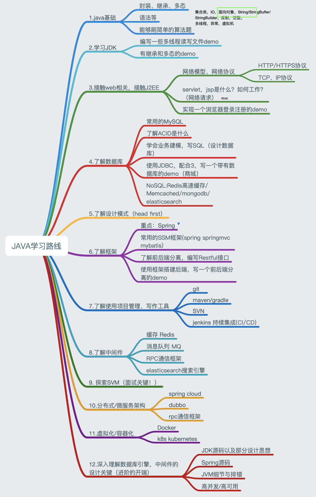

# JavaSE2JavaEE_Note
供入门java的同学使用。

Java学习路线：

包含目录：
- java基础
- MVC设计模式
- Web开发
- Mysql
- JDBC
- 设计模式
- maven
- mybatis
- spring
- springmvc
- html
- css
- javascript
- vue
- springboot
- springsecurity
- redis
- docker
- jvm
- linux