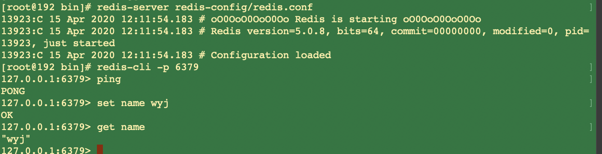
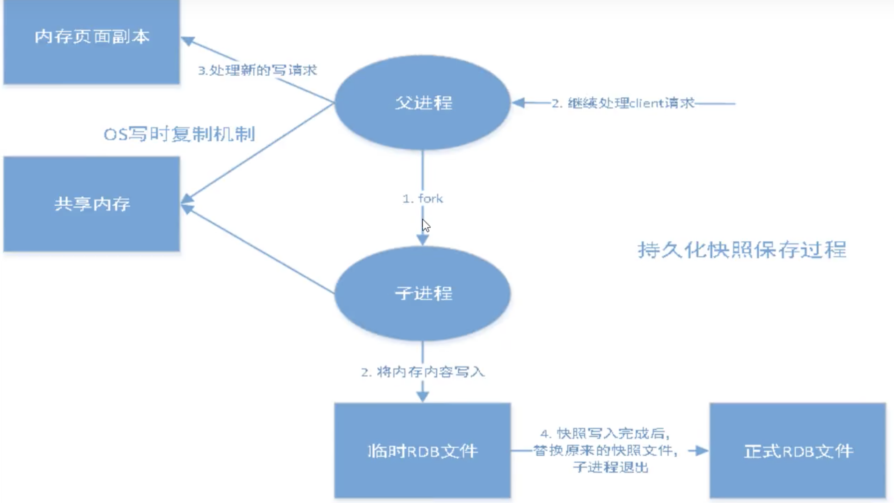
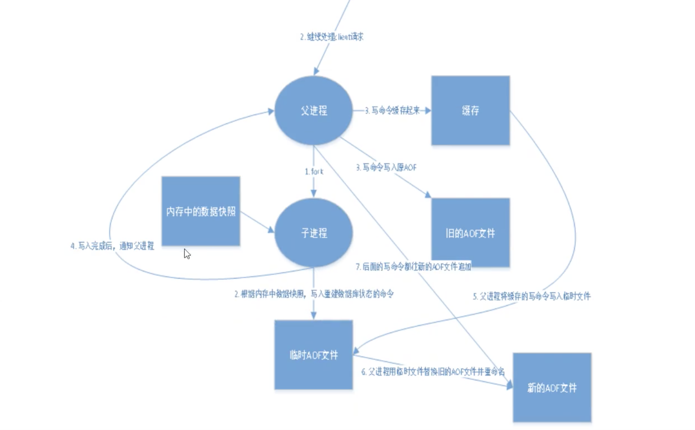
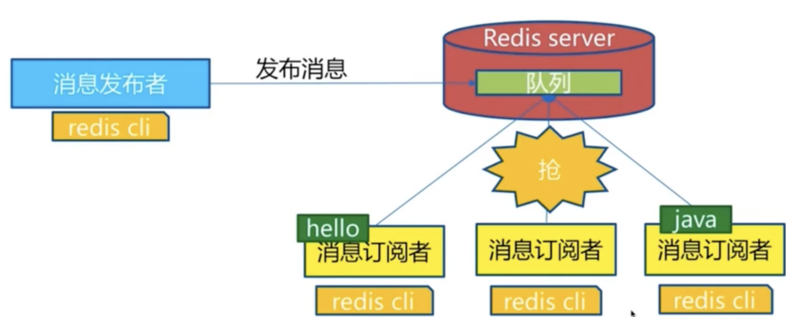
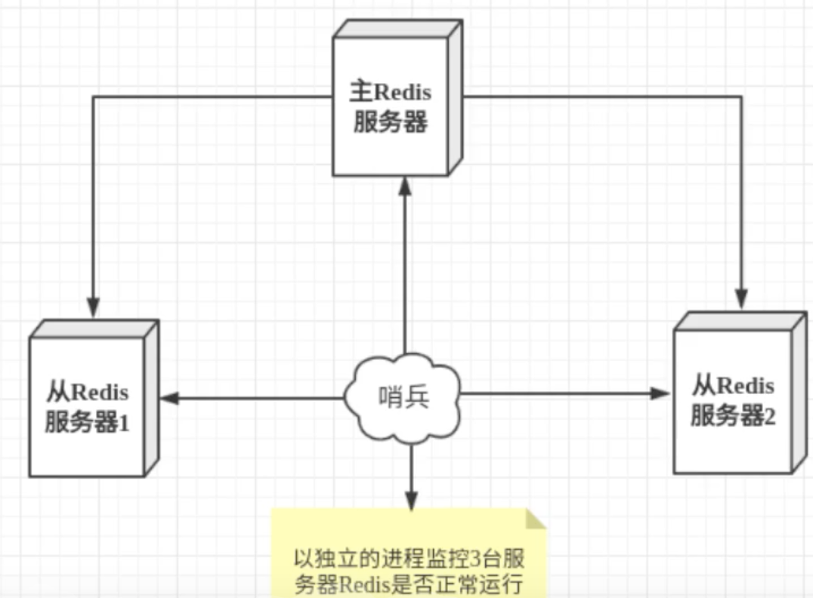
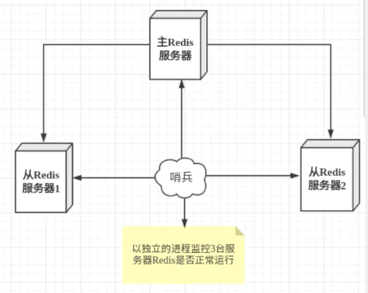
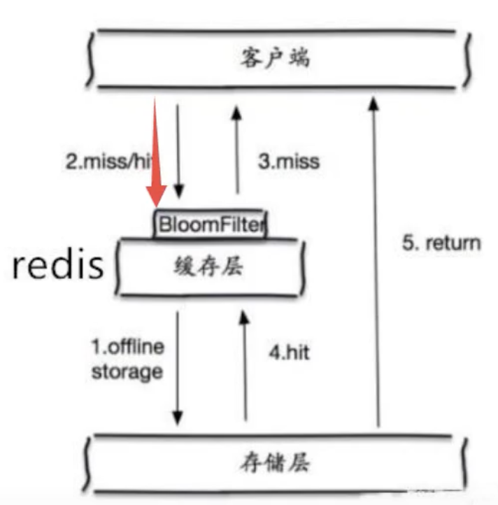

# Redis
## Nosql
个人信息，社交网络，地理位置等用户自己产生的数据，用户日志等爆发式的增长。这时就需要nosql数据库。

### 什么是NoSQL
泛指非关系型数据库。

特点
- 方便扩展（数据之间没有关系）
- 大数据量，高性能（一秒写8万次，读11万次，NoSQL的缓存记录级，是一种细粒度的缓存，性能会比较高）
- 数据库时多样性的（不需要实现设计数据库，随取随用）
- 传统的关系型数据库和NoSQL的区别
    - 传统的关系型数据库
      - 结构化组织
      - SQL
      - 数据和关系都存在单独的表中
      - 操作，数据定义语言
      - 严格的一致性
      - 基础的事务
    - NOSQL
      - 不仅仅是数据
      - 没有固定的查询语言
      - 键值对存储，列存储，文档存储，图形数据库（社交关系）
      - 最终一致性
      - CAP定理和BASE（异地多活）
      - 高性能，高可用，高可扩展性。
### NOSQL的四大分类
- KV键值对
  - Redis
- 文档型数据库
  - MongoDB。是一个分布式文件存储的数据库，主要用来处理大量的文档
- 列存储数据库
  - HBase
  - 分布式文件系统
- 图关系数据库

## redis入门
### 概述
redis即远程字典服务。使用C语言编写，支持网络、可基于内存亦可持久化的日志型、KV数据库

redis会周期性的把更新的数据写入磁盘或者把修改操作写入追加的记录文件，并且在此基础上实现了master-slave(主从)同步

能干嘛
- 内存存储、持久化
- 效率高，可以用于高速缓存
- 发布订阅系统
- 地图信息分析
- 计时器、计数器
- ...

特性
- 开源
- 支持多样数据类型
- 持久化
- 集群
- 事务
- ...

www.redis.cn

推荐在linux服务器上搭建

redis是单线程的，是基于内存操作的

### 安装
下载，解压，用gcc-c++ make编译。修改配置，daemonize yes。（后台启动）

启动redis服务: 在/usr/local/bin目录下 `redis-server redis-config/redis.conf `。通过制定的配置文件启动服务


```bash
[root@192 bin]# redis-cli -p 6379  # 使用redis客户端进行连接
127.0.0.1:6379> ping
PONG
127.0.0.1:6379> set name wyj
OK
127.0.0.1:6379> get name
"wyj"
127.0.0.1:6379> keys *
1) "name"
```

查看redis进程是否开启`ps -ef|grep redis`

关闭redis `shutdown`

### 测试性能
100个并发连接 100000个请求
`redis-benchmark -h localhost -p 6379 -c 100 -n 100000`

### 基础知识
默认有16个数据库。默认使用的是第0个，可以使用select切换数据库。
```bash
[root@192 bin]# redis-cli -p 6379
127.0.0.1:6379> select 3
OK
127.0.0.1:6379[3]> dbsize
(integer) 0
127.0.0.1:6379[3]> set name wyj
OK
127.0.0.1:6379[3]> get name
"wyj"
127.0.0.1:6379[3]> dbsize
(integer) 1
127.0.0.1:6379[3]> select 7
OK
127.0.0.1:6379[7]> dbsize
(integer) 0
```

- flushall 清空所有数据库
- flushdb 清空当前数据库

### 五大数据类型
#### Redis-Key
```bash
127.0.0.1:6379> set name wyj
OK
127.0.0.1:6379> keys *
1) "name"
127.0.0.1:6379> exists name # 判断name是否存在
(integer) 1
127.0.0.1:6379> move name 1 # 将name移动到数据库1中
(integer) 1
127.0.0.1:6379> keys *
(empty list or set)
127.0.0.1:6379> set name wyj
OK
127.0.0.1:6379> set age 18
OK
127.0.0.1:6379> keys *
1) "name"
2) "age"
127.0.0.1:6379> expire name 10 # 设置过期时间 单位是秒
(integer) 1
127.0.0.1:6379> ttl name # 查看还剩余多久
(integer) 3
127.0.0.1:6379> ttl name
(integer) 1
127.0.0.1:6379> ttl name
(integer) 0
127.0.0.1:6379> keys *
1) "age"
127.0.0.1:6379> type age # 查看age的类型
string

127.0.0.1:6379> select 1
OK
127.0.0.1:6379[1]> get name
"wyj"
127.0.0.1:6379[1]> del name # 删除name
(integer) 1
127.0.0.1:6379[1]> get name
(nil)
```
#### String
```bash
127.0.0.1:6379> set key1 v2 # 设置值
OK
127.0.0.1:6379> get key1 # 获得值
"v2"
127.0.0.1:6379> exists key1 # 判断是否存在
(integer) 1
127.0.0.1:6379> append key1 hello # 往value中追加字符串。如果当前的key不存在就相当于set一个key
(integer) 7
127.0.0.1:6379> get key1
"v2hello"
127.0.0.1:6379> strlen key1 # 获取字符串长度
(integer) 7
----------------------------------------
127.0.0.1:6379> set views 0
OK
127.0.0.1:6379> incr views # +1
(integer) 1
127.0.0.1:6379> incr views
(integer) 2
127.0.0.1:6379> get views
"2"
127.0.0.1:6379> decr views # -1
(integer) 1
127.0.0.1:6379> get views
"1"
127.0.0.1:6379> incrby views 10 # 固定步长增加
(integer) 11
127.0.0.1:6379> decrby views 5 # 固定步长减少
(integer) 6
----------------------------------------
127.0.0.1:6379> set key1 hello,hello
OK
127.0.0.1:6379> getrange key1 0 5 # 字符串截取
"hello,"
127.0.0.1:6379> getrange key1 0 -1
"hello,hello"
127.0.0.1:6379> setrange key1 5 xx # 替换字符，从偏移量开始
(integer) 11
127.0.0.1:6379> get key1
"helloxxello"
----------------------------------------
127.0.0.1:6379> setex key3 30 hello # 设置值并附加过期时间
OK
127.0.0.1:6379> ttl key3
(integer) 27
127.0.0.1:6379> setnx mykey redis # 如果不存在就设置
(integer) 1
127.0.0.1:6379> get mykey
"redis"
127.0.0.1:6379> setnx mykey mongodb # 此时已存在，这条指令无效
(integer) 0
127.0.0.1:6379> get mykey
"redis"
----------------------------------------
127.0.0.1:6379> mset k1 v1 k2 v2 # 批量设置值
OK
127.0.0.1:6379> keys *
1) "k1"
2) "k2"
127.0.0.1:6379> mget k1 k2 # 批量获取值
1) "v1"
2) "v2"
127.0.0.1:6379> msetnx k1 v1 k4 v4 # 批量的如果不存在就创建。这里是原子性操作，由于k1已经存在，所以k4也不会被创建
(integer) 0
127.0.0.1:6379> get k4
(nil)
----------------------------------------
127.0.0.1:6379> mset user:1:name zhangsan user:1:age 18
OK
127.0.0.1:6379> mget user:1:name user:1:age
1) "zhangsan"
2) "18"
127.0.0.1:6379> get user:1
(nil)
----------------------------------------
127.0.0.1:6379> getset db redis # 获取原来的值，并更新新的值
(nil)
127.0.0.1:6379> get db
"redis"
127.0.0.1:6379> getset db mongodb
"redis"
127.0.0.1:6379> get db
"mongodb"
```
#### List
基本的数据类型，列表

在redis可以帮list当做栈或者队列

所有的list都是以l开头的

```bash
127.0.0.1:6379> lpush list one # 将值从左侧头部插入
(integer) 1
127.0.0.1:6379> lpush list two
(integer) 2
127.0.0.1:6379> lpush list three
(integer) 3
127.0.0.1:6379> lrange list 0 -1 # 先存入的在最后
1) "three"
2) "two"
3) "one"
127.0.0.1:6379> lrange list 0 1
1) "three"
2) "two"
127.0.0.1:6379> rpush list right # 将值从右侧尾部插入
(integer) 4
127.0.0.1:6379> lrange list 0 -1
1) "three"
2) "two"
3) "one"
4) "right"
----------------------------------------
127.0.0.1:6379> lpop list # 移除左边第一个
"three"
127.0.0.1:6379> lrange list 0 -1
1) "two"
2) "one"
3) "right"
127.0.0.1:6379> rpop list # 移除右侧第一个
"right"
127.0.0.1:6379> lrange list 0 -1
1) "two"
2) "one"
127.0.0.1:6379> lindex list 0 # 通过下标获得list中某一个值
"two"
----------------------------------------
127.0.0.1:6379> llen list # 查看list长度
(integer) 2
127.0.0.1:6379> lrange list 0 -1
1) "three"
2) "three"
3) "three"
4) "two"
5) "one"
127.0.0.1:6379> lrem list 1 three # 移除list中1个three
(integer) 1
127.0.0.1:6379> lrange list 0 -1
1) "three"
2) "three"
3) "two"
4) "one"
127.0.0.1:6379> lrem list 2 three # 移除list中两个three
(integer) 2
127.0.0.1:6379> lrange list 0 -1
1) "two"
2) "one"
----------------------------------------
127.0.0.1:6379> lrange mylist 0 -1
1) "hello"
2) "hello1"
3) "hello3"
4) "hello2"
127.0.0.1:6379> ltrim mylist 1 2 # 通过下标截取指定的长度
OK
127.0.0.1:6379> lrange mylist 0 -1
1) "hello1"
2) "hello3"
----------------------------------------
127.0.0.1:6379> rpoplpush mylist myotherlist # 从mylist中删除最后一个，添加到myotherlist的头部
"hello2"
127.0.0.1:6379> lrange mylist 0 -1
1) "hello"
2) "hello1"
127.0.0.1:6379> lrange myotherlist 0 -1
1) "hello2"
----------------------------------------
127.0.0.1:6379> lrange list 0 -1
1) "hello2"
2) "hello1"
3) "hello"
127.0.0.1:6379> lset list 0 item # 根据下标改变值。如果不存在列表使用这个会报错
OK
127.0.0.1:6379> lrange list 0 -1
1) "item"
2) "hello1"
3) "hello"
127.0.0.1:6379> 
----------------------------------------
# linsert key BEFORE|AFTER pivot value
127.0.0.1:6379> linsert list after item other # 将某个具体的value插入到列表中某个元素的前后
(integer) 4
127.0.0.1:6379> lrange list 0 -1
1) "item"
2) "other"
3) "hello1"
4) "hello"
----------------------------------------
```

#### Set
```bash
127.0.0.1:6379> sadd myset hello # set集合添加元素
(integer) 1
127.0.0.1:6379> sadd myset hello1 hello2
(integer) 2
127.0.0.1:6379> smembers myset # set集合所有值
1) "hello2"
2) "hello1"
3) "hello"
127.0.0.1:6379> sismember myset hello # 判断是否在set中
(integer) 1
127.0.0.1:6379> scard myset # 获取set集合个数
(integer) 3
----------------------------------------
127.0.0.1:6379> srem myset hello # 移除set集合中的指定元素
(integer) 1
127.0.0.1:6379> smembers myset
1) "hello2"
2) "hello1"
----------------------------------------
127.0.0.1:6379> srandmember myset 1 # 随机抽选一个元素
1) "hello1"
127.0.0.1:6379> spop myset # 随机删除集合中的一个元素
"hello2"
127.0.0.1:6379> smembers myset
1) "hello3"
2) "hello1"
----------------------------------------
127.0.0.1:6379> smove myset myotherset hello1 # 将myset中的hello1移动到myotherset中
(integer) 1
127.0.0.1:6379> smembers myset
1) "hello3"
127.0.0.1:6379> smembers myotherset
1) "hello1"
----------------------------------------
127.0.0.1:6379> sadd key1 a b c
(integer) 3
127.0.0.1:6379> sadd key2 c d e
(integer) 3
127.0.0.1:6379> sdiff key1 key2 # 差集
1) "a"
2) "b"
127.0.0.1:6379> sinter key1 key2 # 交集
1) "c"
127.0.0.1:6379> sunion key1 key2 # 并集
1) "e"
2) "c"
3) "b"
4) "a"
5) "d"
----------------------------------------
```
#### Hash
map集合,key-map集合

```bash
127.0.0.1:6379> hset myhash field1 hello
(integer) 1
127.0.0.1:6379> hget myhash field1
"hello"
127.0.0.1:6379> hget myhash field1
"hello"
127.0.0.1:6379> hmset myhash field2 hello2 field3 hello3
OK
127.0.0.1:6379> hgetall myhash # 获取myhash中的所有键值对
1) "field1"
2) "hello"
3) "field2"
4) "hello2"
5) "field3"
6) "hello3"
----------------------------------------
127.0.0.1:6379> hdel myhash field1 # 删除hash指定的key字段
(integer) 1
127.0.0.1:6379> hgetall myhash
1) "field2"
2) "hello2"
3) "field3"
4) "hello3"
127.0.0.1:6379> hlen myhash # 获取hash表的字段数量
(integer) 2
127.0.0.1:6379> hexists myhash field2 # 判断hash中的指定字段是否存在
(integer) 1
127.0.0.1:6379> hkeys myhash # 获得所有的key
1) "field2"
2) "field3"
127.0.0.1:6379> hvals myhash # 获得所有的value
1) "hello2"
2) "hello3"
----------------------------------------
# hincrby hsetnx
```
可以用来存储经常变更的数据，尤其是用户信息

#### Zset
在set的基础上增加了一个值。用来排序

```bash
127.0.0.1:6379> zadd salary 2500 xiaoming  3000 xiaohong  1000 xiaowang
(integer) 3
127.0.0.1:6379> zrange salary 0 -1
1) "xiaowang"
2) "xiaoming"
3) "xiaohong"
127.0.0.1:6379> ZREVRANGE salary 0 -1 # 逆序
1) "xiaohong"
2) "xiaoming"
127.0.0.1:6379> zrangebyscore salary -inf +inf withscores
1) "xiaowang"
2) "1000"
3) "xiaoming"
4) "2500"
5) "xiaohong"
6) "3000"
----------------------------------------
127.0.0.1:6379> zrem salary xiaowang # 移除
(integer) 1
127.0.0.1:6379> zrange salary 0 -1
1) "xiaoming"
2) "xiaohong"
127.0.0.1:6379> zcard salary # 获取个数
(integer) 2
127.0.0.1:6379> zcount salary 1000 2800 # 获取区间内的数量
(integer) 1
```
### 三大特殊类型
#### geospatial 地理位置
- geoadd
- geodist
- geohash
- geopos
- georadius
- georadiusbymember

```bash
127.0.0.1:6379> geoadd china:city 120.16 30.24 hangzhou 108.96 34.26 xian #插入城市经纬度
(integer) 2
----------------------------------------
127.0.0.1:6379> geopos china:city beijing # 获取指定的经纬度
1) 1) "116.39999896287918091"
   2) "39.90000009167092543"
----------------------------------------
127.0.0.1:6379> geodist china:city beijing hangzhou km # 两地直线距离
"1127.3378"
----------------------------------------
127.0.0.1:6379> georadius china:city 110 30 1000 km # 查找距离110,30这个经纬度1000km内的城市
1) "chongqing"
2) "xian"
3) "shenzheng"
4) "hangzhou"
127.0.0.1:6379> georadius china:city 110 30 1000 km withdist
1) 1) "chongqing"
   2) "341.9374"
2) 1) "xian"
   2) "483.8340"
3) 1) "shenzheng"
   2) "922.6257"
4) 1) "hangzhou"
   2) "977.5143"
----------------------------------------
127.0.0.1:6379> georadiusbymember china:city hangzhou 1000 km # 杭州1000km内的
1) "hangzhou"
2) "shanghai"
----------------------------------------
127.0.0.1:6379> geohash china:city beijing # 将二维的经纬度转换成一维字符串
1) "wx4fbxxfke0"
```

geo底层是zset，可以用zset操作geo
```bash
127.0.0.1:6379> zrange china:city 0 -1
1) "chongqing"
2) "xian"
3) "shenzheng"
4) "hangzhou"
5) "shanghai"
6) "beijing"
127.0.0.1:6379> zrem china:city beijing
(integer) 1
127.0.0.1:6379> zrange china:city 0 -1
1) "chongqing"
2) "xian"
3) "shenzheng"
4) "hangzhou"
5) "shanghai"
```

#### Hyperloglog
基数统计的算法

优点：占用的内存是固定的
```bash
127.0.0.1:6379> pfadd mykey a b c d e
(integer) 1
127.0.0.1:6379> pfadd mykey2 c d e f g
(integer) 1
127.0.0.1:6379> pfmerge mykey3 mykey mykey2 # 会去掉重复的
OK
127.0.0.1:6379> pfcount mykey3 # 统计元素基数数量
(integer) 7
```
#### bitmaps
两个状态的都可用bitmaps

操作二进制位来进行记录，只有0或1

```bash
127.0.0.1:6379> setbit sign 0 0
(integer) 0
127.0.0.1:6379> setbit sign 1 0
(integer) 0
127.0.0.1:6379> setbit sign 2 1
(integer) 0
127.0.0.1:6379> getbit sign 0
(integer) 0
127.0.0.1:6379> getbit sign 2
(integer) 1
127.0.0.1:6379> bitcount sign # 统计有多少个1
(integer) 1
```
### 事务
要么同时成功，要么同时失败，原子性！

**redis单条命令是原子性的，但是事务不保证原子性**

redis事务没有隔离级别的概念

- 开启事务 multi
- 命令入队 ...
- 执行事务 exec
- 放弃事务 discard

```bash
127.0.0.1:6379> multi
OK
127.0.0.1:6379> set k1 v1
QUEUED
127.0.0.1:6379> set k2 v2
QUEUED
127.0.0.1:6379> get k2
QUEUED
127.0.0.1:6379> set k3 v4
QUEUED
127.0.0.1:6379> exec
1) OK
2) OK
3) "v2"
4) OK
```

- 编译型异常，代码有问题
  - 事务中所有的命令都不会执行
  ```bash
  127.0.0.1:6379> multi
  OK
  127.0.0.1:6379> set k1 v1
  QUEUED
  127.0.0.1:6379> set k2 v3
  QUEUED
  127.0.0.1:6379> set k3
  (error) ERR wrong number of arguments for 'set' command
  127.0.0.1:6379> set k4 v4
  QUEUED
  127.0.0.1:6379> exec
  (error) EXECABORT Transaction discarded because of previous errors.
  127.0.0.1:6379> get k4
  (nil)
  ```
- 运行时异常，事务队列中每一句运行处有问题
  - 其他代码正常运行，这一句报错
  ```bash
  127.0.0.1:6379> set k1 v1
  OK
  127.0.0.1:6379> multi
  OK
  127.0.0.1:6379> incr k1
  QUEUED
  127.0.0.1:6379> set k2 v2
  QUEUED
  127.0.0.1:6379> set k3 v3
  QUEUED
  127.0.0.1:6379> exec
  1) (error) ERR value is not an integer or out of range
  2) OK
  3) OK
  127.0.0.1:6379> get k3
  "v3"
  ```

#### 监控
- 悲观锁
  - 认为什么时候都会出问题，什么时候都加锁
- 乐观锁
  - 认为什么时候都不会出问题，所以不会上锁！更新数据的时候去判断一下，在此期间是否有人修改过。
  - 获取version
  - 更新的时候比较version

redis的监控

正常执行成功
```bash
127.0.0.1:6379> set money 100
OK
127.0.0.1:6379> set out 0
OK
127.0.0.1:6379> watch money # 监视money对象
OK
127.0.0.1:6379> multi # 事务正常结束，数据期间没有变动，正常执行
OK
127.0.0.1:6379> decrby money 20
QUEUED
127.0.0.1:6379> incrby out 20
QUEUED
127.0.0.1:6379> exec
1) (integer) 80
2) (integer) 20
```

#### 乐观锁
```bash
127.0.0.1:6379> set money 100
OK
127.0.0.1:6379> set out 0
OK
127.0.0.1:6379> watch money # 监视money对象
OK
127.0.0.1:6379> multi # 事务正常结束，数据期间没有变动，正常执行
OK
127.0.0.1:6379> decrby money 20
QUEUED
127.0.0.1:6379> incrby out 20
QUEUED
127.0.0.1:6379> exec
(nil)
```
当这个线程中的事务还没提交时，另外一个线程更改了money，被监视到那么这个事务就会提交失败。这里使用watch相当于乐观锁操作。

如果失败后，要先unwatch 然后重新监视watch

### Jedis
使用java来操作Redis。jedis是官方推荐的java链接工具，使用java操作redis的中间件。

导包
```xml
<!-- https://mvnrepository.com/artifact/redis.clients/jedis -->
<dependency>
    <groupId>redis.clients</groupId>
    <artifactId>jedis</artifactId>
    <version>3.2.0</version>
</dependency>
```
#### 使用
- 链接数据库
- 操作命令
- 断开链接

```java
public class TestPing {
    public static void main(String[] args) {
        // 1. new Jedis 对象
        Jedis jedis = new Jedis("127.0.0.1", 6379);
        // jedis所有命令和redis的一样
        System.out.println(jedis.ping());
        jedis.close();
    }
}
```
#### 事务
```java
public class TestPing {
    public static void main(String[] args) {
        // 1. new Jedis 对象
        Jedis jedis = new Jedis("127.0.0.1", 6379);
        JSONObject jsonObject = new JSONObject();
        jsonObject.put("hello", "world");
        jsonObject.put("hell1o", "world1");
        String s = jsonObject.toJSONString();

        Transaction multi = jedis.multi();
        try{
            multi.set("user1", s);
            multi.set("user2", s);
            multi.exec();
        }catch(Exception e){
            multi.discard();
            e.printStackTrace();
        }finally {
            System.out.println(jedis.get("user1"));
            System.out.println(jedis.get("user2"));
            jedis.close();
        }
    }
}
```

### springboot 整合
springboot操作数据都被封装在springdata中

springboot2.x 之后jedis被替换为了lettuce

jedis：采用直连，多个线程操作是不安全的，不过要避免就要使用jedis poll连接池。像BIO模式
lettuce：采用netty，实例可以在多个线程中进行共享。可以减少线程数量。像NIO模式

通过RedisAutoConfiguration类自动配置。源码如下
```java
@Configuration(proxyBeanMethods = false)
@ConditionalOnClass(RedisOperations.class)
@EnableConfigurationProperties(RedisProperties.class)
@Import({ LettuceConnectionConfiguration.class, JedisConnectionConfiguration.class })
public class RedisAutoConfiguration {

	@Bean
	@ConditionalOnMissingBean(name = "redisTemplate") // 我们可以自己定义redisTemplate
	public RedisTemplate<Object, Object> redisTemplate(RedisConnectionFactory redisConnectionFactory)
			throws UnknownHostException {
        // 默认的没有过多的配置，redis对象都是需要序列化的
        // 两个泛型都是Object，我们使用需要强制转换<String, Object>
		RedisTemplate<Object, Object> template = new RedisTemplate<>();
		template.setConnectionFactory(redisConnectionFactory);
		return template;
	}

	@Bean
	@ConditionalOnMissingBean
	public StringRedisTemplate stringRedisTemplate(RedisConnectionFactory redisConnectionFactory)
			throws UnknownHostException {
		StringRedisTemplate template = new StringRedisTemplate();
		template.setConnectionFactory(redisConnectionFactory);
		return template;
	}

}
```

#### 使用
1. 导入依赖
2. 配置
```properties
# 配置redis
spring.redis.host=127.0.0.1
spring.redis.port=6379
```
3. 代码
```java

@SpringBootTest
class Redis02SpringbootApplicationTests {

    @Autowired
    private RedisTemplate redisTemplate;
    @Test
    void contextLoads() {
        // 获取连接
        RedisConnection connection = redisTemplate.getConnectionFactory().getConnection();
        connection.flushAll();

        redisTemplate.opsForValue().set("user", "hello");
        System.out.println(redisTemplate.opsForValue().get("user"));

        // 除了基本的操作，常用的方法可以直接通过redisTemplate操作
    }

}
```

#### 进阶
redisTemplate中的序列化是通过jdk进行。这样插入中文，在数据库中查询会乱码。我们需要用json进行序列化。这样就需要自定义

##### 序列化
```java
@Test
public void test() throws JsonProcessingException {
    // 真实开发一般使用json来传递对象
    User wyj = new User("wyj", 18);
    // 通过json进行序列化
    String s = new ObjectMapper().writeValueAsString(wyj);
    redisTemplate.opsForValue().set("user", s);
    System.out.println(redisTemplate.opsForValue().get("user"));
}
```

或者在pojo类中实现Serializable

##### 编写自己的redisTemplate
固定模板
```java
import com.fasterxml.jackson.annotation.JsonAutoDetect;
import com.fasterxml.jackson.annotation.PropertyAccessor;
import com.fasterxml.jackson.databind.ObjectMapper;
import org.springframework.context.annotation.Bean;
import org.springframework.context.annotation.Configuration;
import org.springframework.data.redis.connection.RedisConnectionFactory;
import org.springframework.data.redis.core.RedisTemplate;
import org.springframework.data.redis.serializer.Jackson2JsonRedisSerializer;
import org.springframework.data.redis.serializer.StringRedisSerializer;

@Configuration
public class redisConfig {
    @Bean
    public RedisTemplate<String, Object> redisTemplate(RedisConnectionFactory redisConnectionFactory){
        RedisTemplate<String, Object> template = new RedisTemplate<>();
        template.setConnectionFactory(redisConnectionFactory);

        // json序列化配置
        Jackson2JsonRedisSerializer jackson2JsonRedisSerializer =
                new Jackson2JsonRedisSerializer(Object.class);
        ObjectMapper om = new ObjectMapper();
        om.setVisibility(PropertyAccessor.ALL, JsonAutoDetect.Visibility.ANY);
        om.activateDefaultTyping(om.getPolymorphicTypeValidator());
        jackson2JsonRedisSerializer.setObjectMapper(om);
        // string序列化
        StringRedisSerializer stringRedisSerializer = new StringRedisSerializer();

        template.setKeySerializer(stringRedisSerializer);
        template.setHashKeySerializer(stringRedisSerializer);
        template.setValueSerializer(jackson2JsonRedisSerializer);
        template.setHashValueSerializer(jackson2JsonRedisSerializer);
        template.afterPropertiesSet();

        return template;
    }
}
```
```java
// 测试类
@Test
public void test() throws JsonProcessingException {
    // 真实开发一般使用json来传递对象
    User wyj = new User("王", 18);
    // 通过json进行序列化
    String s = new ObjectMapper().writeValueAsString(wyj);
    RedisConnection connection = redisTemplate.getConnectionFactory().getConnection();
    connection.flushAll();
    redisTemplate.opsForValue().set("user", s);
    System.out.println(redisTemplate.opsForValue().get("user"));
}
```

未序列化之前，`keys *` 返回乱码，序列化之后`keys *` 返回
```bash
127.0.0.1:6379> keys *
1) "user"
127.0.0.1:6379> get user
"\"{\\\"name\\\":\\\"\xe7\x8e\x8b\\\",\\\"age\\\":18}\""
```

数据库显示中文 `redis-cli --row`

### Redis.conf详解
启动的时候需要通过配置文件启动

centos中，redis安装在`/usr/local/bin`中

- 单位
```bash
# Note on units: when memory size is needed, it is possible to specify
# it in the usual form of 1k 5GB 4M and so forth:
#
# 1k => 1000 bytes
# 1kb => 1024 bytes
# 1m => 1000000 bytes
# 1mb => 1024*1024 bytes
# 1g => 1000000000 bytes
# 1gb => 1024*1024*1024 bytes
#
# units are case insensitive so 1GB 1Gb 1gB are all the same.
```
- 包含
```bash
################################## INCLUDES ###################################

# Include one or more other config files here.  This is useful if you
# have a standard template that goes to all Redis servers but also need
# to customize a few per-server settings.  Include files can include
# other files, so use this wisely.
#
# Notice option "include" won't be rewritten by command "CONFIG REWRITE"
# from admin or Redis Sentinel. Since Redis always uses the last processed
# line as value of a configuration directive, you'd better put includes
# at the beginning of this file to avoid overwriting config change at runtime.
#
# If instead you are interested in using includes to override configuration
# options, it is better to use include as the last line.
#
# include /path/to/local.conf
# include /path/to/other.conf
```
- 网络 
```bash
################################## NETWORK #####################################

# By default, if no "bind" configuration directive is specified, Redis listens
# for connections from all the network interfaces available on the server.
# It is possible to listen to just one or multiple selected interfaces using
# the "bind" configuration directive, followed by one or more IP addresses.
#
# Examples:
#
# bind 192.168.1.100 10.0.0.1
# bind 127.0.0.1 ::1
#
# ~~~ WARNING ~~~ If the computer running Redis is directly exposed to the
# internet, binding to all the interfaces is dangerous and will expose the
# instance to everybody on the internet. So by default we uncomment the
# following bind directive, that will force Redis to listen only into
# the IPv4 loopback interface address (this means Redis will be able to
# accept connections only from clients running into the same computer it
# is running).
#
# IF YOU ARE SURE YOU WANT YOUR INSTANCE TO LISTEN TO ALL THE INTERFACES
# JUST COMMENT THE FOLLOWING LINE.
# ~~~~~~~~~~~~~~~~~~~~~~~~~~~~~~~~~~~~~~~~~~~~~~~~~~~~~~~~~~~~~~~~~~~~~~~~
bind 127.0.0.1 # 这里这绑定了自己，只有自己能访问
protected-mode yes # 保护模式
port 6379 # 端口
```
- 通用配置
```bash
daemonize yes # 以守护进程进行。就是后台运行
pidfile /var/run/redis_6379.pid # 如果以后台方式运行，需要指定一个pid进程文件
# Specify the server verbosity level.
# This can be one of:
# debug (a lot of information, useful for development/testing)
# verbose (many rarely useful info, but not a mess like the debug level)
# notice (moderately verbose, what you want in production probably)
# warning (only very important / critical messages are logged)
loglevel notice # 日志级别
logfile "" # 日志的文件位置
databases 16 # 默认数据库数量
always-show-logo yes # 是否显示logo
```
- 快照 持久化，在规定的时间内操作了多少次则会持久化到.rdb .aof文件

redis是内存数据库，如果没有持久化，断电就会消失
```bash
save 900 1 # 900s内修改一次就进行持久化操作
save 300 10
save 60 10000

stop-writes-on-bgsave-error yes # 持久化出错了是否还要继续工作
rdbcompression yes # 是否压缩rdb文件 需要消耗cpu资源
rdbchecksum yes # 保存rdb文件时，进行错误检查校验
dir ./ # rdb保存目录
```
- 复制 后面讲主从复制时再讲
- 安全
```bash
requirepass ... # 设置密码
# 或者在命令行中设置 config set requirepass ....
# auth ... 密码登录才能有权限
```
- APPEND ONLY MODE aof的配置
```bash
appendonly no # 默认不开启，使用rdb持久化
appendfilename "appendonly.aof" # 持久化文件名
# appendfsync always # 每次写入都会同步，消耗性能
appendfsync everysec # 每秒执行一次，但是可能会丢失这1s的数据
# appendfsync no # 不执行同步。操作系统自己同步
```

### redids持久化
#### rdb
在指定的时间间隔内将内存中的数据集快照写入磁盘中，恢复的时候将快照文件直接读取到内存中。

redis会单独的fork一个子进程，先将数据写到临时文件中，写完后用临时文件代替原来的rdb文件



<u>rdb保存的文件是dump.rdb</u>

触发机制
- save的规则满足，就会生成
- flushall命令，也会生成
- 退出redis，也会生成rdb文件

恢复rdb文件
- 只需要将rdb文件放到redis启动目录下就可以了，启动的时候会自动的检查
```bash
127.0.0.1:6379> config get dir
dir
/usr/local/bin # 在这个目录下存放dump.rdb文件即可
```

优点
- 适合大规模数据恢复！
- 对数据完整性要求不高

缺点
- 需要一定的时间间隔进行操作
- 意外宕机，未保存的数据就没了
- fork进程的时候会占用一定的内存空间

#### AOF
将我们所有命令都记录下来，恢复的时候把文件全部执行一遍



<u>aof的保存文件是appendonly.aof</u>

默认不开启的，要在配置文件中手动开启`appendonly yes`

如果appendonly.aof出现了错误，redis无法启动，需要通过`redis-check-aof --fix appendonly.aof`进行修复

优点：
- 每次修改都可以同步，文件完整性好。
- 默认的是每秒同步一次，可能会丢失一秒数据

缺点：
- aof占用空间更大，修复速度慢
- aof运行效率慢

### redis发布订阅
是一种消息通信模式：发布者发送消息，订阅者接收消息

redis客户端可以订阅任何数量的频道




订阅端
```bash
127.0.0.1:6379> subscribe channel1 # 订阅一个频道
subscribe
channel1
1
message # 表示收到一条消息
channel1 # 来自channel1
message1 # 内容是message1
```

发送端
```bash
127.0.0.1:6379> publish channel1 message1 # 往channel1频道中发送一个message1消息
1
```

#### 原理
redis-server里维护了一个字典，字典的键就是一个个频道。字典的值是一个链表，保存了所有订阅这个频道的客户端。

publish时就会遍历链表，将消息发布给所有订阅者

### 主从复制
是指将一台redis服务器的数据复制到其他的redis服务器。

数据的复制是单向的，只能由主节点到从节点。主节点写，从节点读。实现读写分离。减缓服务器压力

最得配置是1主2从。

主从复制的主要作用：
- 数据冗余，主从复制实现了数据的热备份
- 故障恢复：当主节点出现问题时，可以有从节点提供服务
- 负载均衡：在主从复制的基础上，配合读写分离，可以由主节点提供写服务，由从节点提供读服务
- 高可用（集群）基石：主从复制时哨兵和集群能够实施的基础

#### 环境配置
只配置从库，不用配置主库

```bash
127.0.0.1:6379> info replication # 查看当前库的复制信息
# Replication
role:master # 当前角色为主库
connected_slaves:0 # 没有从机
master_replid:20f5790e97ce4ed508dd7693472458f813921181
master_replid2:0000000000000000000000000000000000000000
master_repl_offset:0
second_repl_offset:-1
repl_backlog_active:0
repl_backlog_size:1048576
repl_backlog_first_byte_offset:0
repl_backlog_histlen:0
```

1. 复制三个配置文件，修改端口号，pid文件名，log文件名和rdb文件名
2. 启动三个redis服务 分别为三个不同的端口
```bash
[root@192 bin]# ps -ef|grep redis
root     18435     1  0 00:33 ?        00:00:00 redis-server 127.0.0.1:6379
root     18463     1  0 00:34 ?        00:00:00 redis-server 127.0.0.1:6380
root     18472     1  0 00:34 ?        00:00:00 redis-server 127.0.0.1:6381
root     18497 11786  0 00:34 pts/0    00:00:00 grep --color=auto redis
```

#### 一主二从
默认情况下，三台都是主机。一般情况下只需要配置从机`slaveof host port`

这里6379端口为主机，6380 6381为从机

```bash
[root@192 bin]# redis-cli -p 6380
127.0.0.1:6380> slaveof 127.0.0.1 6379
OK
127.0.0.1:6380> info replication
# Replication
role:slave
master_host:127.0.0.1
master_port:6379
master_link_status:up
master_last_io_seconds_ago:4
master_sync_in_progress:0
slave_repl_offset:0
slave_priority:100
slave_read_only:1
connected_slaves:0
master_replid:de0dc49abeda4349f822c15011b932a0a1e0ec85
master_replid2:0000000000000000000000000000000000000000
master_repl_offset:0
second_repl_offset:-1
repl_backlog_active:1
repl_backlog_size:1048576
repl_backlog_first_byte_offset:1
repl_backlog_histlen:0

# 主机中也能看到从机的信息
127.0.0.1:6379> info replication
# Replication
role:master
connected_slaves:2
slave0:ip=127.0.0.1,port=6380,state=online,offset=154,lag=1
slave1:ip=127.0.0.1,port=6381,state=online,offset=154,lag=1
master_replid:de0dc49abeda4349f822c15011b932a0a1e0ec85
master_replid2:0000000000000000000000000000000000000000
master_repl_offset:154
second_repl_offset:-1
repl_backlog_active:1
repl_backlog_size:1048576
repl_backlog_first_byte_offset:1
repl_backlog_histlen:154
```

真实的主从配置应该从配置文件中配置。
```bash
# replicaof <masterip> <masterport>
# masterauth <master-password>
```

#### 细节
主机能写，从机只能读。主机中的所有信息都会被从机自动保存

主机断开连接，从机还是可以读操作，主机重新连接再写入，从机也还是可以读操作。

从机如果是用命令行配置的，重启后，会变回主机

复制原理
- slave启动成功后会给主机发送同步命令
- 主机会启动后台的存盘进程，将所有命令在后台执行完毕之后，将传输整个数据文件到slave，一次性完全同步
- 全量复制：slave在接收到数据库文件数据后，将其存盘并加载到内存中
- 增量复制：master继续将新的修改命令依次传给slave，完成同步

slave重连到master后，会进行一次全量复制

**当把79为主机，80当做79的从机，81当做80的从机时，80还是从节点，虽然80是81的主机，但是不能进行写操作。**

#### 宕机情况
当主机79宕机后，需要手动的选一个新的主机出来。`slaveof no one`

这时候79回来了，也没用。需要重新配置

#### 哨兵模式（自动选举主机模式）
当主机宕机后，需要手动选取一台服务器为新的主机。用哨兵模式可以解决这个问题

能够监控主机是否故障，如果故障了根据投票数自动将从库转换为主库

原理：哨兵通过发送命令等待redis服务器响应，从而监控运行的多个redis实例。



单个哨兵可能哨兵进程出现问题，可以使用多哨兵



假设主服务器宕机，哨兵1先检测到这个结果，并不会马上的重新选，仅仅是哨兵1认为服务器不可用，这个现象为**主观下线**，当别的哨兵也检测到不可用时，并且数量到达一定数值，那么由一个哨兵发起投票，进行failover（故障转移），切换成功后，就会通过发布订阅模式，让各个哨兵把自己的监控从服务器实现切换主机，这个过程叫**客观下线**

##### 使用
创建sentinel.conf
```bash
# 配置监听的主服务器，这里sentinel monitor代表监控，mymaster代表服务器的名称，可以自定义，192.168.11.128代表监控的主服务器，6379代表端口，2代表只有两个或两个以上的哨兵认为主服务器不可用的时候，才会进行failover操作。
# sentinel monitor mymaster 192.168.11.128 6379 2
sentinel monitor myredis 127.0.0.1 6379 1
```

启动哨兵`redis-sentinel redis-config/sentinel.conf`

如果主机宕机，会选一个从机当做主机，如果原来的主机再回来了，会变成新的主机的从机

##### 密码
redis
```bash
# 使得Redis服务器可以跨网络访问
bind 0.0.0.0
# 设置密码
requirepass "123456"
# 指定主服务器，注意：有关slaveof的配置只是配置从服务器，主服务器不需要配置
slaveof 192.168.11.128 6379
# 主服务器密码，注意：有关slaveof的配置只是配置从服务器，主服务器不需要配置
masterauth 123456
```

哨兵
```bash
# 禁止保护模式
protected-mode no
# 配置监听的主服务器，这里sentinel monitor代表监控，mymaster代表服务器的名称，可以自定义，192.168.11.128代表监控的主服务器，6379代表端口，2代表只有两个或两个以上的哨兵认为主服务器不可用的时候，才会进行failover操作。
sentinel monitor mymaster 192.168.11.128 6379 2
# sentinel author-pass定义服务的密码，mymaster是服务名称，123456是Redis服务器密码
# sentinel auth-pass <master-name> <password>
sentinel auth-pass mymaster 123456
```

### redis缓存穿透和雪崩
#### 缓存穿透
用户查询数据，发现redis内存数据库中没有，于是向持久层数据库查询，发现也没有。当用户多了之后，频繁的访问持久层数据库，造成压力

解决方案：
1. 布隆过滤器

2. 缓存空对象（如果持久层也没有，那么就往redis中存一个空对象）

但是会浪费存储空间，还有过期时间的问题。可能之后缓存里的空对象还未过期，但是数据库中已经有了。

#### 缓存击穿
一个key非常热点，当这个key在失效的瞬间，持续的大并发就穿破缓存，直接请求数据库。

当某个key在过期的瞬间，有大量的请求并发访问，这类数据一般是热点数据，由于缓存过期，会同时访问数据库来查询最新数据，并且回写缓存，会导致数据库瞬间压力过大

解决方案
1. 设置热点数据永不过期
2. 加互斥锁
   分布式锁：保证对于每个key同时只有一个线程去查询后端服务，其他线程没有获得锁因此只能等待。这种方式将高并发的压力转移到了分布式锁上。

#### 缓存雪崩
在某一个时间段，缓存集中过期失效或者redis宕机

解决方案
- 增加redis
- 限流降级
  - 在缓存失效后，通过加锁或者队列来控制读数据库写缓存的线程数量
- 数据预热
  - 把可能的数据线预先访问一遍。这样大量访问的数据就会加载到缓存中。在即将发生大并发访问前手动触发加载缓存不同的key，设置不同的过期时间。