# 6. head first 设计模式
## 6.1. 策略模式 P24
定义了算法族，分别封装起来，让它们之间可以相互替换，此模式让算法的变化独立于使用算法的客户。

### 6.1.1. 设计原则：将不变的部分和变化的部分分离
### 6.1.2. 设计原则：针对接口编程，而不是针对实现编程 P11
  ```java
    public interface FlyBehavior{
        fly();
    }

    public class FlyWithWings implements FlyBehavior{
        fly(){
            ...
        }
    }

    public class FlyNoWay implements FlyBehavior{
        fly(){
            ...
        }
    }

    public class Duck{
        FlyBehavior fb;
        
        void performFly(){
            fb.fly();
        }
    }

    public class MallardDuck extends Duck{
        public MallarDuck(){
            fb = new FlyWithWings();
        }
    }
  ```
### 6.1.3. 动态设定行为 p20
  ```java
    public class Duck{
        FlyBehavior fb;
        
        public void performFly(){
            fb.fly();
        }

        public void setFlyBehavior(FlyBehavior fb){
            this.fb = fb;
        }
    }

    public class FlyRocketPower implements FlyBehavior{
        fly(){..}
    }

    Duck model = new MallardDuck();
    model.setFlyBehavior(new FlyRocketPower());
  ```
### 6.1.4. 多用组合少用继承 P23
## 6.2. 观察者模式 P51
定义了对象之间的一对多依赖，这样一来，当一个对象改变状态时，它的所有依赖者都会收到通知并自动更新。

### 6.2.1. 设计原则：为了交互对象之间的松耦合设计而努力
松耦合的设计之所以能让我们建立有弹性的OO系统，能够应对变化，是因为对象之间的相互依赖降到最低。

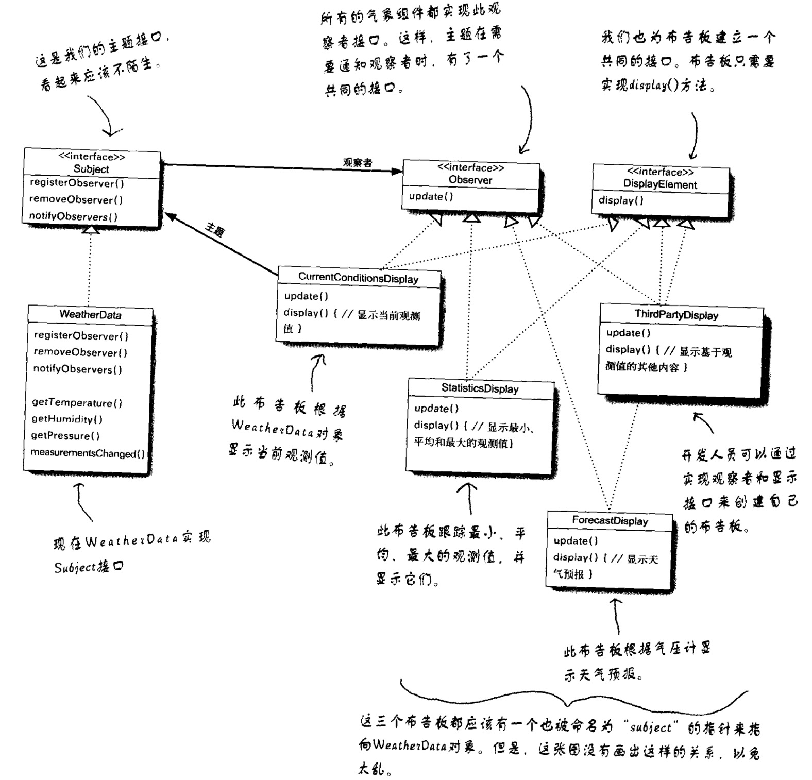

```java
// 接口
public interface Subject{
    public void registerObserver(Observer o);
    public void removeObserver(Observer o);
    public void notifyObserver();
}

public interface Observer{
    public void update(float temp, float humidity, float pressure);
}

public interface DisplayElement{
    public void display();
}

// Subject
public class WeatherData implements Subject{
    private ArrayList observers;
    private float temp;
    private float humidity;
    private float pressure;
    public WeatherData(){
        observers = new ArrayList();
    }
    public void registerObserver(Observer o){
        observers.add(o);
    }
    public void removeObserver(Observer o){
        int i = observers.indexOf(o);
        if(i>0)
            observers.remove(i);
    }
    public void notifyObserver(){
        for(Observer o:observers)
            o.update(temp, humidity, pressure);
    }
    public void measurementsChanged(){
        notifyObserver();
    }
    public void setMeasurements(float temp, float humidity, float pressure){
        this.temp = temp;
        this.humidity = humidity;
        this.pressure = pressure;
        measurementsChanged();
    }
}

// Observer
public class CurrentConditionsDisplay implements Observer, DisplayElement{
    private float temp;
    private float humidity;
    private Subject weatherData; // 为什么要保存，为了以后删除时候的方便 weatherData.removeObserver();
    public CurrentConditionsDisplay(Subject weatherData){
        this.weatherData = weatherData;
        weather.registerObserver(this); // 注册
    }
    public void update(float temp, float humidity, float pressure){
        this.temp = temp;
        this.humidity = humidity;
        display();
    }
    public void display(){
        System.out.println(temp + '' + humidity);
    }
}

public static void main(String[] args){
    WeatherData wd = new WeatherData();
    CurrentConditionsDisplay cd = new CurrentConditionsDisplay(wd);
    wd.setMeasurements(80,65,30.4f);
}
```
### 6.2.2. Java内置的观察者模式
java.util.Observer(接口)类似于前面的Observer，java.util.Observable(类)类似于前面的Subject

#### 6.2.2.1. 把对象变成观察者
实现java.util.Observer接口，然后调用Observable中的`addObserver()`方法。当不再想当观察者时调用`deleteObserver()`

#### 6.2.2.2. Subject要发出通知时
1. 调用setChanged()方法，标机状态已经改变的事实
2. 调用`notifyObservers()`或`notifyObservers(Object args)`中的一种

#### 6.2.2.3. 观察者接收通知
`update(Observable o, Object args)`，要推数据给观察者时，可以用Object args传给观察者。否则观察者会从Subject拉数据。

将之前的代码改成java内置版本

```java
// 接口
import java.util.Observer;
import java.tuil.Observable;

public interface DisplayElement{
    public void display();
}
// Subject
public class WeatherData extends Observable{
    private float temp;
    private float humidity;
    private float pressure;
    public WeatherData(){} // 不在需要提供记录观察者的数据
    // 不再需要自己实现注册和通知，超类中都有
    public void measurementsChanged(){
        setChanged(); // 超类的方法
        notifyObserver(); // 超类的方法
    }
    public void setMeasurements(float temp, float humidity, float pressure){
        this.temp = temp;
        this.humidity = humidity;
        this.pressure = pressure;
        measurementsChanged();
    }
    // 以下方法是用于观察者拉数据的
    public float getTemperature(){
        return temp;
    }
    public float getHumidity(){
        return humidity;
    }
    public float getPressure(){
        return pressure;
    }
}

// Observer
public class CurrentConditionsDisplay implements Observer, DisplayElement{
    private float temp;
    private float humidity;
    private Observable observable; // 为什么要保存，为了以后删除时候的方便 weatherData.removeObserver();
    public CurrentConditionsDisplay(Observable observable){
        this.observable = observable;
        observable.addObserver(this); // 注册
    }
    public void update(Observable obs, Object args){
        if(obs instanceof WeatherData){
            WeatherData wd = WeatherData(obs);
            this.temp = wd.getTemperature();
            this.humidity = wd.getHumidity;
            display();
        }
    }
    public void display(){
        System.out.println(temp + '' + humidity);
    }
}

public static void main(String[] args){
    WeatherData wd = new WeatherData();
    CurrentConditionsDisplay cd = new CurrentConditionsDisplay(wd);
    wd.setMeasurements(80,65,30.4f);
}
```

#### 6.2.2.4. Observable的缺点
他是一个类，而不是接口，违背针对接口编程的设计原则，无法复用。

### 6.2.3. 要点
- 观察者模式定义了对象之间一对多的关系
- subject（可观察者）用一个共同的接口来更新观察者
- 观察者和可观察者之间用松耦合方式结合，可观察者不知道观察者的细节，只知道观察者实现了观察者接口
- 使用此模式时，你可以从被观察者处推(push)或拉(pull)数据（然而，推被认为更正确）
- 有多个观察者时，不可以依赖特定的通知次序。
- java有多种观察者模式的实现，包括通用的java.util.Observable
- 要注意java.util.Observable实现上所带来的的一些问题
- 如果有必要的话，可以自己实现自己的Observable，这并不难

## 6.3. 装饰对象
动态地将责任附加到对象上。若要扩展功能，装饰者提供了比继承更有弹性的替代方案
### 6.3.1. 设计原则：类应该对扩展开放，对修改关闭
允许类容易扩展，在不修改现有代码的情况下，就可搭配新的行为。这样的设计具有弹性可以应对改变，可以接收新的功能来应对改变的需求。

### 6.3.2. 认识装饰者模式

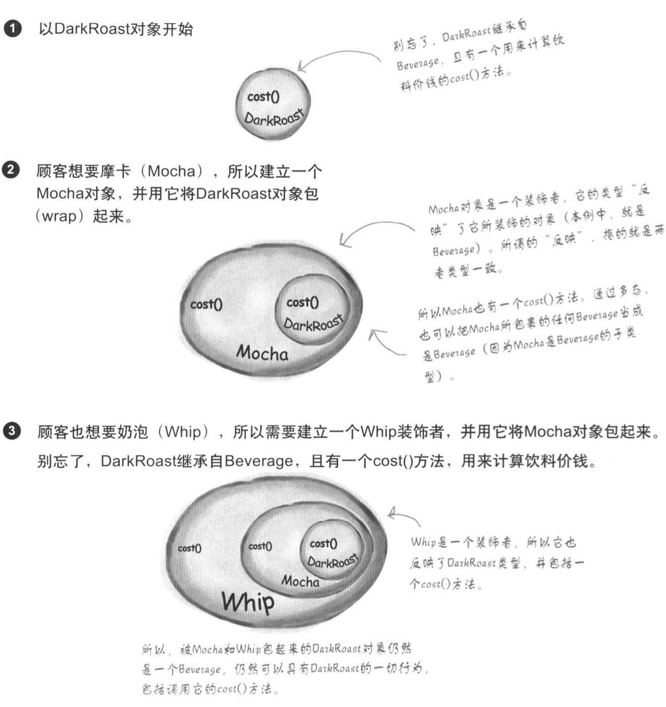
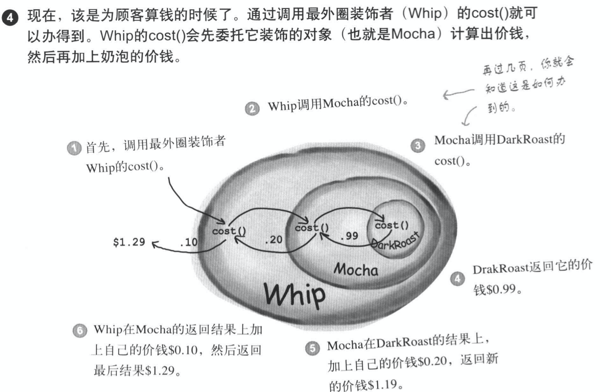

- 装饰者和被装饰对象有相同的超类型。
- 你可以用一个或多个装饰者包装一个对象
- 既然装饰者和被装饰者对象由相同的超类型，所以在任何需要原始对象（被包装的）的场合，可以用装饰过的对象代替它。
- **装饰者可以在所委托被装饰者的行为之前与/或之后，加上自己的行为，以达到特定的目的**
- 对象可以在任何时候被装饰，所以可以在运行时动态地、不限量的使用你喜欢的装饰者来装饰对象。

### 6.3.3. 定义装饰者模式

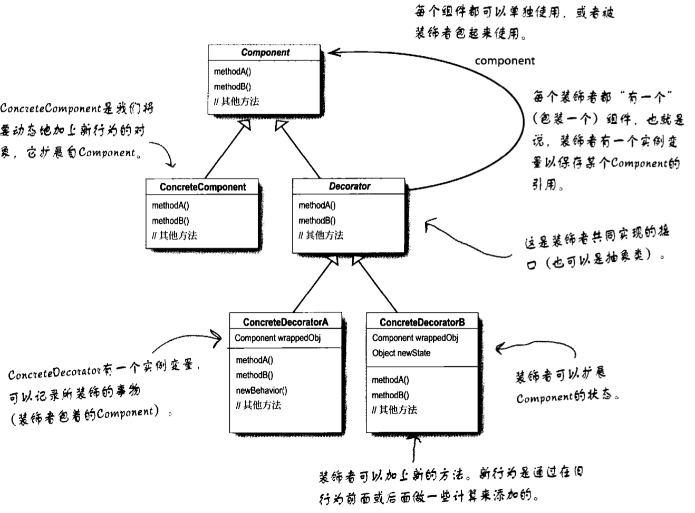
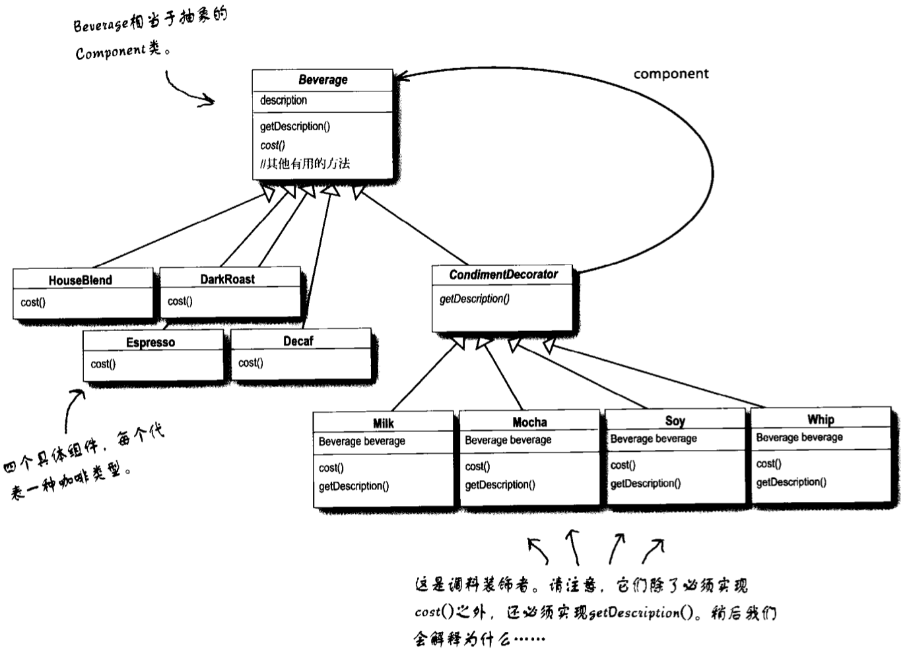

- 通过将装饰者与组件组合起来，扩展功能。
- 超类可以是接口也可以是抽象类

```java
// 超类
public abstract class Beverage{
    String description = "Unkown Beverage.";
    public String getDescription(){
        return description;
    }
    public abstract double cost();
}

// 装饰者抽象类
public abstract class CondimentDecorator extends Beverage{
    public abstract String getDescription();
}

// 不同类型饮料子类
public class Espresso extends Beverage{
    public Espresso(){
        description = "Espresso.";
    }
    public double cost(){
        return 1.99;
    }
}
.....

// 具体的装饰者
public class Mocha extends CondimentDecorator{
    Beverage beverage;
    public Mocha(Beverage beverage){
        this.beverage = beverage;
    }
    public String getDescription(){
        return beverage.getDescription + ", mocha.";
    }
    public double cost(){
        return beverage.cost() + 0.2;
    }
}
....

public static void main(String args[]){
    Beverage beverage = new Espresso();
    Beverage beverage2 = new Mocha(Espresso);
    System.out.println(beverage.getDescription + ":" + beverage.cost());
}
```

装饰者通常是用其他类似于工厂或生成器这样的模式创建的。

### 6.3.4. 装饰者 java I/O
`FileInputStream`是被装饰的组件，`BufferedInputStream`是他的装饰者，`LineNumberInputStream`是后者的装饰者。

### 6.3.5. 要点
- 继承属于扩展形式之一，但不见得是达到弹性设计的最佳方式
- 在我们的设计中，应该允许行为可以被拓展，而不需修改现有的代码。
- 组合和委托可用于在运行时被动的加上新的行为。
- 除了继承，装饰者模式也可以让我们扩展性为
- 装饰者模式意味着一群装饰者类，这些类用来包装具体组件
- 装饰者类反映出被装饰的组件类型
- 装饰者可以在被装饰者的行为前与/或后面加上自己的行为，甚至将被装饰者的行为整个取代掉，而达到特定的目的。
- 你可以用无数个装饰者包装一个组件
- 装饰者一般对组件的客户是透明的，除非客户程序依赖于组建的具体类型
- 装饰者会导致设计中出现许多小对象，如果过度使用，会让程序变得复杂

## 6.4. 工厂模式
定义了一个创建对象的接口，但由子类决定要实例化的类是哪一个。工厂方法让类把实例化推迟到子类。

当有很多子类时，有些时候只有在运行的时候才会知道到底需要哪一个类去new，因此需要很多的if判断，如下图，没有将改变和不改变的部分分开。

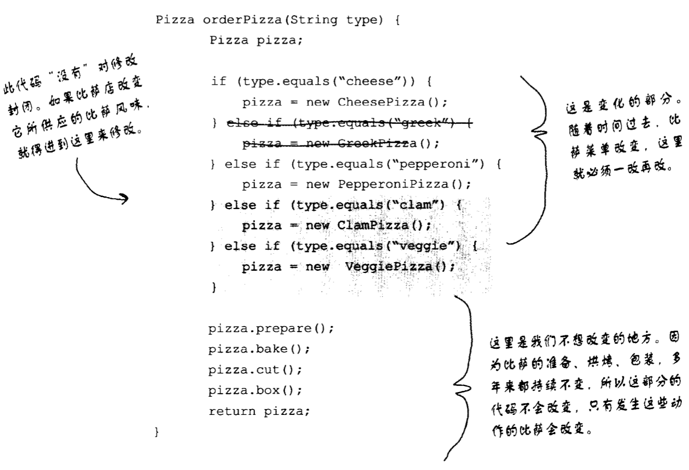

可以将改变部分的代码重建一个新的对象，这个对象成为工厂。

### 6.4.1. 定义简单工厂

```java
// 定义工厂
public class SimplePizzaFactory{
    public Pizza createPizza(String type){
        Pizza pizza = null;
        if(type.equals("cheese")){
            pizza = new CheesePizza();
        }else if(type.equals("pepperoni")){
            pizza = new PepperoniPizza();
        }....
        return pizza;
    }
}
// 定义客户
public class PizzaStore{
    SimplePizzaFactory spf;
    public PizzaStore(SimplePizzaFactory spf){
        this.spf = spf;
    }
    public Pizza orderPizza(String type){
        Pizza pizza;
        pizza = spf.createPizza(type);
        pizza.prepare();
        pizza.bake();
        ...
        return pizza;
    }
}
public 
```

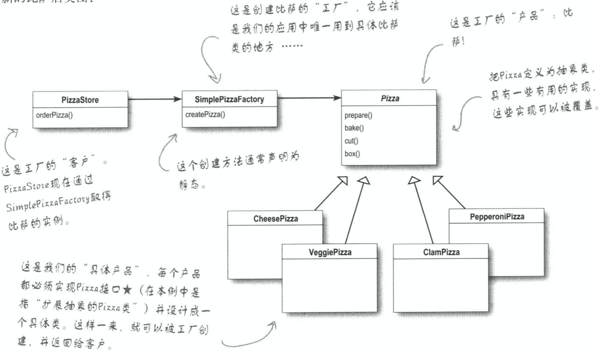
**有问题：如果要想增加新的做法，就要在工厂代码中进行修改。**

### 6.4.2. 改进
**通过继承的方式，让对象的实例化推迟到子类中。这样加入新的做法就可以不改变工厂。**

如果不同的店的做法不同，怎么办。

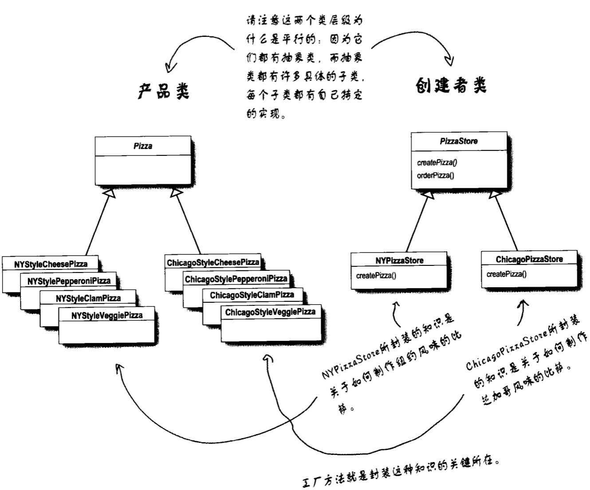

```java
public abstract class PizzaStore{
    public Pizza orderPizza(String type){
        Pizza pizza;
        pizza = createPizza(type);
        pizza.prepare();
        pizza.bake();
        ...
        return pizza;
    }
    public abstract Pizza createPizza(String type);
}

public class NYStylePizzaStore extends PizzaStore{
    public Pizza createPizza(String type){
        Pizza pizza = null;
        if(type.equals("cheese")){
            pizza = new NYStyleCheesePizza();
        }else if(type.equals("pepperoni")){
            pizza = new NYStylePepperoniPizza();
        }....
        return pizza;
    }
}

public class ChicagoStylePizzaStore extends PizzaStore{
    public Pizza createPizza(String type){
        Pizza pizza = null;
        if(type.equals("cheese")){
            pizza = new ChicagoStyleCheesePizza();
        }else if(type.equals("pepperoni")){
            pizza = new ChicagoStylePepperoniPizza();
        }....
        return pizza;
    }
}
```
### 6.4.3. 定义

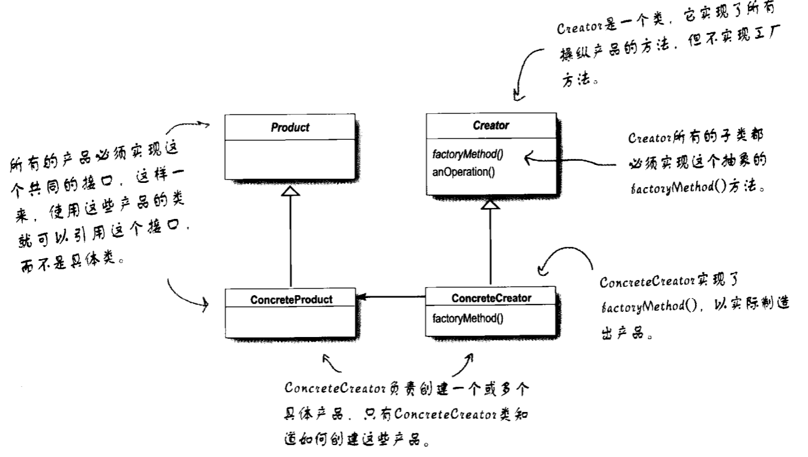

工厂模式的好处：将创建对象的代码集中在一个对象或方法中，可以避免代码中的重复，并且更方便以后的维护。这也意味着客户在实例化对象时，只会依赖于接口，而不是具体类。

### 6.4.4. 设计原则：依赖倒置原则，要依赖抽象，不要依赖具体类
不能让高层组件依赖底层组件，而且不管高层或底层组件，两者都应该依赖于抽象。


底层组件依赖于Pizza这个抽象类，而高级组件PizzaStore也依赖于Pizza，实现了依赖倒置。

- 变量不可以持有具体类的引用。
  - 如果使用new，就会持有具体类的引用。可以通过工厂模式来避开这样的做法
- 不要让类派生自具体类
  - 这样就会依赖具体类。需要派生自一个抽象接口或抽象类
- 不要覆盖基类中已实现的方法

## 6.5. 抽象工厂模式
提供一个接口，用于创建相关或依赖对象的家族，而不需要明确指定具体类


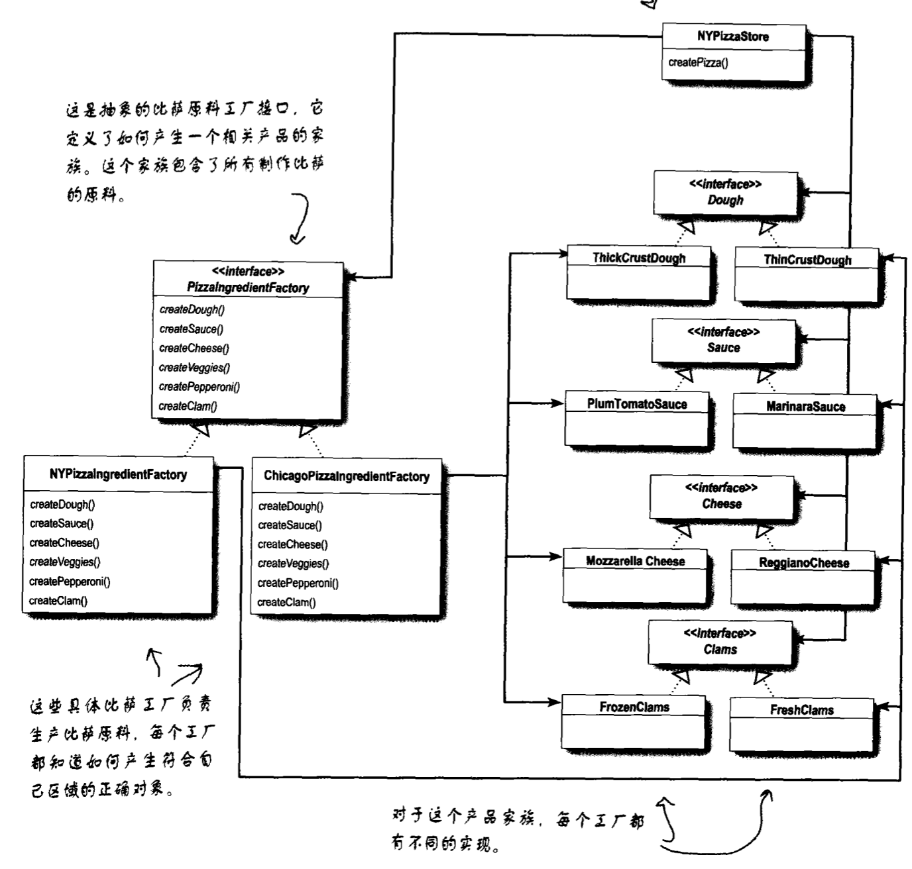

不同地方的披萨店使用的原料不同，统一通过原料工厂产出

```java
// 抽象工厂
public interface PizzaIngredientFactory{
    public Dough createDough();
    public Sauce createSauce();
    ...
}
public class NYPizzaIngredientFactory implements PizzaIngredientFactory{
    public Dough createDough(){
        return new ThinCrustDough(); //生成纽约这家店特定的原料
    }
    public Cheese createCheese(){
        return new ReggianoCheese();
    }
    ...
}

// 重写Pizza
public abstract class Pizza{
    String name;
    Dough dough;
    Cheese cheese;

    abstract void prepare(); // 抽象类，具体披萨具体做法
    void bake(){....};
    void cut(){....};
    void box(){....};
    void setName(String name){...};
    String getName(){....};
}

// 优化之前的NYCheesePizza和ChicagoChessPiza，都是做披萨，唯一的区别是区域性的原料不同。Pizza与区域性原料之间被解耦，无论原料工厂开在哪里，都可以复用Pizza类
public class CheesePizza extends Pizza{
    PizzaIngredientFactory ingredientFactory;
    public CheesePizza(PizzaIngredientFactory ingredientFactory){
        this.ingredientFactory = ingredientFactory;
    }
    void prepare(){
        // 每当需要原料时就跟工厂要
        dough = ingredientFactory.createDough();
        cheese = ingredientFactory.createCheese();
    }
}

// 具体的Pizza店
public class NYPizzaStore extends PizzaStore{
    protected Pizza createPizza(String item){
        Pizza pizza = null;
        PizzaIngredientFactory ingredientFactory = new NYPizzaIngredientFactory();
        if(item.equals("cheese")){
            pizza = new CheesePizza(ingredientFactory);
            pizza.setName("New York Cheese Pizza");
        }else if....
        return pizza;
    }
}
```

抽象工厂可以生产同类型但是不同种的内容，比如生产Cheese可以是纽约的，也可以是芝加哥的。将代码从实际工厂中解耦出来。抽象工厂模式中我们可以定义实现不止一个接口，一个工厂也可以生成不止一个产品类，抽象工厂模式较好的实现了“开放-封闭”原则，是三个模式中较为抽象，并具一般性的模式。我们在使用中要注意使用抽象工厂模式的条件。

### 6.5.1. 工厂模式和抽象工厂模式的比较
**工厂模式**
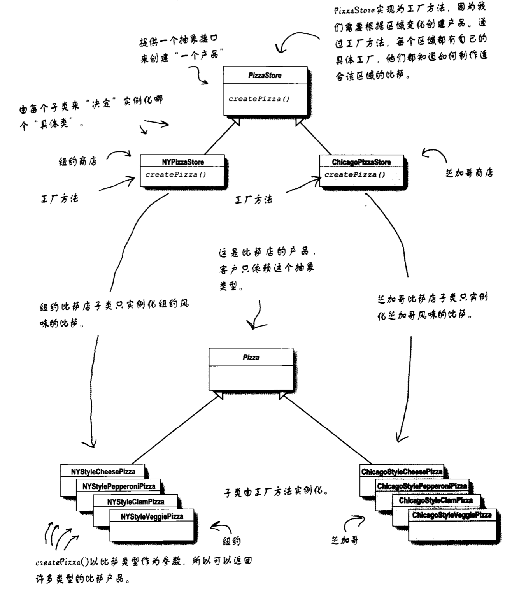

**抽象工厂模式**
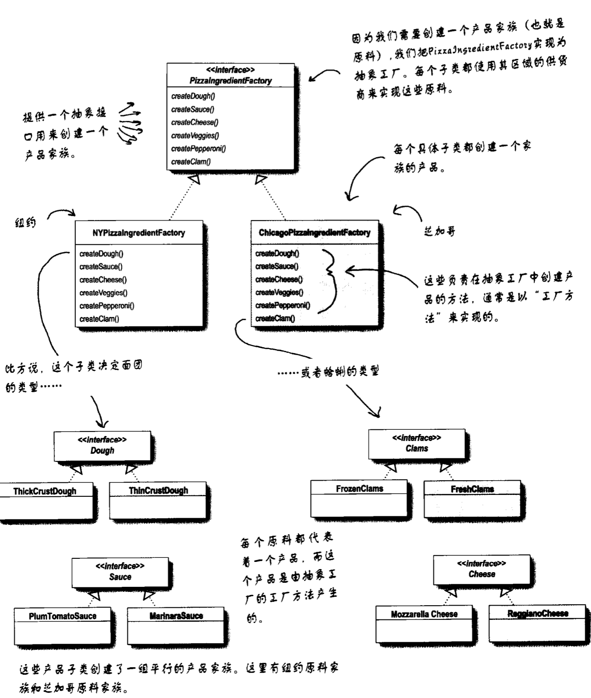

### 6.5.2. 要点
- 所有的工厂都是用来封装对象的创建
- 简单工厂，虽然不是真正的设计模式，但仍不失为一个简单的方法，可以将客户程序从具体类解耦
- 工厂方法使用继承，把对象的创建委托给子类，子类实现工厂方法来创建对象
- 抽象工厂使用对象组合，对象的创建被实现在工厂接口所暴露出来的方法中。
- 所有工厂模式都通过减少应用程序和具体类之间的依赖促进松耦合。
- 工厂方法允许类将实例化延迟到子类进行。
- 抽象工厂创建相关的对象家族，而不需要依赖它们的具体类
- 依赖倒置原则，知道我们避免依赖具体类型，而要尽量依赖抽象
- 工厂是很有威力的技巧，帮助我们针对抽象编程，而不要针对具体类编程

## 6.6. 单件模式
确保一个类只有一个实例，并提供一个全局访问点

### 6.6.1. 懒汉式
```java
public class Single
{
	// 私有的构造，会导致这个类无法用new来创建对象，只能在类内调用new
	private Single()
	{}
	
	private static Single single = null;
	
	public static Single getInstance()
	{
        // 方法一:效率差
        synchronized(Single.class){
            if(single == null)
            {
                single = new Single();
            }
            return single;
        }   

        // 方法二：效率高 双重检查加锁
        if(single == null){
            synchronized(Single.class){
                if(single == null)
                {
                    single = new Single();
                }
            } 
        }
        return single;
	}
}
```

### 6.6.2. 饿汉式

```java
public class Single
{
	// 私有的构造，会导致这个类无法用new来创建对象，只能在类内调用new
	private Single()
	{}
	
	private static Single single = new Single();
	
	public static Single getInstance()
	{
		return single;
	}
}
```

### 6.6.3. 要点
- 单件模式确保程序中一个类最多只有一个实例
- 单件模式也提供访问这个实例的全局点
- 在java中实现单例模式需要私有的构造器、一个静态方法和一个静态变量
- 确定在性能和资源商的限制，然后小心地选择适当的方案来实现单件，已解决多线程的问题
- 如果不是采用JDK5，双重检查加锁会失效
- 小心，你如果使用多个类加载器，可能导致单件失效而产生多个实例

## 6.7. 命令模式
将请求封装成对象，以便使用不同的请求、队列或者日志来参数化其他对象。命令模式也支持可撤销的操作。

可将动作的请求者从动作的执行者对象中解耦。

以服务员举例。服务员只需要接收客户的订单，然后将订单转交给厨师就行了，不需要考虑订单里的内容具体是什么。这里服务员与厨师之间的关系是解耦的。

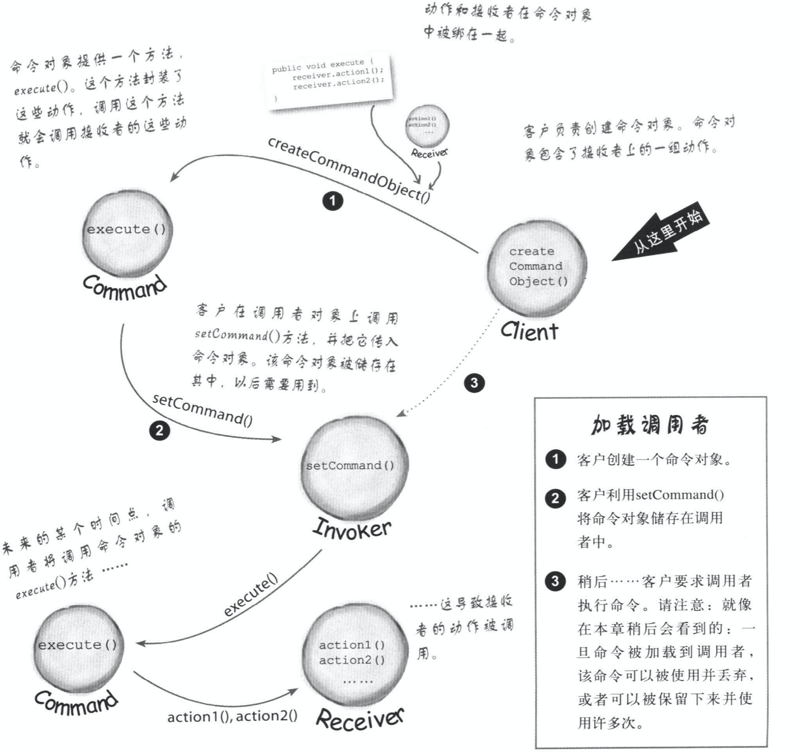

```java
public interface Command{
    public void execute();
}

public class LightOnCommand implements Command{
    Light light;
    public LightOnCommand(Light light){
        this.light = light;
    }
    public void execute(){
        light.on();
    }
}

public class SimpleRemoteControl{
    Command slot;
    public SimpleRemoteControl(){}
    public void setCommand(Command command){
        slot = command;
    }
    public void buttonWasPressed(){
        slot.execute();
    }
}

public class RemoteControlTest{ // 命令的客户
    public static void main(String args[]){
        SimpleRemoteControl src = new SimpleRemoteControl(); // 命令调用者
        Light light = new Light(); // 请求的接收者
        LightOnCommand lightOn = new LightOnCommand(light); // 创建命令，将接收者传给他
        src.setCommand(lightOn);
        src.buttonWasPressed(); // 只管按下了按钮会有设备有响应，不管设备具体怎么响应。
    }
}
```


### 6.7.1. 实现举例

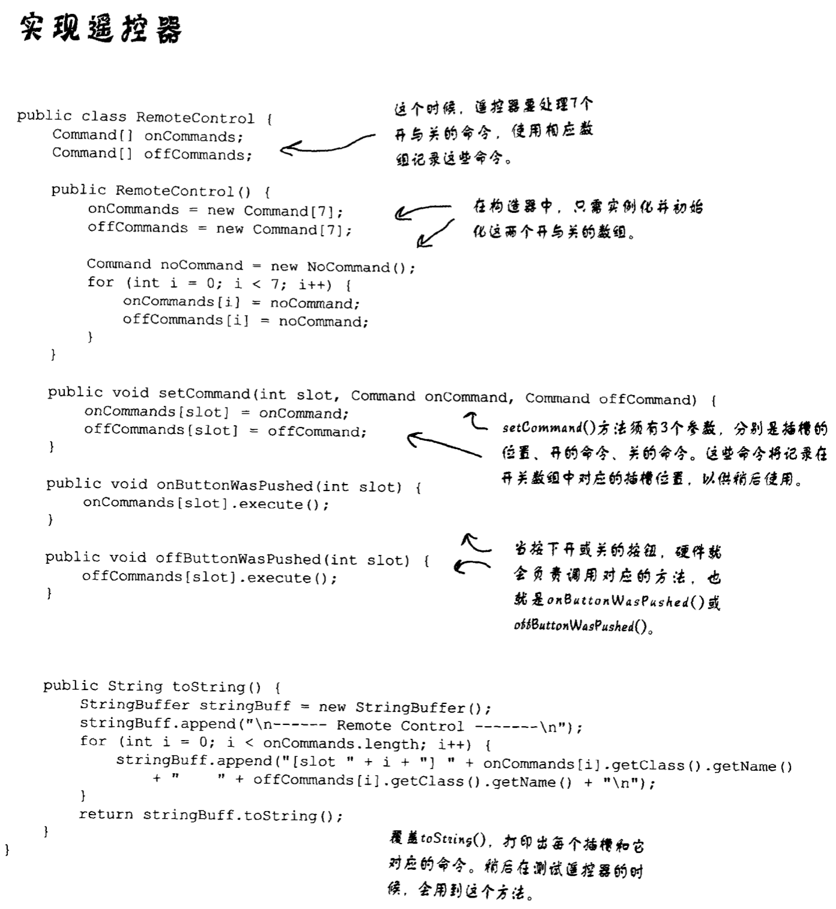
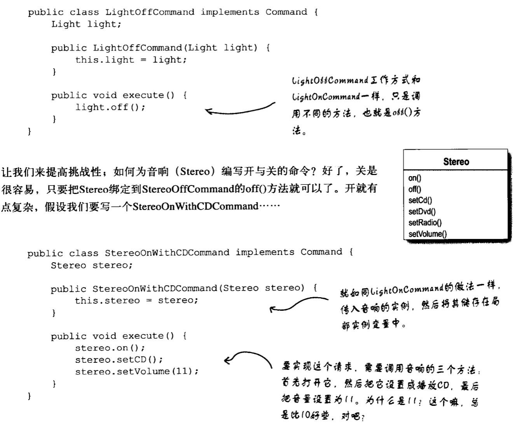
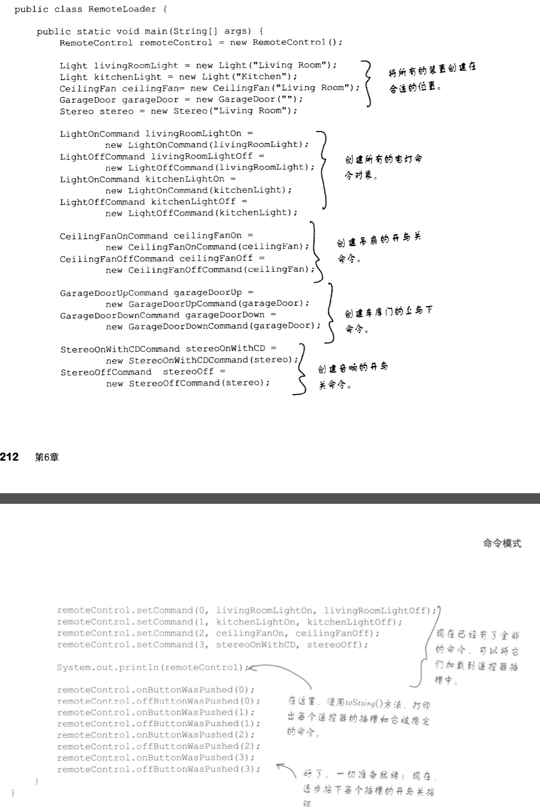

### 6.7.2. 使用宏命令
```java
public class MacroCommand implements Command{
    Command[] commands;
    public MacroCommand(Command[] commands){
        this.commands = commands;
    }
    public void execute(){
        for(Command c:commands){
            c.exectue();
        }
    }
}

Light light = new Light("Living Room");
TV tv = new TV("Living Room");
LightOnCommand lightOn = new LightOnCommand(light);
TVOnCommand TVOn = new TVOnCommand(tv);

Command[] partyOn = {lightOn,TVOn};
MacroCommand partyOnMacro = new MacroCommand(partyOn);
MacroCommand partyOffMacro = ...;
remoteControl.setCommand(0, partyOnMacro, partyOffMacro);
remoteControl.onButtonWasPushed(0);
```

### 6.7.3. 更多用途：队列请求
在一端添加命令，然后另一端则是线程。线程从队列中取出一个命令，调用它的execute()方法，等待调用完成，继续下一个。不在乎具体的execute的内容是什么。

### 6.7.4. 要点
- 命令模式将发出的请求的对象和解耦。
- 在被解耦的两者之间是通过命令对象进行沟通的。命令对象封装了接收者和一个或一组命令
- 调用者通过调用命令对象的execute()发送请求，这会使得接收者的动作被调用。
- 调用者可以接受命令当做参数，甚至在运行时动态地进行。
- 命令可以支持撤销，做法是实现一个undo()方法来回到execute()被执行前的状态
- 宏命令是命令的一种简单的延伸，允许调用多个命令。宏方法也可以支持undo
- 实际操作时，很常见使用聪明命令对象，也就是直接实现了请求，而不是将工作委托给接收者。
- 命令也可以用来实现日志和事务系统。

## 6.8. 适配器模式与外观模式
### 6.8.1. 适配器
将一个类的接口转换成客户期望的另一个接口。适配器让原本接口不兼容的类可以合作无间。

这个模式可以让不兼容的接口变成兼容。让客户从实现的接口解耦。

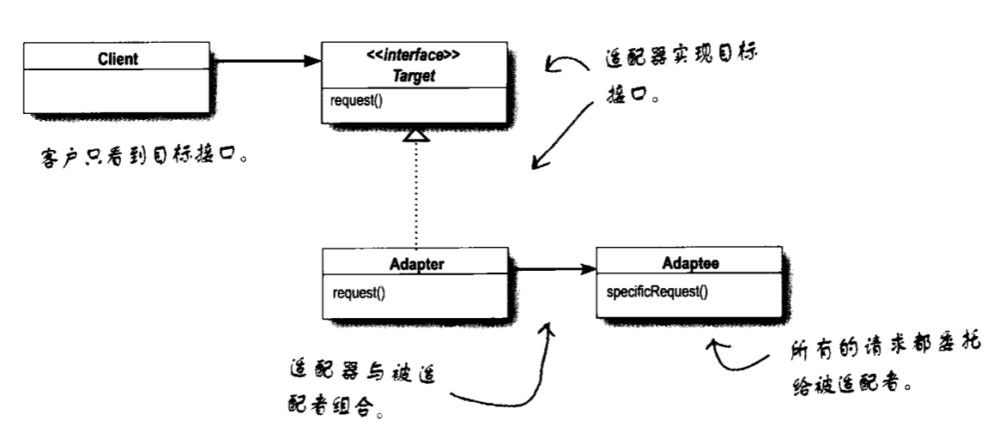

被适配者的任何子类都可以搭配着适配器使用

将一直火鸡通过适配器变成鸭子

```java
public interface Duck{
    public void quack();
    public void fly();
}
public class MallardDuck implements Duck{
    public void quack(){
        System.out.println("Quack");
    }
    public void fly(){
        System.out.println("I'm flying");
    }
}
public interface Turkey{
    public void gobble();
    public void fly();
}
public class WileTurkey implements Turkey{
    public void gobble(){
        System.out.println("Gobble gobble");
    }
    public void fly(){
        System.out.println("Im flying a shor distance");
    }
}
// 适配器 将火鸡拿来冒充鸭子
public class TurkeyAdapter implements Duck{
    Turkey turkey;
    public TurkeyAdapter(Turkey turkey){
        this.turkey = turkey;
    }
    public void quack(){
        turkey.gobble();
    }
    public void fly(){
        tuekey.fly();
    }
}
```

客户使用适配器的过程：
- 客户通过目标接口调用适配器的方法对适配器发出请求
- 适配器使用被适配者接口把请求转换成被适配者的一个或多个调用接口
- 客户接收到调用的结果，但并未察觉这一切是适配器在起转换作用

#### 6.8.1.1. 对象和类的适配器
实际上有两种适配器：对象适配器和类适配器。

类适配器需要多重继承，在java中不能实现。

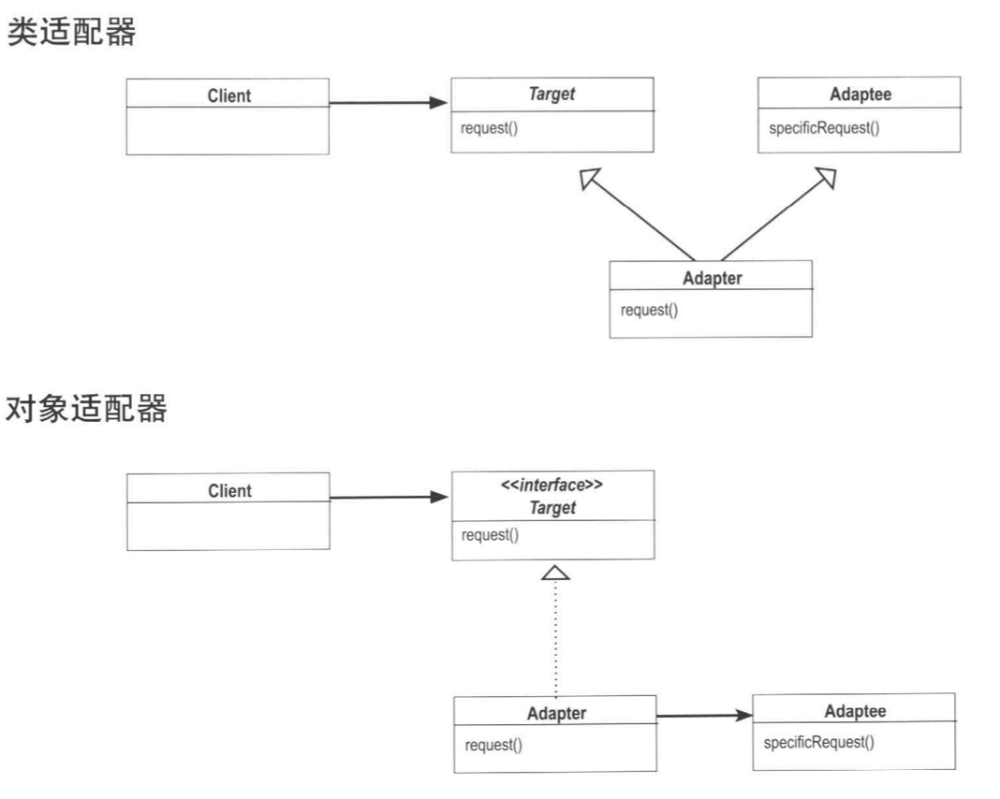

### 6.8.2. 外观模式
提供了一个统一的接口，用来访问子系统中的一群接口。外观定义了一个高层接口，让子系统更容易使用。

将一个或数个类的复杂的一切都隐藏在背后，只显露出一个干净美好的外观

外观只是提供简化的接口，客户如果觉得有必要，依然可以直接使用子系统的类。

外观和适配器可以包装许多类，但是外观的意图是简化接口，而适配器的意图是将接口转换成不同接口

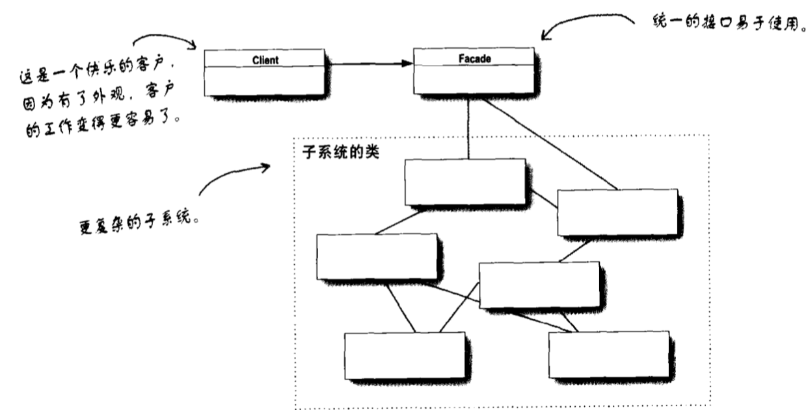

**区别**
- 装饰者 不改变接口，但加入责任
- 适配器 将一个借口转换成另一个接口
- 外观 让接口更简单

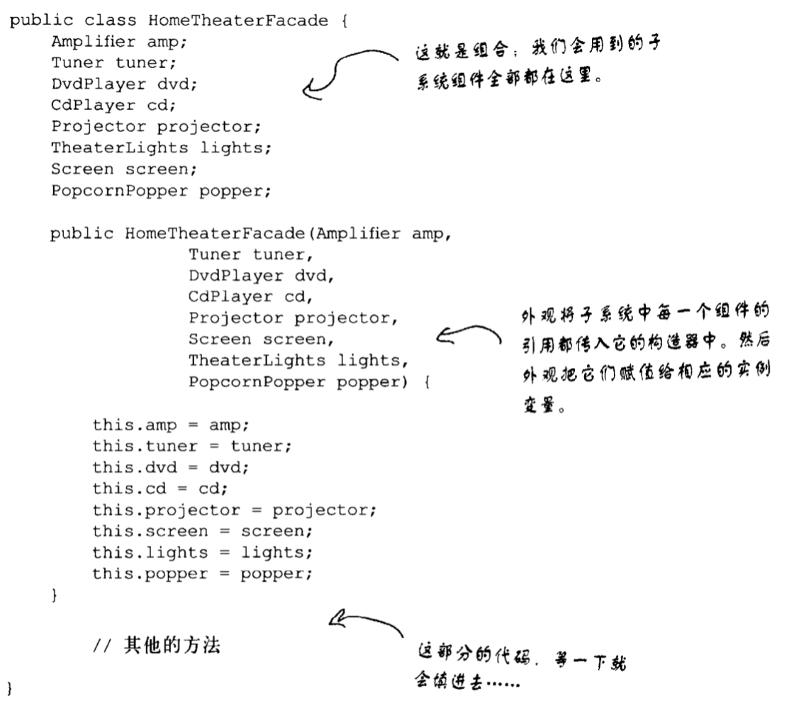
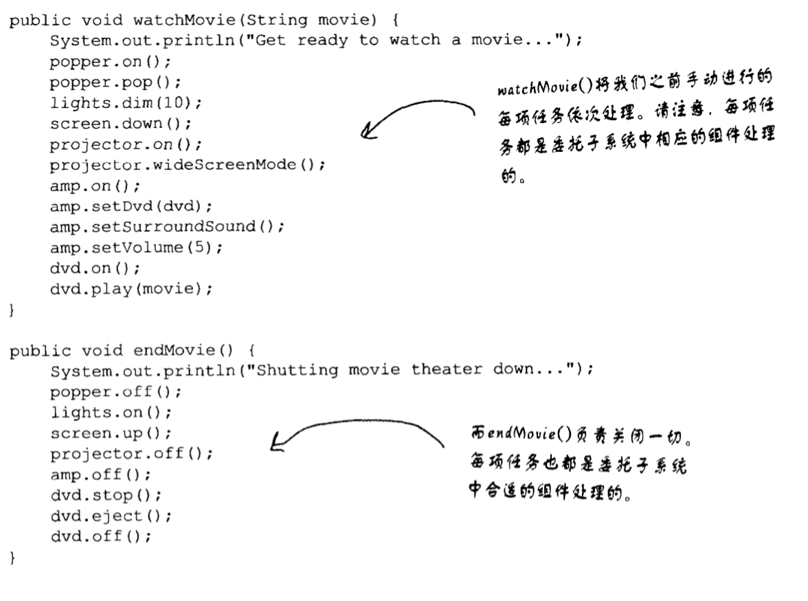

### 6.8.3. 设计原则：最少知识原则：只和你的密友谈话
希望我们在设计中，不要让太多的类偶合在一起，免得修改系统中一部分，会影响到其他部分。

方针：我们只应该调用属于以下范围的方法：
- 该对象本身
- 被当做方法的参数而传递进来的对象
- 此方法所创建或实例化的任何对象
- 对象的任何组件（有一个关系）

请注意：如果某对象是调用其他的方法的返回结果，不要调用该对象的方法
```java
// 没有使用这个原则，这里调用了其他方法的返回结果的对象的方法
public float getTemp(){
    Thermometer thermometer = station.getThermometer();
    return thermometer.getTemp();
}

// 使用这个原则
public float getTemp(){
    return station.getTemp(); // 应该去station这个类中在定义一个返回温度的方法。可以减少我们所依赖的类的数目
}
```

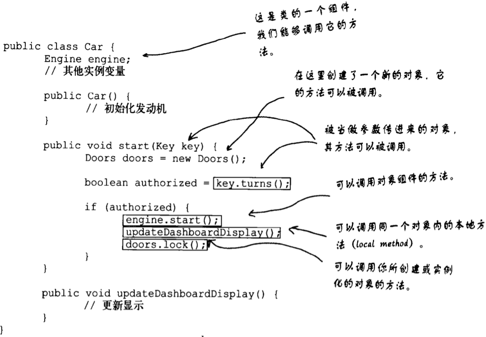

优点：减少对象之间的依赖，研究显示会减少软件的维护成本
缺点：导致更多的包装类被制造出来，以处理和其他组件的沟通，这可能会导致复杂度和开发时间的增加，并降低运行时的性能。

### 6.8.4. 要点
- 当需要使用一个现有的类而其接口并不符合你的需要时，就是用适配器
- 当需要简化并统一一个很大的接口或者一群复杂的接口时，使用外观。
- 适配器改变接口以符合客户的期望
- 外观将客户从一个复杂的子系统中解耦
- 实现一个适配器可能需要一番功夫，也可能不费功夫，视目标接口的大小与复杂度而定
- 实现一个外观，需要将子系统组合进外观中，然后将工作委托给子系统执行
- 适配器模式有两种形式：对象适配器和类适配器。类适配器需要用到多重继承
- 你可以为一个子系统实现一个以上的外观
- 适配器将一个对象包装起来以改变其接口：装饰者将一个对象包装起来以增加新的行为和责任；而外观将一群对象“包装”起来以简化其接口

## 6.9. 模板方法模式
在一个方法中定义一个算法的骨架，而将一些步骤延迟到子类中。模板方法使得子类可以在不改变算法结构的情况下，重新定义算法中的某些步骤。
### 6.9.1. 封装
代码复用最大化，算法只存在于一个地方，所以容易修改。CaffeineBeverage本身只需关注算法，由子类提供具体完成的实现。

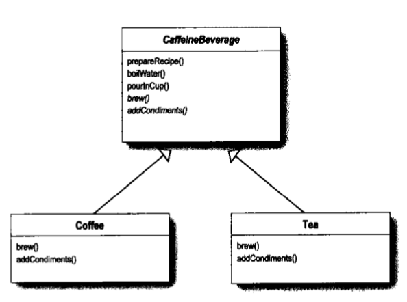

```java
public abstract class CaffeineBeverage{
    final void prepareRecipe(){ // 模板方法 声明为final，以免子类的影响
        boilWater();
        brew();
        pourInCup();
        addCondiments();
        hook();
    }
    // 这两个方法在咖啡和茶中做法不同
    abstract void brew();
    abstract void addCondiments();
    void boilWater(){
        System.out.println("boiling water");
    }
    void pourInCup(){
        System.out.println("pour in cup");
    }
    void hook(){}; //特殊的挂钩定义，可以什么都不做，让子类自己考虑要不要覆盖它
}
public class Tea extends CaffeineBeverage{
    public void brew(){
        System.out.println("steeping the tea");
    }
    public void addCondiments(){
        System.out.println("adding lemon");
    }
}
public class Coffee extends CaffeineBeverage{
    public void brew(){
        System.out.println("dripping coffee through filter");
    }
    public void addCondiments(){
        System.out.println("adding sugar and milk");
    }
}
```

这个模式用来创建一个算法的模板，模板就是一个方法，这个方法将算法定义成一组步骤，其中的任何步骤都可以是抽象的。

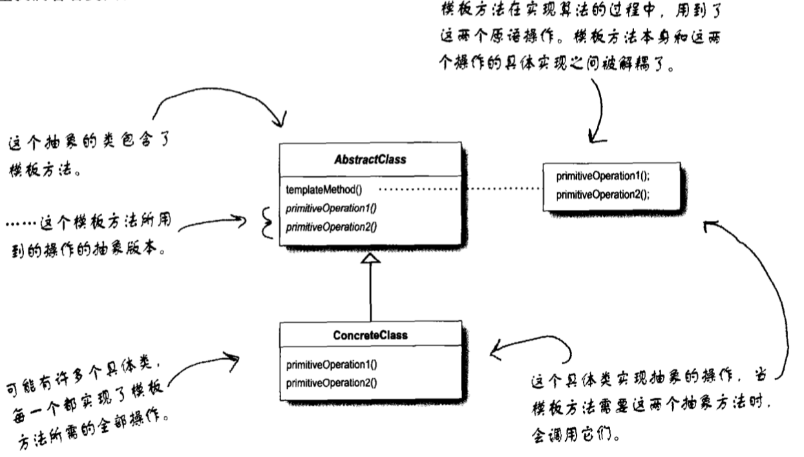

### 6.9.2. 设计原则：好莱坞原则：别调用我们，我们会调用你
将底层组件挂钩到系统上，但是高层组件会决定什么时候和怎么样使用这些底层组件。换句话说，高层组件对待低层组件的方式是“别调用我们，我们会调用你”

### 6.9.3. 策略模式和模板方法模式区别
策略模式：定义一个算法家族，客户可以轻易地使用不同的算法

模板方法模式：定义一个算法的大纲，规定其顺序，具体实现细节交给子类

### 6.9.4. 要点
- 模板方法定义了算法的步骤，把这些步骤的实现延迟到子类
- 模板方法模式为我们提供了一种代码复用的重要技巧
- 模板方法的抽象类可以定义具体方法、抽象方法和钩子
- 抽象方法由子类实现
- 钩子是一种方法，它在抽象类中不做事，或者只做默认的事情
- 为了防止子类改变模板方法中的算法，可以将模板方法声明为final
- 好莱坞原则告诉我们，将决策权放在高层模块中，以便决定如何以及何时调用底层模块
- 你将在真实世界代码中看到模板方法模式的许多变体，不要期待它们全都是一眼就可以被你认出的
- 策略模式和模板方法模式都封装算法，一个用组合，一个用继承。
- 工厂方法是模板方法的一种特殊版本

## 6.10. 迭代器与组合模式
### 6.10.1. 迭代器
提供一种方法顺序访问一个聚合对象中的各个元素，而又不暴露其内部的表示。

把游走的任务放在迭代器上，而不是聚合上。这样简化了聚合的接口和实现，也让责任各得其所。

依赖于iterator接口，有hasNext()和next()两个方法

可以同时维护ArrayList和数组

```java
// 自己创建Iterator接口
public interface Iterator{
    boolean hasNext();
    Object next();
}
public class DinerMenuIterator implements Iterator{
    MenuItem[] items;
    int position = 0;
    public DinerMenuIterator(MenuItem[] items){
        this.items = items;
    }
    public Object next(){
        MenuItem menuItem = items[position];
        position = position + 1;
        return menuItem;
    }
    public boolean hasNext(){
        if(position >= items.length || items[position] == null){
            return false;
        }else{
            return true;
        }
    }
}
public class DinerMenu{
    static final int MAX_ITEMS = 6;
    int numberOfItems = 0;
    MenuItem[] menuItems;
    public Iterator createIterator(){
        return new DinerMenuIterator(menuItems);
    }
}
```

### 6.10.2. 改进
**使用java.util.Iterator**
ArrayList自带Iterator。只需要ArrayList对象.iterator()即可。

```java
import java.util.Iterator;

public interface Menu{
    public Iterator createIterator();
}

public class DinerMenu extends Menu{
    static final int MAX_ITEMS = 6;
    int numberOfItems = 0;
    MenuItem[] menuItems;
    public Iterator createIterator(){ //改变
        return new DinerMenuIterator(menuItems);
    }
}

public class DinerMenuIterator implements Iterator{ // 因为这个是数组，如果是ArrayList则无需在实现这个类了
    MenuItem[] list;
    int position = 0;
    public DinerMenuIterator(MenuItem[] list){
        this.list = list;
    }
    public Object next(){
        MenuItem menuItem = items[position];
        position = position + 1;
        return menuItem;
    }
    public boolean hasNext(){
        if(position >= items.length || items[position] == null){
            return false;
        }else{
            return true;
        }
    }
    public void remove(){// Iterator中的方法
        if(position<=0){
            throw new IllegalStateException("You can not remove an item until youve done at least one next()");
        }
        if(list[position-1]!=null){
            for(int i = position-1; i<(list.length-1);i++){
                list[i] = list[i+1];
            }
            list[list.length-1] = null;
        }
    }
}

public class Waitress{
    Menu dinerMenu;

    public Waitress(Menu dinerMenu){
        this.dinerMenu = dinerMenu;
    }
    public void printMenu(){
        Iterator dinerIterator = dinerMenu.createIterator();
        printMenu(dinerIterator);
    }
    public void printMenu(Iterator iterator){
        while(iterator.hasNext()){
            MenuItem menuItem = (MenuItem)iterator.next();
            System.out.println(....);
        }
    }
}
```

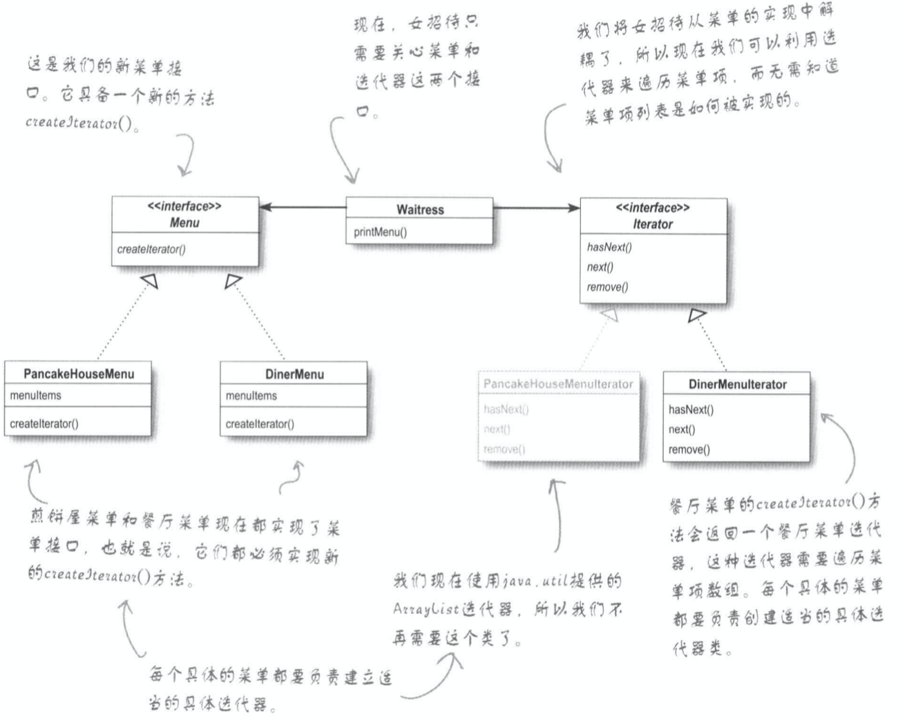

Hashtable.value().iterator(); Hashtable间接的支持迭代器

### 6.10.3. 设计原则：一个类应该只有一个引起变化的原因
类的每个责任都有改变的潜在区域。超过一个责任，意味着超过一个改变的区域。

这个原则告诉我们，尽量让每个类保持单一责任。

### 6.10.4. 组合模式
允许你将对象组合成树形结构来表现“整体/部分”层次结构。组合能让客户以一致的方式处理个别对象以及对象组合。

组合模式让我们能用树形方式创建对象的结构，树里面包含了组合以及个别的对象。

使用了迭代器后，女招待在使用时需要声明多个不同的菜单，以及使用printMenu操作。需要一种仪器管理它们的方法
```java
// 如果多个不同的菜单，需要多次重复这两句话
Iterator dinerIterator = dinerMenu.createIterator();
printMenu(dinerIterator);
```

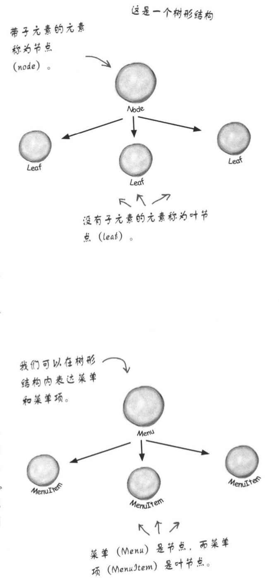
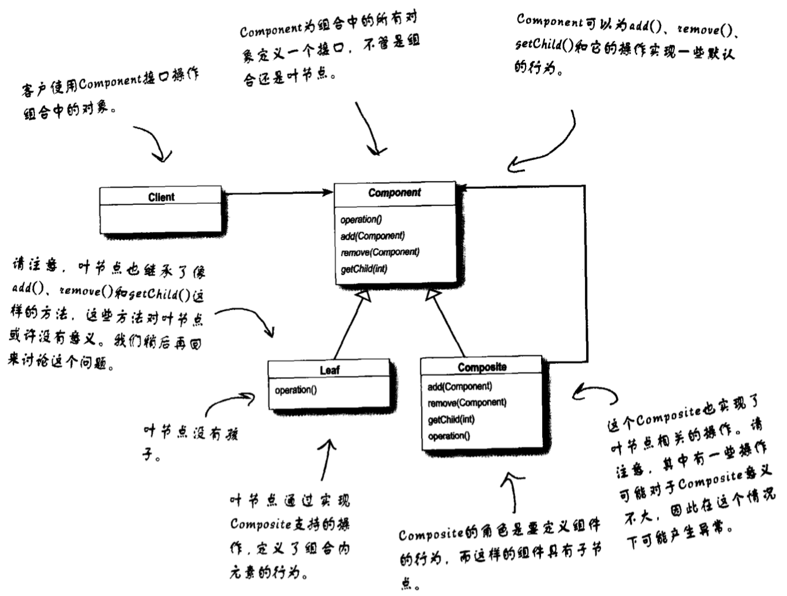

#### 6.10.4.1. 使用组合模式实现菜单
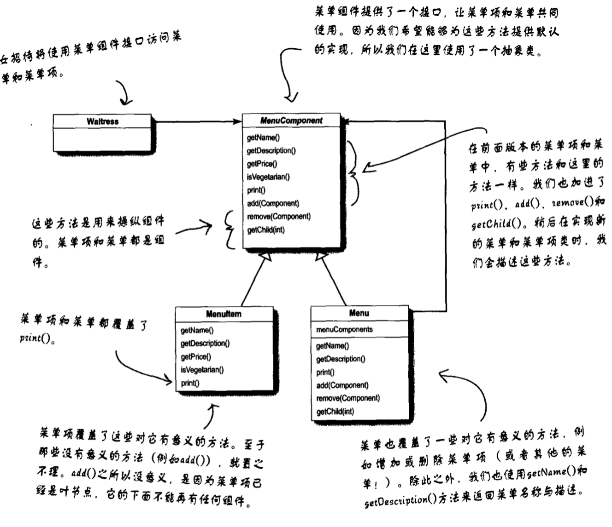

```java
public abstract class MenuComponent{
    ....
}
public class MenuItem extends MenuComponent{
    String name;
    String description;
    boolean vegetarian;
    double price;
    public MenuItem(String name, String desc, boolean vege, double price){
        this.name = name;
        this.description = desc;
        this.vegetarian = vege;
        this.price = price;
    }
    public String getName(){
        return name;
    }
    ...
}
public class Menu extends MenuComponent{ // 这也是MenuComponent的子类
    ArrayList menuComponents = new ArrayList();
    String name;
    String description;
    public Menu(String name, String description){
        this.name = name;
        this.description = description;
    }
    public void add(MenuComponent menuComponent){
        menuComponents.add(menuComponent);
    }
    public void remove(...){
        ...
    }
    public void print(){ // 打印一个菜单下的所有餐品
        Iterator iterator = menuComponents.iterator();
        while(iterator.hasNext()){
            MenuComponent menuComponent = (MenuComponent)iterator.next();
            menuComponent.print();
        }
    }
}
public class Waitress{
    MenuComponent allMenu;

    public Waitress(MenuComponent allMenu){ // 将顶层拿出来
        this.allMenu = allMenu;
    }
    public void printMenu(){
        allMenu.print();
    }
}
public static void main(String args[]){
    MenuComponent pancakeHouseMenu = new Menu("pancake house menu", "breakfast");
    MenuComponent dinerMenu = new Menu("diner menu", "diner");
    MenuComponent allMenus = new Menu("all menu", "all");
    allMenus.add(pancakeHouseMenu);
    allMenus.add(dinerMenu);
    dinerMenu.add(..);
    pancakeHouseMenu.add(..);

    Waitress waitress = new Waitress(allMenus);
    waitress.printMenu();
}
```

### 6.10.5. 将迭代器和组合模式一起使用

```java
public abstract class MenuComponent{
    ....
    public Iterator createIterator(){}
}
public class Menu extends MenuComponent{
    ...
    public Iterator createIterator(){
        return new CompositeIterator(menuComponents.iterator()); //CompositeIterator的功能是遍历组件内的菜单项，而且确保所有的子菜单都被包括进来
    }
}
public class MenuItem extends MenuComponent{
    ...
    public Iterator createIterator(){
        return new NullIterator(); // 空迭代器
    }
}
public class Waitress{
    ....
    public void printVegetarianMenu(){
        Iterator iterator = allMenus.createIterator();
        while(iterator.hasNext()){
            MenuComponent menuComponent = (MenuComponent)iterator.next();
            try{
                if(menuComponent.isVegetarian()){
                    menuComponent.print();
                }
            }catch(Exception e){}
        }
    }
}
```

### 6.10.6. 要点
- 迭代器允许访问聚合的元素，而不需要暴露它的内部结构
- 迭代器将遍历聚合的工作封装进一个对象中
- 当使用迭代器的时候，我们依赖聚合提供遍历
- 迭代器提供了一个通用的接口，让我们遍历聚合的项，当我们编码使用聚合的项时，就可以使用多态机制
- 我们应该努力让一个类只分配一个责任
- 组合模式提供一个结构，可同时包容个别对象和组合对象
- 组合模式允许客户对个别对象以及组合对象一视同仁
- 组合结构内的任何对象称为组件，组件可以是组合，也可以是叶节点
- 在实现组合模式时，有许多设计上的折中。你要根据需要平衡透明性和安全性。

## 6.11. 状态模式
允许对象在内部状态改变时改变它的行为，对象看起来好像修改了它的类。

这个模式将状态封装成为独立的类，并将动作委托到代表当前状态的对象。

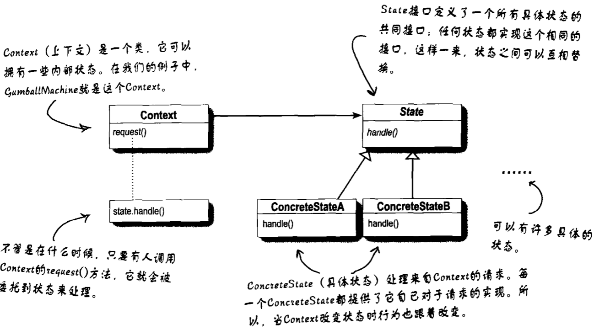
类图与策略模式一样，区别在于意图。
### 6.11.1. 需求
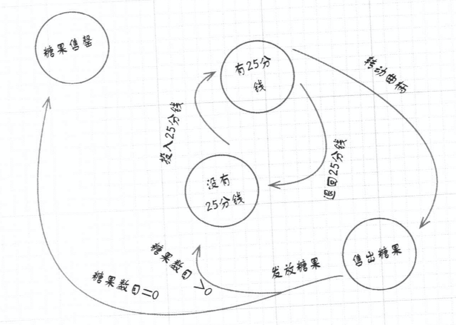
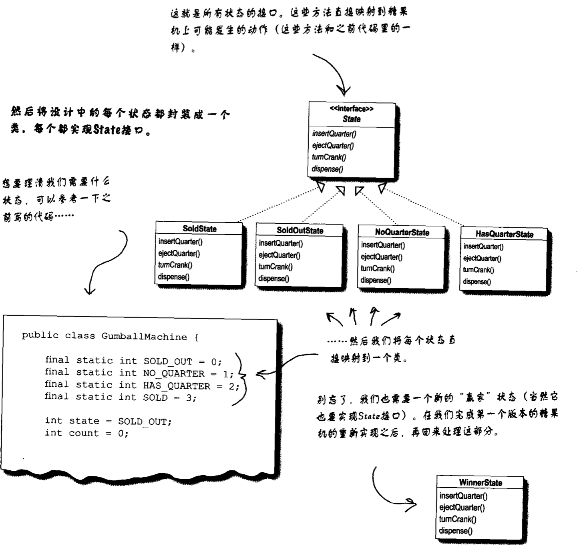

```java
public class NoQuarterState implements State{
    GumballMachine gumballMachine;
    public NoQuarterState(GumballMachine gumballMachine){
        this.gumballMachine = gumballMachine;
    }
    public void insertQuarter(){
        System.out.println("you inserted a quarter");
        gumballMachine.setState(gumballMachine.getHasQuarterState());
    }
    public void ejectQuarter(){
        System.out.println("you havent inserted a quarter");
    }
    public void turnCrank(){
        System.out.println("you turned, but there is no quarter");
    }
    public void dispense(){
        System.out.println("you need to pay first");
    }
}
public class GumballMachine{
    State soldOutState;
    State noQuarterState;
    State hasQuarterState;
    State soldState;
    State state = soldOutState; // 初始化
    int count = 0;
    public GumballMachine(int numberGumballs){
        soldOutState = new SoldOutState(this);
        noQuarterState = new noQuarterState(this);
        hasQuarterState = new hasQuarterState(this);
        soldState = new soldState(this);
        this.count = numberGumballs;
        if(numberGumballs>0){
            state = noQuarterState;
        }
    }
    public void insertQuarter(){
        state.insertQuarter();
    }
    public void ejectQuarter(){
        state.ejectQuarter();
    }
    public void turnCrank(){
        state.turnCrank();
        state.dispense();
    }
    public void setState(State state){
        this.state = state;
    }
    public releaseBall(){
        if(count!=0){
            count-=1;
        }
    }
    //... 其他getter 各个状态
}
....
```

### 6.11.2. 要点
- 状态模式允许一个对象基于内部状态而拥有不同的行为
- 和程序状态机不同，状态模式用类代表状态
- Context会将行为委托给当前状态对象
- 通过将每个状态封装进一个类，我们把以后需要做的任何改变局部化了
- 状态模式和策略模式有相同的类图，但是它们的意图不同
- 策略模式通常会用行为或算法来配置Context类
- 状态模式允许Conttext随着状态的改变而改变的行为
- 状态转换可以由State类或Context类控制
- 使用状态模式通常会导致设计中累的数目大量增加
- 状态类可以被多个Context实例共享

## 6.12. 代理模式
为另一个对象提供一个替身或占位符以控制对这个对象的访问

使用代理模式创建代表对象，让代表对象控制某对象的访问，被代理的对象可以是远程的对象、创建开销大的对象或需要安全控制的对象
### 6.12.1. 需求
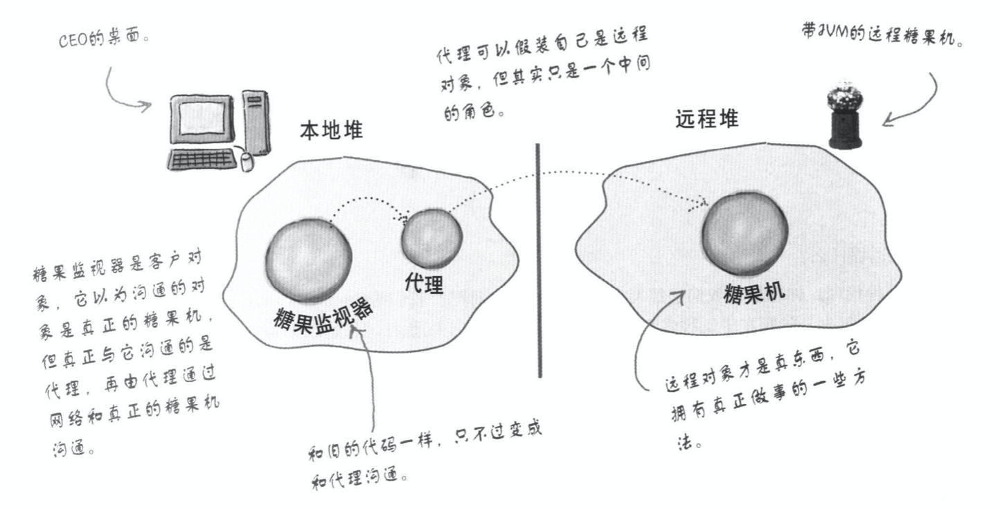

### 6.12.2. 远程方法
需要客户辅助对象和服务辅助对象。客户调用客户辅助对象上的方法，仿佛客户辅助对象就是真正的服务。客户辅助对象再负责为我们转发这些请求。客户辅助对象会联系服务器，传送方法调用信息，然后等待服务器的返回。

在服务器端，服务辅助对象从客户辅助对象中接收请求，将调用的信息解包，然后调用真正服务对象上的真正方法。
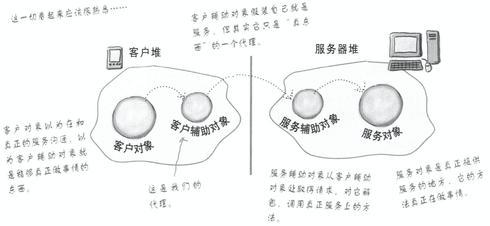

方法调用如何发生：
- 客户对象调用客户辅助对象的doBigThing()方法
- 客户辅助对象打包调用信息（变量、方法名称等），然后通过网络将它运给服务辅助对象
- 服务辅助对象把来自客户辅助对象的信息解包，找出被调用的方法（以及在哪个对象内），然后调用真正的服务对象上的真正方法。
- 服务对象上的方法被调用，将结果返回给服务辅助对象
- 服务辅助对象把调用的返回信息打包，然后通过网络运回给客户辅助对象
- 客户辅助对象把返回值解包，返回给客户对象。对于客户来说，这是完全透明的。

### 6.12.3. java RMI
RMI提供了客户辅助对象和服务辅助对象，为客户辅助对象创建和服务对象相同的方法。RMI的好处在于你不必亲自写任何网络和I/O代码。

RMI称呼：RMI将客户辅助对象成为stub（桩），服务辅助对象成为skeleton（骨架）。

### 6.12.4. 制作远程服务
- 制作远程接口
  - 远程接口定义出可以让客户远程调用的方法。客户将用它作为服务的类类型。Stub和实际的服务都实现此接口。
- 制作远程的实现
  - 这是做实际工作的类，为远程接口中定义的远程方法提供了真正的实现。这就是客户真正想要调用方法的对象（例如，我们的GumballMachine）。
- 利用rmic产生的stub和skeleton
  - 这就是客户和服务的辅助类。你不需自己创建这些类，甚至连生成它们的代码都不用看，因为当你运行rmic工具时，这都会自动处理。你可以在JDK中找到rmic
- 启动RMI registry（rmiregistry）
  - rmireistry就像是电话簿，客户可以从中查到代理的位置（也就是客户的stub helper对象）
- 开始远程服务
  - 你必须让服务对象开始运行。你的服务实现类会去实例化一个服务的实例，并将这个服务注册到RMI registry。注册之后，这个服务就可以供客户调用了。

#### 6.12.4.1. 制作远程接口
```java
import java.rmi.*;
public interface MyRemote extends Remote{
    public String sayHello() throws RemoteException; // 返回值将从服务器经过网络给客户，所以必须是Serializable的
}
```

#### 6.12.4.2. 制作远程实现
```java
// 服务器上的代码
// 为了成为远程服务对象，必须具备远程的功能，继承java.rmi.server.UnicastRemoteObject可以帮你完成这个工作
public class MyRemoteImpl extends UnicastRemoteObject implements MyRemote{
    public MyRemoteImpl() throws RemoteException{} //因为超类UnicastRemoteObject的构造器会抛出气场，唯一的解决方法就是声明一个构造器也抛出异常
    public String sayHello(){
        return "Server says, 'Hey'";
    }
}
// 实例化服务，放进RMI registry中，当注册这个实现对象时，RMI系统其实注册的是stub，因为这是客户真正需要的。注册服务器试用java.rmi.Naming类的静态rebind()方法
public static void main(Stirng[] args){
    try{
        MyRemote service = new MyRemoteImpl();
        Naming.rebind("RemoteHello", service);// 为服务在注册表中命名
    }catch(Exception ex){...}
}
```

#### 6.12.4.3. 产生stub和skeleton
在终端输入`rmic MyRemoteImpl`，会生成MyRemoteImpl_Stub.class和MyRemoteImpl_Skel.class

#### 6.12.4.4. 执行remiregistry
在中断启动rmiregistry

#### 6.12.4.5. 启动服务
`java MyRemoteImpl`从远处实现类中的main方法启动

#### 6.12.4.6. 客户取得stub对象
`MyRemote service = (MyRemote) Naming.lookup("rmi://127.0.0.1/RemoteHello");`

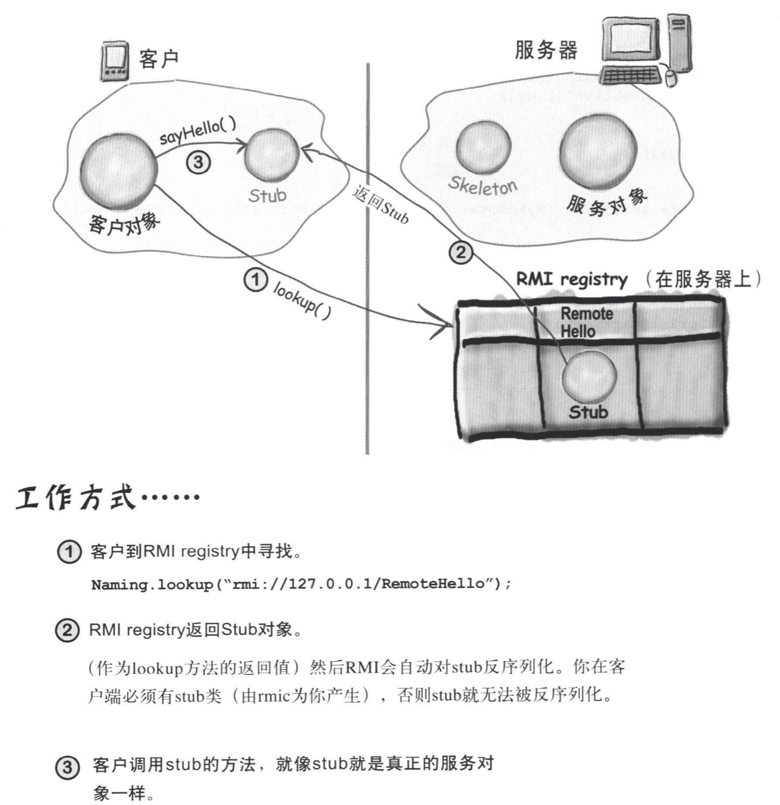

#### 6.12.4.7. 客户代码
```java
import java.rmi.*;
public class MyRemoteClient{
    public static void main(String[] args){
        new MyRemoteClient().go();
    }
    public void go(){
        try{
            MyRemote service = (MyRemote) Naming.lookup("rmi://127.0.0.1/RemoteHello");
            String s = service.sayHello();
            System.out.println(s);
        }catch(Exception e){
            e.printStackTrace();
        }
    }
}
```

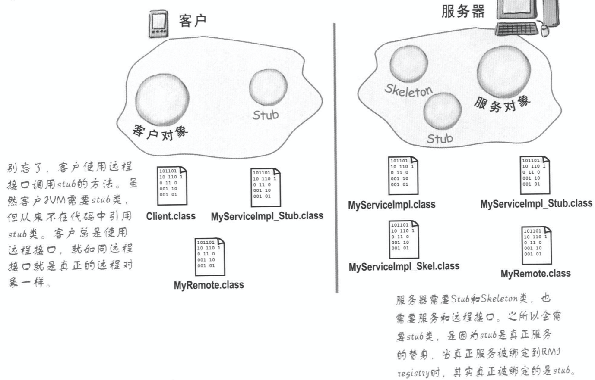

### 6.12.5. 远程糖果机
#### 6.12.5.1. 服务端
```java
import java.rmi.*;
public interface GumballMachineRemote extends Remote{
    public int getCount() throws RemoteException;
    public String getLocation() throws RemoteException;
    public State getState() throws RemoteException; // 原State接口要继承Serializable编程可序列化的
}
public class NoQuarterState implements State{
    transient GumballMachine gumballMachine; // 表示不需要序列化这个部分，不希望糖果机也被序列化，并随着State一起传送出去
}
public class GumballMachine extends UnicastRemoteObject implements GumballMachineRemote{
    // 实例变量声明
    public GumballMachine(Sgring location, int numberGumballs) throws RemoteException{
        //代码
    }
    public int getCount(){
        return count;
    }
    public State getState(){
        return state;
    }
    public String getLocation(){
        return location;
    }
    ...
}

public class GumballMonitorTestDrive{
    public static void main(String[] args){
        GumballMachineRemote gumballMachine = null;
        int count;
        if(args.length<2){
            System.out.println("GumballMachine <name> <inventory>");
            System.exit(1);
        }

        try{
            count = Integer.parseInt(args[1]);
            gumballMachine = new GumballMachine(args[0], count);
            Naming.rebind("//"+args[0]+"/gumballmachine",gumballMachine);
        }catch(Exception e){
            e.printStackTrace();
        }
    }
}
// 终端输入 rmiregistry
// 终端输入 java GumballMachineTestDrive seattle.mightygumball.com 100
```

#### 6.12.5.2. 客户端
```java
import java.rmi.*;
public class GumballMonitor{
    GumballMachineRemote machine;
    public GumballMonitor(GumballMachineRemote machine){
        this.machine = machine;
    }
    public void report(){
        try{
            System.out.println(machine.getLocation());
            System.out.println(machine.getCount());
            System.out.println(machine.getState());
        }catch(RemoteException e){
            e.printStackTrace();
        }
    }
}

public class GumballMonitorTestDrive{
    public static void main(String[] args){
        String[] location = {"rmi://santafr.mightygumball.com/gumballmachine",
        "rmi://boulder.mightygumball.com/gumballmachine",
        "rmi://seattle.mightygumball.com/gumballmachine"};
        GumballMonitor[] monitor = new GumballMonitor[location.length];
        for(int i=0;i<location.length;i++){
            try{
                GumballMachineRemote machine = (GumballMachineRemote) Naming.lookup(location[i]);
                monitor[i] = new GumballMonitor(machine);
                System.out.println(monitor[i]);
            }catch(Exception e){
                e.printStackTrace();
            }
        }
        for(int i=0;i<monitor.length;i++){
            monitor[i].report();
        }
    }
}
```

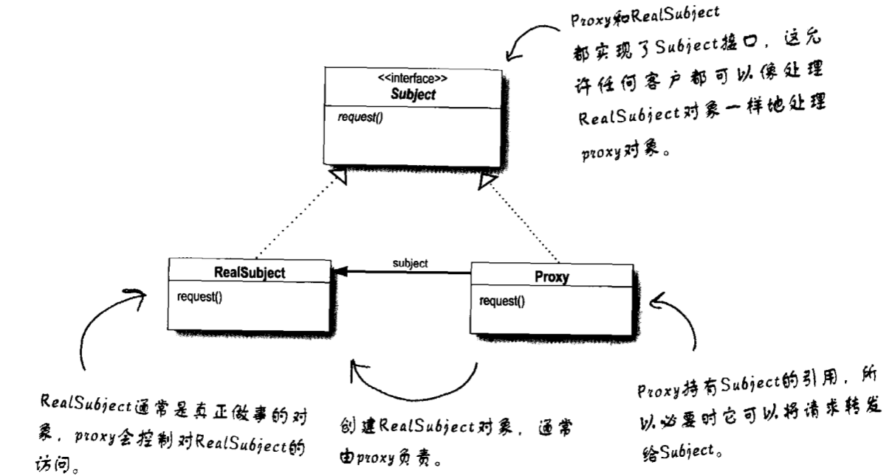

### 6.12.6. 虚拟代理
虚拟代理作为创建开销大的对象的代表。虚拟代理经常直到我们真正需要一个对象的时候才创建它。当对象在创建前和创建中时，由虚拟代理来扮演对象的替身。对象创建后，代理就会将请求直接委托给对象。

#### 6.12.6.1. 需求
下载可能需要一些时间，所以在等待图片加载的时候，应该显示一些东西。利用虚拟代理，在加载的时候显示“加载中”，一旦加载完成，代理就把显示的职责委托给Icon。

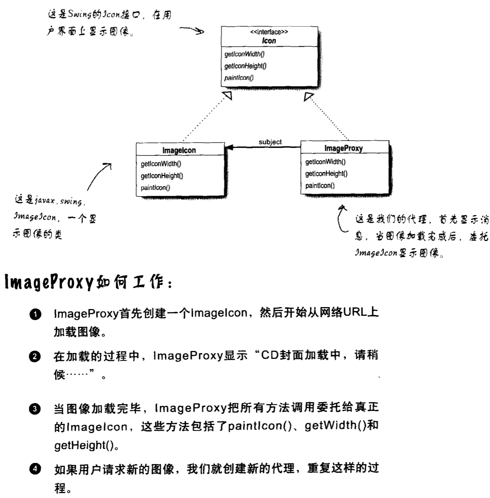

```java
class ImageProxy implements Icon{
    ImageIcon imageIcon;
    URL imageURL;
    Thread retrievalThread;
    boolean retrieving = false;

    public ImageProxy(URL url)(imageURL = url);

    public int getIconWidth(){
        if(imageIcon != null){
            return imageIcon.getIconWidth()
        }else{
            return 800;
        }
    }
    public int getIconHeight(){
        // 代码同width
    }
    public void paintIcon(final Component c, Graphics g, int x, int y){
        if(imageIcon != null){
            imageIcon.paintIcon(c, g, x, y);
        }else{
            g.drawString("loading cd cover, please wait ...", x+300, y+190);
            if(!retrieving){ // 判断是否已经在取出图片
                retrieving = true;
                retrievalThread = new Thread(new Runnable(){
                    public void run(){
                        try{
                            imageIcon = new ImageIcon(imageURL, "CD Cover");
                            c.repaint();
                        }catch(Exception e){
                            e.printStackTrace();
                        }
                    }
                });
                retrievalThread.start();
            }
        }
    }
}
```

### 6.12.7. 保护代理：使用动态代理
利用java.lang.reflect包中自己的代理支持，在运行时动态地创建一个代理类。

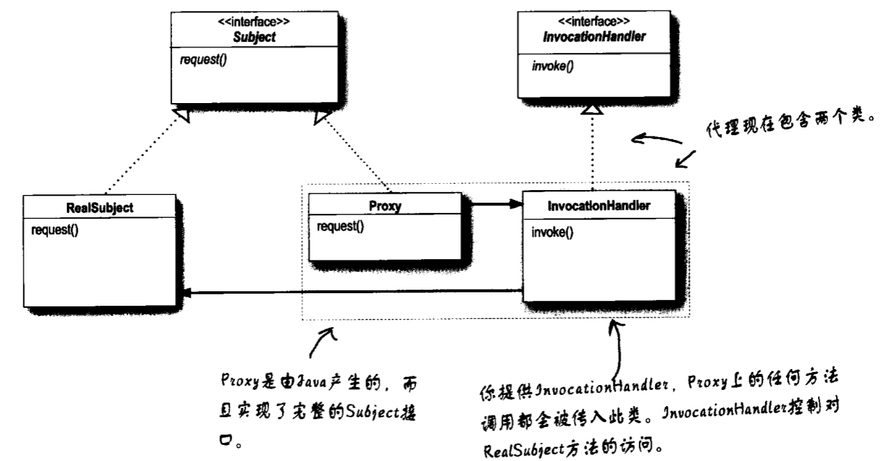

因为Proxy类是java创建的，我们不能够再将代码放入Proxy类中，我们需要实现一个InvocationHandler类，可以把它想成是代理收到方法调用后，请求做实际工作的对象。

```java
public interface PersonBean{
    String getName();
    String getGender();
    String getInterests();
    int getHotOrNotRating();

    void setName(String name);
    void setGender(String gender);
    void setInterests(String interests);
    void setHotOrNotRating(int rating);
}
public class PersonBeanImpl implements PersonBean{
    ...;
}
```

然而其中的设置等方法是用户不能随便改变的。因此需要创建两个代理，一个访问你自己的PersonBean对象，另一个访问别人的PersonBean对象。此时必须使用java API的动态代理。

#### 6.12.7.1. 步骤一：创建两个InvocationHandler
一个给拥有者使用，另一个给非拥有者使用。
```java
import java.lang.reflect.*; //InvocationHandler是reflect包中的一部分

public class OwnerInvocationHandler implements InvocationHandler{
    PersonBean person;
    public OwnerInvocationHandler(PersonBean person){
        this.person = person;
    }
    public Object invoke(Object proxy, Method method, Object[] args) throws IllegalAccessException{
        try{
            if(method.getName().startsWith("get")){
                return method.invoke(person, args); // 如果是getter方法，我们就调用person内的方法
            }else if(method.getName().equals("setHotOrNotRating")){
                throw new IllegalAccessException();
            }else if(method.getName().startWith("set")){
                return method.invoke(person, args); // 因为我们是拥有者，所以也是可以调用setter方法的
            }catch(InvocationTargetException e){
                e.printStackTrace();
            }
            return null;
        }
    }
}
```

#### 6.12.7.2. 步骤二：创建Proxy类并实例化Proxy对象
```java
PersonBean getOwnerProxy(PersonBean person){
    return (PersonBean) Proxy.newProxyInstance(person.getClass().getClassLoader(),person.getClass().getInterfaces(),new OwnerInvocationHandler(person)); // Proxy类的静态函数创建代理
}
```

#### 6.12.7.3. 步骤三：配对服务
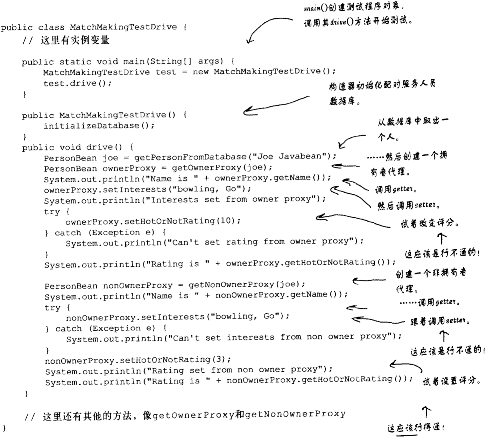

### 6.12.8. 要点
- 代理模式为另一个对象提供代表，以便控制客户对象的访问，管理访问的方式有许多种
- 远程代理管理客户和远程对象之间的交互
- 虚拟代理控制访问实例化开销大的对象
- 保护代理基于调用者控制对象方法的访问
- 代理模式有许多变体，例如：缓存代理、同步代理、防火墙代理和写入时复制代理。
- 代理在结构上类似装饰者，但是目的不同
- 装饰者模式为对象加上行为，而代理则是控制访问
- java内置的代理支持，可以根据需要建立动态代理，并将所有调用分配到所选的处理器
- 就和其他的包装者一样，代理会造成你的设计中类的数目增加

## 6.13. 模式的模式
对于这些在设计中携手合作征服许多问题的模式，我们称之为复合模式。

我们将某些模式结合使用，并不代表这些模式就够资格成为符合模式。MVC是一个真正的复合模式。

```java
public interface Quackable{
    public void quack();
}
public class MallardDuck implements Quackable{
    public void quack(){
        System.out.println("quack");
    }
}
public class RedheadDuck implements Quackable{
    public void quack(){
        System.out.println("quack");
    }
}
public class DuckCall implements Quackable{
    public void quack(){
        System.out.println("kwak");
    }
}

// 适配器
public class Goose{
    public void honk(){
        System.out.println("Honk");
    }
}
public class GooseAdapter implements Quackable{
    Goose goose;
    public GooseAdapter(Goose goose){
        this.goose = goose;
    }
    public void quack(){
        goose.honk();
    }
}
// 装饰器 统计叫声次数
public class QuackCounter implements Quackable{
    Quackable duck;
    static int numberOfQuacks;
    public QuackCounter(Quackable duck){
        this.duck = duck;
    }
    public void quack(){
        duck.quack();
        numberOfQuacks++;
    }
    public static int getQuacks(){
        return numberOfQuacks;
    }
}

public class DuckSimulator{
    public static void main(String[] args){
        DuckSimulator simulator = new DuckSimulator();
        simulator.simulate();
    }
    void simulate(){
        Quackable mallardDuck = new QuackCounter(new MallardDuck());
        Quackable redheadDuck = QuackCounter(new RedheadDuck());
        Quackable duckCall = QuackCounter(new DuckCall());
        Quackable gooseDuck = new GooseAdapter(new Goose());
        simulate(mallardDuck);
        simulate(redheadDuck);
        simulate(duckCall);
        simulate(gooseDuck);
        System.out.println(QuackCounter.getQuacks());
    }
    void simulate(Quackable duck){
        duck.quack();
    }
}
```

```java
// 工厂生产鸭子
public abstract class AbstractDuckFactory{
    public abstract Quackable createMallardDuck();
    public abstract Quackable createRedheadDuck();
    public abstract Quackable createDuckCall();
    public abstract Quackable createRubberDuck();
}
public class DuckFactory extends AbstractDuckFactory{
    public Quackable createMallardDuck(){
        return new MallardDuck();
    }
    ...
}
public class CountingDuckFactory extends AbstractDuckFactory{
    public Quackable createMallardDuck{
        return new QuackCounter(new MallardDuck());
    }
    ...
}
public class DuckSimulator{
    public static void main(String[] args){
        DuckSimulator simulator = new DuckSimulator();
        AbstractDuckFactory duckFactory = new CountingDuckFactory();
        simulator.simulate(duckFactory);
    }
    void simulate(AbstractDuckFactory duckFactory){
        Quackable mallardDuck = duckFactory.createMallardDuck();
        Quackable redheadDuck = duckFactory.createRedheadDuck();
        Quackable duckCall = duckFactory.createDuckCall();
        Quackable gooseDuck = new GooseAdapter(new Goose());
        simulate(mallardDuck);
        simulate(redheadDuck);
        simulate(duckCall);
        simulate(gooseDuck);
        System.out.println(QuackCounter.getQuacks());
    }
    void simulate(Quackable duck){
        duck.quack();
    }
}
```

```java
// 组合模式，方便管理不需要一个一个实例化
public class Flock implements Quackable{
    ArrayList quackers = new ArrayList();
    public void add(Quackable quacker){
        quackers.add(quacker);
    }
    public void quack(){
        // 迭代器模式
        Iterator iterator = quackers.iterator();
        while(iterator.hasNext()){
            Quackable quacker = (Quackable)iterator.next();
            quacker.quack();
        }
    }
}
public class DuckSimulator{
    public static void main(String[] args){
        DuckSimulator simulator = new DuckSimulator();
        AbstractDuckFactory duckFactory = new CountingDuckFactory();
        simulator.simulate(duckFactory);
    }
    void simulate(AbstractDuckFactory duckFactory){
        Quackable mallardDuck = duckFactory.createMallardDuck();
        Quackable redheadDuck = duckFactory.createRedheadDuck();
        Quackable duckCall = duckFactory.createDuckCall();
        Quackable gooseDuck = new GooseAdapter(new Goose());
        
        Flock flockOfDucks = new Flock();
        flockOfDucks.add(mallardDuck);
        flockOfDucks.add(redheadDuck);
        flockOfDucks.add(duckCall);
        flockOfDucks.add(gooseDuck);

        simulate(flockOfDucks);
        System.out.println(QuackCounter.getQuacks());
    }
    void simulate(Quackable duck){
        duck.quack();
    }
}
```

```java
// 观察者模式
public interface QuackObservable{
    public void registerObserver(Observer observer);
    public void notifyObservers();
}
public interface Quackable extends QuackObservable{
    public void quack();
}
public class Observable implements QuackObservable{
    ArrayList observers = new ArrayList();
    QuackObservable duck;
    public Observable(QuackObservable duck){
        this.duck = duck;
    }
    public void registerObserver(Observer observer){
        observers.add(observer)
    }
    public void notifyObservers(){
        Iterator iterator = observers.iterator();
        while(iterator.hasNext()){
            Observer observer = (Observer)iterator.next();
            observer.update(duck);
        }
    }
}
public class MallardDuck implements Quackable{
    Observable observable;
    public MallardDuck(){
        observable = new Observable(this);
    }
    public void quack(){
        System.out.println("quack");
        notifyObservers();
    }
    public void registerObserver(Observer observer){
        observable.registerObserver(observer);
    }
    public void notifyObservers(){
        observable.notifyObservers();
    }
}
public class Flock implements Quackable{
    ArrayList quackers = new ArrayList();
    public void add(Quackable quacker){
        quackers.add(quacker);
    }
    public void quack(){
        // 迭代器模式
        Iterator iterator = quackers.iterator();
        while(iterator.hasNext()){
            Quackable quacker = (Quackable)iterator.next();
            quacker.quack();
        }
    }
    public void registerObserver(Observer observer){
        Iterator iterator = quackers.iterator();
        while(iterator.hasNext()){
            Quackable quacker = (Quackable)quacker.next();
            quacker.registerObserver(observer);
        }
    }
    public void notifyObservers(){} // 不需要实现，因为这里的需求是观察特定一直鸭子，而不是这个鸭子的群体
}
// Observer端
public interface Observer{
    public void update(QuackObservable duck);
}
public class Quackologist implements Observer{
    public void update(QuackObservable duck){
        System.out.println(duck);
    }
}

public class DuckSimulator{
    public static void main(String[] args){
        DuckSimulator simulator = new DuckSimulator();
        AbstractDuckFactory duckFactory = new CountingDuckFactory();
        simulator.simulate(duckFactory);
    }
    void simulate(AbstractDuckFactory duckFactory){
        Quackable mallardDuck = duckFactory.createMallardDuck();
        Quackable redheadDuck = duckFactory.createRedheadDuck();
        Quackable duckCall = duckFactory.createDuckCall();
        Quackable gooseDuck = new GooseAdapter(new Goose());
        
        Flock flockOfDucks = new Flock();
        flockOfDucks.add(mallardDuck);
        flockOfDucks.add(redheadDuck);
        flockOfDucks.add(duckCall);
        flockOfDucks.add(gooseDuck);

        // 观察者模式
        Quackologist quackologist = new Quackologist();
        flockOfDucks.registerObserver(quackologist);

        simulate(flockOfDucks);
        System.out.println(QuackCounter.getQuacks());
    }
    void simulate(Quackable duck){
        duck.quack();
    }
}
```

这些还不是复合模式，只是一群模式携手合作。所谓的符合模式是指一群模式被结合起来使用。
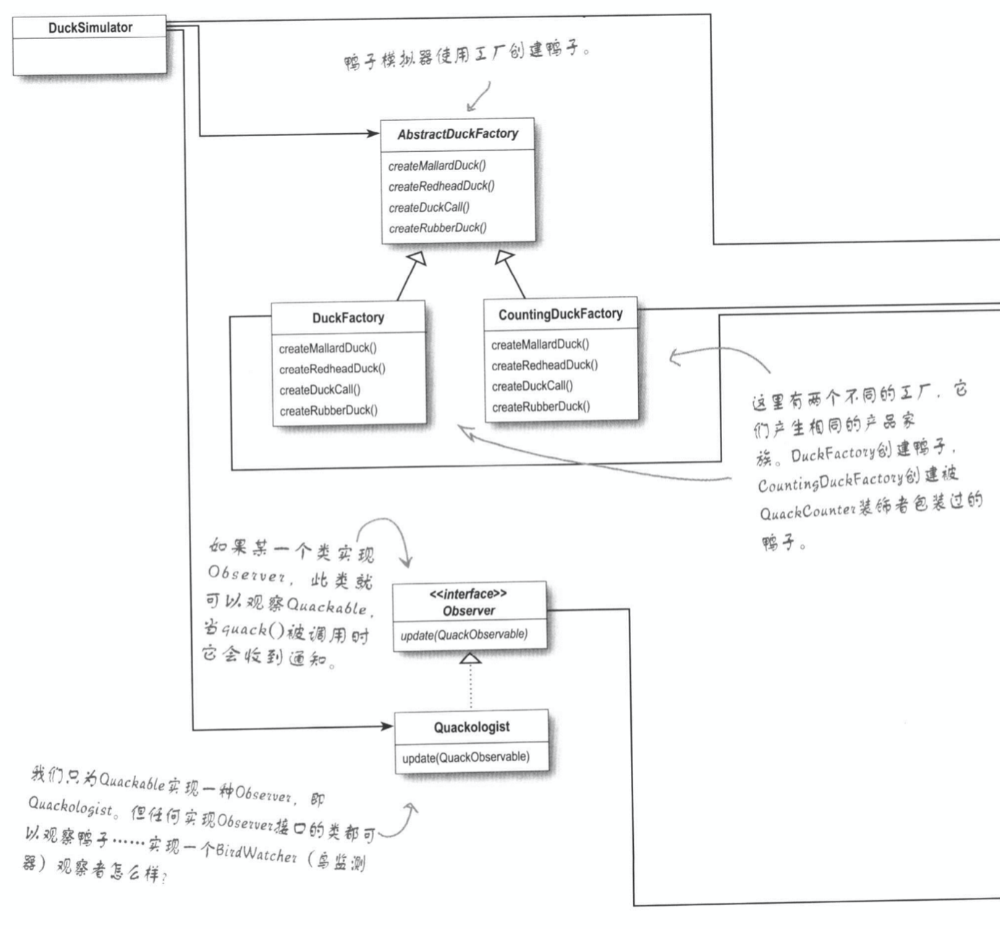
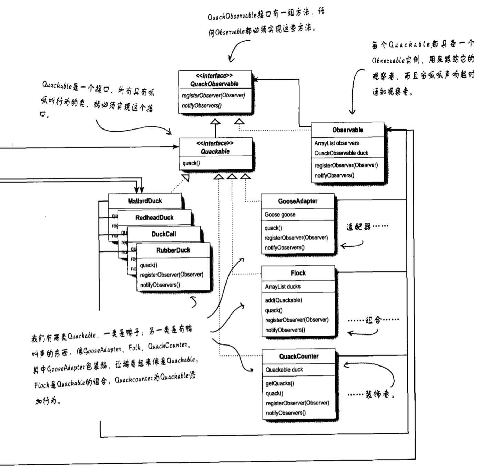

### 6.13.1. MVC
模型-视图-控制器
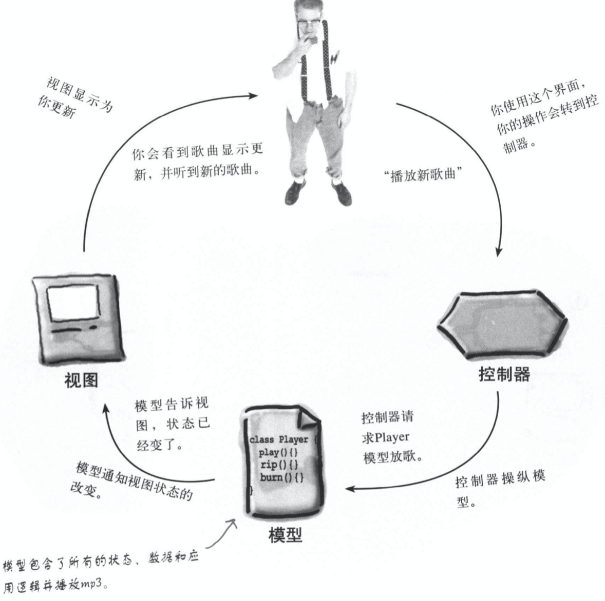
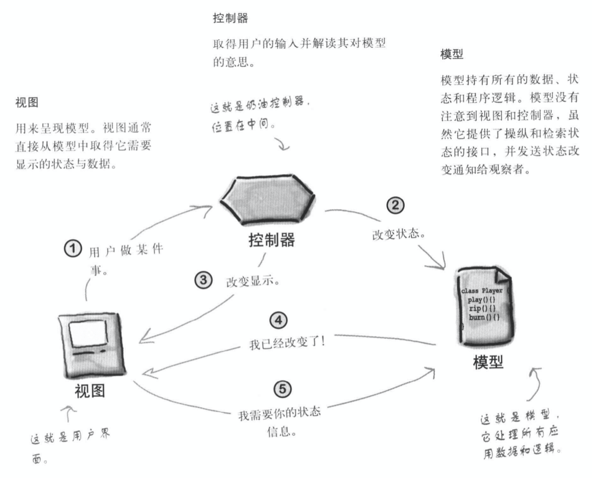

模型利用观察者模式让控制器和视图可以随最新的状态改变而更新。另一方面，视图和控制器则实现了策略模式。控制器是视图的行为，如果你希望有不同的行为，可以直接换一个控制器。

视图是一个对象，可以被调整使用不同的策略，而控制器提供策略。

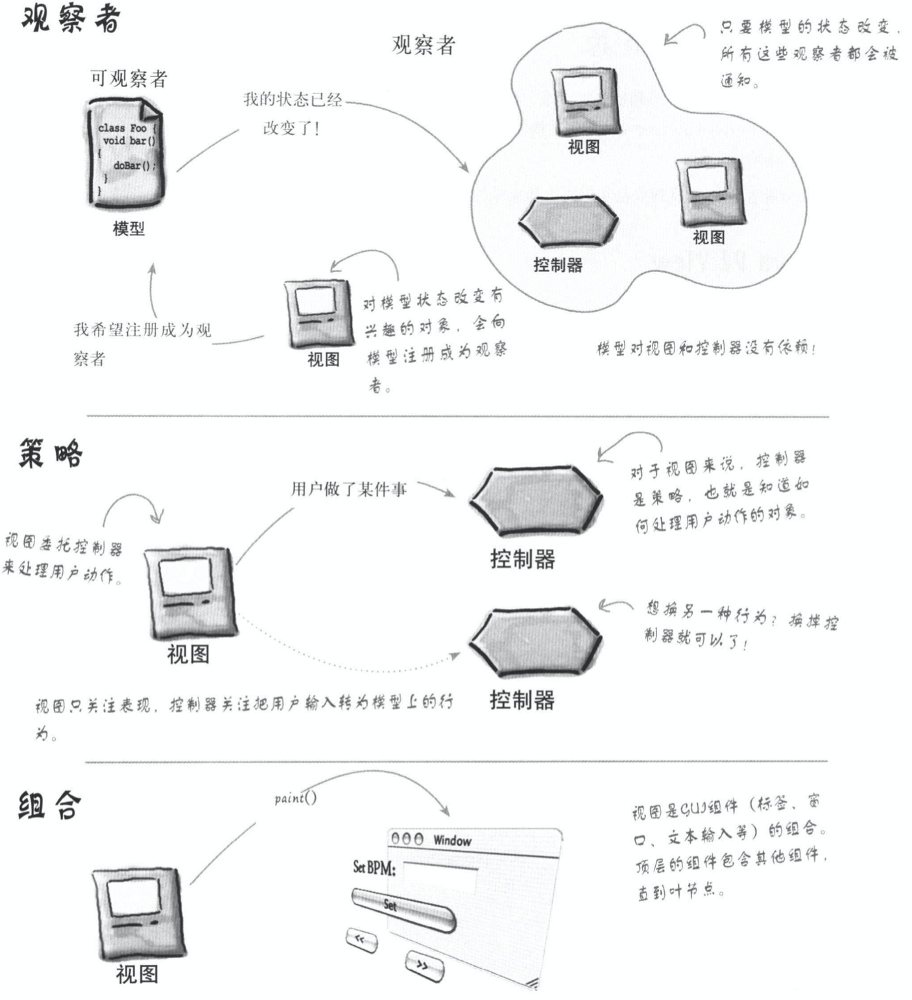

### 6.13.2. 要点
- MVC是复合模式，结合了观察者模式、策略模式和组合模式
- 模型使用观察者更新，同时保持两者之间的解耦
- 控制器是视图的策略，视图可以使用不同的控制器实现，得到不同的行为
- 视图使用组合模式实现用户界面，用户界面通常组合了嵌套的组件，像面板、框架和按钮
- 这些模式携手合作，把MVC模型的三层解耦，这样可以保持设计干净又有弹性
- 适配器模式用来将新的模型适配成已有的视图和控制器
- Model 2是MVC在Web上的应用
- Model 2中，控制器是线程Servlet，而JSP/HTML实现视图。

## 6.14. 真实世界的模式
模式是在某情境下，针对某问题的某种解决方案
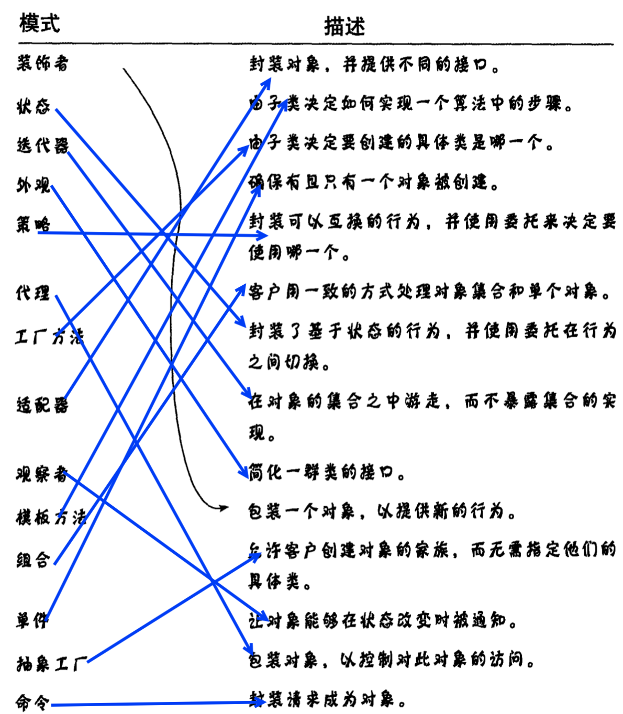

### 6.14.1. 模式分类
- 创建型
  - 单例模式
  - 抽象工厂
  - 工厂方法
- 行为型
  - 模板方法
  - 迭代器
  - 命令
  - 观察者模式
  - 状态
  - 策略模式
- 结构型
  - 代理
  - 组合模式
  - 适配器
  - 外观
  - 装饰者

- 类
  - 模板方法
  - 工厂方法
  - 适配器
- 对象
  - 单例模式
  - 抽象工厂
  - 迭代器
  - 命令
  - 观察者模式
  - 状态
  - 策略模式
  - 代理
  - 组合模式
  - 外观
  - 装饰者

### 6.14.2. 用模式思考
- 保持简单
- 设计模式非万灵丹
- 你知道何时需要模式
- 重构的时间就是模式的时间
- 拿掉你所不需要的，不要害怕将一个设计模式从你的设计中删除
- 如果你现在不需要，就别做
