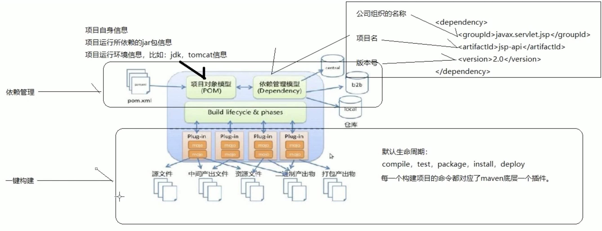

# 7. Maven
## 7.1. 简介
Maven是一个项目管理工具，它包含了一个项目对象模型（POM:Project Obect Model），一组标准集合，一个项目生命周期，一个依赖管理系统和用来运行定义在生命周期阶段中的插件目标的逻辑。

### 7.1.1. Maven能解决什么
- 我们需要引用各种jar包，尤其是比较大的工厂，以及jar包冲突
- 将代码即使编译
- 我们需要一个一个的做单元测试，maven可以将指定目录下一次性测试完毕
- 将项目打包，只需要一个命令

maven项目将jar包存放在jar包仓库中。通过jar包的坐标找到jar包仓库。

代码可重用

### 7.1.2. maven一键构建
`mvn tomcat:run` 一条命令即可

### 7.1.3. jar包仓库
先通过jar包的坐标去寻找本地仓库，如果联网，会去中央仓库寻找开源jar包。也可以开一个远程仓库（在同局域网内），到远程仓库去找。

localRepository 设置本地仓库

### 7.1.4. 标准目录结构
- 核心代码部分（打成jar包，如果修改需要重新打jar包很麻烦，所以需要配置文件，可以在不改代码的情况下改动功能）
- 配置文件部分
- 测试代码部分
- 测试配置文件

【传统项目】
- 项目名
  - src目录
  - config 或resources
无规范

【maven项目标准目录结构】
- src/main/java 核心代码部分
- src/main/resources 配置文件部分
- src/test/java 测试代码部分
- src/test/resources 测试配置部分
- src/main/webapp 页面资源，js，css，图片等

## 7.2. Maven命令
- `mvn clean` 删除target目录
- `mvn compile` 生成target目录 编译src/main下面的代码
  - 将java编译成class
- `mvn test` 编译src/test 和 src/main下的代码
- `mvn package` 打包，同时编译src/test 和 src/main
- `mvn install` 同时编译src/test 和 src/main 打包，把包安装到本地仓库
- `mvn deploy` 发布

## 7.3. maven生命周期
- 清理生命周期
  - 清理
- 默认生命周期
  - 编译、测试、打包、安装、发布（后一个命令会自动执行前几个命令）
- 站点生命周期

## 7.4. Maven概念模型


## 7.5. Maven pom.xml
```xml
<build>
    <plugins>
        <plugin>
            <groupId></groupId>
            <artifactId>maven-jar-plugin</artifactId>
            <version>3.0.2</version>
        </plugin>
    </plugins>
</build>
```

静态资源过滤问题
```xml
<!--build中配置resources，来防止我们资源导出失败的问题-->
    <build>
        <resources>
            <resource>
                <directory>src/main/resources</directory>
                <includes>
                    <include>**/*.properties</include>
                    <include>**/*.xml</include>
                </includes>
                <filtering>true</filtering>
            </resource>
            <resource>
                <directory>src/main/java</directory>
                <includes>
                    <include>**/*.properties</include>
                    <include>**/*.xml</include>
                </includes>
                <filtering>true</filtering>
            </resource>
        </resources>
    </build>
```
