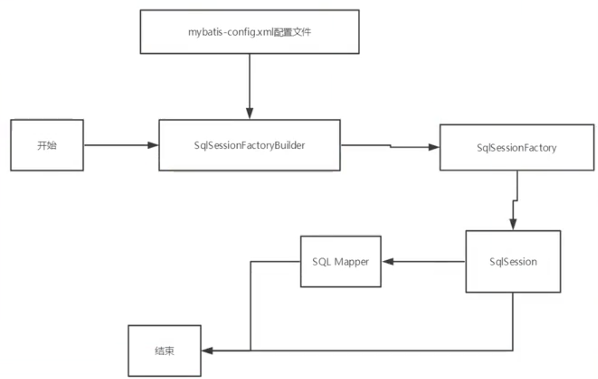
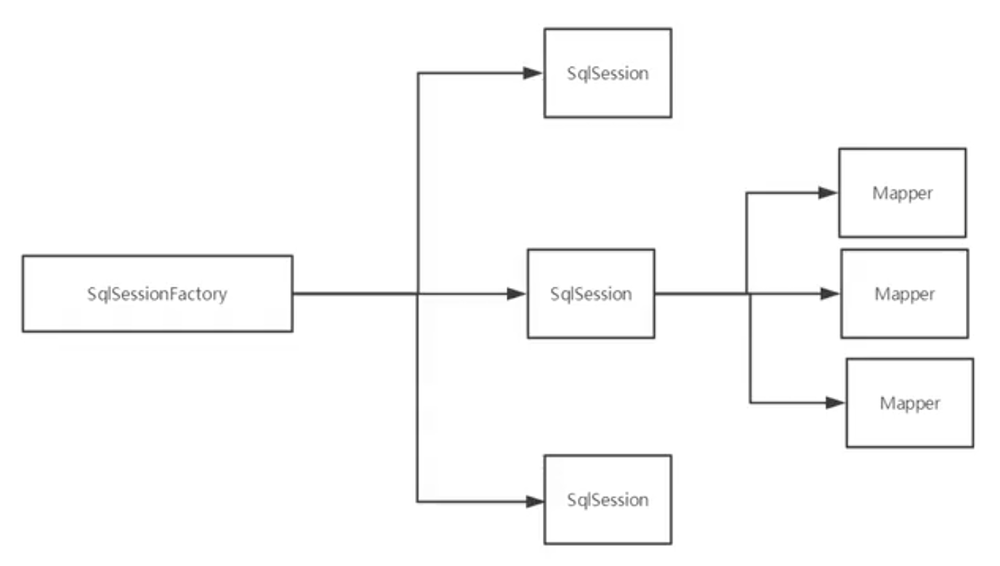
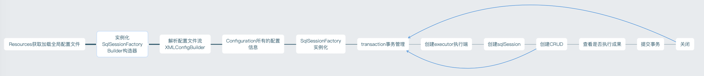
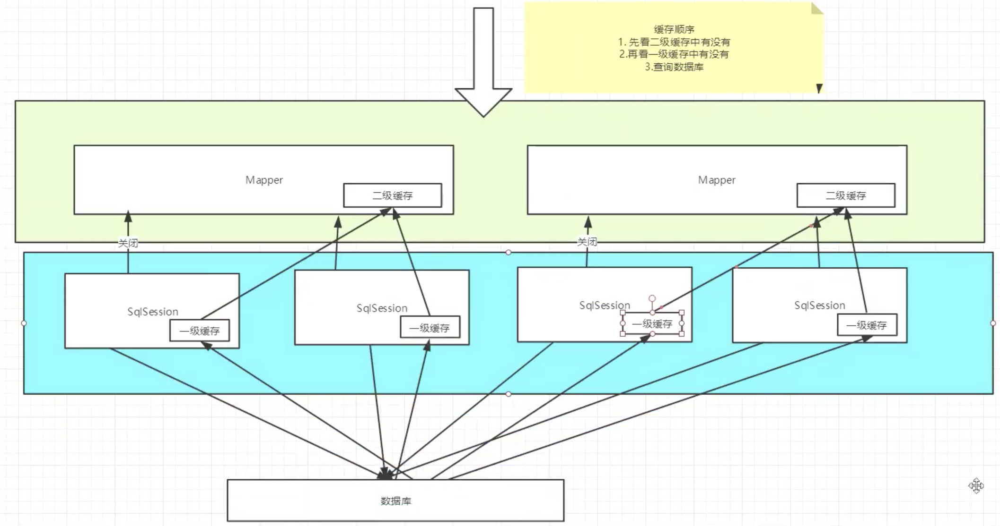

# 8. Mybatis
- 简化JDBC操作
- Mysql
- java基础
- Maven
- junit 单元测试

框架：配置文件。 [查看官方文档](https://mybatis.org/mybatis-3/index.html)

## 8.1. 简介
### 8.1.1. 什么是Mybatis
- 持久层框架
- 支持定制化SQL、存储过程以及高级映射
- 避免了所有的JDBC代码和手动设置参数以及获取结果集
- 可以使用简单的XML或注解来配置和映射原生类型、接口和java的pojo为数据库中的记录

### 8.1.2. 获得Mybatis
- maven仓库
  ```xml
    <!-- https://mvnrepository.com/artifact/org.mybatis/mybatis -->
    <dependency>
        <groupId>org.mybatis</groupId>
        <artifactId>mybatis</artifactId>
        <version>3.5.4</version>
    </dependency>
  ```
- github

### 8.1.3. 持久化
[数据持久化]
- 将程序的数据在持久状态和瞬时状态转化的过程。
- 数据库(jdbc)，io文件持久化

### 8.1.4. 持久层
Dao层、Servuce层、Controller层
- 完成持久化工作的代码块
- 界限十分明显

### 8.1.5. 为什么需要mybatis
- 帮助程序员将数据存入到数据库中
- 方便
- 传统的JDBC代码复杂。简化。框架。自动化。
- 不用Mybatis也可以。
- 优点：简单，灵活，解除sql与代码的耦合，提供映射标签，提供xml标签支持编写动态sql

## 8.2. 第一个程序
搭建环境->导入Mybatis->编程->测试

### 8.2.1. 搭建环境
#### 8.2.1.1. 搭建数据库
```sql
create database `mybatis`;

use `mybatis`;

create table `user`(
`id` int(20) not null PRIMARY key,
`name` varchar(30) default null,
`pwd` varchar(30) default null
)engine=innodb DEFAULT CHARSET=utf8;

insert into `user` (`id`,`name`,`pwd`) VALUES
(1,'张三','123456'),
(2,'李四','123456'),
(3,'王五','123456')
```

#### 8.2.1.2. 新建项目
- 创建maven项目
- 删除src（把他当做父工程）
- 导入maven依赖
    ```xml
    <?xml version="1.0" encoding="UTF-8"?>
    <project xmlns="http://maven.apache.org/POM/4.0.0"
            xmlns:xsi="http://www.w3.org/2001/XMLSchema-instance"
            xsi:schemaLocation="http://maven.apache.org/POM/4.0.0 http://maven.apache.org/xsd/maven-4.0.0.xsd">
        <modelVersion>4.0.0</modelVersion>
        <!--父工程-->
        <groupId>org.example</groupId>
        <artifactId>MybatisStudy</artifactId>
        <version>1.0-SNAPSHOT</version>
        <!--导入依赖-->
        <dependencies>
            <!--mysql驱动-->
            <!-- https://mvnrepository.com/artifact/mysql/mysql-connector-java -->
            <dependency>
                <groupId>mysql</groupId>
                <artifactId>mysql-connector-java</artifactId>
                <version>8.0.18</version>
            </dependency>
            <!--mybatis-->
            <!-- https://mvnrepository.com/artifact/org.mybatis/mybatis -->
            <dependency>
                <groupId>org.mybatis</groupId>
                <artifactId>mybatis</artifactId>
                <version>3.5.2</version>
            </dependency>
            <!--junit-->
            <!-- https://mvnrepository.com/artifact/junit/junit -->
            <dependency>
                <groupId>junit</groupId>
                <artifactId>junit</artifactId>
                <version>4.12</version>
                <scope>test</scope>
            </dependency>

        </dependencies>

    </project>
    ```

### 8.2.2. 创建一个模块
#### 8.2.2.1. 第一步：核心配置文件
```xml
<?xml version="1.0" encoding="UTF-8" ?>
<!DOCTYPE configuration
        PUBLIC "-//mybatis.org//DTD Config 3.0//EN"
        "http://mybatis.org/dtd/mybatis-3-config.dtd">
<!-- 核心配置文件 -->
<configuration>
    <environments default="development">
        <environment id="development">
            <transactionManager type="JDBC"/>
            <dataSource type="POOLED">
                <property name="driver" value="com.mysql.cj.jdbc.Driver"/>
                <property name="url" value="jdbc:mysql://localhost:3306/mybatis?useSSL=true&amp;useUnicode=true&amp;characterEncoding=UTF-8"/>
                <property name="username" value="root"/>
                <property name="password" value="12345678"/>
            </dataSource>
        </environment>
    </environments>
    <!-- 每一个mapper.xml都需要在mybatis核心配置文件中注册! -->
    <mappers>
        <mapper resource="com/wyj/dao/UserMapper.xml" />
    </mappers>
</configuration>
```

#### 8.2.2.2. 第二步：编写mybatis工具类
```java
package com.wyj.utils;

import org.apache.ibatis.io.Resources;
import org.apache.ibatis.session.SqlSession;
import org.apache.ibatis.session.SqlSessionFactory;
import org.apache.ibatis.session.SqlSessionFactoryBuilder;

import java.io.InputStream;

// SqlSessionFactory --> sqlSession
public class MybatisUtils {
    private static SqlSessionFactory sqlSessionFactory;
    static{
        try {
            // 使用mybatis第一步：获取sqlSessionFactory对象
            String resource = "mybatis-config.xml";
            InputStream inputStream = Resources.getResourceAsStream(resource);
            sqlSessionFactory = new SqlSessionFactoryBuilder().build(inputStream);
        }catch(Exception e){
            e.printStackTrace();
        }
    }

    // 既然有了 SqlSessionFactory，顾名思义，我们可以从中获得 SqlSession 的实例。
    // SqlSession 提供了在数据库执行 SQL 命令所需的所有方法。
    // 你可以通过 SqlSession 实例来直接执行已映射的 SQL 语句。
    public static SqlSession getSqlSession(){
        return sqlSessionFactory.openSession();
    }

}
```

### 8.2.3. 编写代码
#### 8.2.3.1. 第三步：：主体类pojo
#### 8.2.3.2. 第四步：Dao接口
  ```java
  package com.wyj.dao;
  import com.wyj.pojo.User;
  import java.util.List;

  public interface UserDao {
      List<User> getUserList();
  }
  ```
#### 8.2.3.3. 第五步：接口实现类 由原来的impl转换为一个mapper配置文件
  ```xml
  <?xml version="1.0" encoding="UTF-8" ?>
  <!DOCTYPE mapper
          PUBLIC "-//mybatis.org//DTD Mapper 3.0//EN"
          "http://mybatis.org/dtd/mybatis-3-mapper.dtd">
  <!--namespace=绑定一个对应的Dao(mapper)接口-->
  <mapper namespace="com.wyj.dao.UserDao">
      <!--select查询语句-->
      <select id="getUserList" resultType="com.wyj.pojo.User">  <!--方法名，返回值的类型路径-->
          select * from mybatis.user
      </select>
  </mapper>
  ```

#### 8.2.3.4. 第六步： 测试
注意点：
org.apache.ibatis.binding.BindingException: Type interface com.wyj.dao.UserDao is not known to the MapperRegistry.
核心配置文件中注册mappers

MapperRegistry

```java
package com.wyj.dao;

import com.wyj.pojo.User;
import com.wyj.utils.MybatisUtils;
import org.apache.ibatis.session.SqlSession;
import org.junit.Test;

import java.util.List;

public class UserDaoTest {
    @Test
    public void test(){
        // 第一步：获得sqlSession对象
        SqlSession sqlSession = MybatisUtils.getSqlSession();

        // 方式一：getMapper
        UserDao userDao = sqlSession.getMapper(UserDao.class);
        List<User> userList = userDao.getUserList();

        // 方式二： 不推荐
        //List<User> userList = sqlSession.selectList("com.wyj.dao.UserDao.getUserList");

        for(User user : userList){
            System.out.println(user);
        }
        sqlSession.close();
    }
}

```

#### 8.2.3.5. SqlSessionFactoryBuilder
这个类可以被实例化、使用和丢弃，一旦创建了 SqlSessionFactory，就不再需要它了。 因此 SqlSessionFactoryBuilder 实例的最佳作用域是方法作用域（也就是局部方法变量）。 你可以重用 SqlSessionFactoryBuilder 来创建多个 SqlSessionFactory 实例，但最好还是不要一直保留着它，以保证所有的 XML 解析资源可以被释放给更重要的事情。

#### 8.2.3.6. SqlSessionFactory
SqlSessionFactory 一旦被创建就应该在应用的运行期间一直存在，没有任何理由丢弃它或重新创建另一个实例。 使用 SqlSessionFactory 的最佳实践是在应用运行期间不要重复创建多次，多次重建 SqlSessionFactory 被视为一种代码“坏习惯”。因此 SqlSessionFactory 的最佳作用域是应用作用域。 有很多方法可以做到，最简单的就是使用单例模式或者静态单例模式。

#### 8.2.3.7. SqlSession
每个线程都应该有它自己的 SqlSession 实例。SqlSession 的实例不是线程安全的，因此是不能被共享的，所以它的最佳的作用域是请求或方法作用域。 绝对不能将 SqlSession 实例的引用放在一个类的静态域，甚至一个类的实例变量也不行。 也绝不能将 SqlSession 实例的引用放在任何类型的托管作用域中，比如 Servlet 框架中的 HttpSession。 如果你现在正在使用一种 Web 框架，考虑将 SqlSession 放在一个和 HTTP 请求相似的作用域中。 换句话说，每次收到 HTTP 请求，就可以打开一个 SqlSession，返回一个响应后，就关闭它。 这个关闭操作很重要，为了确保每次都能执行关闭操作，你应该把这个关闭操作放到 finally 块中。 下面的示例就是一个确保 SqlSession 关闭的标准模式：


## 8.3. CRUD
事务默认开启，增删改查需要commit！ 与JDBC不同。

配置事务的自动提交在MyBatisUtils工具类中
```java
public static SqlSession getSqlSession(){
    return sqlSessionFactory.openSession(true);
}
```

### 8.3.1. namespace
namespace中的包名要和Dao/Mapper包名一致

### 8.3.2. select
```xml
    <select id="getUserList" resultType="com.wyj.pojo.User"> <!--方法名，返回值的类型路径-->
        select * from user
    </select>
    <select id="getUserById" parameterType="int" resultType="com.wyj.pojo.User">
        select * from user where id=#{id}
    </select>
```

- id:就是对应的namespace中的方法名
- resultType:sql语句的返回值
- ParameterType：参数的类型

### 8.3.3. insert
```java
int addUser(User user);
```
```xml
    <insert id="addUser" parameterType="com.wyj.pojo.User">
        insert into user (id, name, pwd) values (#{id},#{name},#{pwd})
    </insert>
```
```java
 @Test
public void addUser(){
    SqlSession sqlSession = MybatisUtils.getSqlSession();
    UserDao userDao = sqlSession.getMapper(UserDao.class);
    int res = userDao.addUser(new User(4,"哈哈","123456"));
    sqlSession.commit();  //增删改查需要commit
    if(res>0){
        System.out.println("插入成功");
    }
    sqlSession.close();
}
```
### 8.3.4. update
```java
int updateUser(User user);
```
```xml
<update id="updateUser" parameterType="com.wyj.pojo.User">
    update user set name=#{name},pwd=#{pwd} where id=#{id}
</update>
```
```java
@Test
public void updateUser(){
    SqlSession sqlSession = MybatisUtils.getSqlSession();
    UserDao userDao = sqlSession.getMapper(UserDao.class);
    userDao.updateUser(new User(4,"呵呵","123456"));
    sqlSession.commit();
    sqlSession.close();
}
```
### 8.3.5. delete
```java
int deleteUser(User user);
```
```xml
<delete id="deleteUser" parameterType="com.wyj.pojo.User">
    delete from user where name=#{name} and pwd=#{pwd} and id=#{id}
</delete>
```
```java
@Test
public void deleteUser(){
    SqlSession sqlSession = MybatisUtils.getSqlSession();
    UserDao userDao = sqlSession.getMapper(UserDao.class);
    userDao.deleteUser(new User(4,"呵呵","123456"));
    sqlSession.commit();
    sqlSession.close();
}
```

### 8.3.6. 使用map
多个参数的情况下用Map或者注解。也可以直接用对象的属性。

如果一个参数可以不写！

不需要对应数据库中的名字了。名字可以自己定。
```java
int addUser2(Map<String, Object> map);
```
```xml
<insert id="addUser2" parameterType="map">
    insert into user(id,name,pwd) values (#{userId},#{userName},#{password})
</insert>
```
```java
 @Test
public void addUser2(){
    SqlSession sqlSession = MybatisUtils.getSqlSession();
    UserDao userDao = sqlSession.getMapper(UserDao.class);
    HashMap<String, Object> map = new HashMap<String, Object>();
    map.put("userId",4);
    map.put("userName","陈六");
    map.put("password","123456");
    userDao.addUser2(map);
    sqlSession.commit();
    sqlSession.close();
}
```
### 8.3.7. 模糊查询
- java代码执行的时候，传递通配符%%
    ```java
    List<User> userList = userDao.getUserLike("%李%");
    ```
- 在sql中拼接使用通配符
    ```xml
    <select id="getUserLike" resultType="User">
        select * from user where name like "%"#{value}"%"
    </select>
    ```

## 8.4. 配置解析
### 8.4.1. 核心配置文件
mybatis-config.xml

```xml
configuration（配置）
properties（属性）
settings（设置）
typeAliases（类型别名）
typeHandlers（类型处理器）
objectFactory（对象工厂）
plugins（插件）
environments（环境配置）
environment（环境变量）
transactionManager（事务管理器）
dataSource（数据源）
databaseIdProvider（数据库厂商标识）
mappers（映射器）
```

### 8.4.2. 环境变量
MyBatis 可以配置成适应多种环境

**不过要记住：尽管可以配置多个环境，但每个 SqlSessionFactory 实例只能选择一种环境。**

#### 8.4.2.1. 事务管理器（transactionManager）
在 MyBatis 中有两种类型的事务管理器（也就是 type="[JDBC|MANAGED]"）：

- JDBC – 这个配置直接使用了 JDBC 的提交和回滚设施，它依赖从数据源获得的连接来管理事务作用域。 默认
- MANAGED – 这个配置几乎没做什么。

#### 8.4.2.2. 数据源（dataSource）
有三种内建的数据源类型（也就是 type="[UNPOOLED|POOLED|JNDI]"）：

数据连接池
- UNPOOLED 无连接池
- POOLED 有连接池 默认
- JNDI

#### 8.4.2.3. 属性（properties）
可以通过属性来实现引用配置文件

这些属性可以在外部进行配置，并可以进行动态替换。你既可以在典型的 Java 属性文件中配置这些属性，也可以在 properties 元素的子元素中设置

编写properties文件
```properties
driver=com.mysql.cj.jdbc.Driver
url=jdbc:mysql://localhost:3306/mybatis?useSSL=true&useUnicode=true&characterEncoding=UTF-8
username=root
password=12345678
```

在核心配置文件中映入
```xml
<?xml version="1.0" encoding="UTF-8" ?>
<!DOCTYPE configuration
        PUBLIC "-//mybatis.org//DTD Config 3.0//EN"
        "http://mybatis.org/dtd/mybatis-3-config.dtd">
<!-- 核心配置文件 -->
<configuration>
    <!-- 引入外部配置文件 -->
    <properties resource="db.properties">
        <property name="password" value="1111"/> <!-- 优先使用文件中定义的，不是这里的 -->
    </properties>
    <environments default="development">
        <environment id="development">
            <transactionManager type="JDBC"/>
            <dataSource type="POOLED">
                <property name="driver" value="${driver}"/>
                <property name="url" value="${url}"/>
                <property name="username" value="${username}"/>
                <property name="password" value="${password}"/>
            </dataSource>
        </environment>
    </environments>
    <!-- 每一个mapper.xml都需要在mybatis核心配置文件中注册! -->
    <mappers>
        <mapper resource="com/wyj/dao/UserMapper.xml" />
    </mappers>
</configuration>
```

- 可以引入外部文件
- 可以在其中增加一些属性
- 优先使用外部文件的

#### 8.4.2.4. 类型别名（typeAliases）
类型别名可为 Java 类型设置一个缩写名字。 它仅用于 XML 配置，意在降低冗余的全限定类名书写。
```xml
<typeAliases>
    <typeAlias type="com.wyj.pojo.User" alias="User"/>
</typeAliases>
```

也可以指定一个包名，MyBatis 会在包名下面搜索需要的 Java Bean.在没有注解的情况下，会使用 Bean 的首字母小写的非限定类名来作为它的别名
```xml
<typeAliases>
    <package name="com.wyj.pojo"/>
</typeAliases>
```

注解：
```java
@Alias("MyUser")
public class User {
    private int id;
    private String name;
    private String pwd;
}
```

常用的别名规则：常用的基本类型需要前面加一个下划线`_int`代表int，`int`代表integer

#### 8.4.2.5. 设置（settings）
- cacheEnabled	全局性���开启或关闭所有映射器配置文件中已配置的任何缓存。	true | false	默认true
- lazyLoadingEnabled	延迟加载的全局开关。当开启时，所有关联对象都会延迟加载。 特定关联关系中可通过设置 fetchType 属性来覆盖该项的开关状态。	true | false	默认false
- logImpl 指定 MyBatis 所用日志的具体实现，未指定时将自动查找。 SLF4J | LOG4J | LOG4J2 | JDK_LOGGING | COMMONS_LOGGING | STDOUT_LOGGING | NO_LOGGING  默认未设置

#### 8.4.2.6. 其他
- typeHeadlers(类型处理器)
- objectFactory(对象工厂)
- plugins(插件)
  - mybatis-plus 更加便利

#### 8.4.2.7. 映射器（mappers）
方式一
```xml
<!-- 每一个mapper.xml都需要在mybatis核心配置文件中注册! -->
<mappers>
    <mapper resource="com/wyj/dao/UserMapper.xml" />
</mappers>
```

方式二：使用class文件绑定注册
```xml
<mappers>
    <mapper class="com.wyj.dao.UserMapper" />
</mappers>
```
注意：
- 接口和他的mapper配置文件必须同名
- 接口和mapper配置文件必须在同一个文件夹下

方式三：扫描packge注入绑定
```xml
<mappers>
    <package name="com.wyj.dao"/>
</mappers>
```
注意：
- 接口和他的mapper配置文件必须同名
- 接口和mapper配置文件必须在同一个文件夹下

#### 8.4.2.8. 生命周期和作用有
作用域和生命周期类别是至关重要的，因为错误的使用会导致非常严重的并发问题。


[SqlSessionFactoryBuilder]
- 一旦创建了 SqlSessionFactory，就不再需要它了
- 局部变量
  

[SqlSessionFactory]
- 可以想象为数据库连接池
- 一旦被创建就应该在应用的运行期间一直存在，**没有任何理由丢弃它或重新创建另一个实例**
- 因此sqlSessionFactory的最佳作用域是应用作用域
- 最简单的就是使用**单例模式**或者静态单例模式

[Sqlsession]
- 可以理解为链接到连接池的一个请求
- SqlSession 的实例不是线程安全的，因此是不能被共享的，所以它的最佳的作用域是请求或方法作用域
- 用完之后需要赶紧关闭


这里的每一个mapper代表一个具体的业务

## 8.5. 解决属性名和字段名不一致的问题
User类中的密码为password，而数据库中为pwd

查出来会显示password='null'

实际的sql查询代码为`select id,name,pwd from user where id = #{id}`而User中是password，无法赋值

[解决]
- 起别名:`select id,name,pwd as password from user where id = #{id}`
- resultMap 结果集映射
  - 将pwd映射到password
  ```xml
  <!--    结果集映射-->
  <resultMap id="UserMap" type="User">
      <!-- column 数据库中的字段 property实体类中的属性-->
      <!-- 一样的部分其实可以不写 -->
      <result column="id" property="id"/>
      <result column="name" property="name"/>
      <result column="pwd" property="password"/>
  </resultMap>
  <select id="getUserById" parameterType="int" resultType="User" resultMap="UserMap">
      select * from user where id=#{id}
  </select>
  ```
  - resultMap 元素是 MyBatis 中最重要最强大的元素。
  - ResultMap 的设计思想是，对简单的语句做到零配置，对于复杂一点的语句，只需要描述语句之间的关系就行了。
  - ResultMap 的优秀之处——你完全可以不用显式地配置它们

## 8.6. 日志
### 8.6.1. 日志工厂
如果一个数据库操作，出现异常，我们需要排错。日志就是最好的助手

- SLF4J
- LOG4J【掌握】
- JDK_LOGGING
- COMMONS_LOGGING
- STDOUT_LOGGING【掌握】
- NO_LOGGING

在mybatis中具体使用哪个在设置中设定。

### 8.6.2. STDOUT_LOGGING
在核心配置中配置日志
```xml
<settings>
    <setting name="logImpl" value="STDOUT_LOGGING"/>
</settings>
```
就这一句话就够了 不需要其他的配置

```
// 输出结果
Logging initialized using 'class org.apache.ibatis.logging.stdout.StdOutImpl' adapter.
PooledDataSource forcefully closed/removed all connections.
PooledDataSource forcefully closed/removed all connections.
PooledDataSource forcefully closed/removed all connections.
PooledDataSource forcefully closed/removed all connections.
Opening JDBC Connection
Created connection 945288723.
Setting autocommit to false on JDBC Connection [com.mysql.cj.jdbc.ConnectionImpl@3857f613]
==>  Preparing: select * from user where id=? 
==> Parameters: 1(Integer)
<==    Columns: id, name, pwd
<==        Row: 1, 张三, 123456
<==      Total: 1
User{id=1, name='张三', password='123456'}
Resetting autocommit to true on JDBC Connection [com.mysql.cj.jdbc.ConnectionImpl@3857f613]
Closing JDBC Connection [com.mysql.cj.jdbc.ConnectionImpl@3857f613]
Returned connection 945288723 to pool.
```

### 8.6.3. LOG4J
- 可以输出到控制台、文件、GUI组件、套接口服务器
- 可以控制输出格式
- 定义每一条日志信息的级别，能够更细致控制日志的生成过程
- 通过一个配置文件配置，不需要

1. 导入LOG4J包
2. 建立log4j.properties
   ```properties
    # 将等级为DEBUG的日志信息输出到console和file这两个目的地，console和file的定义在下面的代码
    log4j.rootLogger=DEBUG,console,file

    #控制输出的相关设置
    log4j.appender.console=org.apache.log4j.ConsoleAppender
    log4j.appender.console.Target=System.out
    log4j.appender.console.Threshold=DEBUG
    log4j.appender.console.layout=org.apache.log4j.PatternLayout
    log4j.appender.console.layout.ConversionPattern=[%c]-%m%n

    #文件输出的相关设置
    log4j.appender.file=org.apache.log4j.RollingFileAppender
    log4j.appender.file.File=./log/wyj.log
    log4j.appender.file.MaxFileSize=10mb
    log4j.appender.file.Threshold=DEBUG
    log4j.appender.file.layout=org.apache.log4j.PatternLayout
    log4j.appender.file.layout.ConversionPattern=[%p[%d{yy-MM-dd}][%c]%m%n

    #日志输出级别
    log4j.logger.org.mybatis=DEBUG
    log4j.logger.java.sql=DEBUG
    log4j.logger.java.sql.Statement=DEBUG
    log4j.logger.java.sql.ResultSet=DEBUG
    log4j.logger.java.sql.PrepareStatement=DEBUG
   ```
3. 配置log4j日志
   ```xml
    <settings>
        <setting name="logImpl" value="LOG4J"/>
    </settings>
   ```
4. 使用log4j
    ```java
    static Logger logger = Logger.getLogger(UserDaoTest.class);
    ```

#### 8.6.3.1. 简单使用
1. 导入包import org.apache.log4j.Logger
2. 日志对象，参数为当前类的class
3. 日志级别 info/debug/error
   ```java
   static Logger logger = Logger.getLogger(UserDaoTest.class);
   public void testLog4j(){
        logger.info("info:进入了testLog4j");
        logger.debug("debug:进入了testLog4j");
        logger.error("error:进入了testLog4j");
    }
   ```
## 8.7. 分页
减少数据的处理量

### 8.7.1. 使用limit分页
sql中使用limit分页，查询第0个开始，10个数据
```sql
select * from user limit 0,10;
```

mybatis实现分页
1. 接口
2. xml中实现业务
3. 测试

```java
List<User> getUserByLimit(Map<String, Object> map);
```
```xml
<select id="getUserByLimit" parameterType="map" resultMap="UserMap">
  select * from user limit #{startIndex},#{pageSize}
</select>
```
```java
@Test
public void getUserByLimit(){
    SqlSession sqlSession = MybatisUtils.getSqlSession();
    UserDao userDao = sqlSession.getMapper(UserDao.class);
    HashMap<String, Object> map = new HashMap<String, Object>();
    map.put("startIndex", 0);
    map.put("pageSize", 2);
    List<User> users = userDao.getUserByLimit(map);
    for(User user:users){
        System.out.println(user);
    }
    sqlSession.close();
}
```

### 8.7.2. RowBounds分页 比较老不推荐
不在使用sql进行分页
```xml
<select id="getUserByRowBounds" resultMap="UserMap">
    select * from user
</select>
```
```java
@Test
public void getUserByRowBounds(){
    SqlSession sqlSession = MybatisUtils.getSqlSession();
    UserDao mapper = sqlSession.getMapper(UserDao.class);
    //RowBounds实现
    RowBounds rowBounds = new RowBounds(1,2);
    // 通过java代码层面实现分页
    List<User> userList = sqlSession.selectList("com.wyj.dao.UserDao.getUserByRowBounds",null,rowBounds);

    for(User user:userList){
        System.out.println(user);
    }
    sqlSession.close();
}
```

### 8.7.3. 分页插件
mybatis pagehelper

了解即可

## 8.8. 使用注解开发
### 8.8.1. 面向接口编程
**解耦**，可拓展，上层不用管具体的实现

定义与实现的分离

```java
import org.apache.ibatis.annotations.Select;
public interface UserDao {
    @Select("select * from user")
    List<User> getUserList();
}
```
需要在核心配置文件中绑定接口
```xml
<mappers>
    <mapper class="com.wyj.dao.UserDao" />
</mappers>
```
**使用注解来映射简单语句会使代码显得更加简洁，但对于稍微复杂一点的语句，Java 注解不仅力不从心，还会让你本就复杂的 SQL 语句更加混乱不堪。 因此，如果你需要做一些很复杂的操作，最好用 XML 来映射语句。**

本质：使用反射，获取类，类内的方法，方法名，方法的返回值

底层：动态代理

### 8.8.2. Mybatis详细的执行流程


### 8.8.3. 多个参数
```java
@Select("select * from user where id=#{id} and name=#{name}")
User getUserById(@Param("id") int id1, @Param("name")String name2);
```
基础类型或者String需要些@Param

引用对象不需要

如果只有一个基本类型的话可以忽略，但是建议都加上。

在SQL中引用的就是@Param("")中设定的属性

### 8.8.4. #{}与${}
### 8.8.5. #{}可以防止sql注入

### 8.8.6. 注解CRUD
可以在工具类创建的时候实现自动提交事务
```java
public static SqlSession getSqlSession(){
    return sqlSessionFactory.openSession(true);
}

```
```java
// 这里#{}这的要与User类的定义相同
import org.apache.ibatis.annotations.Insert;
@Insert("insert into user(id,name,pwd) values (#(id),#(name),#(password)")
int addUser(User user);
```

## 8.9. Lombok
插件

使用步骤：
- 安装lombok插件
- 在项目中导入lombok jar包
    ```xml
    <dependency>
        <groupId>org.projectlombok</groupId>
        <artifactId>lombok</artifactId>
        <version>1.18.10</version>
    </dependency>
    ```
- 在实体类上加注解

```
@Getter and @Setter
@FieldNameConstants
@ToString
@EqualsAndHashCode
@AllArgsConstructor, @RequiredArgsConstructor and @NoArgsConstructor
@Log, @Log4j, @Log4j2, @Slf4j, @XSlf4j, @CommonsLog, @JBossLog, @Flogger, @CustomLog
@Data
@Builder
@SuperBuilder
@Singular
@Delegate
@Value
@Accessors
@Wither
@With
@SneakyThrows
@val
@var
```

说明
- @Data: 无参构造、get、set、tostring、hashcode、equals
- @AllArgsConstructor: 有参构造
- @NoArgsConstructor 无参构造
- @EqualsAndHashCode
- @Getter and @Setter 放在类上 所有变量都会生成getter和setter方法，放在字段上，只有该变量会

缺点：
- 不能重载多参数构造器
- 阅读起来不方便

## 8.10. 多对一处理
学生：关联，多个学生一个老师 多对一 使用association

老师：集合，一个老师多个学生 一对多

多对一处理：通过学生搜索老师

注意：idea中java和resources中同名的文件夹会在target中合并

### 8.10.1. 测试环境搭建
1. 新建实体类
2. 建立对应的Mapper接口
3. 建立Mapper.xml文件
4. 在核心配置文件中绑定注册我们的Mapper接口或者文件
5. 测试

### 8.10.2. 按照查询嵌套处理
```xml
 <!-- 思路：
1. 查询所有的学生信息
2. 根据学生中的tid对应寻找对应的老师 子查询

-->
<resultMap id="StudentTeacher" type="com.wyj.pojo.Student">
    <result property="id" column="id"/>
    <result property="name" column="name"/>
    <!-- 复杂的属性，我们需要单独处理
    对象：association
    集合：collection-->
    <!-- 需要将查询得到的tid转换为teacher对象，通过子查询的方法 -->
    <association property="teacher" column="tid" javaType="com.wyj.pojo.Teacher" select="getTeacher"/>
</resultMap>
<select id="getStudent" resultMap="StudentTeacher">
    select * from student
</select>
<select id="getTeacher" resultType="com.wyj.pojo.Teacher">
    select * from teacher where id=#{tid}
</select>
```

### 8.10.3. 按照结果嵌套处理
```xml
<!--按照结果嵌套处理-->
<resultMap id="StudentTeacher2" type="com.wyj.pojo.Student">
    <result property="id" column="sid"/>
    <result property="name" column="sname"/>
    <association property="teacher" javaType="com.wyj.pojo.Teacher">
        <result property="name" column="tname"/>
    </association>
</resultMap>
<select id="getStudent2" resultMap="StudentTeacher2">
    select s.id sid,s.name sname,t.name tname
    from student s, teacher t
    where s.tid=t.id
</select>
```

### 8.10.4. 总结
- 子查询
- 按结果嵌套处理

## 8.11. 一对多处理
一个老师有多个学生，对于老师而言就是一对多

### 8.11.1. 按子查询
```xml
<!--按子查询查询-->
<resultMap id="TeacherStudent2" type="com.wyj.pojo.Teacher">
    <!--这里column的值意思是先通过getTeacher2查到老师信息，把teacher表中的id传给子查询作为参数#{tid}-->
    <result property="id" column="id"/>
    <collection property="students" column="id" javaType="ArrayList" ofType="com.wyj.pojo.Student" select="getStudentByTeacherId"/>
</resultMap>
<select id="getTeacher2" resultMap="TeacherStudent2">
    select * from teacher where id=#{tid}
</select>
<select id="getStudentByTeacherId" resultType="com.wyj.pojo.Student">
    select * from student where tid=#{tid}
</select>
```

### 8.11.2. 按结果嵌套查询
```java
@Data
public class Teacher {
    private int id;
    private String name;

    // 一个老师拥有多个学生
    private List<Student> students;
}
```
```java
public interface TeacherMapper {
    // 获取指定老师下的所有学生及老师的信息
    Teacher getTeacher(@Param("tid") int id);
}
```
```xml
<!--按结果嵌套查询-->
<resultMap id="TeacherStudent" type="com.wyj.pojo.Teacher">
    <result property="id" column="tid"/>
    <result property="name" column="tname"/>
    <!--复杂的对象需要单独处理，对象用association 集合用collection
    此处一对多 一个老师多个学生 用collection
    javaType是指定属性的类型
    集合中的泛型信息，使用ofType获取-->
    <collection property="students" ofType="com.wyj.pojo.Student">
        <result property="name" column="sname"/>
        <result property="id" column="sid"/>
        <result property="tid" column="tid"/>
    </collection>
</resultMap>
<select id="getTeacher" resultType="com.wyj.pojo.Teacher" resultMap="TeacherStudent">
    select s.id sid,s.name sname, t.name tname, t.id tid
    from student s, teacher t
    where s.tid = t.id and t.id=#{tid}
</select>
```
```java
@Test
public void testTeacher(){
    SqlSession sqlSession = MybatisUtils.getSqlSession();
    TeacherMapper mapper = sqlSession.getMapper(TeacherMapper.class);
    Teacher teacherList = mapper.getTeacher(1);
    System.out.println(teacherList);
    sqlSession.close();
}
// 返回结果
// Teacher(id=1, name=秦老师, students=[Student(id=1, name=小明, tid=1), Student(id=2, name=小红, tid=1), Student(id=3, name=小张, tid=1), Student(id=4, name=小李, tid=1), Student(id=5, name=小王, tid=1)])
```

### 8.11.3. 总结
- 关联 association 多对一
- 集合 collection 一对多
- javaType 用来指定实体类中属性的类型
- ofType 用来指定映射到List或者集合中的pojo类型

[注意]
- 保证sql的可读性，通俗易懂
- 注意一对多和多对一中属性名和字段的问题
- 问题不好排查可以使用日志

### 8.11.4. 面试高频
- Mysql引擎
- InnoDB底层原理
- 索引
- 索引优化

## 8.12. 动态SQL
根据不同的条件生成不同的sql语句

- if
- choose(when, otherwise)
- trim(where, set)
- foreach

### 8.12.1. if
```sql
create table blog(
id varchar(50) not null comment'博客id',
title varchar(100) not null comment'博客标题',
author varchar(30) not null comment'博客坐着',
create_time datetime not null comment '创建时间',
views int(30) not null comment '浏览量'
)engine=innodb default charset=utf8
```

```java
// 查询博客
List<Blog> queryBlogIF(Map map);
```
```xml
<select id="queryBlogIF" resultType="Blog" parameterType="map">
    select * from blog where 1=1
    <if test="title != null">
        and title = #{title}
    </if>
    <if test="author != null">
        and author = #{author}
    </if>
</select>

<!-- 用where标签 -->
<select id="queryBlogIF" resultType="Blog" parameterType="map">
    select * from blog
    <where>
        <if test="title != null">
            title = #{title}
        </if>
        <if test="author != null">
            and author = #{author}
        </if>
    </where>
</select>
```
```java
@Test
public void queryBlogIF(){
    SqlSession sqlSession = MybatisUtils.getSqlSession();
    BlogMapper mapper = sqlSession.getMapper(BlogMapper.class);
    HashMap<String, String> map = new HashMap<String, String>();
    map.put("title","微服务简单");
    List<Blog> blogList = mapper.queryBlogIF(map);
    for(Blog blog : blogList){
        System.out.println(blog);
    }
    sqlSession.close();
}
```
where 元素只会在子元素返回任何内容的情况下才插入 “WHERE” 子句。而且，若子句的开头为 “AND” 或 “OR”，where 元素也会将它们去除。

### 8.12.2. choose(when otherwise)
只选择其中一个
```xml
<select id="queryBlogChoose" resultType="Blog" parameterType="map">
    select * from blog
    <where>
        <choose>
            <when test="title != null">
                title = #{title}
            </when>
            <when test="author != null">
                and author = #{author}
            </when>
            <otherwise>
                and views = #{views}
            </otherwise>
        </choose>
    </where>
</select>
```

### 8.12.3. trim(where, set)
where用法，自动的添加或者删除and/or，**后面的每一个前面都要先写一个and/or，不然出错**
```xml
<select id="queryBlogIF" resultType="Blog" parameterType="map">
    select * from blog
    <where>
        <if test="title != null">
            title = #{title}
        </if>
        <if test="author != null">
            and author = #{author}
        </if>
    </where>
</select>
```

set的用法跟where差不多，是自动删减逗号，**第一个后面需要自己先写一个逗号**，否则出错
```xml
<update id="updateBlog" parameterType="map">
    update blog
    <set>
        <if test="title != null">
            title=#{title},
        </if>
        <if test="author != null">
            author=#{author}
        </if>
    </set>
    where id=#{id}
</update>
```

使用trim起到跟where标签一样的功能，也可以自定义
```xml
<trim prefix="WHERE" prefixOverrides="AND |OR ">
  ...
</trim>
```
使用trim起到跟set标签一样的功能
```xml
<trim prefix="SET" suffixOverrides=",">
  ...
</trim>
```

prefixOverrides 属性会忽略通过管道符分隔的文本序列（注意此例中的空格是必要的）。上述例子会移除所有 prefixOverrides 属性中指定的内容，并且插入 prefix 属性中指定的内容。

### 8.12.4. SQL片段
将公共的部分提取出来，在需要使用的时候复用

```xml
<sql id="if-title-author">
    <if test="title != null">
        title=#{title},
    </if>
    <if test="author != null">
        author=#{author}
    </if>
</sql>

<update id="updateBlog" parameterType="map">
    update blog
    <set>
        <include refid="if-title-author"></include>
    </set>
    where id=#{id}
</update>

<select id="queryBlogIF" resultType="Blog" parameterType="map">
    select * from blog
    <where>
        <include refid="if-title-author"></include>
    </where>
</select>
```

注意事项：
- 最好基于单表来定义SQL片段
- 不要把where标签放入sql片段中

### 8.12.5. Foreach
```xml
select * from user where 1=1 and (id=1 or id=2 or id=3)

<!-- 用foreach可以写成这样 -->
<select id="queryBlogForeach" resultType="Blog" parameterType="map">
    select * from blog
    <where>
        <foreach item="id" collection="ids"
                    open="and (" separator="or" close=")">
            id=#{id}
        </foreach>
    </where>
</select>
```
```java
@Test
public void queryBlogForeach(){
    SqlSession sqlSession = MybatisUtils.getSqlSession();
    BlogMapper mapper = sqlSession.getMapper(BlogMapper.class);
    HashMap<String, List> map = new HashMap<String, List>();
    ArrayList<Integer> ids = new ArrayList<Integer>();
    ids.add(1);
    ids.add(2);
    ids.add(3);
    map.put("ids", ids);
    List<Blog> blogs = mapper.queryBlogForeach(map);
    for(Blog blog : blogs){
        System.out.println(blog);
    }
    sqlSession.close();
}
```

### 8.12.6. 总结
- 先写好sql语句，在通过拼接完成动态sql

## 8.13. 缓存
### 8.13.1. 简介
查询需要连接数据库，消耗资源。可以让一次查询的结果暂存到一个可以直接取到的地方。 --> 内存：缓存

再次查询相同数据的时候直接走缓存

可以使用缓存：经常查询并且不经常改变的数据

### 8.13.2. Mybatis缓存
- mybatis包含一个非常强大的查询缓存特性，它可以非常方便地定制和配置缓存。缓存可以极大的提升查询效率
- mybatis系统中默认定义了两级缓存：一级缓存和二级缓存
  - 默认情况下开启一级缓存。SqlSession级缓存，也成为本地缓存。SqlSession开启生效，关闭失效
  - 二级缓存需要手动开启和配置，他是基于namespace级别的缓存
  - 为了提高拓展性，提供了Cache接口
    - LRU 移除最长时间不被使用的对象 默认的
    - FIFO 先进先出
    - SOFT 弱引用
    - WEAK 软引用

### 8.13.3. 一级缓存
- 一级缓存也叫本地缓存：SqlSession
  - 与数据库同义词会话期间查询到的数据会放在本地缓存中
  - 以后如果需要获取相同的数据，直接从缓存中拿，没必须再去查询数据库

```java
@Test
public void test(){
    SqlSession sqlSession = MybatisUtils.getSqlSession();
    UserMapper mapper = sqlSession.getMapper(UserMapper.class);
    User users = mapper.queryUserById(1);
    System.out.println(users);
    User users1 = mapper.queryUserById(1);
    System.out.println(users1);
    sqlSession.close();
}
```
只查询了一次

失效的情况：
- 查询不一样的东西
- 增删改后会刷新缓存
- 查询不同的mapper.xml
- 手动清理缓存`sqlSession.clearCache();`

一级缓存默认开启，只在一次sqlSession中有效，拿到链接到关闭链接之间。

### 8.13.4. 二级缓存
- 在UserMapper.xml中加一行`<cache/>`即可
- 工作机制
  - 一个会话查询一条数据，这个数据就会被放在当前会话的一级缓存中
  - 如果当前会话关闭了，这个会话对应的一级缓存就没了；但是我们想要的是，会话关闭了，一级缓存中的数据被保存到二级缓存中
  - 新的会话查询信息，就可以从二级缓存中获取内容
  - 不同的mapper查出的数据会放在自己对应的缓存中

```xml
<cache
eviction="FIFO"
flushInterval="60000"
size="512"
readOnly="true"/>
```
这个更高级的配置创建了一个 FIFO 缓存，每隔 60 秒刷新，最多可以存储结果对象或列表的 512 个引用，而且返回的对象被认为是只读的，因此对它们进行修改可能会在不同线程中的调用者产生冲突。

1. 在mybatis-config.xml中`<setting name="cacheEnabled" value="true"/>` 开启全局缓存
2. 在当前mapper.xml中使用二级缓存 在UserMapper.xml中加一行`<cache/>`
  

问题：需要将实体类序列化，否则会报错。

小结：
- 只要开启了二级缓存，在同一个mapper下就有效
- 所有数据都会先放在一级缓存中
- 只有当会话提交或关闭，才会提交到二级缓存

### 8.13.5. 缓存原理
用户查询缓存顺序
- 先看二级缓存中有没有
- 再看一级缓存有没有
- 再查数据库

缓存存储：
- 先查数据库
- 再存一级缓存
- 一级缓存如果关闭了，存二级缓存



### 8.13.6. 自定义缓存-encahe
主要面向通用缓存

需要在maven中导包
