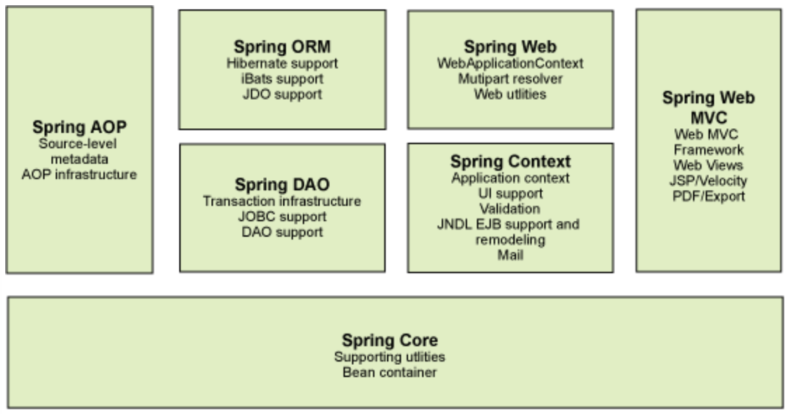
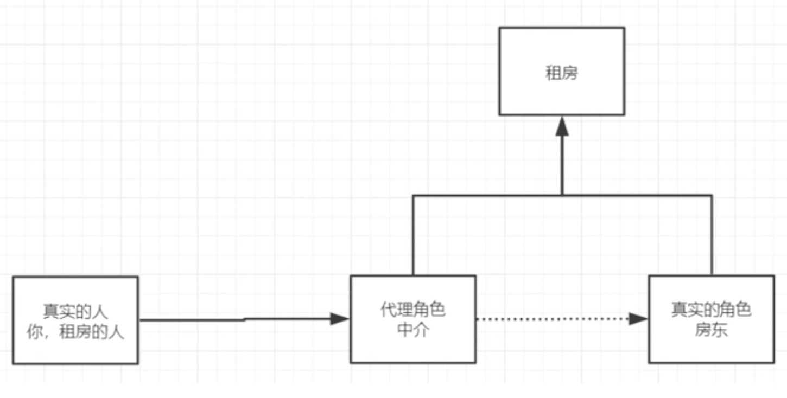
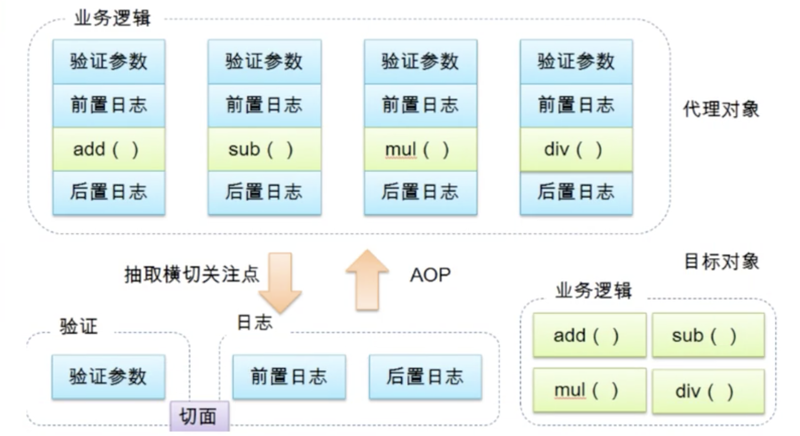
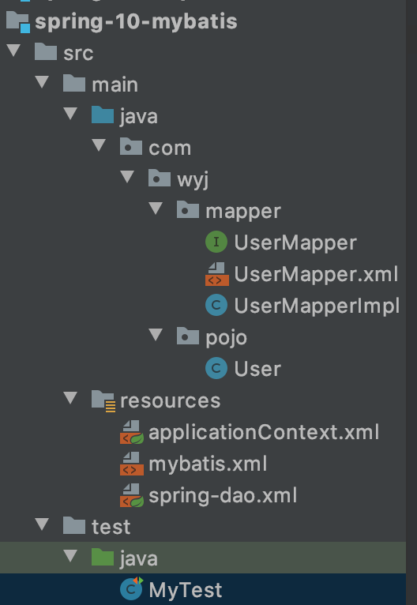

# 9. Spring
## 9.1. 简介
范围：任何java应用

目的：解决企业开发的复杂性，使现有技术更加容易使用

本身是一个大杂烩，整合了现有的技术框架

导包，一个webmvc包会同时导入很多别的包
```xml
<!-- https://mvnrepository.com/artifact/org.springframework/spring-webmvc -->
<dependency>
    <groupId>org.springframework</groupId>
    <artifactId>spring-webmvc</artifactId>
    <version>5.2.4.RELEASE</version>
</dependency>
<!-- https://mvnrepository.com/artifact/org.springframework/spring-jdbc -->
<dependency>
    <groupId>org.springframework</groupId>
    <artifactId>spring-jdbc</artifactId>
    <version>5.2.4.RELEASE</version>
</dependency>
```

### 9.1.1. 优点
- spring是一个开源的免费框架
- spring是一个轻量级的、非入侵式的框架
- **控制反转（IOC），面向切面编程（AOP）**
- 支持事务的处理，对所有框架整合的支持

**总结：轻量级的控制反转和面向切面编程的框架**

### 9.1.2. 组成


### 9.1.3. 拓展
构建一切->协调一切->链接一切

- SpringBoot
  - 一个快速开发的脚手架
  - 基于SpringBoot可以快速的开发单个微服务
  - 约定大于配置
- SpringCloud
  - 基于SpringBoot实现的

大多数公司使用SpringBoot进行开发，学习SpringBoot的前提，需要学习Spring和SpringMVC

弊端：配置十分繁琐
## 9.2. IOC理论推导
以往的项目步骤：
- UserDao 接口
- UserDaoImpl 实现类
- UserService 业务接口
- UserServiceImpl 业务实现类

用户的需求会影响原来的代码
```java
public class UserServiceImpl implements UserService {
    private UserDao userDao = new UserDaoImpl();
    // private UserDao userDao = new UserDaoSQLImpl();
    // 当用户的需求变更了，这里的源码就需要改变
    // 如果新增Dao层的实现方法，要想使用，这里的UserDaoImpl也需要改变
    @Override
    public void getUser() {
        userDao.getUser();
    }
}
```

改进，使用set接口动态。用到了设计模式中的**策略模式**
- 之前，程序是主动创建对象，控制权在程序员手上
- 使用set注入后，程序不再具有主动性，而是被动的接收变化
```java
public class UserServiceImpl implements UserService {
    private UserDao userDao;

    public void setUserDao(UserDao userDao) {
        this.userDao = userDao;
    }

    @Override
    public void getUser() {
        userDao.getUser();
    }
}

public static void main(String[] args) {
        // 不接触Dao层，直接出业务层
        UserServiceImpl userService = new UserServiceImpl();
        userService.setUserDao(new UserDaoImpl()); // 用户可以自己选择需要的实现方法
        userService.getUser();
    }
```

**这就叫控制反转，从本质上解决了问题，程序员不需要再去管理对象的创建。系统的耦合性大大降低。这是IOC的原型**

控制反转是一种思想

采用XML方式配置Bean的时候，Bean的定义信息是和实现分离的，而采用注解的方式可以把两者合为一体，Bean的定义信息直接以注解的形式定义在实现类中，从而达到了零配置的目的。

控制反转是一种通过描述（xml或注解）并通过第三方去生产或获取特定对象的方式。在Spring中实现控制反转的是IOC容器，其实现方法时依赖注入（DI）

以下代码为用spring改进
```xml
<?xml version="1.0" encoding="UTF-8"?>
<beans xmlns="http://www.springframework.org/schema/beans"
       xmlns:xsi="http://www.w3.org/2001/XMLSchema-instance"
       xsi:schemaLocation="http://www.springframework.org/schema/beans
        https://www.springframework.org/schema/beans/spring-beans.xsd">

    <bean id="userDaoImpl" class="com.wyj.dao.UserDaoImpl"/>
    <bean id="MysqlImpl" class="com.wyj.dao.MysqlImpl"/>
    <bean id="OracalImpl" class="com.wyj.dao.OracalImpl"/>

    <bean id="userServiceImpl" class="com.wyj.service.UserServiceImpl">
        <!--
        ref：引用spring容器中配置好的文件
        value：具体的值，基本数据类型
        -->
        <!-- 用户需求变更时，程序不用变，用户也不用变，直接这里ref变更一下就行了
        可以改成OracalImpl MysqlImpl -->
        <property name="userDao" ref="userDaoImpl"></property>
    </bean>

</beans>
```
```java
public class MyTest {
    public static void main(String[] args) {
        // 不接触Dao层，直接出业务层
//        UserServiceImpl userService = new UserServiceImpl();
//        userService.setUserDao(new UserDaoImpl());
//        userService.getUser();
        ApplicationContext context = new ClassPathXmlApplicationContext("beans.xml");
        // 这里让用户自己设定。到底get哪个方法。
        UserServiceImpl userServiceImpl = (UserServiceImpl)context.getBean("userServiceImpl");
        userServiceImpl.getUser();
    }
}
```
## 9.3. 第一个程序
配置maven
```xml
<?xml version="1.0" encoding="UTF-8"?>
<project xmlns="http://maven.apache.org/POM/4.0.0"
         xmlns:xsi="http://www.w3.org/2001/XMLSchema-instance"
         xsi:schemaLocation="http://maven.apache.org/POM/4.0.0 http://maven.apache.org/xsd/maven-4.0.0.xsd">
    <parent>
        <artifactId>spring</artifactId>
        <groupId>com.wyj</groupId>
        <version>1.0-SNAPSHOT</version>
    </parent>
    <modelVersion>4.0.0</modelVersion>

    <artifactId>spring-02-hellospring</artifactId>


</project>
```
beans.xml配置文件
```xml
<?xml version="1.0" encoding="UTF-8"?>
<beans xmlns="http://www.springframework.org/schema/beans"
       xmlns:xsi="http://www.w3.org/2001/XMLSchema-instance"
       xsi:schemaLocation="http://www.springframework.org/schema/beans
        https://www.springframework.org/schema/beans/spring-beans.xsd">


    <!--使用spring来创建对象，在spring中这些都成为bean
    bean = 对象 new Hello()
    id = 变量名
    class = new的对象
    property = 给对象中的属性设置一个数值 需要通过set方法注入，所以pojo类需要有set方法
    这里对象由Spring创建，也由Spring设置-->
    <bean id="hello" class="com.wyj.pojo.Hello">
        <property name="name" value="Spring"/>
    </bean>

</beans>
```
```java
public class MyTest {
    public static void main(String[] args) {
        // 获取Spring的上下文对象
        ApplicationContext context = new ClassPathXmlApplicationContext("beans.xml");
        // 我们的对象现在都在Spring中的管理了，我们要使用，直接去取出来就可以了
        // 这里去spring中拿，并没有new对象
        // 控制：传统的由程序创建，而这里由Spring创建
        // 反转：程序本身不创建对象，被动的接收对象
        // 依赖注入：使用set方法进行注入，在pojo中必须有set方法
        Hello hello = (Hello)context.getBean("hello");
        System.out.println(hello);
    }
}
```
## 9.4. IOC创建对象的方式
1. 使用无参构造创建对象，默认！
2. 假设要使用有参构造对象
   ```xml
    <!-- 第一种方式：下标赋值 -->
    <bean id="user" class="com.wyj.pojo.User">
        <constructor-arg index="0" value="spring"/>
    </bean>
   ```
    ```xml
    <!-- 第二种，使用类型赋值。如果有多个相同的类型则不能用，不建议使用 -->
    <bean id="user" class="com.wyj.pojo.User">
        <constructor-arg type="java.lang.String" value="spring"/>
    </bean>
    ```
    ```xml
    <!-- 第三种，直接通过参数名 -->
    <bean id="user" class="com.wyj.pojo.User">
        <constructor-arg name="name" value="spring"/>
    </bean>
    ```

注意：无论是否在代码中使用，spring中的对象都会先被创建出来
```java
// 此处user和user2是同一个对象，输出true
public static void main(String[] args) {
    ApplicationContext context = new ClassPathXmlApplicationContext("beans.xml");
    User user = (User)context.getBean("user");
    User user2 = (User)context.getBean("user");
    System.out.println(user==user2);
}
```

在配置文件加载的时候，容器中的管理对象就已经被加载了
## 9.5. Spring的配置
### 9.5.1. 别名
```xml
<alias name="user" alias="abc"/>
```
原名和别名都能在代码中使用
### 9.5.2. Bean的配置
```xml
 <!--
id: bean的唯一标识符，也就是相当于对象名
class: bean锁对应的全限定名: 包名+类型
name: 也是别名，而且name可以同时取多个别名 可以用逗号 空格 分号分割
-->
<bean id="user" class="com.wyj.pojo.User" name="abc,def">
    <constructor-arg name="name" value="spring"/>
</bean>
```
### 9.5.3. import
一般用于团队开发使用，将多个配置文件，导入合并为一个
```xml
<import resource="beans.xml"/>
<import resource="beans2.xml"/>
<import resource="beans3.xml"/>
```
这样，就可以通过这个xml配置获取其他的xml的配置
## 9.6. 依赖注入（DI）
### 9.6.1. 构造器注入
1. 使用无参构造创建对象，默认！
2. 假设要使用有参构造对象
   ```xml
    <!-- 第一种方式：下标赋值 -->
    <bean id="user" class="com.wyj.pojo.User">
        <constructor-arg index="0" value="spring"/>
    </bean>
   ```
    ```xml
    <!-- 第二种，使用类型赋值。如果有多个相同的类型则不能用，不建议使用 -->
    <bean id="user" class="com.wyj.pojo.User">
        <constructor-arg type="java.lang.String" value="spring"/>
    </bean>
    ```
    ```xml
    <!-- 第三种，直接通过参数名 -->
    <bean id="user" class="com.wyj.pojo.User">
        <constructor-arg name="name" value="spring"/>
    </bean>
    ```

注意：无论是否在代码中使用，spring中的对象都会先被创建出来
```java
// 此处user和user2是同一个对象，输出true
public static void main(String[] args) {
    ApplicationContext context = new ClassPathXmlApplicationContext("beans.xml");
    User user = (User)context.getBean("user");
    User user2 = (User)context.getBean("user");
    System.out.println(user==user2);
}
```
### 9.6.2. set注入【重点】
- bean对象的创建依赖于容器
- bean对象中的所有属性，由容器注入

1. 复杂类型
  ```java
  public class Address {
    private String address;

    public String getAddress() {
        return address;
    }

    public void setAddress(String address) {
        this.address = address;
    }
  }
  ```
2. 真实对象
  ```java
  public class Student {
    private String name;
    private Address address;
    private String[] books;
    private List<String> hobbies;
    private Map<String, String> card;
    private Set<String> games;
    private Properties info;
    private String wife;
  ```
3. 注入
   ```xml
   <?xml version="1.0" encoding="UTF-8"?>
   <beans xmlns="http://www.springframework.org/schema/beans"
          xmlns:xsi="http://www.w3.org/2001/XMLSchema-instance"
          xsi:schemaLocation="http://www.springframework.org/schema/beans
           https://www.springframework.org/schema/beans/spring-beans.xsd">

       <bean id="address" class="com.wyj.pojo.Address"/>
       <bean id="student" class="com.wyj.pojo.Student">
           <!--第一种 普通set注入, value-->
           <property name="name" value="spring"/>
           <!--第二种 bean注入, ref-->
           <property name="address" ref="address"/>
           <!--第三种 数组注入-->
           <property name="books">
               <array>
                   <value>红楼梦</value>
                   <value>西游记</value>
                   <value>三国演义</value>
               </array>
           </property>
           <!--第四种 List注入-->
           <property name="hobbies">
               <list>
                   <value>听歌</value>
                   <value>看电影</value>
                   <value>写代码</value>
               </list>
           </property>
           <!--第五种 Map注入-->
           <property name="card">
               <map>
                   <entry key="身份证" value="1234"/>
                   <entry key="银行卡" value="789"/>
               </map>
           </property>
           <!--第六种 Set注入-->
           <property name="games">
               <set>
                   <value>LOL</value>
                   <value>COC</value>
                   <value>BOB</value>
               </set>
           </property>
           <!--null-->
           <property name="wife">
               <null/>
           </property>
           <!--properties-->
           <property name="info">
               <props>
                   <prop key="学号">20163333</prop>
                   <prop key="性别">男</prop>
                   <prop key="姓名">小明</prop>
               </props>
           </property>
       </bean>
   </beans>
   ```

### 9.6.3. 拓展方式注入
需要导入xml约束！
#### 9.6.3.1. p命名空间
对应set注入

在beans的配置中加一行
```xml
xmlns:p="http://www.springframework.org/schema/p"
```
```xml
<!--p命名空间注入，可以直接注入属性的值:property-->
<bean id="user" class="com.wyj.pojo.User" p:name="spring" p:age="18"/>
```
#### 9.6.3.2. c命名空间
对应构造器注入

在beans的配置中加一行
```xml
xmlns:c="http://www.springframework.org/schema/c"
```
```xml
<!-- 构造器注入 -->
<bean id="beanOne" class="x.y.ThingOne">
    <constructor-arg name="thingTwo" ref="beanTwo"/>
    <constructor-arg name="thingThree" ref="beanThree"/>
    <constructor-arg name="email" value="something@somewhere.com"/>
</bean>

<!-- c命名空间 -->
<bean id="beanOne" class="x.y.ThingOne" c:thingTwo-ref="beanTwo" c:thingThree-ref="beanThree" c:email="something@somewhere.com"/>
```
### 9.6.4. bean的作用域
- singleton 单例模式 默认的
- prototype 原型模式 每一次getbean都会产生一个新的对象
  ```xml
  <bean id="accountService" class="com.something.DefaultAccountService" scope="prototype"/>
  ```
- request
- session
- application
- websocket

除了前两个，其余的只能在web开发中使用
## 9.7. Bean的自动装配
- 自动装配是spring满足bean依赖的一种方式
- spring会在上下文中自动寻找，并自动给bean装配属性

在spring有三种装配的方式
- 在xml中显示的配置
- 在java中显示配置
- 隐式的自动装配bean【重要】
### 9.7.1. byName 自动分配
```java
public class People {
    private Cat cat;
    private Dog dog;
    private String name;
```
```xml
<!-- 显示配置 -->
<bean id="cat" class="com.wyj.pojo.Cat"/>
<bean id="dog" class="com.wyj.pojo.Dog"/>
<bean id="people" class="com.wyj.pojo.People">
    <property name="name" value="wyj"/>
    <property name="cat" ref="cat"/>
    <property name="dog" ref="dog"/>
</bean>

<!-- 改为隐式配置 -->
<!-- 注意：这里如果cat和dog的id更改，则会找不到报错
byname: 会自动在容器上下文寻找，和set方法后面的值相对应的beanid -->
<bean id="cat" class="com.wyj.pojo.Cat"/>
<bean id="dog" class="com.wyj.pojo.Dog"/>
<bean id="people" class="com.wyj.pojo.People" autowire="byName">
    <property name="name" value="wyj"/>
</bean>
```

注意！
```java
public void setCat(Cat cat) {
    this.cat = cat;
}
// 这里如果方法名改成setCat1， 上面配置中的id也要改成cat1才可自动配置，否则出错
```
### 9.7.2. byTyoe自动分配
自动寻找对象属性类型相同的bean，必须保证同类型只有一个
```xml
<bean id="cat" class="com.wyj.pojo.Cat"/>
<bean id="dog3333" class="com.wyj.pojo.Dog"/>
<bean id="people" class="com.wyj.pojo.People" autowire="byType">
    <property name="name" value="wyj"/>
</bean>
```
### 9.7.3. 总结
- byName需要保证所有bean的id唯一，并且和自动注入的属性的set方法的方法名一致
- byType需要保证bean的class唯一，并且这个bean需要和自动注入的属性类型一致
### 9.7.4. 使用注解进行自动分配
jdk1.5支持的注解，spring2.5支持注解

注解优于xml，需要使用注解需要：
1. 导入约束 context约束 `xmlns:context="http://www.springframework.org/schema/context"`
2. 配置注解的支持 `<context:annotation-config/>`

```xml
<?xml version="1.0" encoding="UTF-8"?>
<beans xmlns="http://www.springframework.org/schema/beans"
    xmlns:xsi="http://www.w3.org/2001/XMLSchema-instance"
    xmlns:context="http://www.springframework.org/schema/context"
    xsi:schemaLocation="http://www.springframework.org/schema/beans
        https://www.springframework.org/schema/beans/spring-beans.xsd
        http://www.springframework.org/schema/context
        https://www.springframework.org/schema/context/spring-context.xsd">

    <context:annotation-config/>

</beans>
```
### 9.7.5. 使用注解配置 @Autowired
```xml 
<?xml version="1.0" encoding="UTF-8"?>
<beans xmlns="http://www.springframework.org/schema/beans"
       xmlns:xsi="http://www.w3.org/2001/XMLSchema-instance"
       xmlns:context="http://www.springframework.org/schema/context"
       xsi:schemaLocation="http://www.springframework.org/schema/beans
        https://www.springframework.org/schema/beans/spring-beans.xsd
        http://www.springframework.org/schema/context
        https://www.springframework.org/schema/context/spring-context.xsd">

    <bean id="cat" class="com.wyj.pojo.Cat"/>
    <bean id="dog" class="com.wyj.pojo.Dog"/>
    <bean id="people" class="com.wyj.pojo.People"/>
    <!-- 开启注解的支持 -->
    <context:annotation-config/>
</beans>
```
```java
import org.springframework.beans.factory.annotation.Autowired;
public class People {
    @Autowired
    private Cat cat;
    @Autowired
    private Dog dog;
    private String name;
    // 可以连set方法都不要！
```
### 9.7.6. @Nullable
@Nullable 可以让值为null也不报错
```java
public People(@Nullable String name) {
    this.name = name;
}
```
```java
// @Autowired源码
public @interface Autowired {
    boolean required() default true;
}
```
```java
// 把required设置为false，说明这个数值可以为null，不出错
@Autowired(required = false)
private Cat cat;
```
### 9.7.7. @Qualifier()
可以显示的指定bean id，当自动装配@Autowired环境复杂时，有多个同类型的bean，可以用@Qualifier指定一个唯一的bean
```java
public class People {
    @Autowired
    private Cat cat;
    @Autowired
    @Qualifier("dog2222")
    private Dog dog;
    private String name;
```
```xml
<bean id="dog1111" class="com.wyj.pojo.Dog"/>
<bean id="dog2222" class="com.wyj.pojo.Dog"/>
```
### 9.7.8. @Resource
java的注释，不是spring的
- 只有一个类型的情况下，名字随意。
- 多个相同类型的情况下，名字要对应
```xml
<bean id="cat222" class="com.wyj.pojo.Cat"/>
<bean id="dog2222" class="com.wyj.pojo.Dog"/>
<bean id="dog" class="com.wyj.pojo.Dog"/>
```
```java
@Resource
private Cat cat;
@Resource
private Dog dog;
private String name;
```
也可以指定id
```java
@Resource(name="cat222")
private Cat cat;
```
### 9.7.9. 总结
@Resource和@Autowired的区别：
- 都是用来自动装配，都可以在属性字段上
- @Autowired通过byType的方式实现，并且必须要求这个对象存在！
- @Resource默认通过byname的方式实现，如果名字找不到，则通过byType！如果两个都找不到，就报错
- 执行顺序：
  - @Autowired 先类型 再名字
  - @Resource 先名字 再类型
## 9.8. 使用注解开发
在spring4之后要使用注解开发，必须保证aop的包导入了。这个包被spring-webmvc包包含了已经

使用注解需要导入context约束，增加注解的支持
```xml
<?xml version="1.0" encoding="UTF-8"?>
<beans xmlns="http://www.springframework.org/schema/beans"
       xmlns:xsi="http://www.w3.org/2001/XMLSchema-instance"
       xmlns:context="http://www.springframework.org/schema/context"
       xsi:schemaLocation="http://www.springframework.org/schema/beans
        https://www.springframework.org/schema/beans/spring-beans.xsd
        http://www.springframework.org/schema/context
        https://www.springframework.org/schema/context/spring-context.xsd">
    
    <context:annotation-config/>
</beans>
```
### 9.8.1. 属性注入
```java
package com.wyj.pojo;

import org.springframework.beans.factory.annotation.Value;
import org.springframework.stereotype.Component;

// 等价于 <bean id="user" class="com.wyj.pojo.User"/>
@Component
public class User {
    @Value("spring") // 相当于<property name="name" value="spring"/>
    public String name;
}
```
### 9.8.2. 衍生注解
@Component有几个衍生注解，我们在web开发中，会按照mvc三层架构分成！
- dao【@Repository】
- service 【@Service】
- controller 【@Controller】

这几个功能都一样，都是@Component功能。代表将某个类注册到spring容器中，装配bean
### 9.8.3. 作用域
```java
@Scope("singleton")
public class User {
    @Value("spring")
    public String name;
}
```
### 9.8.4. 总结
xml与注解：
- xml更加万能，适用于任何场合！维护简单方便
- 注解 不是自己的类是用不了，维护相对复杂

xml与注解最佳时间：
- xml用来管理bean
- 注解只负责完成属性的注入
- 我们在使用过程中，只需要注意一个问题：必须让注解生效，就需要开启注解的支持
  ```xml
  <!--指定要扫描的包，这个包下的注解就会生效-->
    <context:component-scan base-package="com.wyj.pojo"/>
    <context:annotation-config/>
  ```
### 9.8.5. 使用java的方式配置spring
我们现在要完全不使用spring的xml配置了，全权交给java来做！

JavaConfig是Spring的子项目，在spring4后成为核心功能
```java
// MyConfig.java
package com.wyj.config;

import com.wyj.pojo.User;
import org.springframework.context.annotation.Bean;
import org.springframework.context.annotation.ComponentScan;
import org.springframework.context.annotation.Configuration;

@Configuration // 这也会被Spring容器托管，注册到容器中，因为他本来源码里也有@Component
// 代表这是一个配置类，跟beans.xml一样
@ComponentScan("com.wyj.pojo")
public class MyConfig {
    @Bean // 相当于之前xml中写的一个bean标签，方法名等于bean的id，返回值相当于class，return相当于注入到bean的对象
    public User user(){
        return new User();
    }
}
```
```java
// MyConfig2.java
package com.wyj.config;

import org.springframework.context.annotation.ComponentScan;
import org.springframework.context.annotation.Configuration;
import org.springframework.context.annotation.Import;

@Configuration
@ComponentScan("com.wyj.pojo")
@Import(MyConfig.class)
public class MyConfig2 {
}
```
```java
// pojo/User.java
package com.wyj.pojo;

import org.springframework.beans.factory.annotation.Value;
import org.springframework.stereotype.Component;

// 用java配置这里没有@Component也行
@Component
public class User {
    @Value("Spring") // 注入属性值
    private String name;

    @Override
    public String toString() {
        return "User{" +
                "name='" + name + '\'' +
                '}';
    }

    public String getName() {
        return name;
    }

    public void setName(String name) {
        this.name = name;
    }
}
```
```java
// test.java
public class MyTest {
    public static void main(String[] args) {
        // 如果完全使用了配置类去坐，只能通过AnnotationConfigApplicationContext来获取容器，通过配置类的class对象加载
        ApplicationContext context = new AnnotationConfigApplicationContext(MyConfig.class);
        User getUser = context.getBean("user", User.class);
        System.out.println(getUser.getName());
    }
}
```
这种纯java的配置方式，在SpringBoot中随处可见
## 9.9. 代理模式

为什么要学习代理模式？因为这就是springAOP的底层！【SpringAOP和SpringMVC】

代理模式的分类：

- 静态代理
- 动态代理



### 9.9.1. 静态代理
角色分析：
- 抽象角色：一般使用接口或抽象类来解决
- 真实角色：被道理的角色
- 代理角色：代理真实角色，代理真实角色后，我们一般会做一些复数操作
- 客户：访问代理对象

代理模式的好处：
- 可以使真是角色的操作更加纯粹！不用去关注一些公共的业务
- 公共业务交给代理角色，实现了业务的分工
- 公共业务发生扩展的时候，方便集中管理

缺点：
- 一个真实角色就会产生一个代理角色：代码量会翻倍，开发效率变低

代码步骤：
1. 接口
   ```java
   public interface Rent {
       void rent();
   }
   ```
2. 真实角色
   ```java
   public class Host implements Rent {
       public void rent() {
           System.out.println("我要出租房子");
       }
   }
   ```
3. 代理角色
   ```java
   public class Proxy implements Rent{
       private Host host = new Host();

       public Proxy() {
       }

       public Proxy(Host host) {
           this.host = host;
       }

       public void rent() {
           seeHouse();
           host.rent();
           hetong();
       }
       // 看房
       public void seeHouse(){
           System.out.println("中介带你看房");
       }
       // 签合同
       public void hetong(){
           System.out.println("签合同");
       }
   }
   ```
4. 客户端访问代理角色
   ```java
      public class Client {
       public static void main(String[] args) {
           // 方东要租房
           Host host = new Host();
           // 招代理，一般有附属操作
           Proxy proxy = new Proxy(host);
           // 你不用面对房东，直接面对中介
           proxy.rent();
       }
   }
   ```

这里是代理角色中有一个真实角色。而在装饰者模式中，装饰者是继承了超类。相同的是都实现了额外的功能。

代理模式主要是控制真实对象的访问，只是实现一个功能

装饰者就是动态拓展可以嵌套
### 9.9.2. 动态代理
- 动态代理和静态代理角色一样
- 动态代理类是动态生成的，不是我们直接写好的
- 动态代理分为两大类：基于接口的动态代理，基于类的动态代理
  - 基于接口：JDK动态代理
  - 基于类：cglib
  - java字节码实现：javassist

需要了解两个类：Proxy：代理，InvocationHandler：调用处理程序

接口和真实对象同静态代理
```java
package com.wyj.demo03;

import java.lang.reflect.InvocationHandler;
import java.lang.reflect.Method;
import java.lang.reflect.Proxy;

// 会用这个类自动生成代理类
public class ProxyInvocationHandler implements InvocationHandler {
    // 被代理的接口
    private Rent rent;

    public void setRent(Rent rent) {
        this.rent = rent;
    }

    // 生成得到代理类
    public Object getProxy(){
        return Proxy.newProxyInstance(this.getClass().getClassLoader(), rent.getClass().getInterfaces(), this);
    }
    // 处理代理实例，并返回结果
    public Object invoke(Object proxy, Method method, Object[] args) throws Throwable {
        // 顺序 1.看房 2.租房 3.收费
        seeHouse();
        // 动态代理的本质就是使用反射机制实现
        Object result = method.invoke(rent, args);
        fee();
        return result;
    }

    public void seeHouse(){
        System.out.println("中介带看房子");
    }

    public void fee(){
        System.out.println("收中介费");
    }
}
```
```java
package com.wyj.demo03;

public class Client {
    public static void main(String[] args) {
        // 真实角色
        Host host = new Host();
        // 代理角色： 现在没有 要生成
        ProxyInvocationHandler pih = new ProxyInvocationHandler();
        // 通过调用程序处理角色来处理我们要调用的接口对象
        // 设置需要被代理的真实对象
        pih.setRent(host);
        // 获取代理，这里的proxy就是动态生成的
        Rent proxy = (Rent)pih.getProxy();
        proxy.rent();
    }
}
```
#### 9.9.2.1. 通用的代理类
```java
import java.lang.reflect.InvocationHandler;
import java.lang.reflect.Method;
import java.lang.reflect.Proxy;

// 会用这个类自动生成代理类
public class ProxyInvocationHandler implements InvocationHandler {
    // 被代理的接口
    private Object target;

    public void setTarget(Object target) {
        this.target = target;
    }

    // 生成获得代理类
    public Object getProxy(){
        return Proxy.newProxyInstance(target.getClass().getClassLoader(), target.getClass().getInterfaces(), this);
    }

    // 处理代理实例，返回结果
    public Object invoke(Object proxy, Method method, Object[] args) throws Throwable {
        // 这里可以输出调用的方法名
        System.out.println(method.getName());
        Object result = method.invoke(target, args);
        return result;
    }
}
```
#### 9.9.2.2. 动态代理的好处
所有静态代理的好处

- 一个动态代理类代理的是一个接口，一般就是对应的一类业务
- 一个动态代理类可以代理多个类，只要是实现了同一个接口
## 9.10. AOP
### 9.10.1. 什么是AOP
面向切面编程，通过预编译方式和运行期动态代理实现程序功能的统一维护的一种技术。AOP是OOP的延续


### 9.10.2. AOP在spring中的作用
提供声明式事务；允许用户定义切面
- 横切关注点：跨越应用程序多个模块的方法或功能
- 切面(aspect)：横切关注点被模块化的特殊对象。即，它是一个类
- 通知(advice)：切面必须要完成的工作。即，它是类中的一个方法
- 目标(target)：被通知对象
- 代理(proxy)：向目标对象应用通知之后创建的对象
- 切入点(pointcut)：切面通知执行的地点的定义
- 连接点(jointpoint)：与切入点匹配的执行点

spring中支持5中类型的advice（通知方法）：

| 通知类型 | 连接点 | 实现接口 |
| - | - | - |
| 前置通知 | 方法前 | org.springframework.aop.MethodBeforeAdvice |
| 后置通知 | 方法后 | org.springframework.aop.AfterReturningAdvice
| 环绕通知 | 方法前后 | org.aopalliance.intercept.MethodInterceptor |
| 异常抛出通知 | 方法抛出异常 | org.springframework.aop.ThrowsAdvice |
| 引介通知 | 类中增加新的方法属性 | org.springframework.aop.IntroductionInterceptor |
### 9.10.3. 使用spring实现aop
需要导入一个依赖包
```xml
<!-- https://mvnrepository.com/artifact/org.aspectj/aspectjweaver -->
<dependency>
    <groupId>org.aspectj</groupId>
    <artifactId>aspectjweaver</artifactId>
    <version>1.9.5</version>
</dependency>
```
需要在配置beans的xml中增加命名空间
#### 9.10.3.1. 第一种方式：API接口[SpringAPI接口是吸纳]
```java
// 真实对象
public interface UserService {
    public void add();
    public void delete();
    public void update();
    public void query();
}
public class UserServiceImpl implements UserService {
    public void add() {
        System.out.println("add");
    }

    public void delete() {
        System.out.println("delete");
    }

    public void update() {
        System.out.println("update");
    }

    public void query() {
        System.out.println("query");
    }
}
```
```java
public class BeforeLog implements MethodBeforeAdvice {
    // method：要执行的目标对象的方法
    // args：参数
    // target： 目标对象
    public void before(Method method, Object[] args, Object target) throws Throwable {
        System.out.println(target.getClass().getName() +"被执行了");
    }
}
public class AfterLog implements AfterReturningAdvice {
    //returnValue：返回值
    public void afterReturning(Object returnValue, Method method, Object[] args, Object target) throws Throwable {
        System.out.println("执行了" + method.getName() + "，返回结果为" + returnValue);
    }
}
```
```xml
<!--注册bean-->
<bean id="userService" class="com.wyj.service.UserServiceImpl"/>
<bean id="beforeLog" class="com.wyj.log.AfterLog"/>
<bean id="afterLog" class="com.wyj.log.BeforeLog"/>

<!--方法一：使用原生Spring API接口-->
<!--注册bean-->
<bean id="userService" class="com.wyj.service.UserServiceImpl"/>
<bean id="beforeLog" class="com.wyj.log.AfterLog"/>
<bean id="afterLog" class="com.wyj.log.BeforeLog"/>
<!--配置aop-->
<aop:config>
    <!--切入点: expression表达式. execution(要执行的位置！****)-->
    <aop:pointcut id="pointcut" expression="execution(* com.wyj.service.UserServiceImpl.*(..))"/>
    <!--执行环绕增强 哪个类要切入到哪里-->
    <aop:advisor advice-ref="beforeLog" pointcut-ref="pointcut"/>
    <aop:advisor advice-ref="afterLog" pointcut-ref="pointcut"/>
</aop:config>
```
```java
public static void main(String[] args) {
    ApplicationContext context = new ClassPathXmlApplicationContext("applicationContext.xml");
    // 动态代理的是接口，不可以是实现类
    UserService userService = (UserService)context.getBean("userService");
    userService.add();
}
```
#### 9.10.3.2. 方法二：使用自定义实现AOP[切面定义]
```xml
<!--方法二：自定义类-->
<bean id="diy" class="com.wyj.diy.DiyPointCut"/>
<aop:config>
    <!--自定义切面，ref要引用的类-->
    <aop:aspect ref="diy">
        <!--切入点-->
        <aop:pointcut id="point" expression="execution(* com.wyj.service.UserServiceImpl.*(..))"/>
        <!--通知-->
        <aop:before method="before" pointcut-ref="point"/>
        <aop:after method="after" pointcut-ref="point"/>
    </aop:aspect>
</aop:config>
```
```java
public class DiyPointCut {
    public void before(){
        System.out.println("方法执行前");
    }
    public void after(){
        System.out.println("方法执行后");
    }
}
```
#### 9.10.3.3. 方式三：使用注解实现
```xml
<!--第三类：使用注解实现-->
<bean id="annotation" class="com.wyj.diy.AnnotationPointCut"/>
<!--开启注解支持-->
<aop:aspectj-autoproxy/>
```
```java
// 方式三：使用注解方式实现AOP
@Aspect //标注这个类是一个切面
public class AnnotationPointCut {
    // 定义切入点
    @Before("execution(* com.wyj.service.UserServiceImpl.*(..))")
    public void before(){
        System.out.println("方法执行前");
    }
    @After("execution(* com.wyj.service.UserServiceImpl.*(..))")
    public void after(){
        System.out.println("方法执行后");
    }
    @Around("execution(* com.wyj.service.UserServiceImpl.*(..))")
    public void around(ProceedingJoinPoint jp) throws Throwable {
        System.out.println("环绕前");
        System.out.println(jp.getSignature());
        // 执行方法
        Object proceed = jp.proceed();

        System.out.println("环绕后");
    }
}
// 输出结果：
// 环绕前
// void com.wyj.service.UserService.add()
// 方法执行前
// add
// 环绕后
// 方法执行后
```
## 9.11. 整合mybatis
步骤：
1. 导入jar包
   1. junit
   2. mybatis
   3. mysql数据库
   4. spring相关的
   5. aop织入
   6. mybatis-spring【new】
   ```xml
   <?xml version="1.0" encoding="UTF-8"?>
   <project xmlns="http://maven.apache.org/POM/4.0.0"
            xmlns:xsi="http://www.w3.org/2001/XMLSchema-instance"
            xsi:schemaLocation="http://maven.apache.org/POM/4.0.0 http://maven.apache.org/xsd/maven-4.0.0.xsd">
       <modelVersion>4.0.0</modelVersion>

       <groupId>com.wyj</groupId>
       <artifactId>spring</artifactId>
       <packaging>pom</packaging>
       <version>1.0-SNAPSHOT</version>
       <modules>
           <module>spring-01-ioc1</module>
           <module>spring-02-hellospring</module>
           <module>spring-03-ioc2</module>
           <module>spring-04-di</module>
           <module>spring-05-Autowired</module>
           <module>spring-06-anno</module>
           <module>spring-07-appconfig</module>
           <module>spring-08-proxy</module>
           <module>spring-09-aop</module>
           <module>spring-10-mybatis</module>
           <module>spring-11-transaction</module>
       </modules>
       <dependencies>
           <dependency>
               <groupId>junit</groupId>
               <artifactId>junit</artifactId>
               <version>4.12</version>
           </dependency>
           <dependency>
               <groupId>mysql</groupId>
               <artifactId>mysql-connector-java</artifactId>
               <version>8.0.18</version>
           </dependency>
           <dependency>
               <groupId>org.mybatis</groupId>
               <artifactId>mybatis</artifactId>
               <version>3.5.4</version>
           </dependency>
           <dependency>
               <groupId>org.springframework</groupId>
               <artifactId>spring-webmvc</artifactId>
               <version>5.2.4.RELEASE</version>
           </dependency>
           <!--使用spring操作数据库-->
           <dependency>
               <groupId>org.springframework</groupId>
               <artifactId>spring-jdbc</artifactId>
               <version>5.2.4.RELEASE</version>
           </dependency>
           <dependency>
               <groupId>org.aspectj</groupId>
               <artifactId>aspectjweaver</artifactId>
               <version>1.9.5</version>
           </dependency>
           <!-- https://mvnrepository.com/artifact/org.mybatis/mybatis-spring -->
           <dependency>
               <groupId>org.mybatis</groupId>
               <artifactId>mybatis-spring</artifactId>
               <version>2.0.4</version>
           </dependency>
           <dependency>
               <groupId>org.projectlombok</groupId>
               <artifactId>lombok</artifactId>
               <version>1.18.10</version>
           </dependency>
       </dependencies>
       <!--build中配置resources，来防止我们资源导出失败的问题-->
       <build>
           <resources>
               <resource>
                   <directory>src/main/resources</directory>
                   <includes>
                       <include>**/*.properties</include>
                       <include>**/*.xml</include>
                   </includes>
                   <filtering>true</filtering>
               </resource>
               <resource>
                   <directory>src/main/java</directory>
                   <includes>
                       <include>**/*.properties</include>
                       <include>**/*.xml</include>
                   </includes>
                   <filtering>true</filtering>
               </resource>
           </resources>
       </build>
   </project>
   ```
2. 编写配置文件
3. 测试
### 9.11.1. 回忆Mybatis
1. 编写实体类
2. 编写核心配置文件
3. 编写接口
4. 编写Mapper.xml
5. 测试

### 9.11.2. mybatis-spring
允许mybatis参与到spring的事务管理之中


1. 编写数据源配置
   ```xml
   <!-- spring-dao.xml -->
   <?xml version="1.0" encoding="UTF-8"?>
   <beans xmlns="http://www.springframework.org/schema/beans"
          xmlns:xsi="http://www.w3.org/2001/XMLSchema-instance"
          xmlns:context="http://www.springframework.org/schema/context"
          xmlns:aop="http://www.springframework.org/schema/aop"
          xsi:schemaLocation="http://www.springframework.org/schema/beans
           https://www.springframework.org/schema/beans/spring-beans.xsd
           http://www.springframework.org/schema/aop
           https://www.springframework.org/schema/aop/spring-aop.xsd">
       <!--下面三个部分取代了mybatis的配置dataSource sqlSessionFactory和SqlSessionTemplate-->
       <!--DataSource:使用spring的数据源替换mybatis的配置
       我们这里使用sring提供的jdbc-->
       <bean id="dataSource" class="org.springframework.jdbc.datasource.DriverManagerDataSource">
           <property name="driverClassName" value="com.mysql.cj.jdbc.Driver"/>
           <property name="url" value="jdbc:mysql://localhost:3306/mybatis?useSSL=true&amp;useUnicode=true&amp;characterEncoding=UTF-8"/>
           <property name="username" value="root"/>
           <property name="password" value="12345678"/>
       </bean>

       <!--    下面的sqlSessionFactory和SqlSessionTemplate是固定写法-->
       <!--sqlSessionFactory-->
       <bean id="sqlSessionFactory" class="org.mybatis.spring.SqlSessionFactoryBean">
           <property name="dataSource" ref="dataSource"/>
           <!--绑定mybatis配置文件-->
           <property name="configLocation" value="classpath:mybatis.xml"/>
           <property name="mapperLocations" value="classpath:com/wyj/mapper/UserMapper.xml"/>
       </bean>

       <!--这里的SqlSessionTemplate就是sqlSession-->
       <bean id="sqlSessionTemplate" class="org.mybatis.spring.SqlSessionTemplate">
           <!--只能用构造器注入，因为没有set方法-->
           <constructor-arg index="0" ref="sqlSessionFactory"/>
       </bean>

   </beans>
   ```
2. sqlSessionFactory
3. sqlSessionTemplate 可以完全代替原来的sqlSession，是线程安全的，没有set方法，只能构造器初始化
4. 给接口加实现类
   ```java
   // UserMapperImpl
   package com.wyj.mapper;

   import com.wyj.pojo.User;
   import org.mybatis.spring.SqlSessionTemplate;

   import java.util.List;

   public class UserMapperImpl implements UserMapper {
       private SqlSessionTemplate sqlSessionTemplate;

       public void setSqlSessionTemplate(SqlSessionTemplate sqlSessionTemplate){
           this.sqlSessionTemplate = sqlSessionTemplate;
       }

       // 所有操作都是用SqlSessionTemplate执行
       public List<User> selectUser() {
           return sqlSessionTemplate.getMapper(UserMapper.class).selectUser();
       }
   }
   ```
5. 将实现类注入spring的bean中
   ```xml
   <!-- applicationContext.xml -->
   <?xml version="1.0" encoding="UTF-8"?>
   <beans xmlns="http://www.springframework.org/schema/beans"
          xmlns:xsi="http://www.w3.org/2001/XMLSchema-instance"
          xmlns:context="http://www.springframework.org/schema/context"
          xmlns:aop="http://www.springframework.org/schema/aop"
          xsi:schemaLocation="http://www.springframework.org/schema/beans
           https://www.springframework.org/schema/beans/spring-beans.xsd
           http://www.springframework.org/schema/aop
           https://www.springframework.org/schema/aop/spring-aop.xsd">
       <!--用spring的方法配置了mybatis，基本不需要改动这个文件，里面的具体路径需要改-->
       <import resource="spring-dao.xml"/>

       <bean id="userMapper" class="com.wyj.mapper.UserMapperImpl">
           <property name="sqlSessionTemplate" ref="sqlSessionTemplate"/>
       </bean>

   </beans>
   ```
6. 测试
   ```java
   // MyTest.java
   import com.wyj.mapper.UserMapper;
   import org.junit.Test;
   import org.springframework.context.ApplicationContext;
   import org.springframework.context.support.ClassPathXmlApplicationContext;

   public class MyTest {
       @Test
       public void test(){
           ApplicationContext context = new ClassPathXmlApplicationContext("applicationContext.xml");
           UserMapper userMapper = context.getBean("userMapper", UserMapper.class);
           System.out.println(userMapper.selectUser());
       }
   }
   ```
### 9.11.3. SqlSessionSupport
不需要私有SqlSessionTemplate，不需要设置set方法了，不需要注入过程
```java
package com.wyj.mapper;

import com.wyj.pojo.User;
import org.apache.ibatis.session.SqlSession;
import org.mybatis.spring.support.SqlSessionDaoSupport;

import java.util.List;

public class UserMapperImpl2 extends SqlSessionDaoSupport implements UserMapper {
    public List<User> selectUser() {
        SqlSession sqlSession = getSqlSession();// SqlSessionDaoSupport类中写的
        UserMapper mapper = sqlSession.getMapper(UserMapper.class);
        return mapper.selectUser();
    }
}
```
```xml
<bean id="userMapper2" class="com.wyj.mapper.UserMapperImpl2">
    <!-- 这个值是SqlSessionDaoSupport所需要的 -->
    <property name="sqlSessionFactory" ref="sqlSessionFactory"/>
</bean>
```
## 9.12. 声明式事务
### 9.12.1. 回顾事务
- 要么都成功，要么都失败
- 事务在项目开发中十分重要，涉及到数据的一致性问题
- 确保完整性和一致性
- 把一组业务当成一个业务来做
### 9.12.2. ACID原则
- A 原子性
- C 一致性
- I 隔离性
- D 持久性
### 9.12.3. spring中的事务管理
一个使用 MyBatis-Spring 的其中一个主要原因是它允许 MyBatis 参与到 Spring 的事务管理中。而不是给 MyBatis 创建一个新的专用事务管理器，MyBatis-Spring 借助了 Spring 中的 DataSourceTransactionManager 来实现事务管理。

- 声明式事务： AOP
- 编程式事务：需要在代码中进行事务的管理

- propagation_requierd：如果当前没有事务，就新建一个事务，如果已存在一个事务中，加入到这个事务中，这是最常见的选择。
- propagation_supports：支持当前事务，如果没有当前事务，就以非事务方法执行。
- propagation_mandatory：使用当前事务，如果没有当前事务，就抛出异常。
- propagation_required_new：新建事务，如果当前存在事务，把当前事务挂起。
- propagation_not_supported：以非事务方式执行操作，如果当前存在事务，就把当前事务挂起。
- propagation_never：以非事务方式执行操作，如果当前事务存在则抛出异常。
- propagation_nested：如果当前存在事务，则在嵌套事务内执行。如果当前没有事务，则执行与propagation_required类似的操作

```xml
<!-- spring-dao中添加 不需要修改任何源码 -->
<!--配置声明式事务-->
<bean id="transactionManager" class="org.springframework.jdbc.datasource.DataSourceTransactionManager">
    <constructor-arg ref="dataSource" />
</bean>

<!--结合AOP实现事务的织入-->
<!--配置事务通知-->
<tx:advice id="txAdvice" transaction-manager="transactionManager">
    <!--给哪些方法配置事务-->
    <!--配置事务的传播特性 默认是REQUIRED-->
    <tx:attributes>
        <tx:method name="add" propagation="REQUIRED"/>
        <tx:method name="delete"/>
        <tx:method name="update"/>
        <!--只读，在执行时不能执行增删改-->
        <tx:method name="query" read-only="true"/>
        <tx:method name="*"/>
    </tx:attributes>
</tx:advice>

<!--配置事务切入-->
<aop:config>
    <aop:pointcut id="txPointCut" expression="execution(* com.wyj.mapper.*.*(..))"/>
    <aop:advisor advice-ref="txAdvice" pointcut-ref="txPointCut"/>
</aop:config>
```
